
Cell models tuned to data extracted from Cell Types Database. Note: these are preliminary models designed to test the framework for generating NeuroML models from this data, not the final, optimised models.

<table border="1">
<tr>
<td width="130px">

<b>313862167</b>

Primary visual area, layer 4

aspiny

Sst-IRES-Cre

<a href="http://celltypes.brain-map.org/mouse/experiment/electrophysiology/313862167">Source data</a>

</td>
<td>
<a href="traces_313862167.png">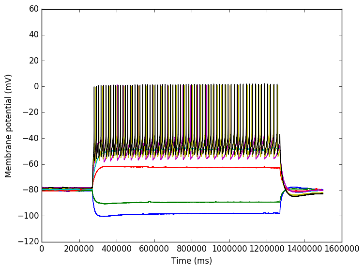</a>
</td>
<td>
<a href="spikes_313862167.png">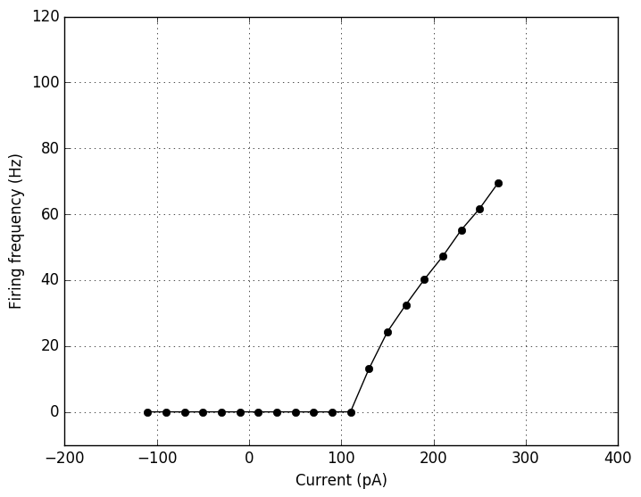</a>
</td>
<td>
<a href="subthreshold_313862167.png">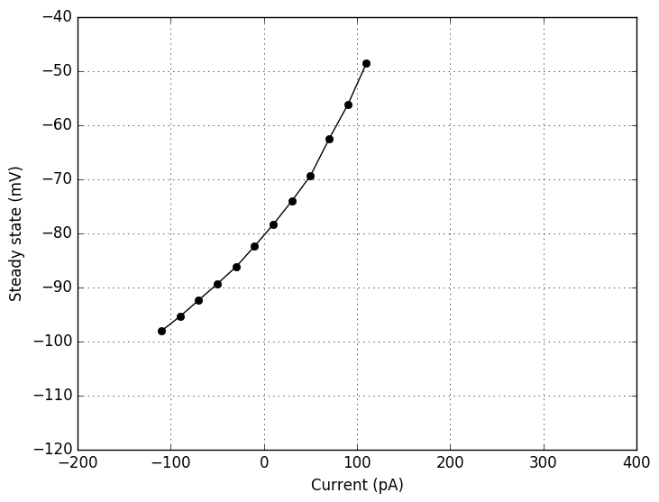</a>
</td>
</tr>
<tr>
<td width="130px">

<b>Izhikevich cell model tuned to dataset 313862167</b>

<a href="https://github.com/OpenSourceBrain/AllenInstituteNeuroML/blob/master/CellTypesDatabase/tune/tuned_cells/Izh_313862167.cell.nml">Tuned model</a>

</td>
<td>
<a href="../../../tune/tuned_cells/summary/Izh_313862167_traces.png">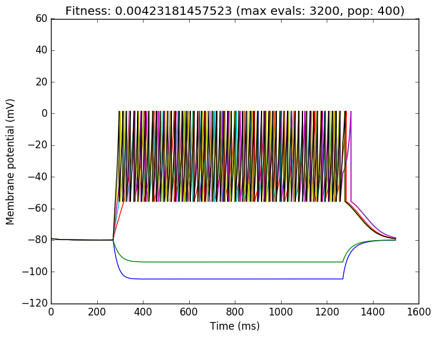</a>
</td>
<td>
<a href="../../../tune/tuned_cells/summary/Izh_313862167_if.png">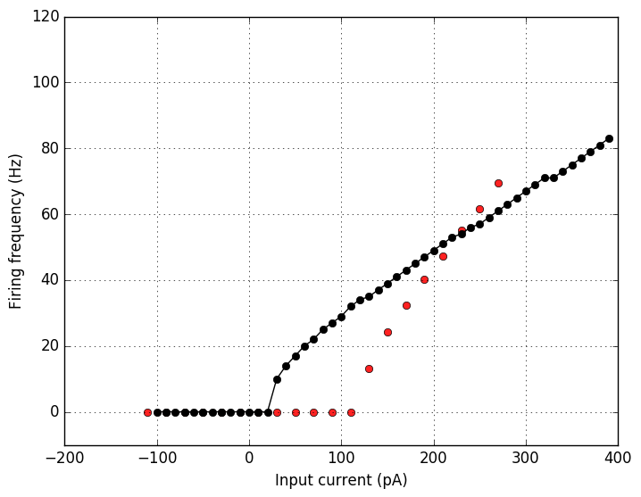</a>
</td>
<td>
<a href="../../../tune/tuned_cells/summary/Izh_313862167_iv.png">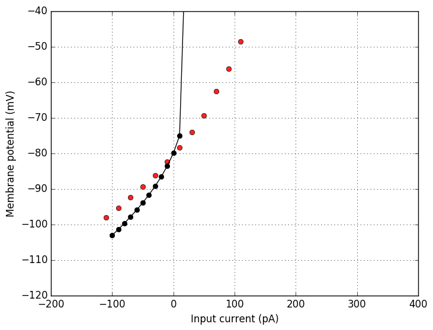</a>
</td>
</tr>
<tr>
<td width="130px">

<b>HH cell model tuned to dataset 313862167</b>

<a href="https://github.com/OpenSourceBrain/AllenInstituteNeuroML/blob/master/CellTypesDatabase/tune/tuned_cells/HH_313862167.cell.nml">Tuned model</a>

</td>
<td>

</td>
<td>
<a href="../../../tune/tuned_cells/summary/HH_313862167_if.png">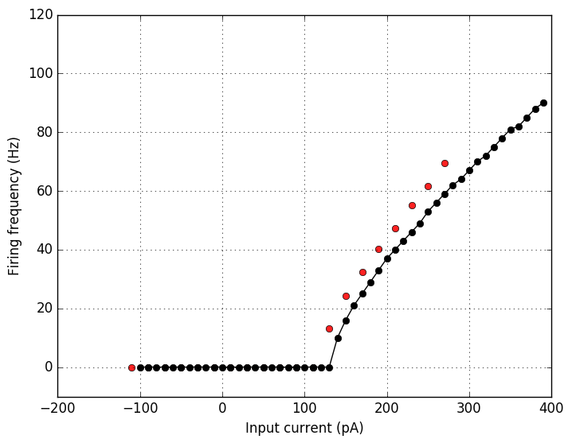</a>
</td>
<td>
<a href="../../../tune/tuned_cells/summary/HH_313862167_iv.png">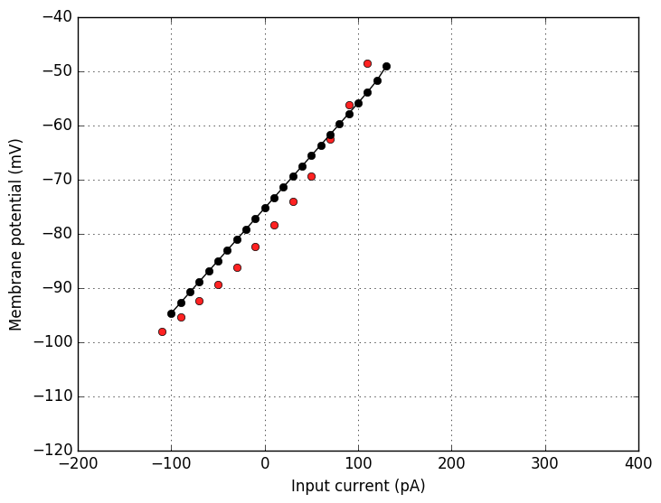</a>
</td>
</tr>
</table>  
 
<table border="1">
<tr>
<td width="130px">

<b>314642645</b>

Primary visual area, layer 4

spiny

Rorb-IRES2-Cre

<a href="http://celltypes.brain-map.org/mouse/experiment/electrophysiology/314642645">Source data</a>

</td>
<td>
<a href="traces_314642645.png">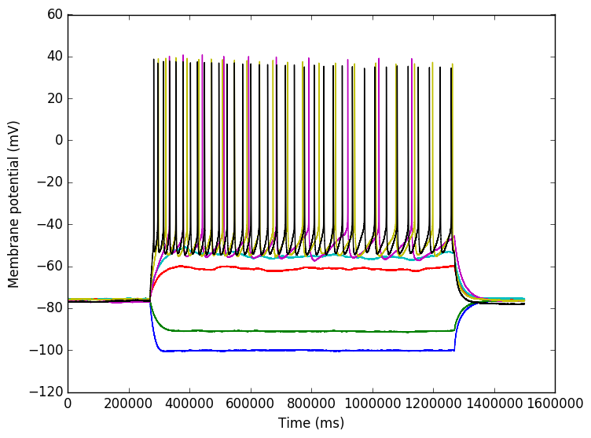</a>
</td>
<td>

</td>
<td>
<a href="subthreshold_314642645.png">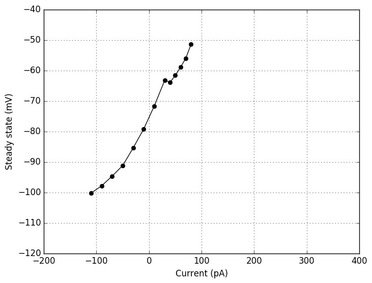</a>
</td>
</tr>
<tr>
<td width="130px">

<b>Izhikevich cell model tuned to dataset 314642645</b>

<a href="https://github.com/OpenSourceBrain/AllenInstituteNeuroML/blob/master/CellTypesDatabase/tune/tuned_cells/Izh_314642645.cell.nml">Tuned model</a>

</td>
<td>

</td>
<td>

</td>
<td>
<a href="../../../tune/tuned_cells/summary/Izh_314642645_iv.png">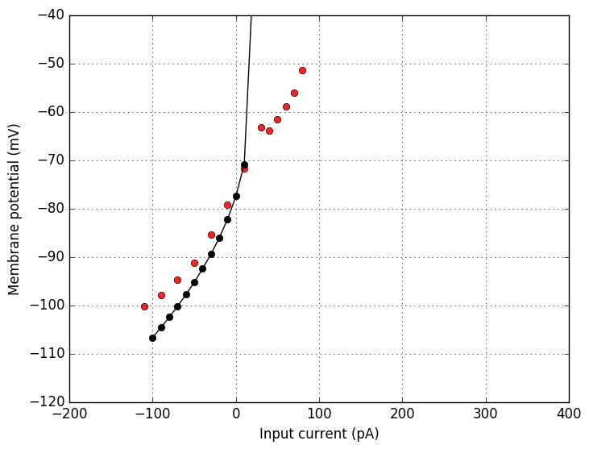</a>
</td>
</tr>
<tr>
<td width="130px">

<b>HH cell model tuned to dataset 314642645</b>

<a href="https://github.com/OpenSourceBrain/AllenInstituteNeuroML/blob/master/CellTypesDatabase/tune/tuned_cells/HH_314642645.cell.nml">Tuned model</a>

</td>
<td>

</td>
<td>
<a href="../../../tune/tuned_cells/summary/HH_314642645_if.png">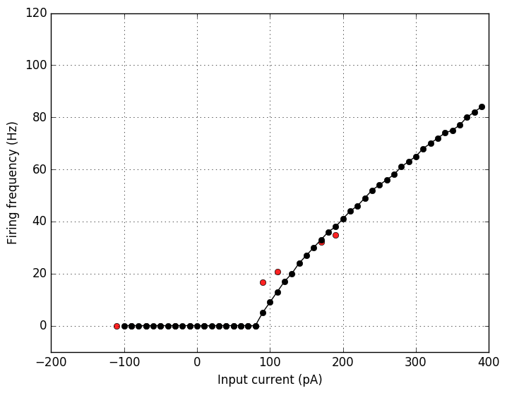</a>
</td>
<td>
<a href="../../../tune/tuned_cells/summary/HH_314642645_iv.png">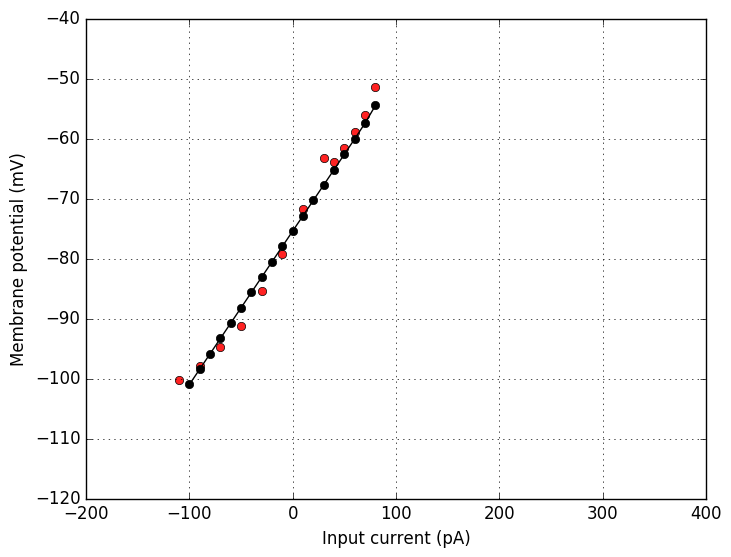</a>
</td>
</tr>
</table>  
 
<table border="1">
<tr>
<td width="130px">

<b>314900022</b>

Primary visual area, layer 4

spiny

Scnn1a-Tg3-Cre

<a href="http://celltypes.brain-map.org/mouse/experiment/electrophysiology/314900022">Source data</a>

</td>
<td>
<a href="traces_314900022.png">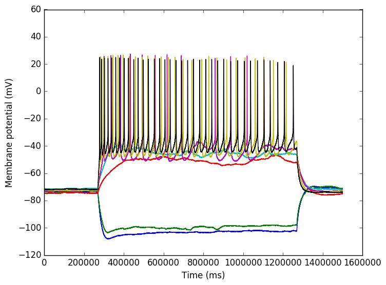</a>
</td>
<td>
<a href="spikes_314900022.png">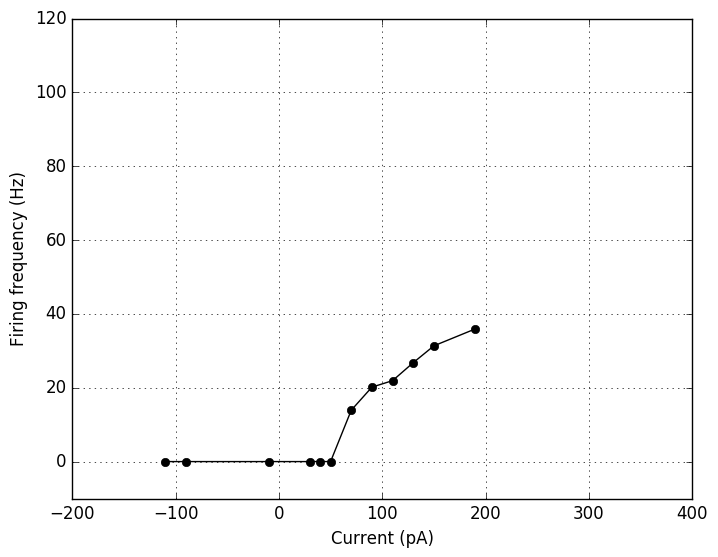</a>
</td>
<td>
<a href="subthreshold_314900022.png">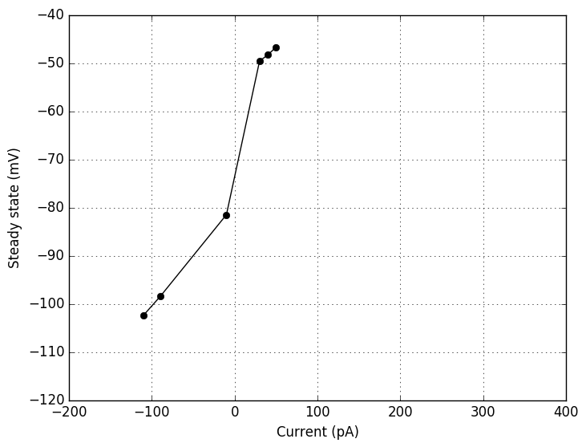</a>
</td>
</tr>
<tr>
<td width="130px">

<b>Izhikevich cell model tuned to dataset 314900022</b>

<a href="https://github.com/OpenSourceBrain/AllenInstituteNeuroML/blob/master/CellTypesDatabase/tune/tuned_cells/Izh_314900022.cell.nml">Tuned model</a>

</td>
<td>
<a href="../../../tune/tuned_cells/summary/Izh_314900022_traces.png">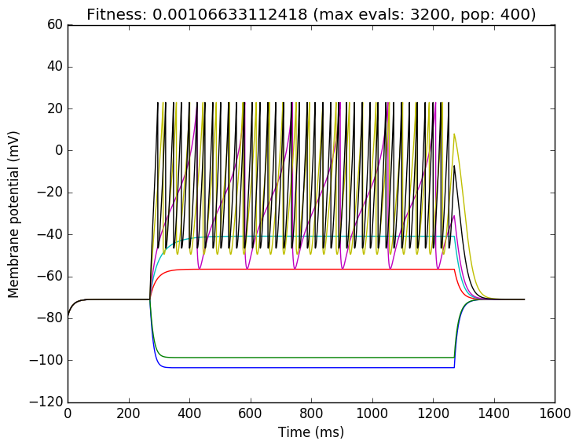</a>
</td>
<td>
<a href="../../../tune/tuned_cells/summary/Izh_314900022_if.png">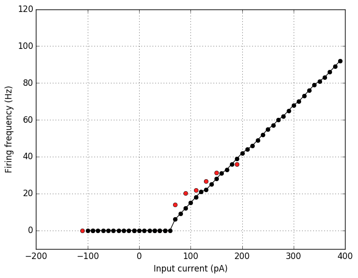</a>
</td>
<td>
<a href="../../../tune/tuned_cells/summary/Izh_314900022_iv.png">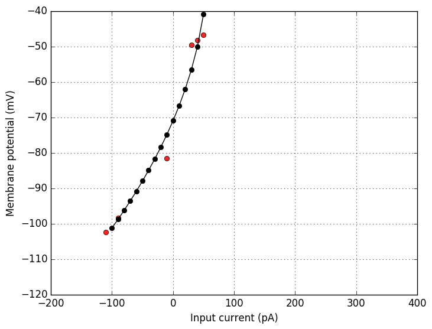</a>
</td>
</tr>
<tr>
<td width="130px">

<b>HH cell model tuned to dataset 314900022</b>

<a href="https://github.com/OpenSourceBrain/AllenInstituteNeuroML/blob/master/CellTypesDatabase/tune/tuned_cells/HH_314900022.cell.nml">Tuned model</a>

</td>
<td>

</td>
<td>
<a href="../../../tune/tuned_cells/summary/HH_314900022_if.png">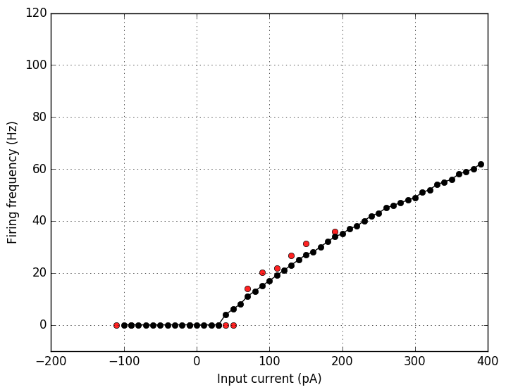</a>
</td>
<td>
<a href="../../../tune/tuned_cells/summary/HH_314900022_iv.png">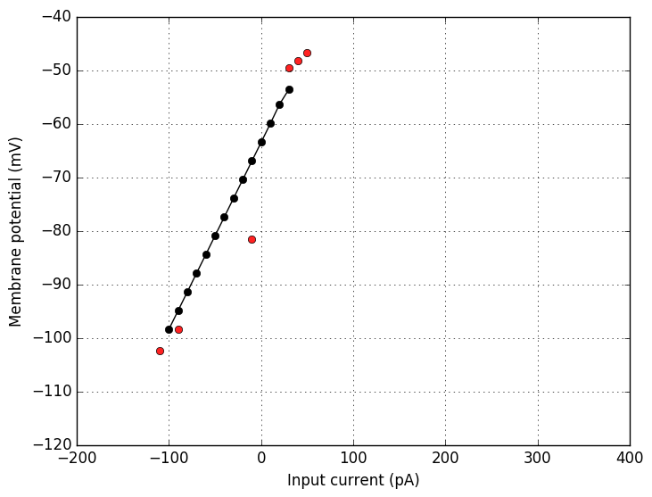</a>
</td>
</tr>
</table>  
 
<table border="1">
<tr>
<td width="130px">

<b>318733871</b>

Primary visual area, layer 4

spiny

Nr5a1-Cre

<a href="http://celltypes.brain-map.org/mouse/experiment/electrophysiology/318733871">Source data</a>

</td>
<td>
<a href="traces_318733871.png">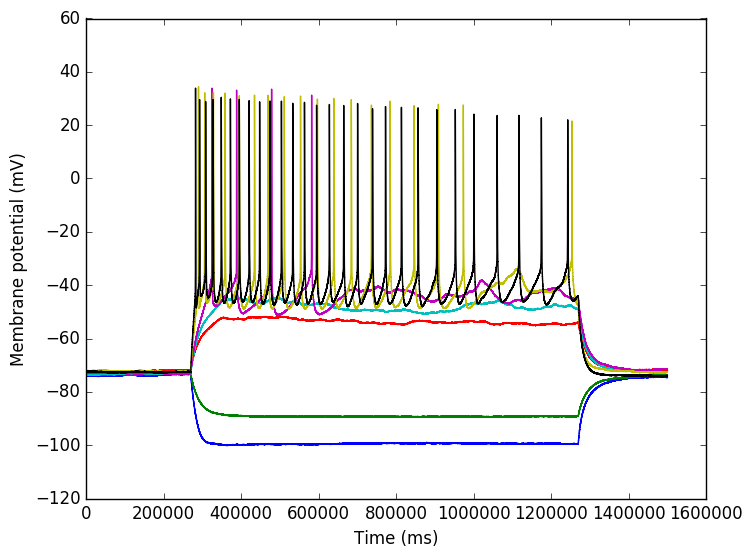</a>
</td>
<td>
<a href="spikes_318733871.png">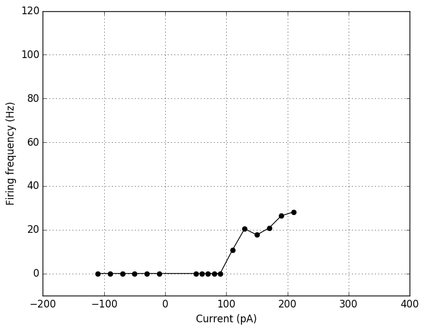</a>
</td>
<td>

</td>
</tr>
<tr>
<td width="130px">

<b>Izhikevich cell model tuned to dataset 318733871</b>

<a href="https://github.com/OpenSourceBrain/AllenInstituteNeuroML/blob/master/CellTypesDatabase/tune/tuned_cells/Izh_318733871.cell.nml">Tuned model</a>

</td>
<td>
<a href="../../../tune/tuned_cells/summary/Izh_318733871_traces.png">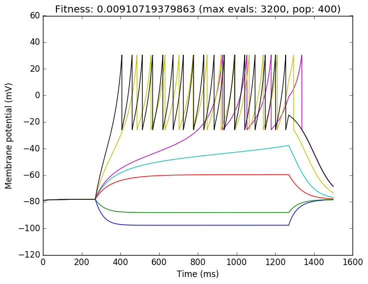</a>
</td>
<td>

</td>
<td>
<a href="../../../tune/tuned_cells/summary/Izh_318733871_iv.png">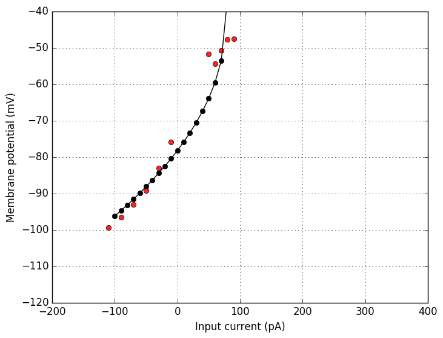</a>
</td>
</tr>
<tr>
<td width="130px">

<b>HH cell model tuned to dataset 318733871</b>

<a href="https://github.com/OpenSourceBrain/AllenInstituteNeuroML/blob/master/CellTypesDatabase/tune/tuned_cells/HH_318733871.cell.nml">Tuned model</a>

</td>
<td>

</td>
<td>
<a href="../../../tune/tuned_cells/summary/HH_318733871_if.png">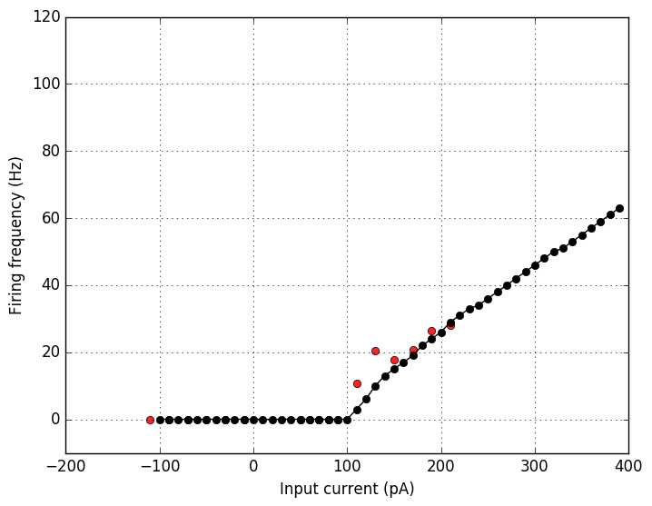</a>
</td>
<td>
<a href="../../../tune/tuned_cells/summary/HH_318733871_iv.png">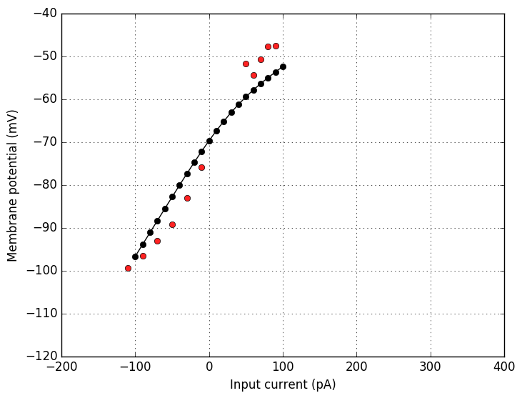</a>
</td>
</tr>
</table>  
 
<table border="1">
<tr>
<td width="130px">

<b>320207387</b>

Primary visual area, layer 5

spiny

Scnn1a-Tg3-Cre

<a href="http://celltypes.brain-map.org/mouse/experiment/electrophysiology/320207387">Source data</a>

</td>
<td>
<a href="traces_320207387.png">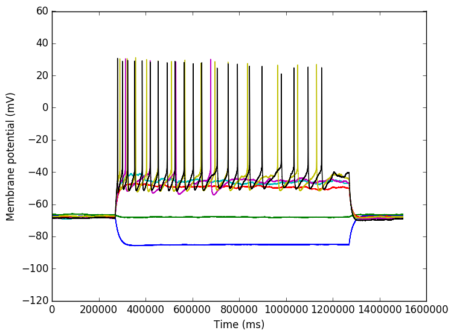</a>
</td>
<td>
<a href="spikes_320207387.png">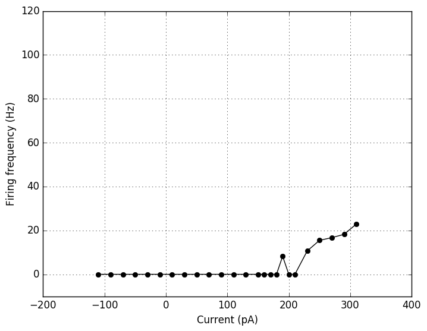</a>
</td>
<td>
<a href="subthreshold_320207387.png">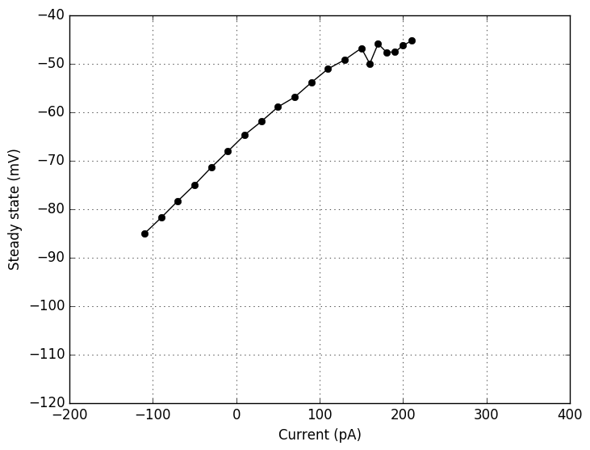</a>
</td>
</tr>
<tr>
<td width="130px">

<b>Izhikevich cell model tuned to dataset 320207387</b>

<a href="https://github.com/OpenSourceBrain/AllenInstituteNeuroML/blob/master/CellTypesDatabase/tune/tuned_cells/Izh_320207387.cell.nml">Tuned model</a>

</td>
<td>
<a href="../../../tune/tuned_cells/summary/Izh_320207387_traces.png">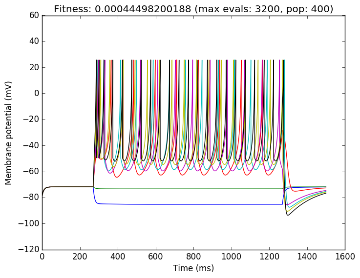</a>
</td>
<td>
<a href="../../../tune/tuned_cells/summary/Izh_320207387_if.png">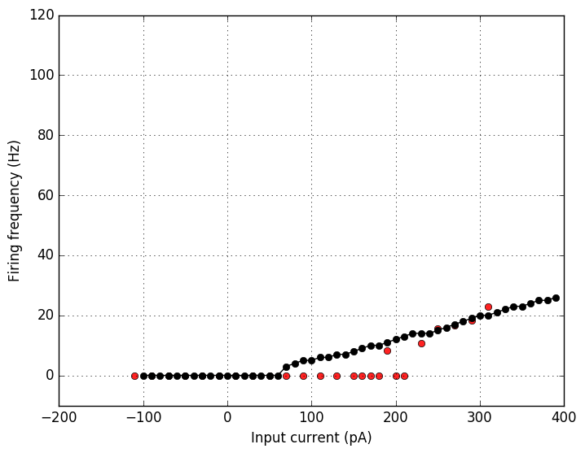</a>
</td>
<td>
<a href="../../../tune/tuned_cells/summary/Izh_320207387_iv.png">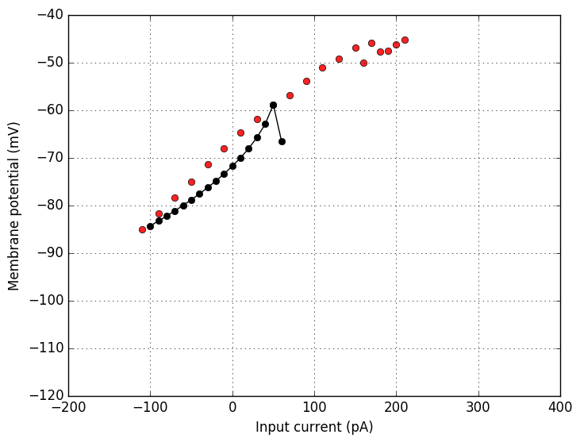</a>
</td>
</tr>
<tr>
<td width="130px">

<b>HH cell model tuned to dataset 320207387</b>

<a href="https://github.com/OpenSourceBrain/AllenInstituteNeuroML/blob/master/CellTypesDatabase/tune/tuned_cells/HH_320207387.cell.nml">Tuned model</a>

</td>
<td>

</td>
<td>
<a href="../../../tune/tuned_cells/summary/HH_320207387_if.png">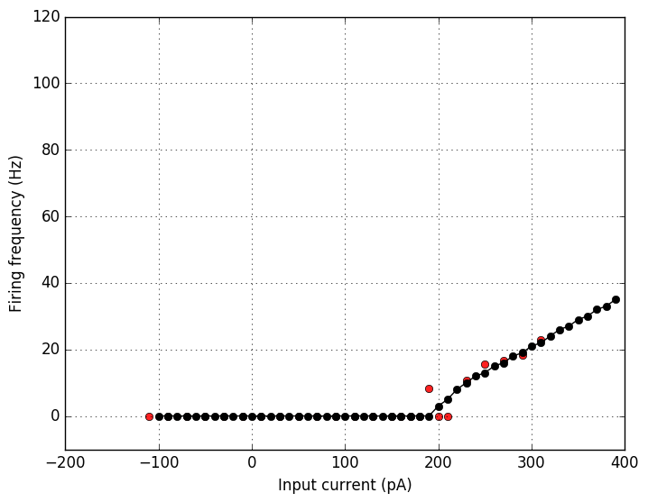</a>
</td>
<td>
<a href="../../../tune/tuned_cells/summary/HH_320207387_iv.png">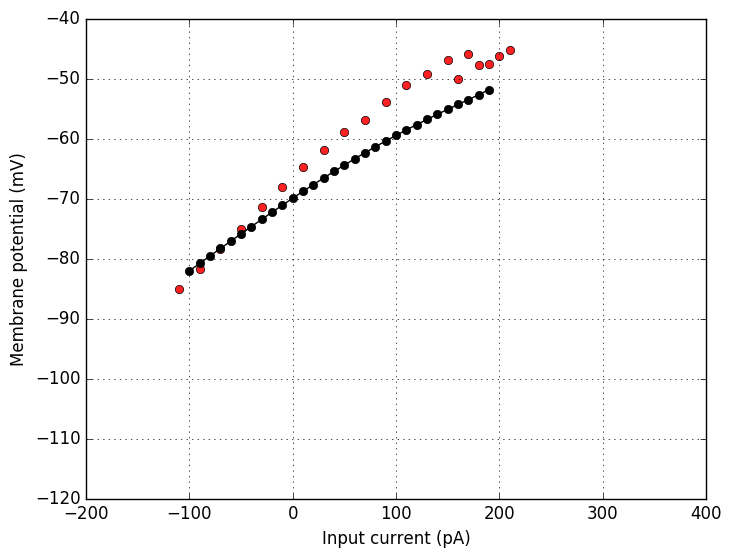</a>
</td>
</tr>
</table>  
 
<table border="1">
<tr>
<td width="130px">

<b>323834998</b>

Primary visual area, layer 6a

aspiny

Scnn1a-Tg3-Cre

<a href="http://celltypes.brain-map.org/mouse/experiment/electrophysiology/323834998">Source data</a>

</td>
<td>
<a href="traces_323834998.png">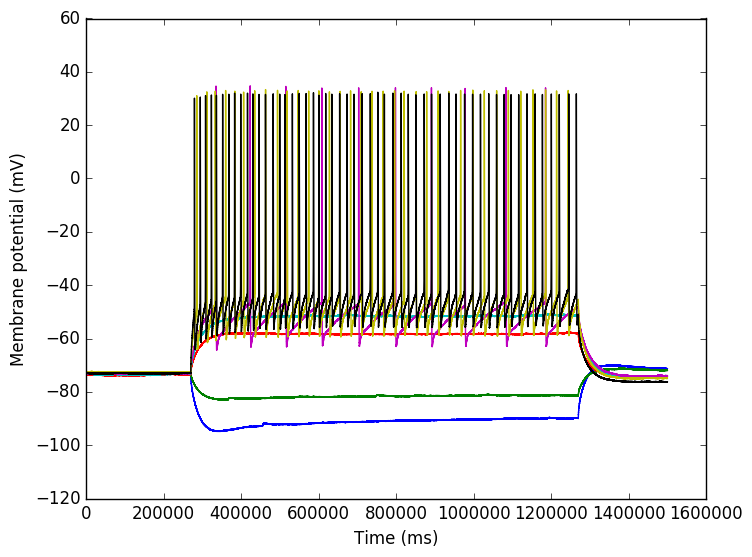</a>
</td>
<td>
<a href="spikes_323834998.png">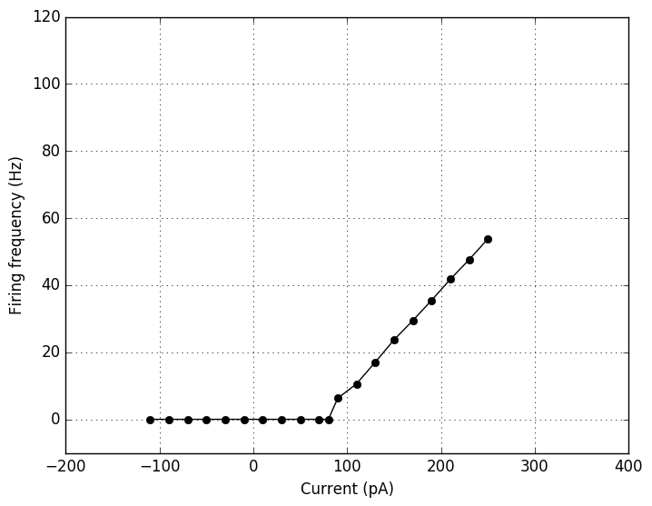</a>
</td>
<td>
<a href="subthreshold_323834998.png">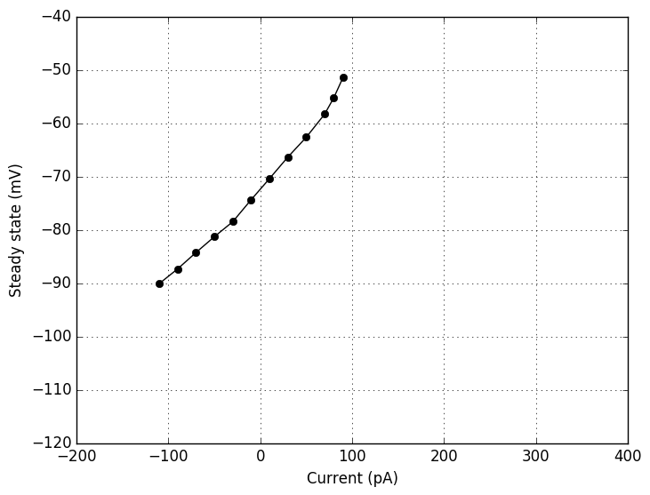</a>
</td>
</tr>
<tr>
<td width="130px">

<b>Izhikevich cell model tuned to dataset 323834998</b>

<a href="https://github.com/OpenSourceBrain/AllenInstituteNeuroML/blob/master/CellTypesDatabase/tune/tuned_cells/Izh_323834998.cell.nml">Tuned model</a>

</td>
<td>
<a href="../../../tune/tuned_cells/summary/Izh_323834998_traces.png">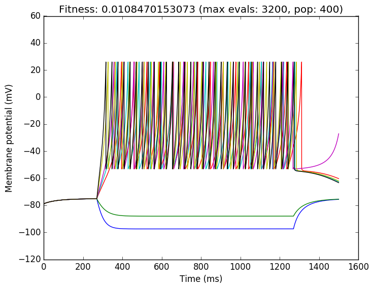</a>
</td>
<td>
<a href="../../../tune/tuned_cells/summary/Izh_323834998_if.png">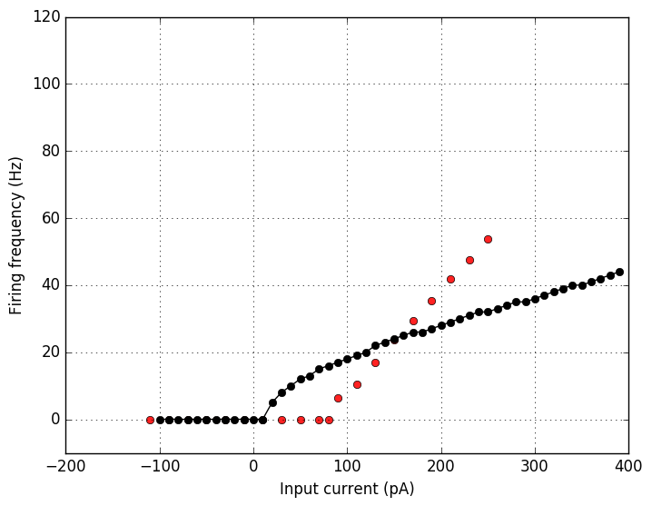</a>
</td>
<td>

</td>
</tr>
<tr>
<td width="130px">

<b>HH cell model tuned to dataset 323834998</b>

<a href="https://github.com/OpenSourceBrain/AllenInstituteNeuroML/blob/master/CellTypesDatabase/tune/tuned_cells/HH_323834998.cell.nml">Tuned model</a>

</td>
<td>
<a href="../../../tune/tuned_cells/summary/HH_323834998_traces.png">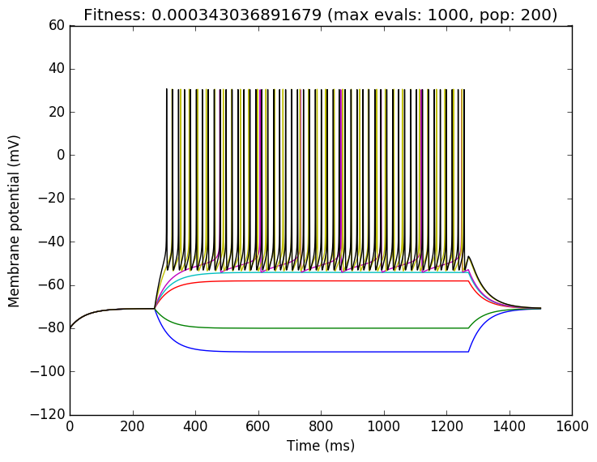</a>
</td>
<td>
<a href="../../../tune/tuned_cells/summary/HH_323834998_if.png">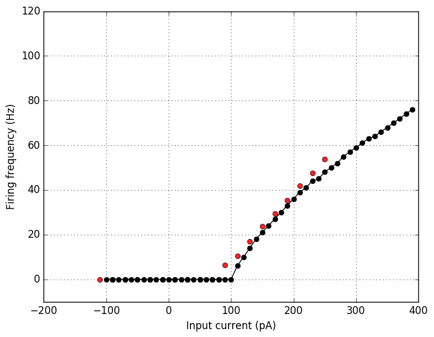</a>
</td>
<td>

</td>
</tr>
</table>  
 
<table border="1">
<tr>
<td width="130px">

<b>324025297</b>

Primary visual area, layer 4

spiny

Rorb-IRES2-Cre

<a href="http://celltypes.brain-map.org/mouse/experiment/electrophysiology/324025297">Source data</a>

</td>
<td>
<a href="traces_324025297.png">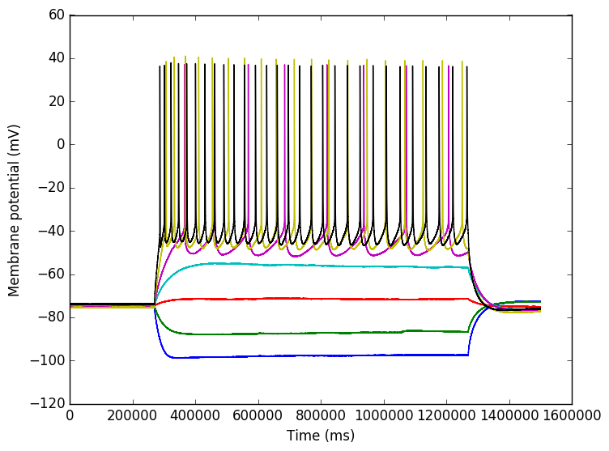</a>
</td>
<td>
<a href="spikes_324025297.png">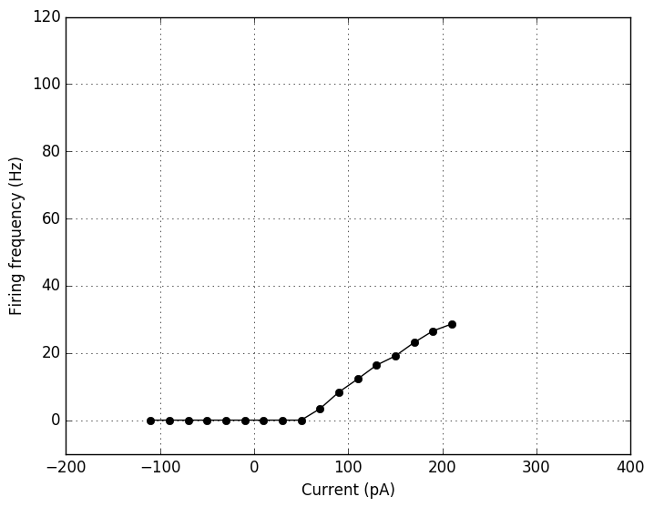</a>
</td>
<td>
<a href="subthreshold_324025297.png">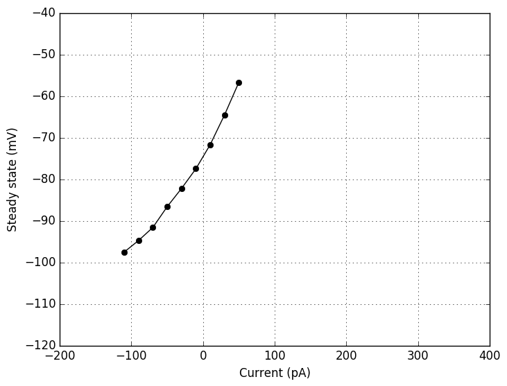</a>
</td>
</tr>
<tr>
<td width="130px">

<b>Izhikevich cell model tuned to dataset 324025297</b>

<a href="https://github.com/OpenSourceBrain/AllenInstituteNeuroML/blob/master/CellTypesDatabase/tune/tuned_cells/Izh_324025297.cell.nml">Tuned model</a>

</td>
<td>
<a href="../../../tune/tuned_cells/summary/Izh_324025297_traces.png">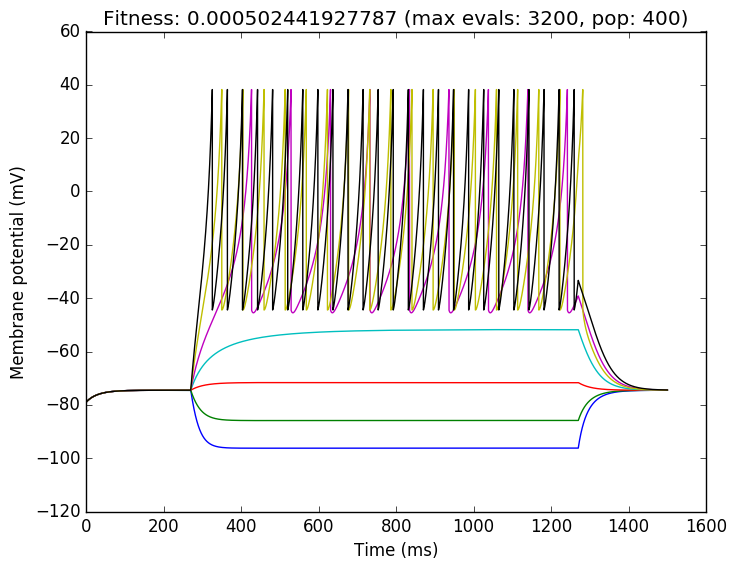</a>
</td>
<td>
<a href="../../../tune/tuned_cells/summary/Izh_324025297_if.png">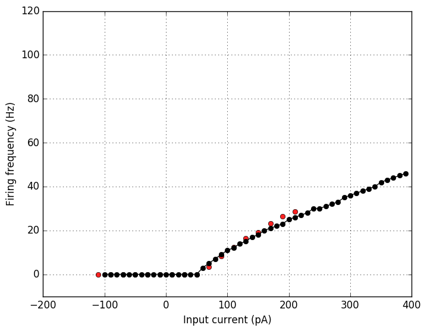</a>
</td>
<td>
<a href="../../../tune/tuned_cells/summary/Izh_324025297_iv.png">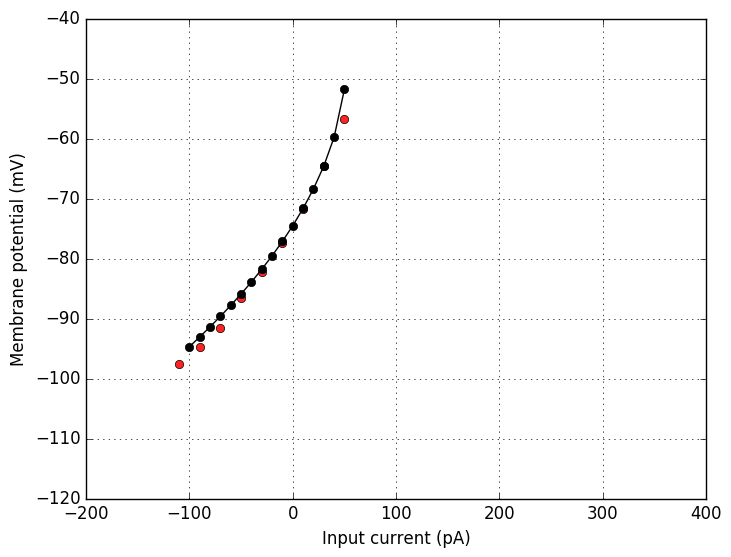</a>
</td>
</tr>
<tr>
<td width="130px">

<b>HH cell model tuned to dataset 324025297</b>

<a href="https://github.com/OpenSourceBrain/AllenInstituteNeuroML/blob/master/CellTypesDatabase/tune/tuned_cells/HH_324025297.cell.nml">Tuned model</a>

</td>
<td>
<a href="../../../tune/tuned_cells/summary/HH_324025297_traces.png">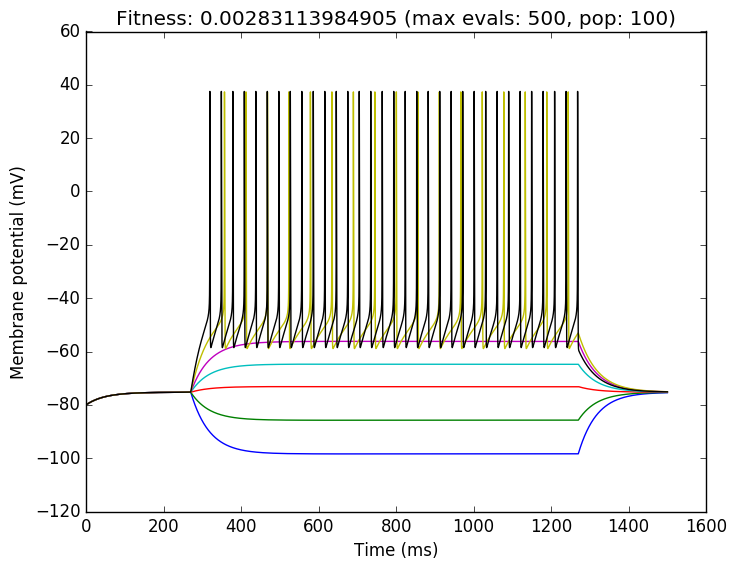</a>
</td>
<td>
<a href="../../../tune/tuned_cells/summary/HH_324025297_if.png">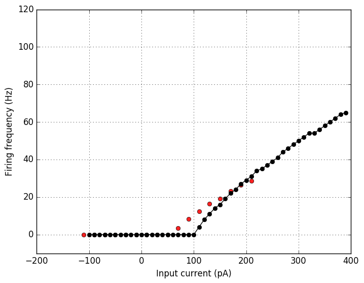</a>
</td>
<td>
<a href="../../../tune/tuned_cells/summary/HH_324025297_iv.png">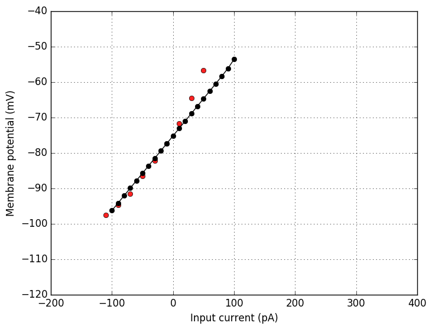</a>
</td>
</tr>
</table>  
 
<table border="1">
<tr>
<td width="130px">

<b>324025371</b>

Primary visual area, layer 4

spiny

Rorb-IRES2-Cre

<a href="http://celltypes.brain-map.org/mouse/experiment/electrophysiology/324025371">Source data</a>

</td>
<td>
<a href="traces_324025371.png">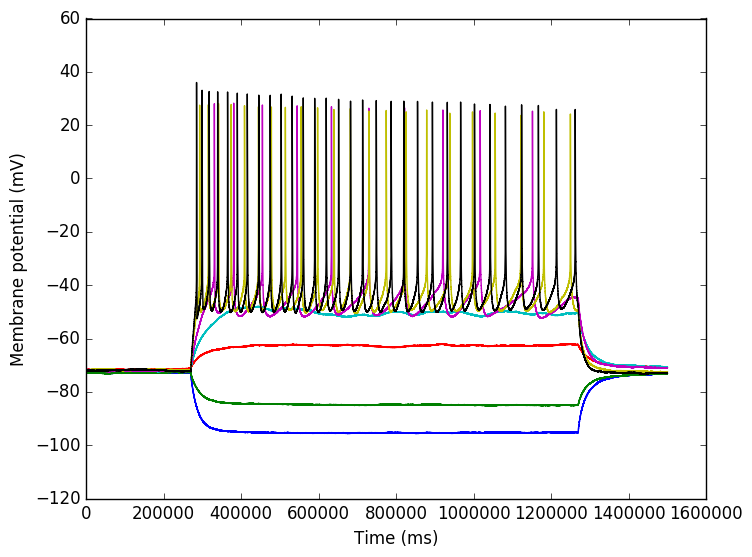</a>
</td>
<td>
<a href="spikes_324025371.png">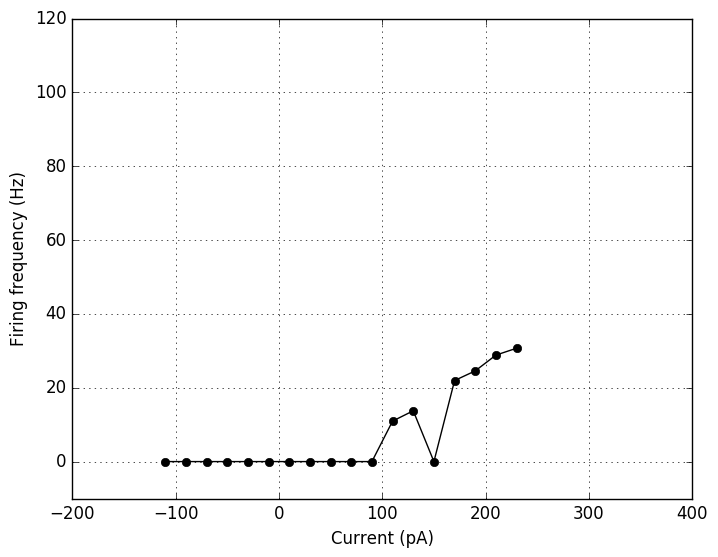</a>
</td>
<td>
<a href="subthreshold_324025371.png">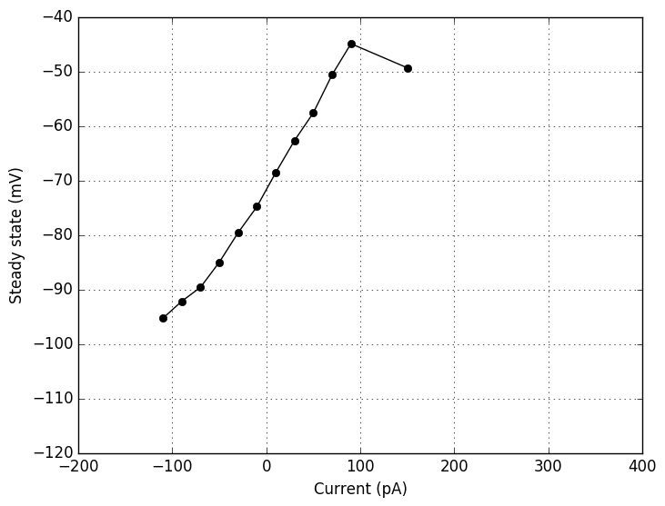</a>
</td>
</tr>
<tr>
<td width="130px">

<b>Izhikevich cell model tuned to dataset 324025371</b>

<a href="https://github.com/OpenSourceBrain/AllenInstituteNeuroML/blob/master/CellTypesDatabase/tune/tuned_cells/Izh_324025371.cell.nml">Tuned model</a>

</td>
<td>
<a href="../../../tune/tuned_cells/summary/Izh_324025371_traces.png">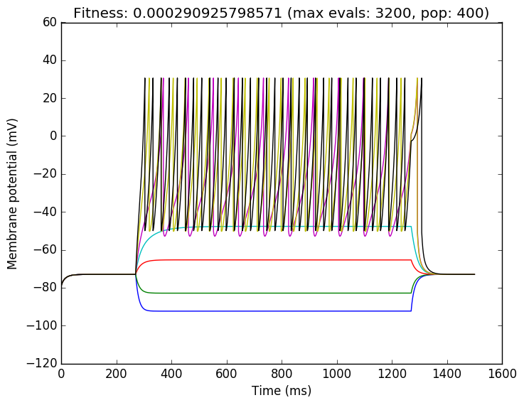</a>
</td>
<td>
<a href="../../../tune/tuned_cells/summary/Izh_324025371_if.png">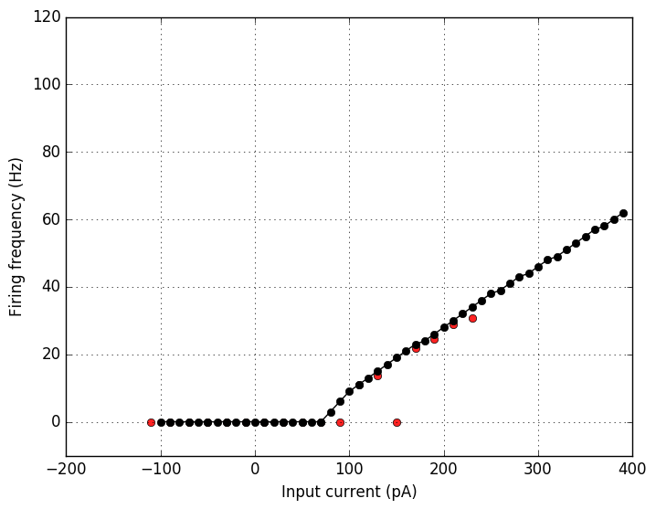</a>
</td>
<td>
<a href="../../../tune/tuned_cells/summary/Izh_324025371_iv.png">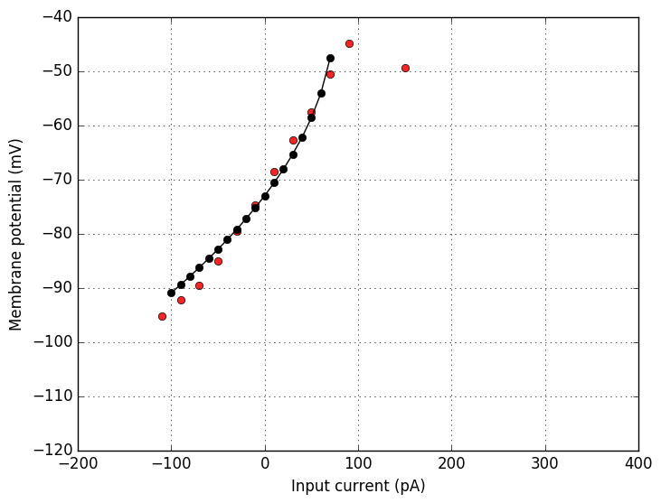</a>
</td>
</tr>
<tr>
<td width="130px">

<b>HH cell model tuned to dataset 324025371</b>

<a href="https://github.com/OpenSourceBrain/AllenInstituteNeuroML/blob/master/CellTypesDatabase/tune/tuned_cells/HH_324025371.cell.nml">Tuned model</a>

</td>
<td>
<a href="../../../tune/tuned_cells/summary/HH_324025371_traces.png">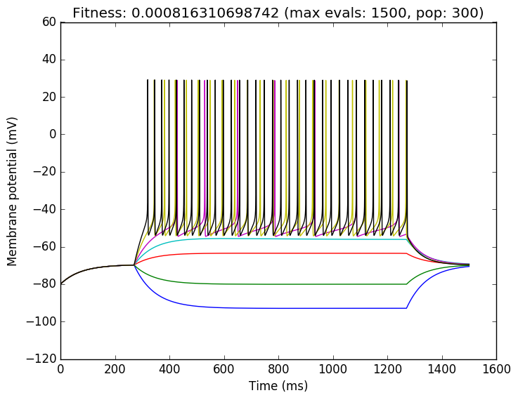</a>
</td>
<td>
<a href="../../../tune/tuned_cells/summary/HH_324025371_if.png">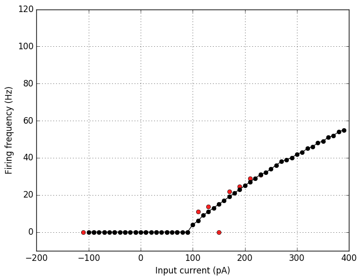</a>
</td>
<td>
<a href="../../../tune/tuned_cells/summary/HH_324025371_iv.png">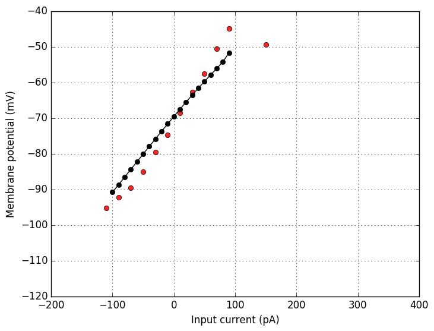</a>
</td>
</tr>
</table>  
 
<table border="1">
<tr>
<td width="130px">

<b>324266189</b>

Primary visual area, layer 2/3

sparsely spiny

Sst-IRES-Cre

<a href="http://celltypes.brain-map.org/mouse/experiment/electrophysiology/324266189">Source data</a>

</td>
<td>
<a href="traces_324266189.png">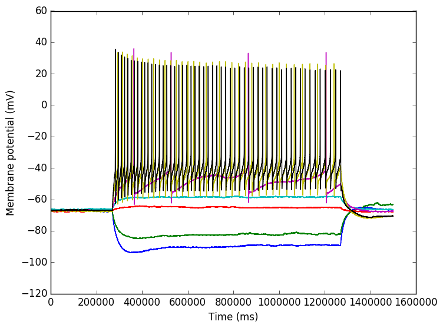</a>
</td>
<td>
<a href="spikes_324266189.png">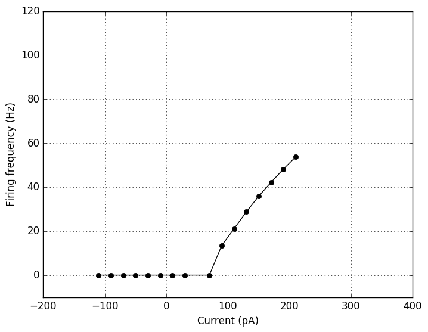</a>
</td>
<td>

</td>
</tr>
<tr>
<td width="130px">

<b>Izhikevich cell model tuned to dataset 324266189</b>

<a href="https://github.com/OpenSourceBrain/AllenInstituteNeuroML/blob/master/CellTypesDatabase/tune/tuned_cells/Izh_324266189.cell.nml">Tuned model</a>

</td>
<td>
<a href="../../../tune/tuned_cells/summary/Izh_324266189_traces.png">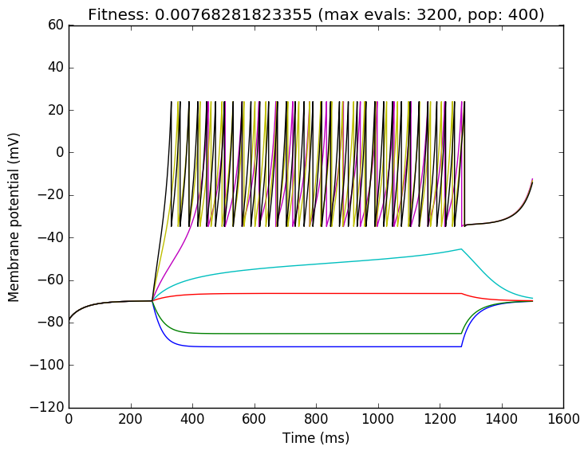</a>
</td>
<td>
<a href="../../../tune/tuned_cells/summary/Izh_324266189_if.png">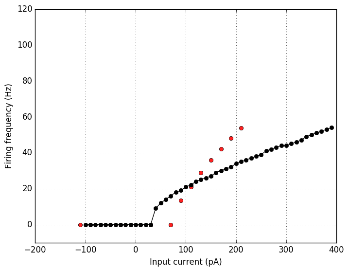</a>
</td>
<td>
<a href="../../../tune/tuned_cells/summary/Izh_324266189_iv.png">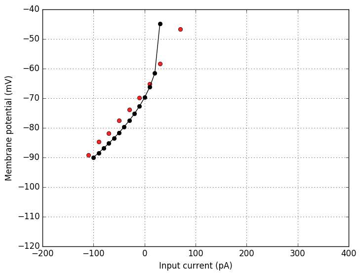</a>
</td>
</tr>
<tr>
<td width="130px">

<b>HH cell model tuned to dataset 324266189</b>

<a href="https://github.com/OpenSourceBrain/AllenInstituteNeuroML/blob/master/CellTypesDatabase/tune/tuned_cells/HH_324266189.cell.nml">Tuned model</a>

</td>
<td>

</td>
<td>
<a href="../../../tune/tuned_cells/summary/HH_324266189_if.png">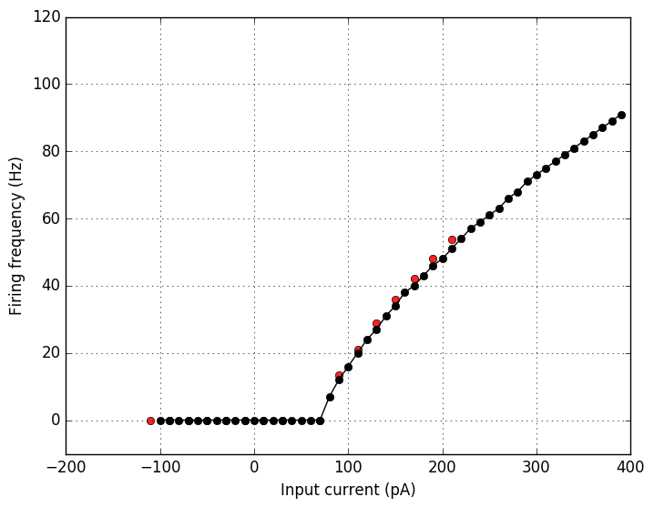</a>
</td>
<td>
<a href="../../../tune/tuned_cells/summary/HH_324266189_iv.png">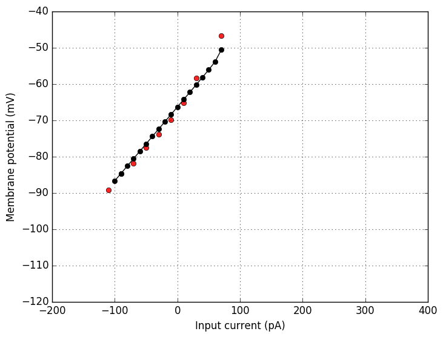</a>
</td>
</tr>
</table>  
 
<table border="1">
<tr>
<td width="130px">

<b>324493977</b>

Primary visual area, layer 2/3

aspiny

Sst-IRES-Cre

<a href="http://celltypes.brain-map.org/mouse/experiment/electrophysiology/324493977">Source data</a>

</td>
<td>
<a href="traces_324493977.png">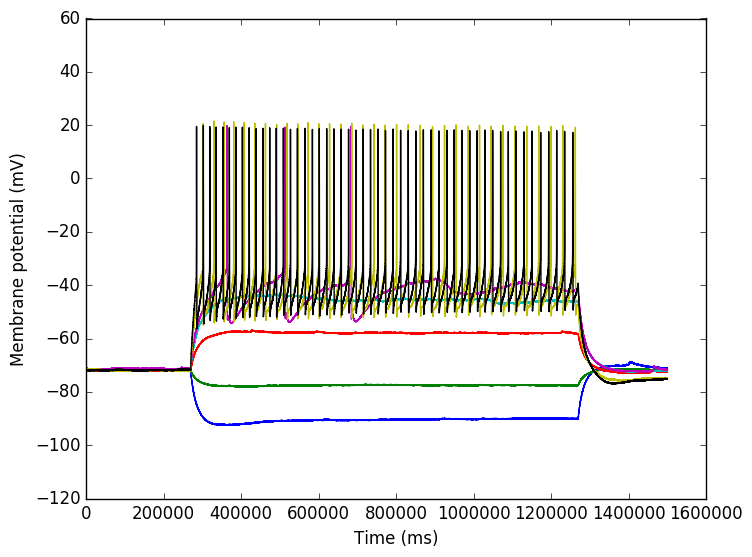</a>
</td>
<td>
<a href="spikes_324493977.png">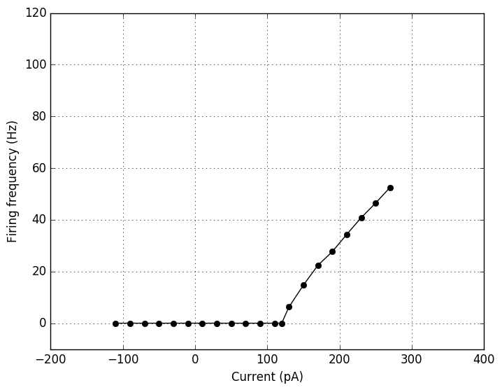</a>
</td>
<td>
<a href="subthreshold_324493977.png">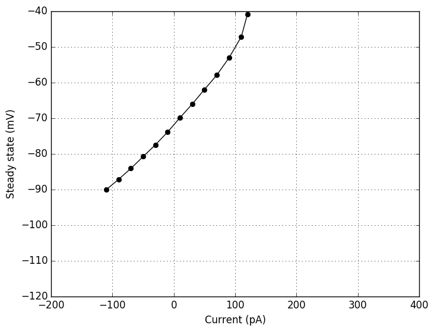</a>
</td>
</tr>
<tr>
<td width="130px">

<b>Izhikevich cell model tuned to dataset 324493977</b>

<a href="https://github.com/OpenSourceBrain/AllenInstituteNeuroML/blob/master/CellTypesDatabase/tune/tuned_cells/Izh_324493977.cell.nml">Tuned model</a>

</td>
<td>
<a href="../../../tune/tuned_cells/summary/Izh_324493977_traces.png">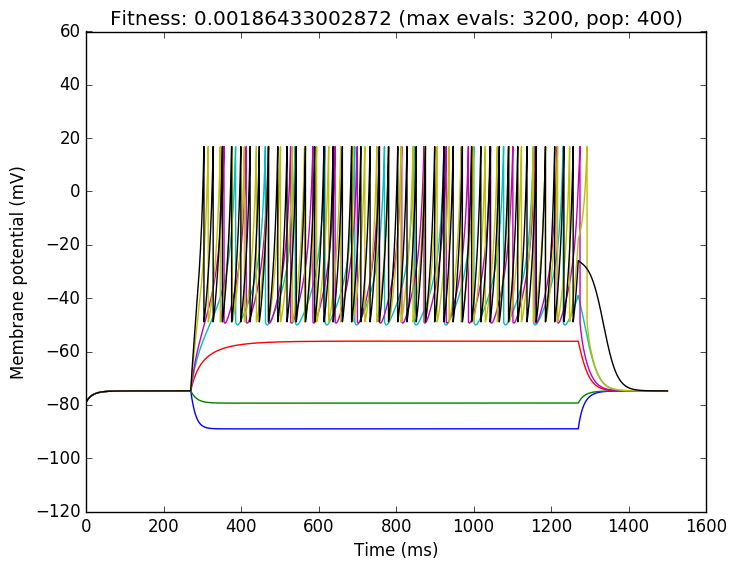</a>
</td>
<td>
<a href="../../../tune/tuned_cells/summary/Izh_324493977_if.png">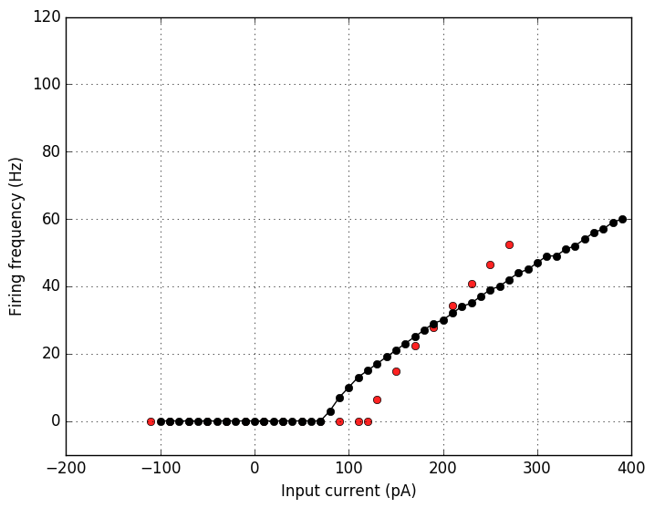</a>
</td>
<td>
<a href="../../../tune/tuned_cells/summary/Izh_324493977_iv.png">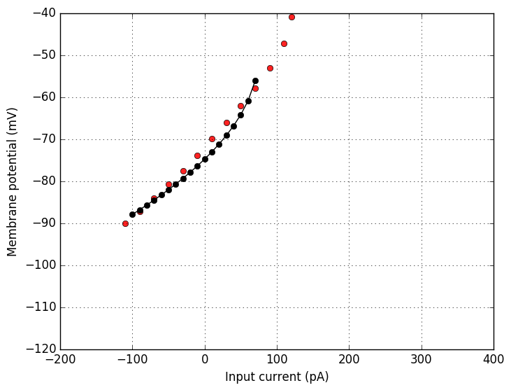</a>
</td>
</tr>
<tr>
<td width="130px">

<b>HH cell model tuned to dataset 324493977</b>

<a href="https://github.com/OpenSourceBrain/AllenInstituteNeuroML/blob/master/CellTypesDatabase/tune/tuned_cells/HH_324493977.cell.nml">Tuned model</a>

</td>
<td>

</td>
<td>
<a href="../../../tune/tuned_cells/summary/HH_324493977_if.png">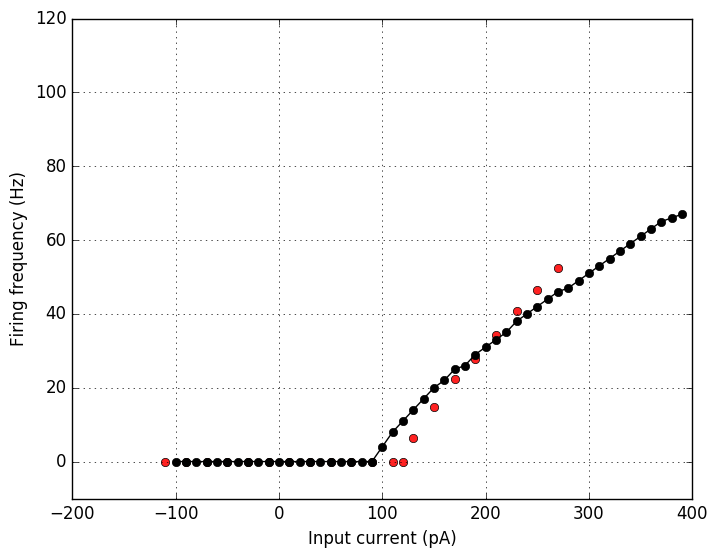</a>
</td>
<td>
<a href="../../../tune/tuned_cells/summary/HH_324493977_iv.png">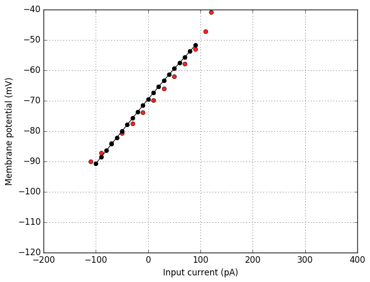</a>
</td>
</tr>
</table>  
 
<table border="1">
<tr>
<td width="130px">

<b>325941643</b>

Primary visual area, layer 6a

spiny

Rbp4-Cre_KL100

<a href="http://celltypes.brain-map.org/mouse/experiment/electrophysiology/325941643">Source data</a>

</td>
<td>
<a href="traces_325941643.png">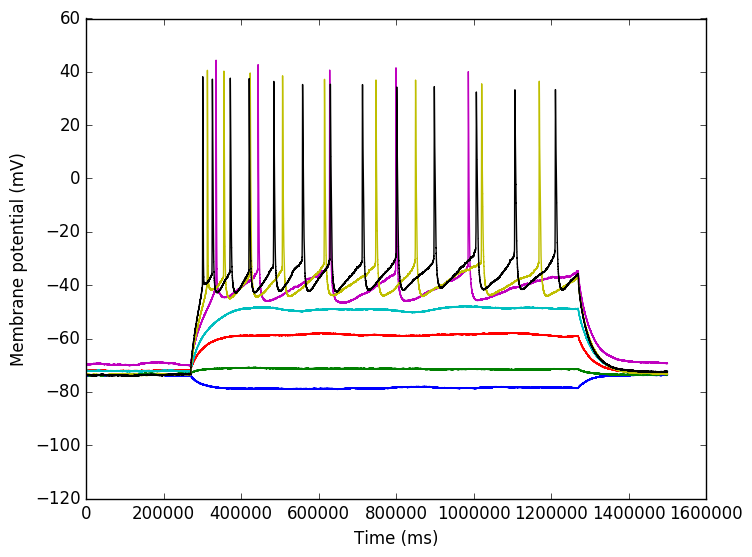</a>
</td>
<td>

</td>
<td>
<a href="subthreshold_325941643.png">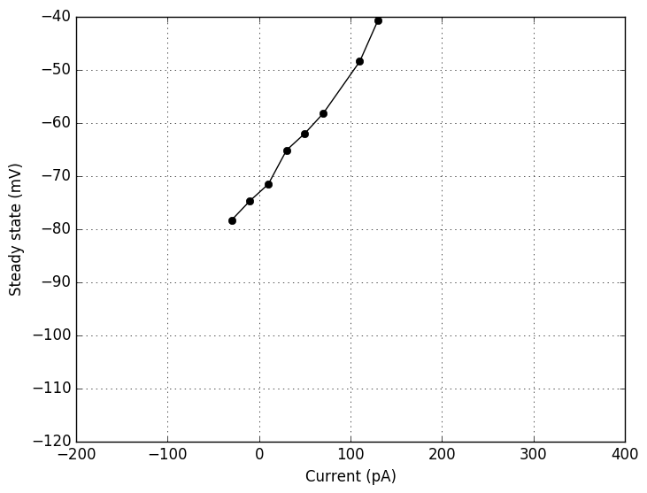</a>
</td>
</tr>
<tr>
<td width="130px">

<b>Izhikevich cell model tuned to dataset 325941643</b>

<a href="https://github.com/OpenSourceBrain/AllenInstituteNeuroML/blob/master/CellTypesDatabase/tune/tuned_cells/Izh_325941643.cell.nml">Tuned model</a>

</td>
<td>
<a href="../../../tune/tuned_cells/summary/Izh_325941643_traces.png">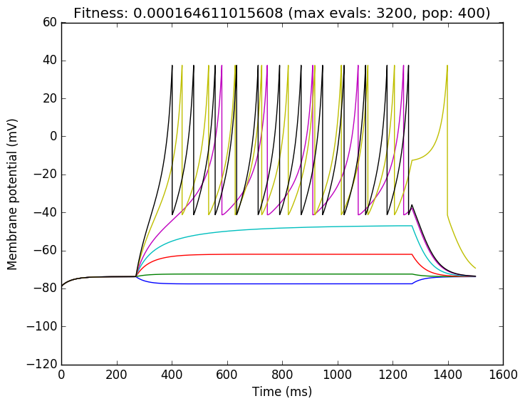</a>
</td>
<td>

</td>
<td>
<a href="../../../tune/tuned_cells/summary/Izh_325941643_iv.png">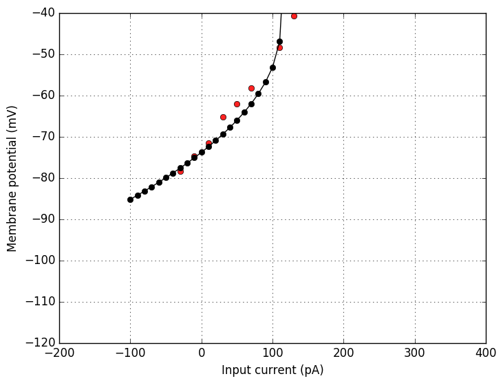</a>
</td>
</tr>
<tr>
<td width="130px">

<b>HH cell model tuned to dataset 325941643</b>

<a href="https://github.com/OpenSourceBrain/AllenInstituteNeuroML/blob/master/CellTypesDatabase/tune/tuned_cells/HH_325941643.cell.nml">Tuned model</a>

</td>
<td>

</td>
<td>

</td>
<td>

</td>
</tr>
</table>  
 
<table border="1">
<tr>
<td width="130px">

<b>327962063</b>

Primary visual area, layer 2/3

aspiny

Htr3a-Cre_NO152

<a href="http://celltypes.brain-map.org/mouse/experiment/electrophysiology/327962063">Source data</a>

</td>
<td>
<a href="traces_327962063.png">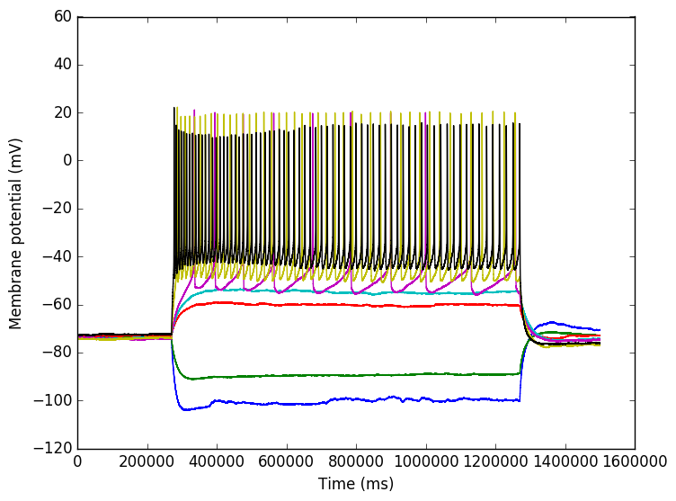</a>
</td>
<td>
<a href="spikes_327962063.png">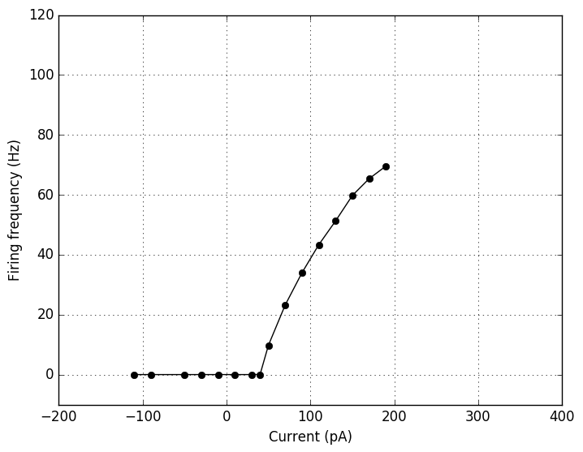</a>
</td>
<td>
<a href="subthreshold_327962063.png">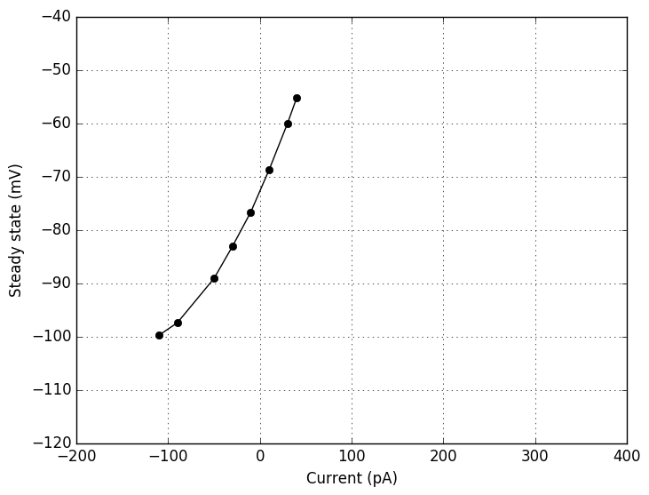</a>
</td>
</tr>
<tr>
<td width="130px">

<b>Izhikevich cell model tuned to dataset 327962063</b>

<a href="https://github.com/OpenSourceBrain/AllenInstituteNeuroML/blob/master/CellTypesDatabase/tune/tuned_cells/Izh_327962063.cell.nml">Tuned model</a>

</td>
<td>
<a href="../../../tune/tuned_cells/summary/Izh_327962063_traces.png">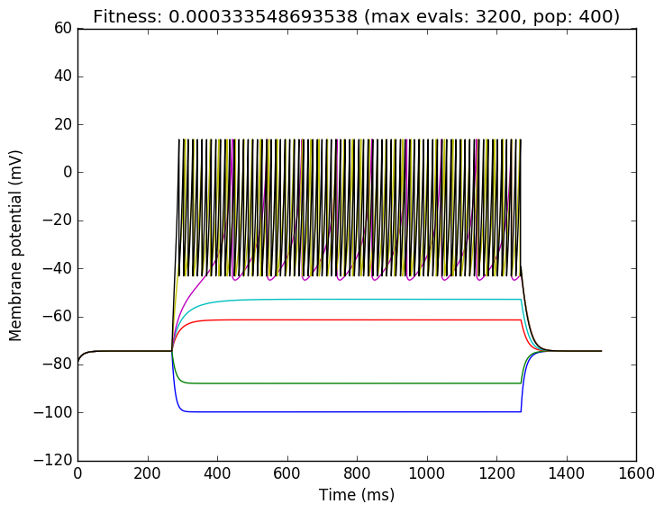</a>
</td>
<td>
<a href="../../../tune/tuned_cells/summary/Izh_327962063_if.png">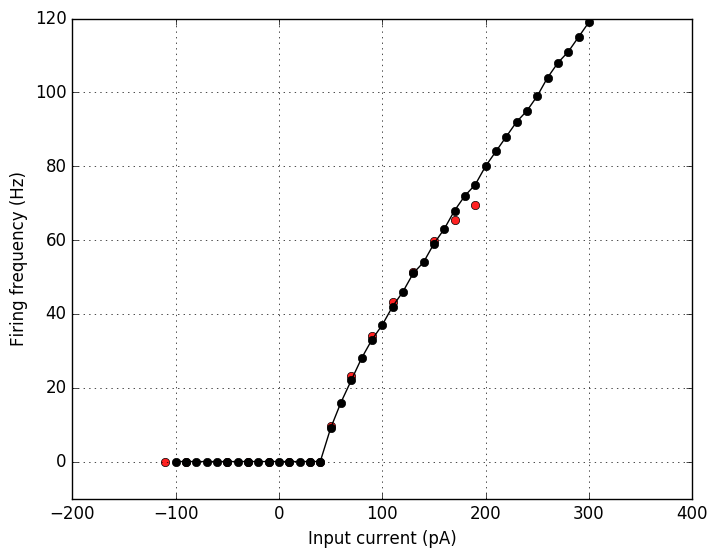</a>
</td>
<td>
<a href="../../../tune/tuned_cells/summary/Izh_327962063_iv.png">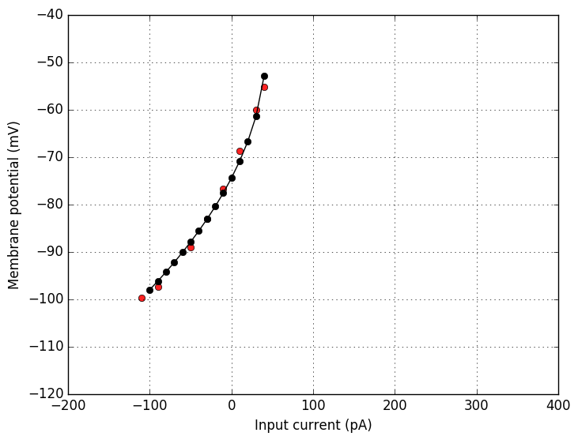</a>
</td>
</tr>
<tr>
<td width="130px">

<b>HH cell model tuned to dataset 327962063</b>

<a href="https://github.com/OpenSourceBrain/AllenInstituteNeuroML/blob/master/CellTypesDatabase/tune/tuned_cells/HH_327962063.cell.nml">Tuned model</a>

</td>
<td>

</td>
<td>
<a href="../../../tune/tuned_cells/summary/HH_327962063_if.png">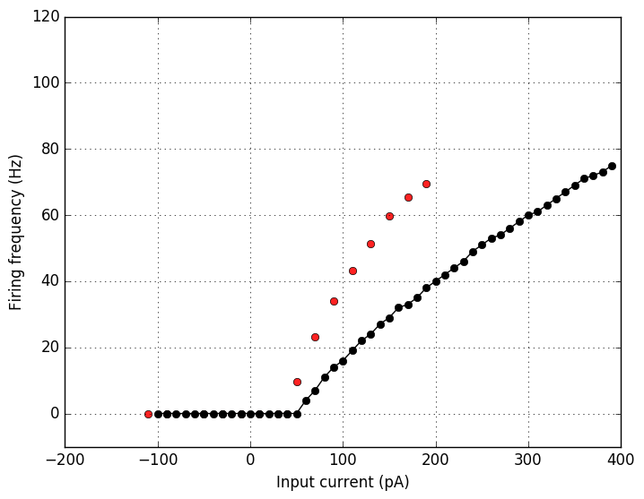</a>
</td>
<td>
<a href="../../../tune/tuned_cells/summary/HH_327962063_iv.png">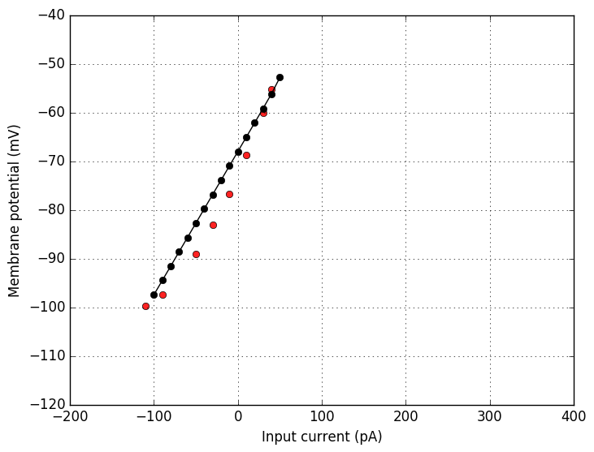</a>
</td>
</tr>
</table>  
 
<table border="1">
<tr>
<td width="130px">

<b>341442651</b>

Primary visual area, layer 2/3

aspiny

Pvalb-IRES-Cre

<a href="http://celltypes.brain-map.org/mouse/experiment/electrophysiology/341442651">Source data</a>

</td>
<td>
<a href="traces_341442651.png">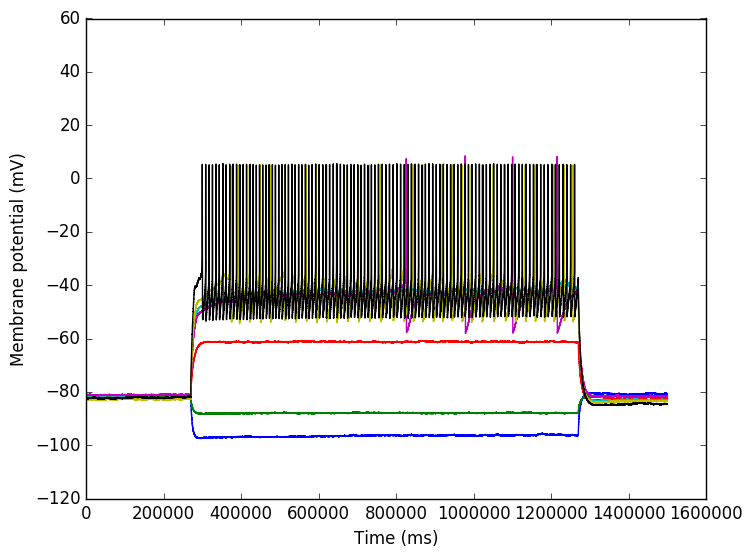</a>
</td>
<td>
<a href="spikes_341442651.png">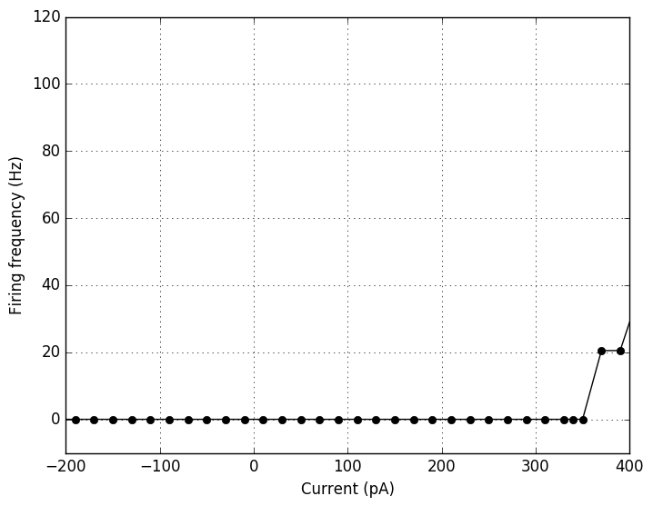</a>
</td>
<td>
<a href="subthreshold_341442651.png">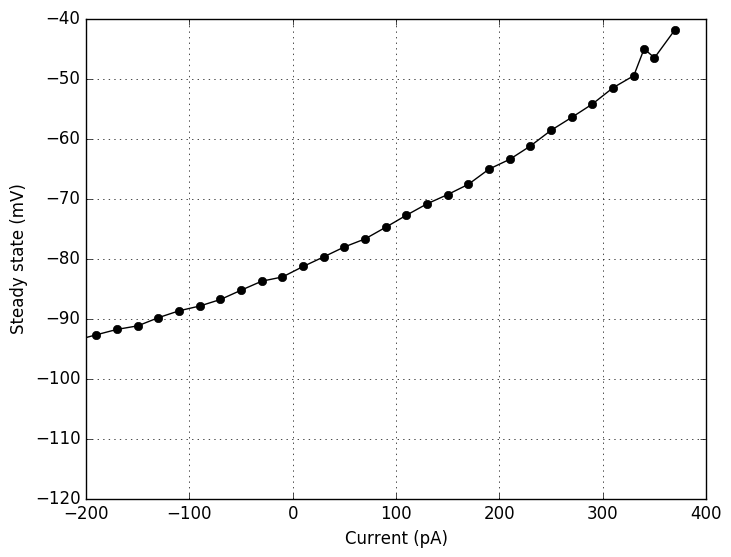</a>
</td>
</tr>
<tr>
<td width="130px">

<b>Izhikevich cell model tuned to dataset 341442651</b>

<a href="https://github.com/OpenSourceBrain/AllenInstituteNeuroML/blob/master/CellTypesDatabase/tune/tuned_cells/Izh_341442651.cell.nml">Tuned model</a>

</td>
<td>
<a href="../../../tune/tuned_cells/summary/Izh_341442651_traces.png">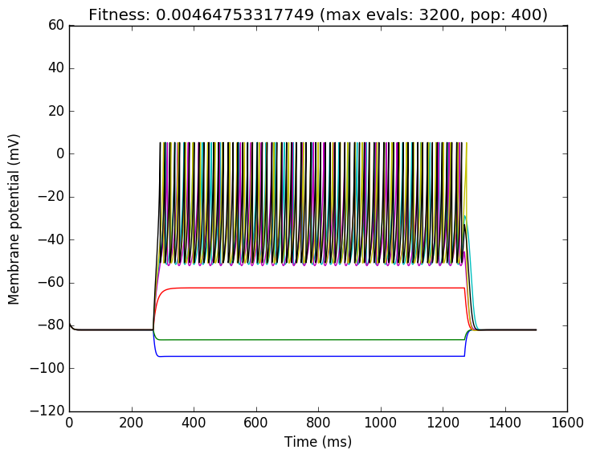</a>
</td>
<td>
<a href="../../../tune/tuned_cells/summary/Izh_341442651_if.png">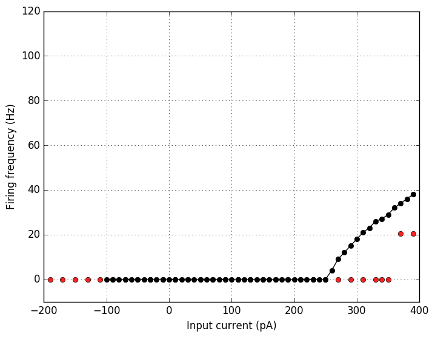</a>
</td>
<td>
<a href="../../../tune/tuned_cells/summary/Izh_341442651_iv.png">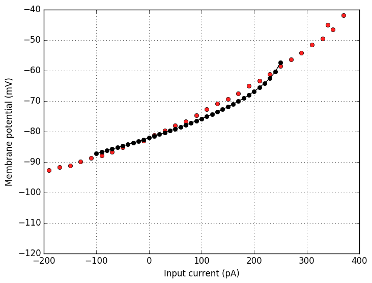</a>
</td>
</tr>
<tr>
<td width="130px">

<b>HH cell model tuned to dataset 341442651</b>

<a href="https://github.com/OpenSourceBrain/AllenInstituteNeuroML/blob/master/CellTypesDatabase/tune/tuned_cells/HH_341442651.cell.nml">Tuned model</a>

</td>
<td>

</td>
<td>
<a href="../../../tune/tuned_cells/summary/HH_341442651_if.png">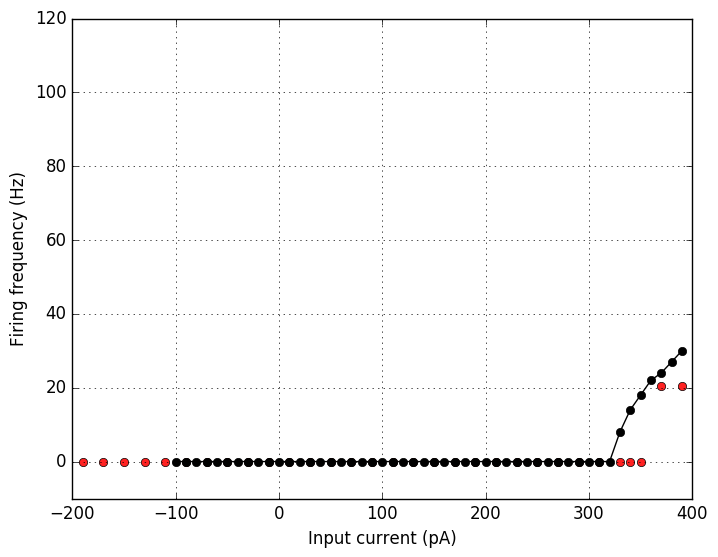</a>
</td>
<td>
<a href="../../../tune/tuned_cells/summary/HH_341442651_iv.png">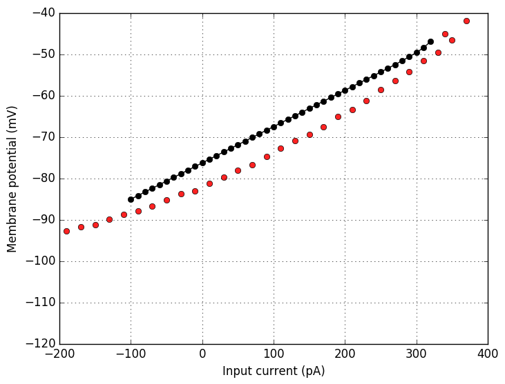</a>
</td>
</tr>
</table>  
 
<table border="1">
<tr>
<td width="130px">

<b>370351753</b>

Primary visual area, layer 4

spiny

Nr5a1-Cre

<a href="http://celltypes.brain-map.org/mouse/experiment/electrophysiology/370351753">Source data</a>

</td>
<td>
<a href="traces_370351753.png">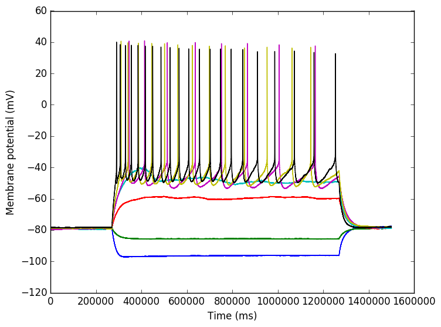</a>
</td>
<td>

</td>
<td>
<a href="subthreshold_370351753.png">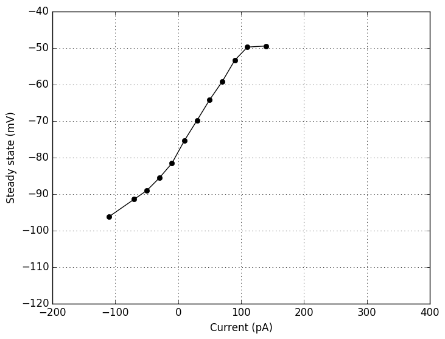</a>
</td>
</tr>
<tr>
<td width="130px">

<b>Izhikevich cell model tuned to dataset 370351753</b>

<a href="https://github.com/OpenSourceBrain/AllenInstituteNeuroML/blob/master/CellTypesDatabase/tune/tuned_cells/Izh_370351753.cell.nml">Tuned model</a>

</td>
<td>
<a href="../../../tune/tuned_cells/summary/Izh_370351753_traces.png">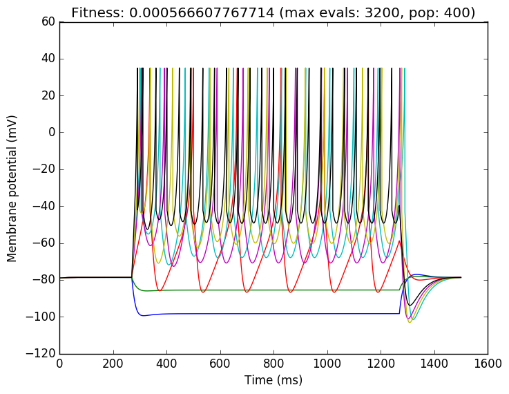</a>
</td>
<td>
<a href="../../../tune/tuned_cells/summary/Izh_370351753_if.png">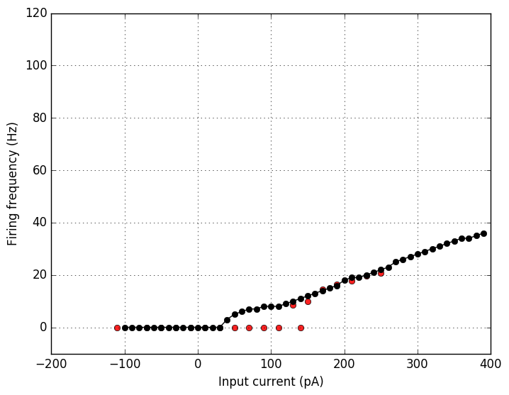</a>
</td>
<td>
<a href="../../../tune/tuned_cells/summary/Izh_370351753_iv.png">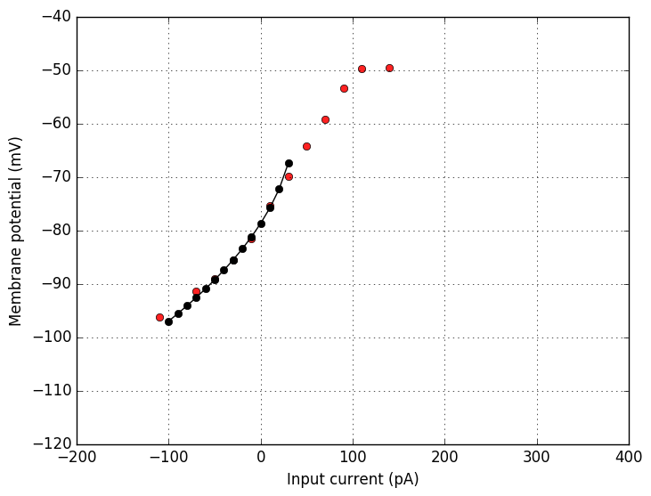</a>
</td>
</tr>
<tr>
<td width="130px">

<b>HH cell model tuned to dataset 370351753</b>

<a href="https://github.com/OpenSourceBrain/AllenInstituteNeuroML/blob/master/CellTypesDatabase/tune/tuned_cells/HH_370351753.cell.nml">Tuned model</a>

</td>
<td>
<a href="../../../tune/tuned_cells/summary/HH_370351753_traces.png">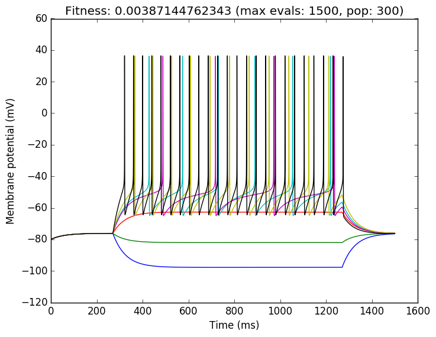</a>
</td>
<td>
<a href="../../../tune/tuned_cells/summary/HH_370351753_if.png">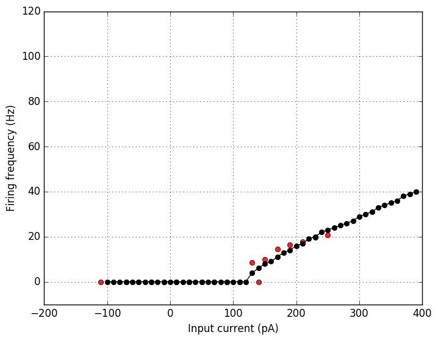</a>
</td>
<td>
<a href="../../../tune/tuned_cells/summary/HH_370351753_iv.png">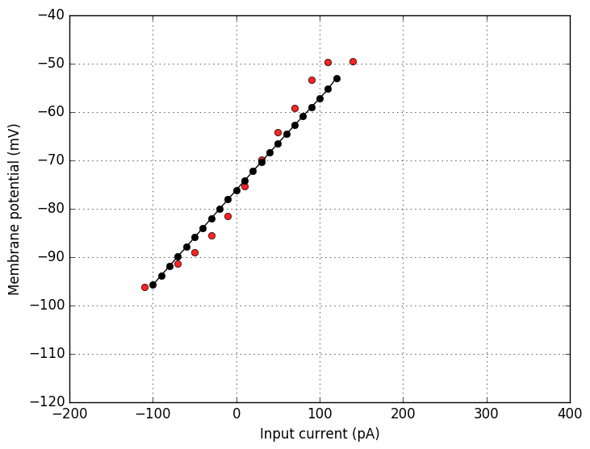</a>
</td>
</tr>
</table>  
 
<table border="1">
<tr>
<td width="130px">

<b>386970660</b>

Primary visual area, layer 4

spiny

Nr5a1-Cre

<a href="http://celltypes.brain-map.org/mouse/experiment/electrophysiology/386970660">Source data</a>

</td>
<td>
<a href="traces_386970660.png">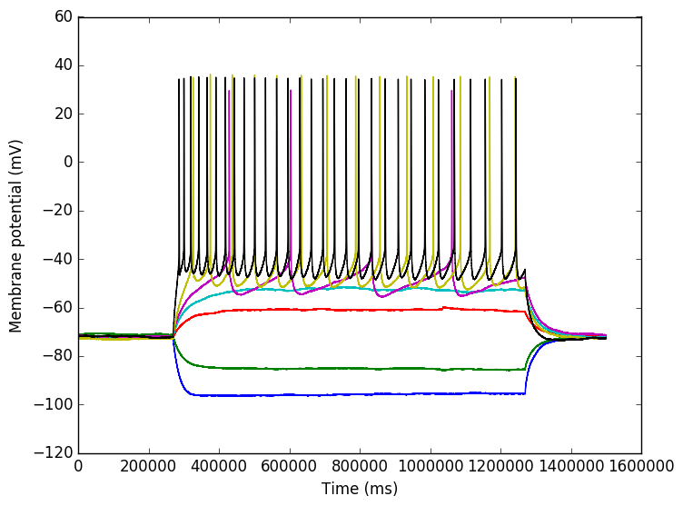</a>
</td>
<td>
<a href="spikes_386970660.png">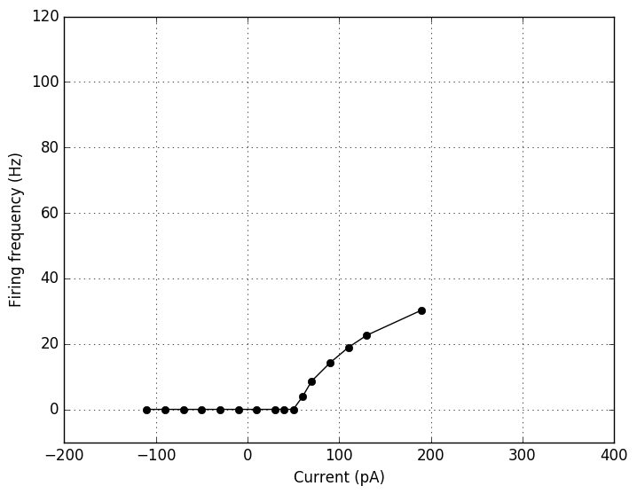</a>
</td>
<td>
<a href="subthreshold_386970660.png">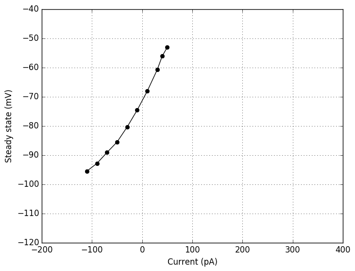</a>
</td>
</tr>
<tr>
<td width="130px">

<b>Izhikevich cell model tuned to dataset 386970660</b>

<a href="https://github.com/OpenSourceBrain/AllenInstituteNeuroML/blob/master/CellTypesDatabase/tune/tuned_cells/Izh_386970660.cell.nml">Tuned model</a>

</td>
<td>
<a href="../../../tune/tuned_cells/summary/Izh_386970660_traces.png">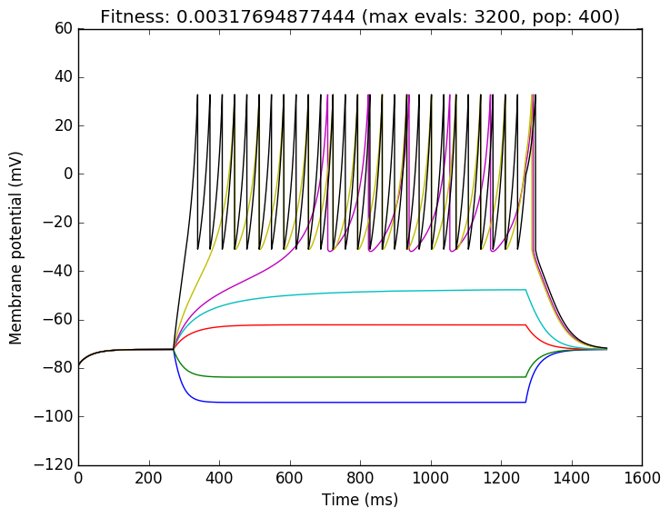</a>
</td>
<td>
<a href="../../../tune/tuned_cells/summary/Izh_386970660_if.png">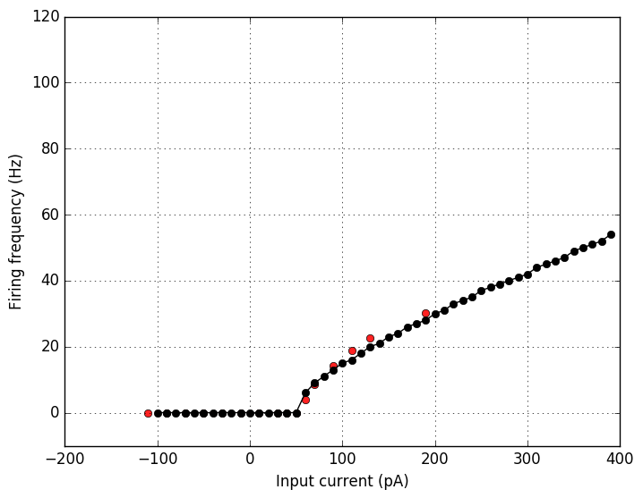</a>
</td>
<td>
<a href="../../../tune/tuned_cells/summary/Izh_386970660_iv.png">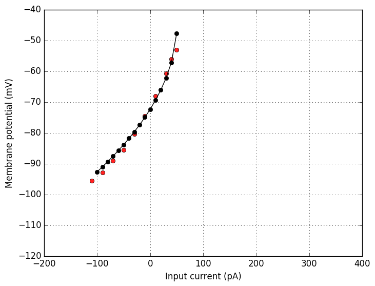</a>
</td>
</tr>
<tr>
<td width="130px">

<b>HH cell model tuned to dataset 386970660</b>

<a href="https://github.com/OpenSourceBrain/AllenInstituteNeuroML/blob/master/CellTypesDatabase/tune/tuned_cells/HH_386970660.cell.nml">Tuned model</a>

</td>
<td>

</td>
<td>
<a href="../../../tune/tuned_cells/summary/HH_386970660_if.png">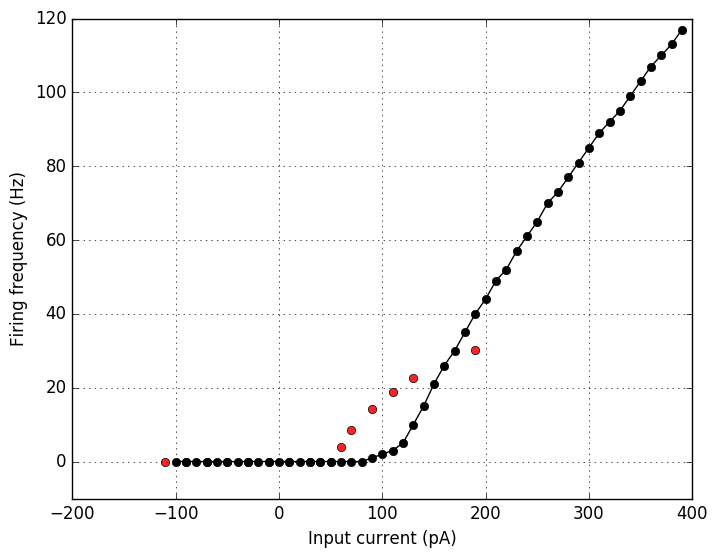</a>
</td>
<td>
<a href="../../../tune/tuned_cells/summary/HH_386970660_iv.png">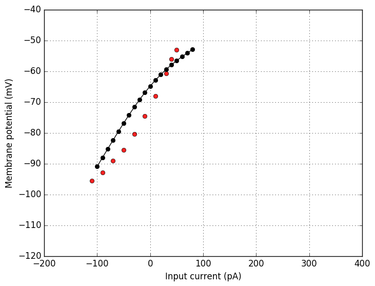</a>
</td>
</tr>
</table>  
 
<table border="1">
<tr>
<td width="130px">

<b>464198958</b>

Lateral visual area, layer 5

aspiny

Sst-IRES-Cre

<a href="http://celltypes.brain-map.org/mouse/experiment/electrophysiology/464198958">Source data</a>

</td>
<td>
<a href="traces_464198958.png">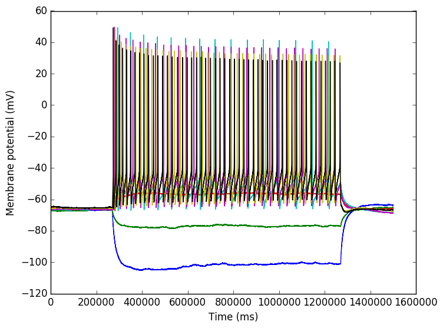</a>
</td>
<td>
<a href="spikes_464198958.png">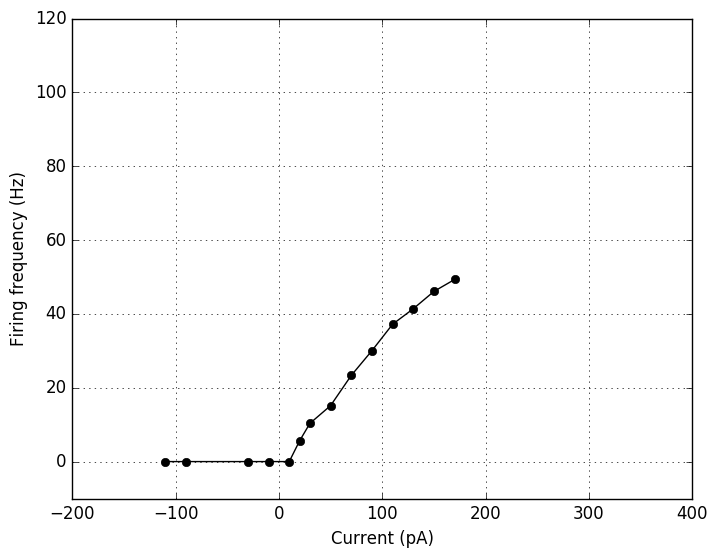</a>
</td>
<td>
<a href="subthreshold_464198958.png">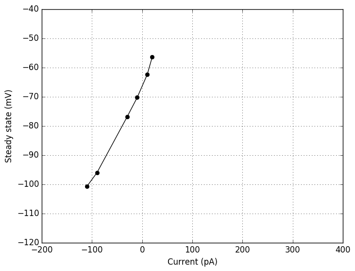</a>
</td>
</tr>
<tr>
<td width="130px">

<b>Izhikevich cell model tuned to dataset 464198958</b>

<a href="https://github.com/OpenSourceBrain/AllenInstituteNeuroML/blob/master/CellTypesDatabase/tune/tuned_cells/Izh_464198958.cell.nml">Tuned model</a>

</td>
<td>

</td>
<td>

</td>
<td>

</td>
</tr>
<tr>
<td width="130px">

<b>HH cell model tuned to dataset 464198958</b>

<a href="https://github.com/OpenSourceBrain/AllenInstituteNeuroML/blob/master/CellTypesDatabase/tune/tuned_cells/HH_464198958.cell.nml">Tuned model</a>

</td>
<td>

</td>
<td>

</td>
<td>

</td>
</tr>
</table>  
 
<table border="1">
<tr>
<td width="130px">

<b>464326095</b>

Primary visual area, layer 6a

aspiny

Pvalb-IRES-Cre

<a href="http://celltypes.brain-map.org/mouse/experiment/electrophysiology/464326095">Source data</a>

</td>
<td>
<a href="traces_464326095.png">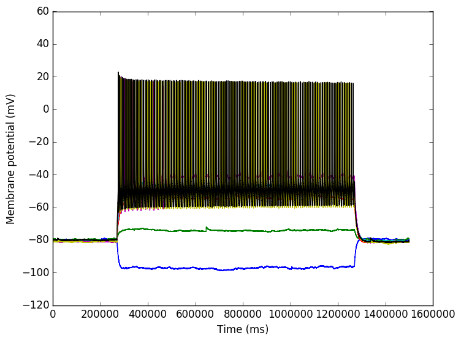</a>
</td>
<td>
<a href="spikes_464326095.png">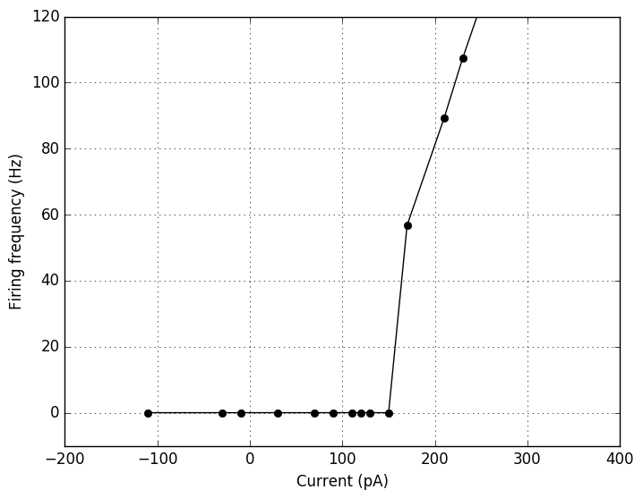</a>
</td>
<td>
<a href="subthreshold_464326095.png">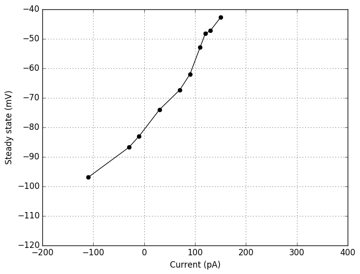</a>
</td>
</tr>
<tr>
<td width="130px">

<b>Izhikevich cell model tuned to dataset 464326095</b>

<a href="https://github.com/OpenSourceBrain/AllenInstituteNeuroML/blob/master/CellTypesDatabase/tune/tuned_cells/Izh_464326095.cell.nml">Tuned model</a>

</td>
<td>
<a href="../../../tune/tuned_cells/summary/Izh_464326095_traces.png">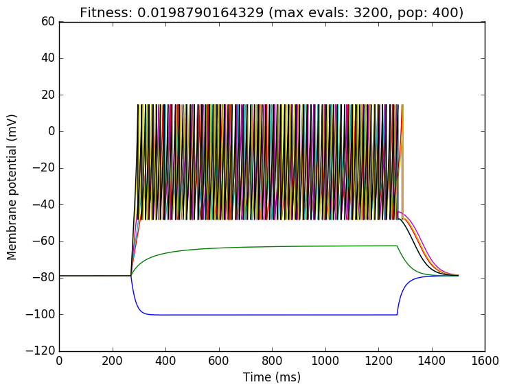</a>
</td>
<td>
<a href="../../../tune/tuned_cells/summary/Izh_464326095_if.png">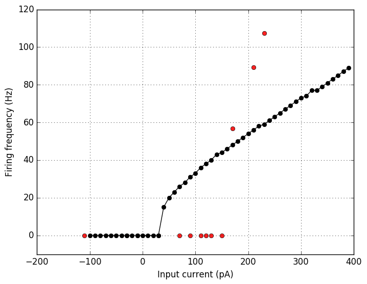</a>
</td>
<td>
<a href="../../../tune/tuned_cells/summary/Izh_464326095_iv.png">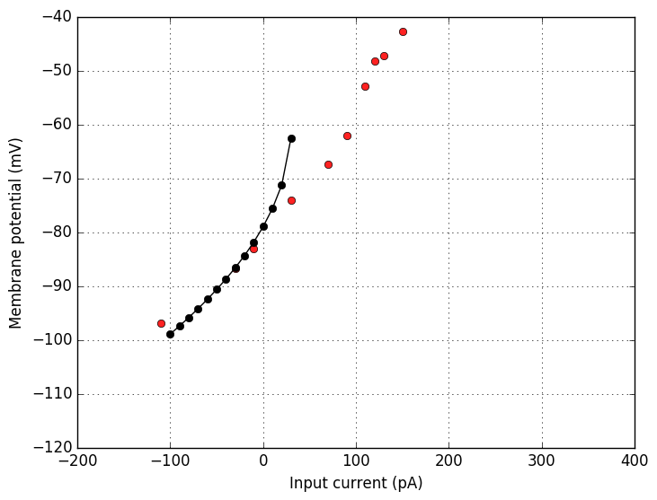</a>
</td>
</tr>
<tr>
<td width="130px">

<b>HH cell model tuned to dataset 464326095</b>

<a href="https://github.com/OpenSourceBrain/AllenInstituteNeuroML/blob/master/CellTypesDatabase/tune/tuned_cells/HH_464326095.cell.nml">Tuned model</a>

</td>
<td>
<a href="../../../tune/tuned_cells/summary/HH_464326095_traces.png">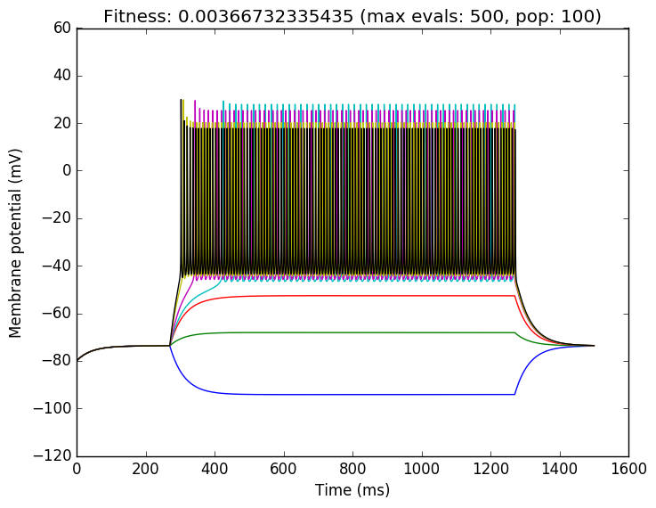</a>
</td>
<td>
<a href="../../../tune/tuned_cells/summary/HH_464326095_if.png">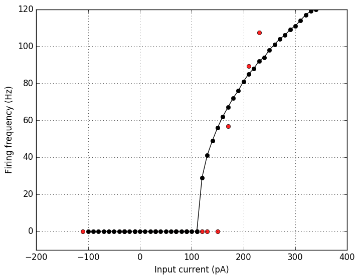</a>
</td>
<td>
<a href="../../../tune/tuned_cells/summary/HH_464326095_iv.png">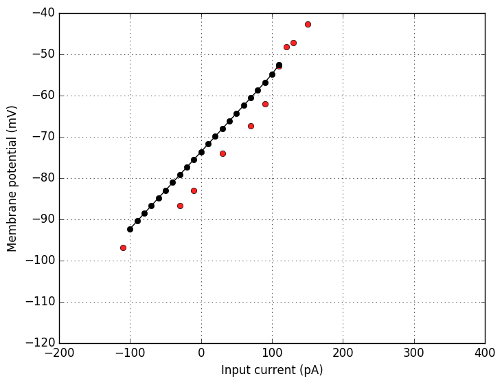</a>
</td>
</tr>
</table>  
 
<table border="1">
<tr>
<td width="130px">

<b>466632464</b>

Primary visual area, layer 6a

spiny

Ntsr1-Cre_GN220

<a href="http://celltypes.brain-map.org/mouse/experiment/electrophysiology/466632464">Source data</a>

</td>
<td>
<a href="traces_466632464.png">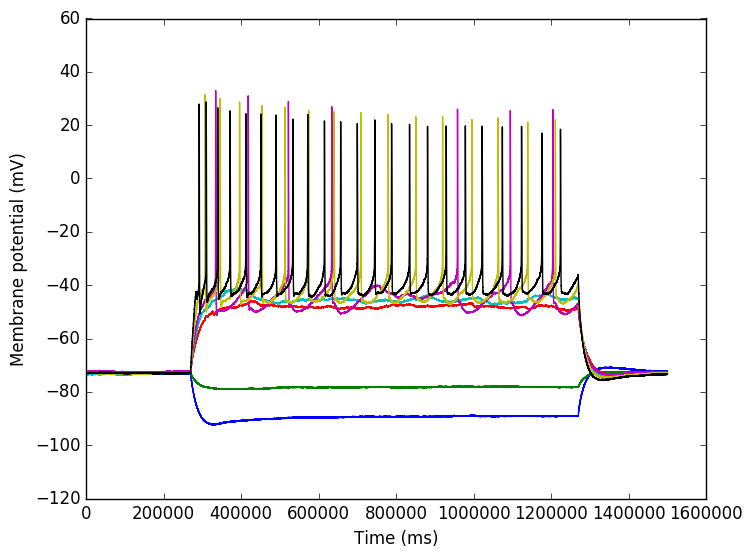</a>
</td>
<td>

</td>
<td>
<a href="subthreshold_466632464.png">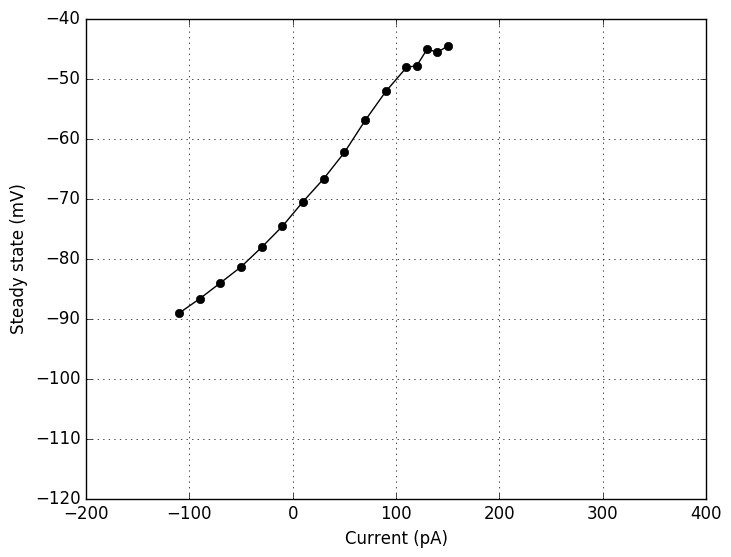</a>
</td>
</tr>
<tr>
<td width="130px">

<b>Izhikevich cell model tuned to dataset 466632464</b>

<a href="https://github.com/OpenSourceBrain/AllenInstituteNeuroML/blob/master/CellTypesDatabase/tune/tuned_cells/Izh_466632464.cell.nml">Tuned model</a>

</td>
<td>
<a href="../../../tune/tuned_cells/summary/Izh_466632464_traces.png">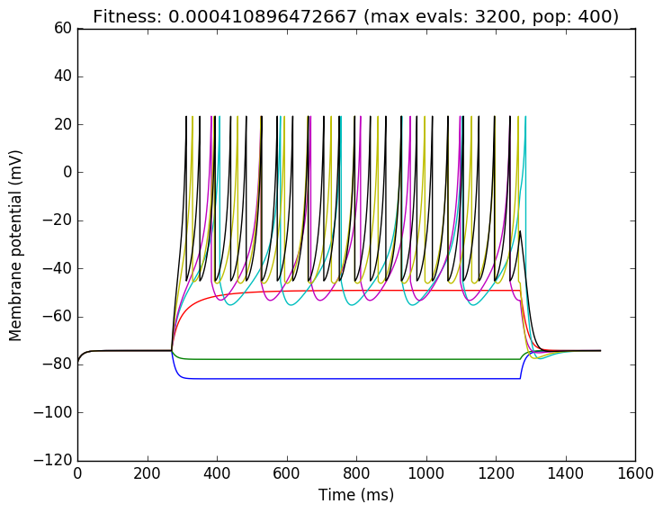</a>
</td>
<td>
<a href="../../../tune/tuned_cells/summary/Izh_466632464_if.png">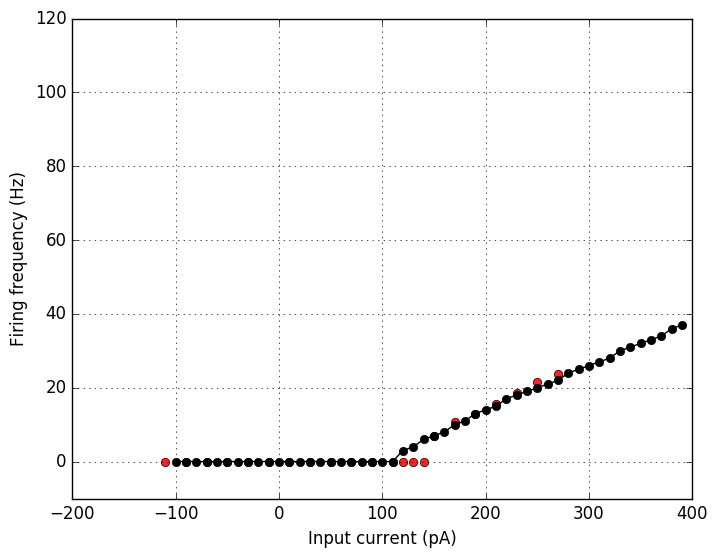</a>
</td>
<td>
<a href="../../../tune/tuned_cells/summary/Izh_466632464_iv.png">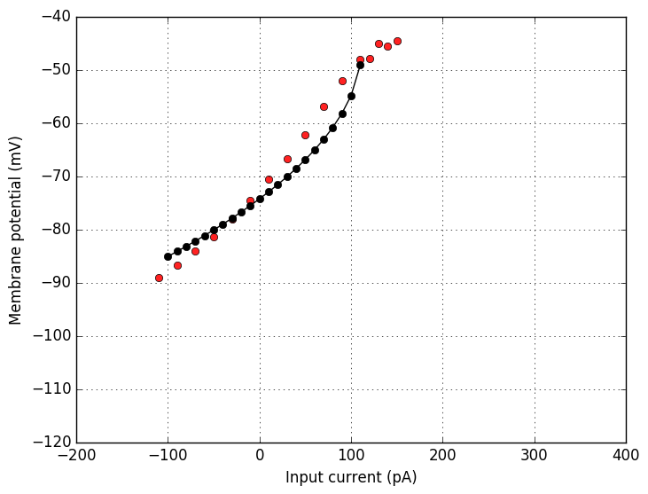</a>
</td>
</tr>
<tr>
<td width="130px">

<b>HH cell model tuned to dataset 466632464</b>

<a href="https://github.com/OpenSourceBrain/AllenInstituteNeuroML/blob/master/CellTypesDatabase/tune/tuned_cells/HH_466632464.cell.nml">Tuned model</a>

</td>
<td>
<a href="../../../tune/tuned_cells/summary/HH_466632464_traces.png">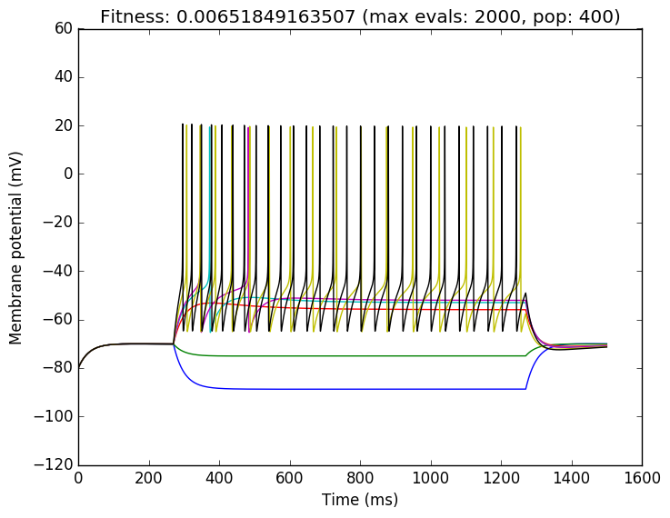</a>
</td>
<td>
<a href="../../../tune/tuned_cells/summary/HH_466632464_if.png">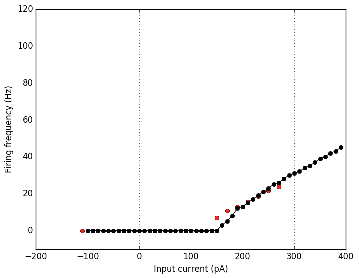</a>
</td>
<td>
<a href="../../../tune/tuned_cells/summary/HH_466632464_iv.png">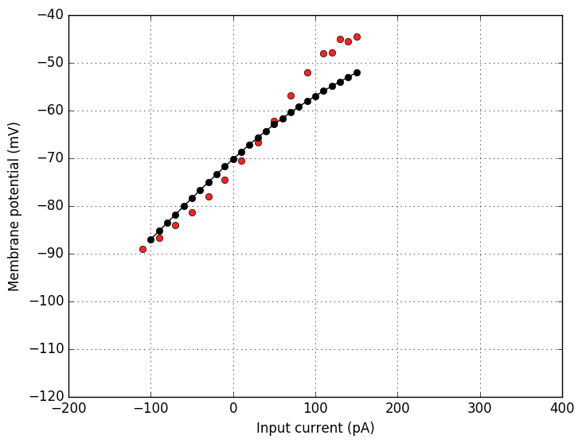</a>
</td>
</tr>
</table>  
 
<table border="1">
<tr>
<td width="130px">

<b>466664172</b>

Primary visual area, layer 5

aspiny

Sst-IRES-Cre

<a href="http://celltypes.brain-map.org/mouse/experiment/electrophysiology/466664172">Source data</a>

</td>
<td>
<a href="traces_466664172.png">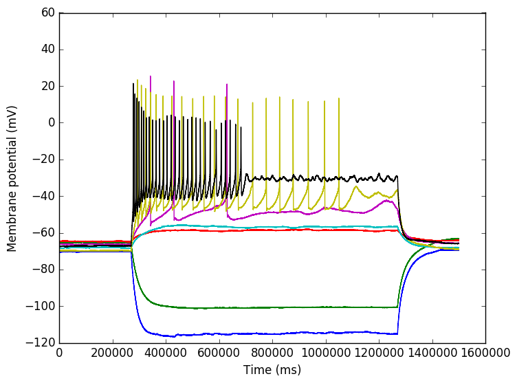</a>
</td>
<td>
<a href="spikes_466664172.png">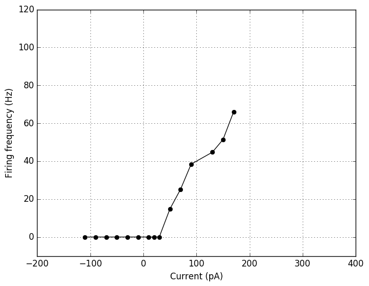</a>
</td>
<td>
<a href="subthreshold_466664172.png">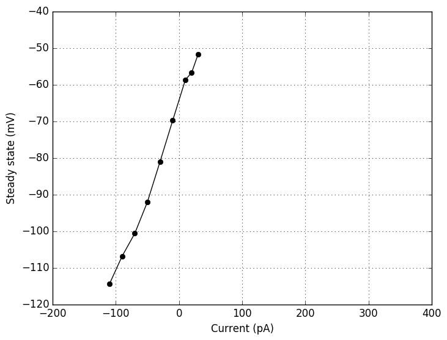</a>
</td>
</tr>
<tr>
<td width="130px">

<b>Izhikevich cell model tuned to dataset 466664172</b>

<a href="https://github.com/OpenSourceBrain/AllenInstituteNeuroML/blob/master/CellTypesDatabase/tune/tuned_cells/Izh_466664172.cell.nml">Tuned model</a>

</td>
<td>
<a href="../../../tune/tuned_cells/summary/Izh_466664172_traces.png">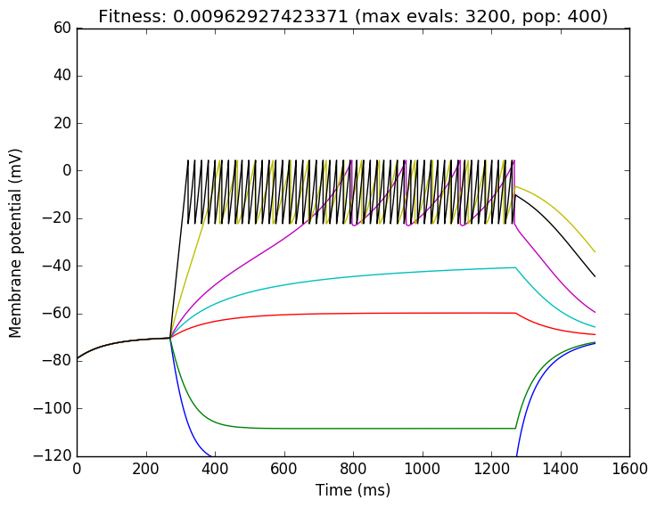</a>
</td>
<td>
<a href="../../../tune/tuned_cells/summary/Izh_466664172_if.png">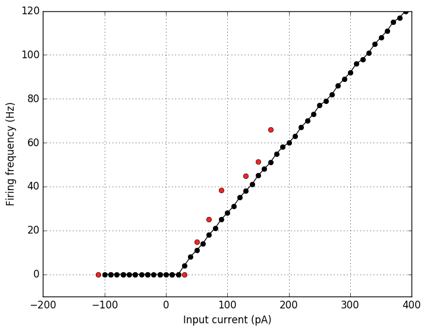</a>
</td>
<td>
<a href="../../../tune/tuned_cells/summary/Izh_466664172_iv.png">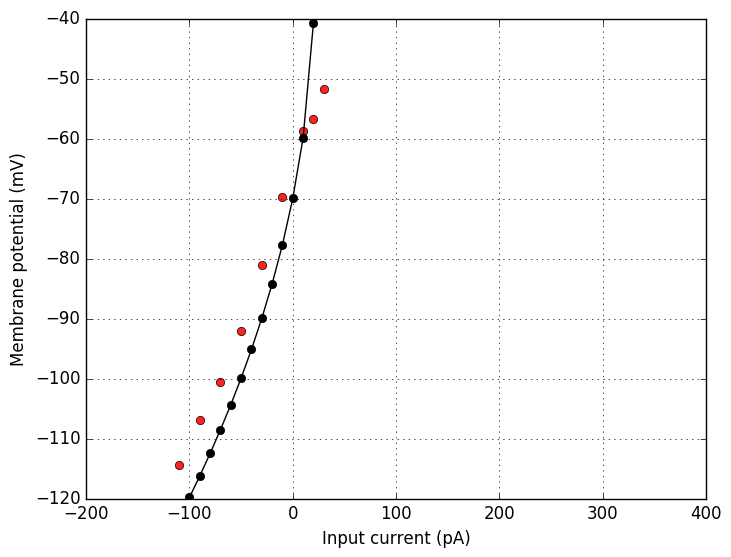</a>
</td>
</tr>
<tr>
<td width="130px">

<b>HH cell model tuned to dataset 466664172</b>

<a href="https://github.com/OpenSourceBrain/AllenInstituteNeuroML/blob/master/CellTypesDatabase/tune/tuned_cells/HH_466664172.cell.nml">Tuned model</a>

</td>
<td>
<a href="../../../tune/tuned_cells/summary/HH_466664172_traces.png">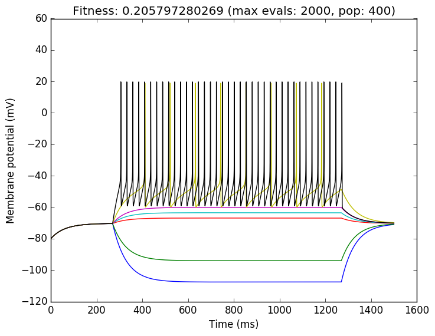</a>
</td>
<td>
<a href="../../../tune/tuned_cells/summary/HH_466664172_if.png">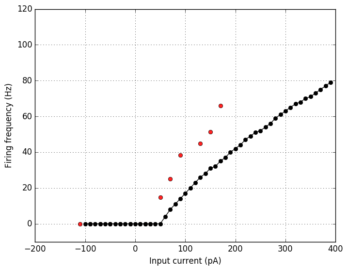</a>
</td>
<td>
<a href="../../../tune/tuned_cells/summary/HH_466664172_iv.png">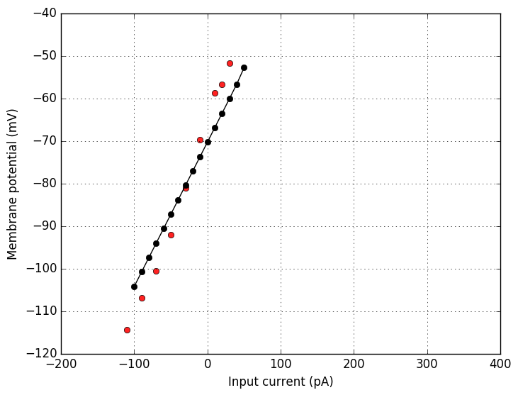</a>
</td>
</tr>
</table>  
 
<table border="1">
<tr>
<td width="130px">

<b>468120757</b>

Primary visual area, layer 5

spiny

Scnn1a-Tg3-Cre

<a href="http://celltypes.brain-map.org/mouse/experiment/electrophysiology/468120757">Source data</a>

</td>
<td>
<a href="traces_468120757.png">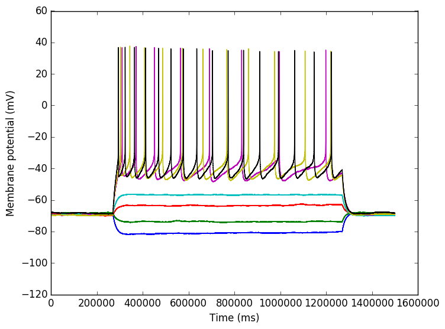</a>
</td>
<td>
<a href="spikes_468120757.png">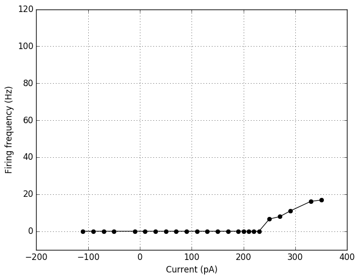</a>
</td>
<td>
<a href="subthreshold_468120757.png">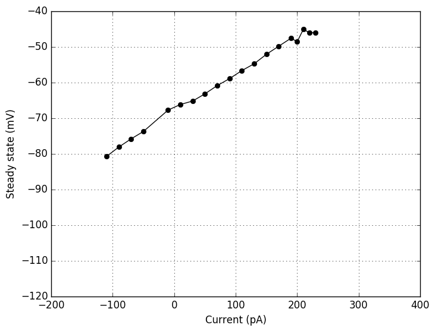</a>
</td>
</tr>
<tr>
<td width="130px">

<b>Izhikevich cell model tuned to dataset 468120757</b>

<a href="https://github.com/OpenSourceBrain/AllenInstituteNeuroML/blob/master/CellTypesDatabase/tune/tuned_cells/Izh_468120757.cell.nml">Tuned model</a>

</td>
<td>
<a href="../../../tune/tuned_cells/summary/Izh_468120757_traces.png">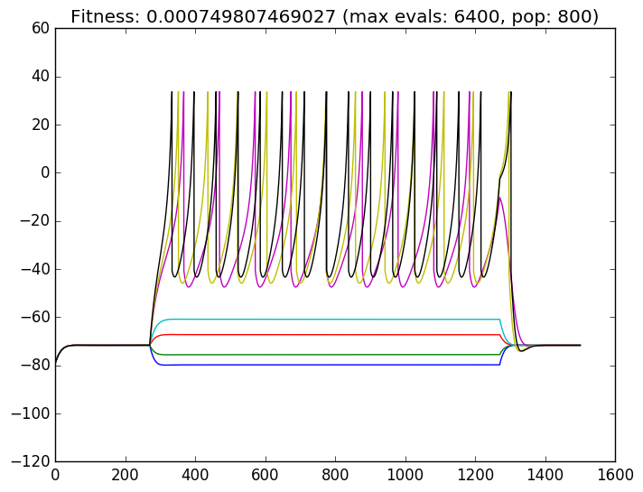</a>
</td>
<td>
<a href="../../../tune/tuned_cells/summary/Izh_468120757_if.png">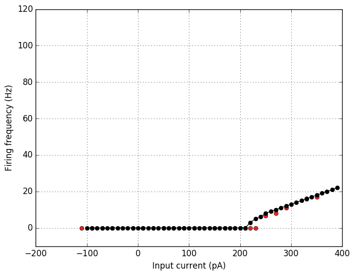</a>
</td>
<td>

</td>
</tr>
<tr>
<td width="130px">

<b>HH cell model tuned to dataset 468120757</b>

<a href="https://github.com/OpenSourceBrain/AllenInstituteNeuroML/blob/master/CellTypesDatabase/tune/tuned_cells/HH_468120757.cell.nml">Tuned model</a>

</td>
<td>

</td>
<td>

</td>
<td>

</td>
</tr>
</table>  
 
<table border="1">
<tr>
<td width="130px">

<b>469753383</b>

Primary visual area, layer 2/3

aspiny

Htr3a-Cre_NO152

<a href="http://celltypes.brain-map.org/mouse/experiment/electrophysiology/469753383">Source data</a>

</td>
<td>
<a href="traces_469753383.png">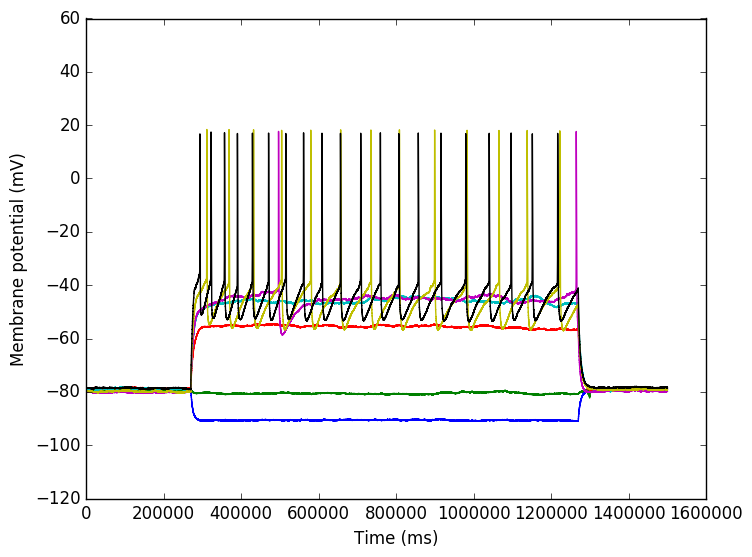</a>
</td>
<td>
<a href="spikes_469753383.png">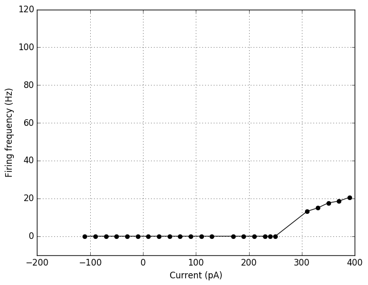</a>
</td>
<td>
<a href="subthreshold_469753383.png">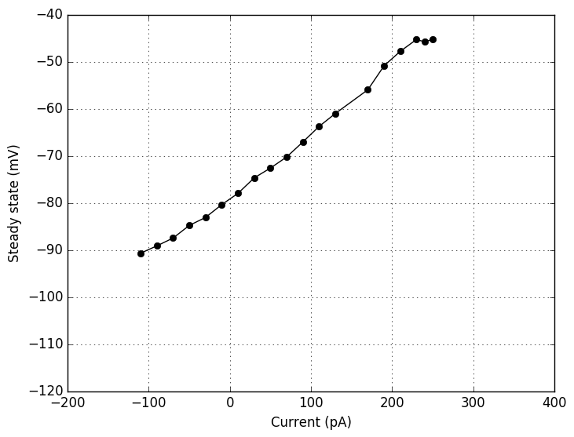</a>
</td>
</tr>
<tr>
<td width="130px">

<b>Izhikevich cell model tuned to dataset 469753383</b>

<a href="https://github.com/OpenSourceBrain/AllenInstituteNeuroML/blob/master/CellTypesDatabase/tune/tuned_cells/Izh_469753383.cell.nml">Tuned model</a>

</td>
<td>

</td>
<td>

</td>
<td>

</td>
</tr>
<tr>
<td width="130px">

<b>HH cell model tuned to dataset 469753383</b>

<a href="https://github.com/OpenSourceBrain/AllenInstituteNeuroML/blob/master/CellTypesDatabase/tune/tuned_cells/HH_469753383.cell.nml">Tuned model</a>

</td>
<td>

</td>
<td>

</td>
<td>

</td>
</tr>
</table>  
 
<table border="1">
<tr>
<td width="130px">

<b>469793303</b>

Primary visual area, layer 4

spiny

Scnn1a-Tg3-Cre

<a href="http://celltypes.brain-map.org/mouse/experiment/electrophysiology/469793303">Source data</a>

</td>
<td>
<a href="traces_469793303.png">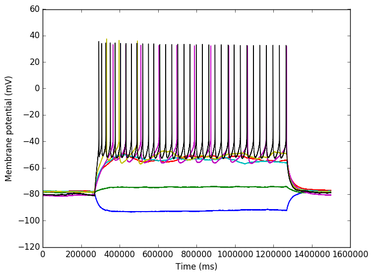</a>
</td>
<td>
<a href="spikes_469793303.png">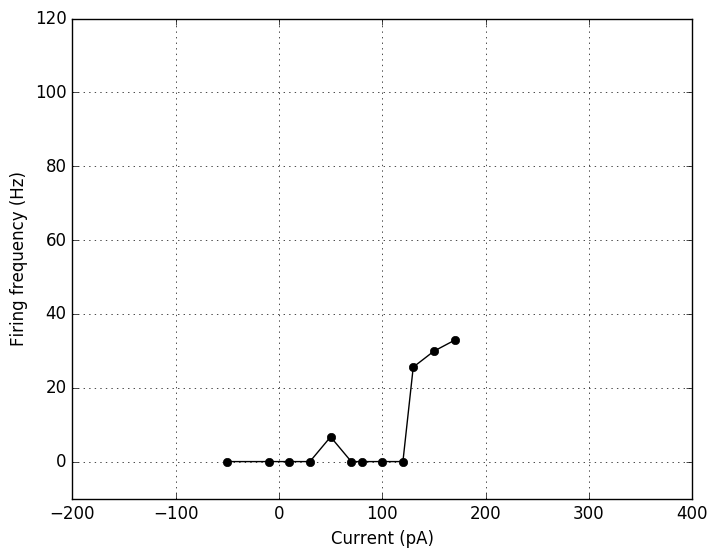</a>
</td>
<td>
<a href="subthreshold_469793303.png">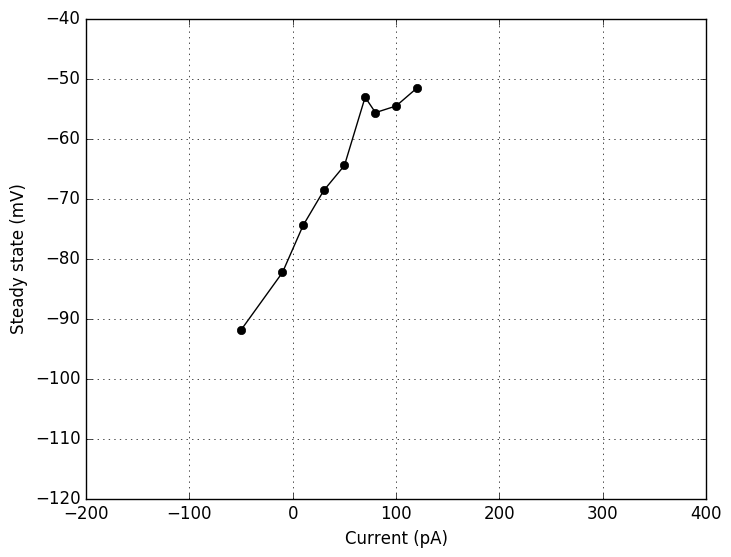</a>
</td>
</tr>
<tr>
<td width="130px">

<b>Izhikevich cell model tuned to dataset 469793303</b>

<a href="https://github.com/OpenSourceBrain/AllenInstituteNeuroML/blob/master/CellTypesDatabase/tune/tuned_cells/Izh_469793303.cell.nml">Tuned model</a>

</td>
<td>
<a href="../../../tune/tuned_cells/summary/Izh_469793303_traces.png">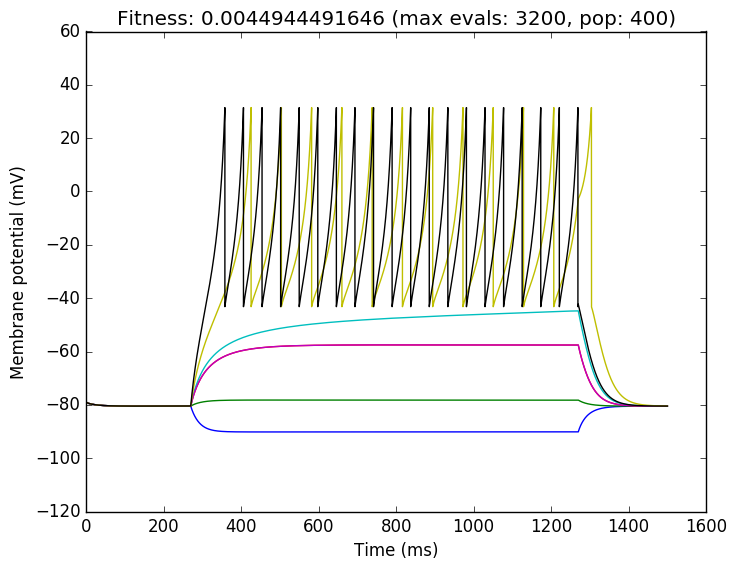</a>
</td>
<td>

</td>
<td>
<a href="../../../tune/tuned_cells/summary/Izh_469793303_iv.png">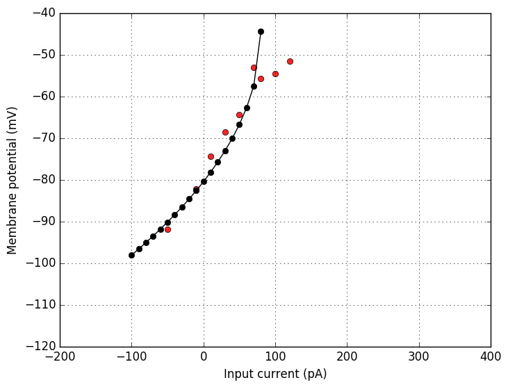</a>
</td>
</tr>
<tr>
<td width="130px">

<b>HH cell model tuned to dataset 469793303</b>

<a href="https://github.com/OpenSourceBrain/AllenInstituteNeuroML/blob/master/CellTypesDatabase/tune/tuned_cells/HH_469793303.cell.nml">Tuned model</a>

</td>
<td>
<a href="../../../tune/tuned_cells/summary/HH_469793303_traces.png">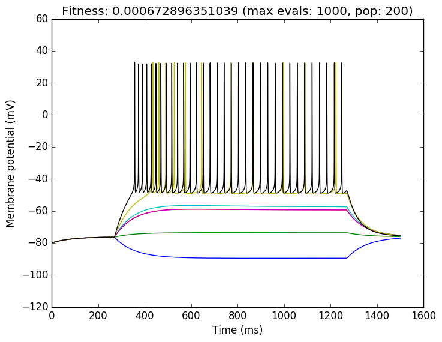</a>
</td>
<td>
<a href="../../../tune/tuned_cells/summary/HH_469793303_if.png">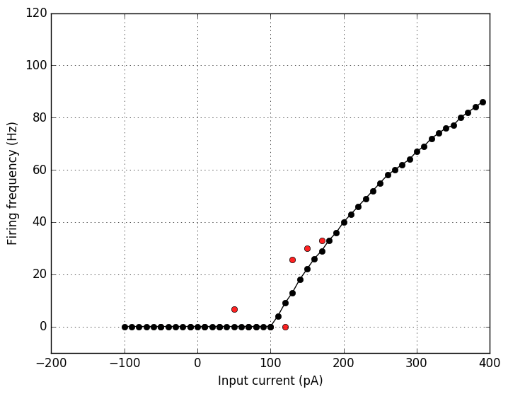</a>
</td>
<td>
<a href="../../../tune/tuned_cells/summary/HH_469793303_iv.png">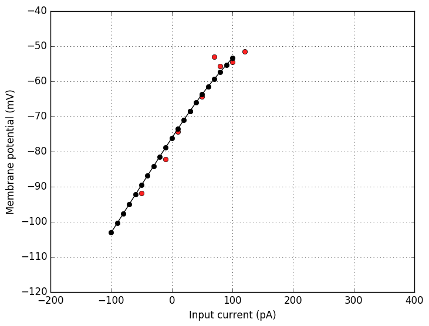</a>
</td>
</tr>
</table>  
 
<table border="1">
<tr>
<td width="130px">

<b>469801569</b>

Primary visual area, layer 5

aspiny

Pvalb-IRES-Cre

<a href="http://celltypes.brain-map.org/mouse/experiment/electrophysiology/469801569">Source data</a>

</td>
<td>
<a href="traces_469801569.png">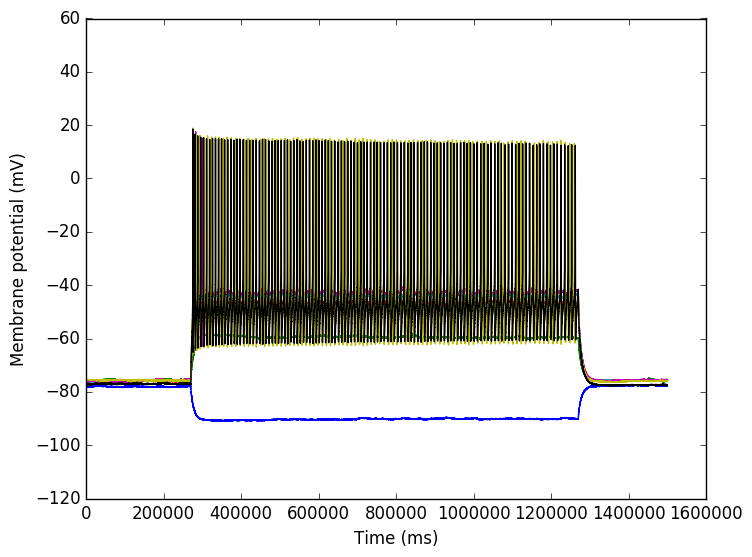</a>
</td>
<td>
<a href="spikes_469801569.png">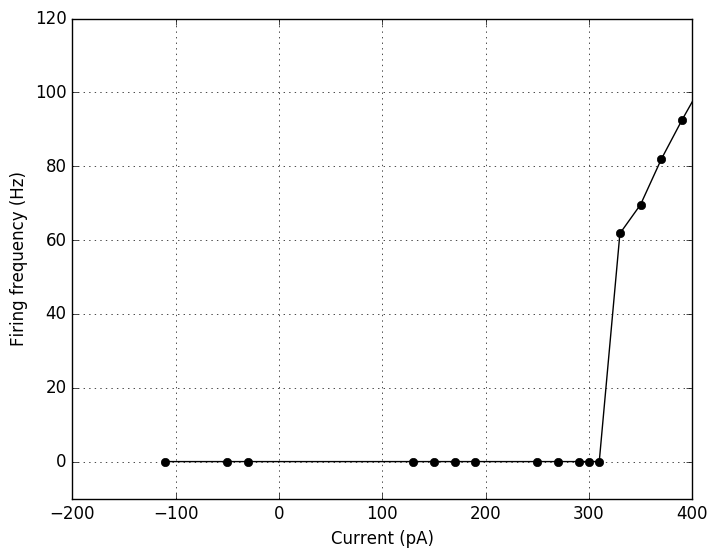</a>
</td>
<td>
<a href="subthreshold_469801569.png">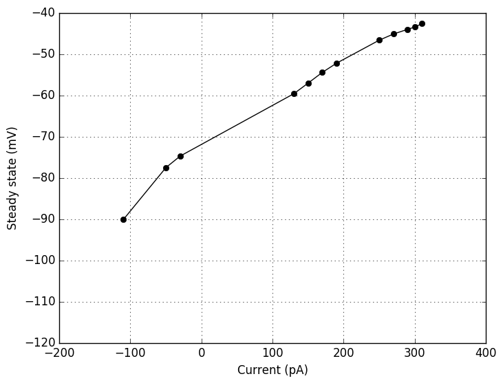</a>
</td>
</tr>
<tr>
<td width="130px">

<b>Izhikevich cell model tuned to dataset 469801569</b>

<a href="https://github.com/OpenSourceBrain/AllenInstituteNeuroML/blob/master/CellTypesDatabase/tune/tuned_cells/Izh_469801569.cell.nml">Tuned model</a>

</td>
<td>

</td>
<td>

</td>
<td>

</td>
</tr>
<tr>
<td width="130px">

<b>HH cell model tuned to dataset 469801569</b>

<a href="https://github.com/OpenSourceBrain/AllenInstituteNeuroML/blob/master/CellTypesDatabase/tune/tuned_cells/HH_469801569.cell.nml">Tuned model</a>

</td>
<td>

</td>
<td>

</td>
<td>

</td>
</tr>
</table>  
 
<table border="1">
<tr>
<td width="130px">

<b>471141261</b>

Primary visual area, layer 5

spiny

Rbp4-Cre_KL100

<a href="http://celltypes.brain-map.org/mouse/experiment/electrophysiology/471141261">Source data</a>

</td>
<td>
<a href="traces_471141261.png">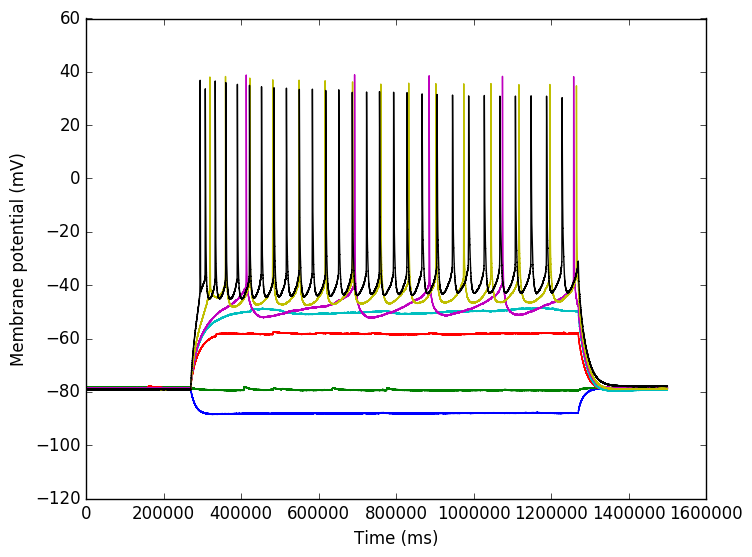</a>
</td>
<td>

</td>
<td>

</td>
</tr>
<tr>
<td width="130px">

<b>Izhikevich cell model tuned to dataset 471141261</b>

<a href="https://github.com/OpenSourceBrain/AllenInstituteNeuroML/blob/master/CellTypesDatabase/tune/tuned_cells/Izh_471141261.cell.nml">Tuned model</a>

</td>
<td>

</td>
<td>

</td>
<td>
<a href="../../../tune/tuned_cells/summary/Izh_471141261_iv.png">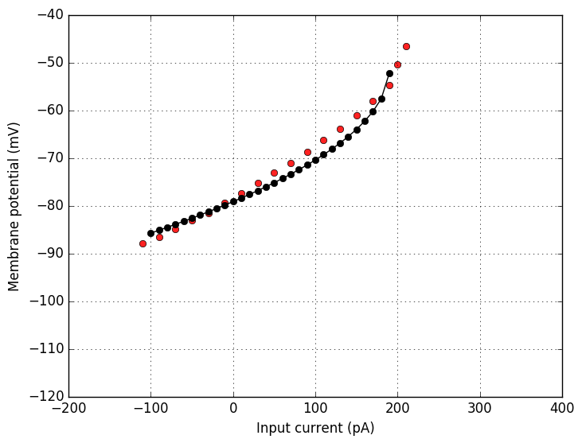</a>
</td>
</tr>
<tr>
<td width="130px">

<b>HH cell model tuned to dataset 471141261</b>

<a href="https://github.com/OpenSourceBrain/AllenInstituteNeuroML/blob/master/CellTypesDatabase/tune/tuned_cells/HH_471141261.cell.nml">Tuned model</a>

</td>
<td>
<a href="../../../tune/tuned_cells/summary/HH_471141261_traces.png">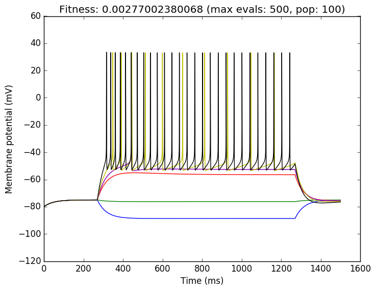</a>
</td>
<td>

</td>
<td>
<a href="../../../tune/tuned_cells/summary/HH_471141261_iv.png">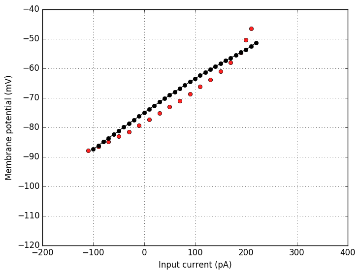</a>
</td>
</tr>
</table>  
 
<table border="1">
<tr>
<td width="130px">

<b>471789504</b>

Primary visual area, layer 6a

spiny

Ntsr1-Cre_GN220

<a href="http://celltypes.brain-map.org/mouse/experiment/electrophysiology/471789504">Source data</a>

</td>
<td>
<a href="traces_471789504.png">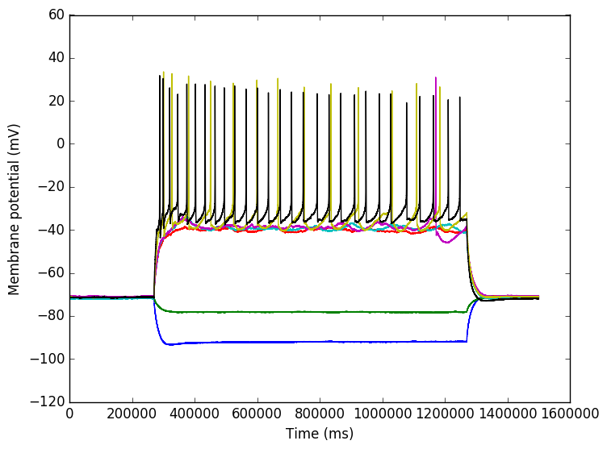</a>
</td>
<td>

</td>
<td>
<a href="subthreshold_471789504.png">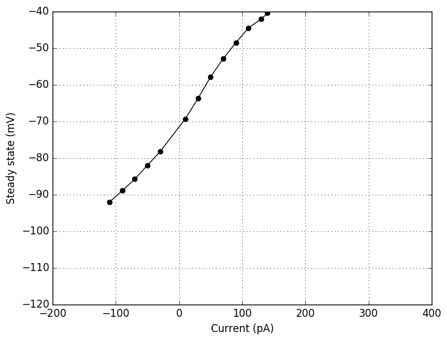</a>
</td>
</tr>
<tr>
<td width="130px">

<b>Izhikevich cell model tuned to dataset 471789504</b>

<a href="https://github.com/OpenSourceBrain/AllenInstituteNeuroML/blob/master/CellTypesDatabase/tune/tuned_cells/Izh_471789504.cell.nml">Tuned model</a>

</td>
<td>

</td>
<td>

</td>
<td>

</td>
</tr>
<tr>
<td width="130px">

<b>HH cell model tuned to dataset 471789504</b>

<a href="https://github.com/OpenSourceBrain/AllenInstituteNeuroML/blob/master/CellTypesDatabase/tune/tuned_cells/HH_471789504.cell.nml">Tuned model</a>

</td>
<td>

</td>
<td>

</td>
<td>

</td>
</tr>
</table>  
 
<table border="1">
<tr>
<td width="130px">

<b>473943881</b>

Primary visual area, layer 2/3

aspiny

Htr3a-Cre_NO152

<a href="http://celltypes.brain-map.org/mouse/experiment/electrophysiology/473943881">Source data</a>

</td>
<td>
<a href="traces_473943881.png">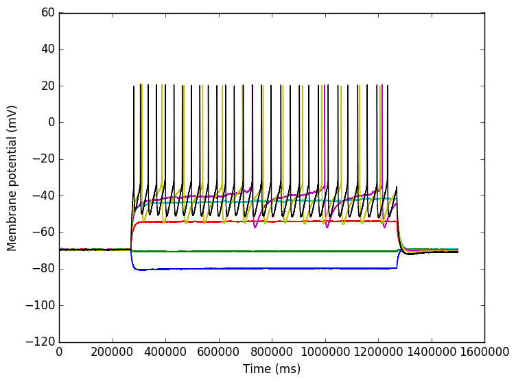</a>
</td>
<td>
<a href="spikes_473943881.png">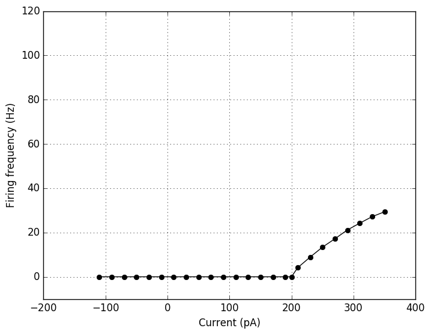</a>
</td>
<td>
<a href="subthreshold_473943881.png">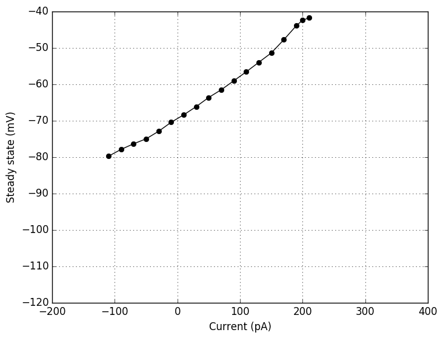</a>
</td>
</tr>
<tr>
<td width="130px">

<b>Izhikevich cell model tuned to dataset 473943881</b>

<a href="https://github.com/OpenSourceBrain/AllenInstituteNeuroML/blob/master/CellTypesDatabase/tune/tuned_cells/Izh_473943881.cell.nml">Tuned model</a>

</td>
<td>
<a href="../../../tune/tuned_cells/summary/Izh_473943881_traces.png">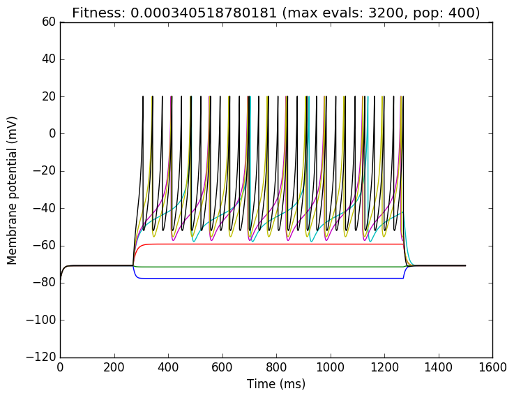</a>
</td>
<td>
<a href="../../../tune/tuned_cells/summary/Izh_473943881_if.png">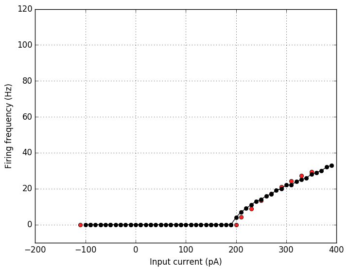</a>
</td>
<td>
<a href="../../../tune/tuned_cells/summary/Izh_473943881_iv.png">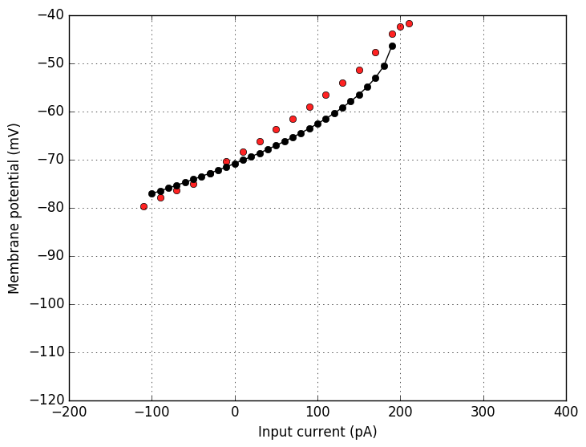</a>
</td>
</tr>
<tr>
<td width="130px">

<b>HH cell model tuned to dataset 473943881</b>

<a href="https://github.com/OpenSourceBrain/AllenInstituteNeuroML/blob/master/CellTypesDatabase/tune/tuned_cells/HH_473943881.cell.nml">Tuned model</a>

</td>
<td>

</td>
<td>
<a href="../../../tune/tuned_cells/summary/HH_473943881_if.png">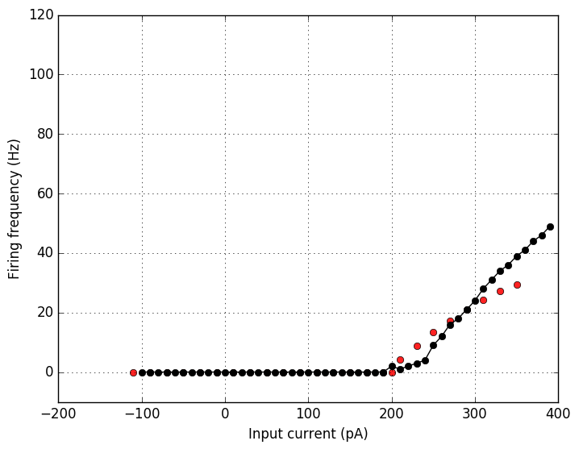</a>
</td>
<td>
<a href="../../../tune/tuned_cells/summary/HH_473943881_iv.png">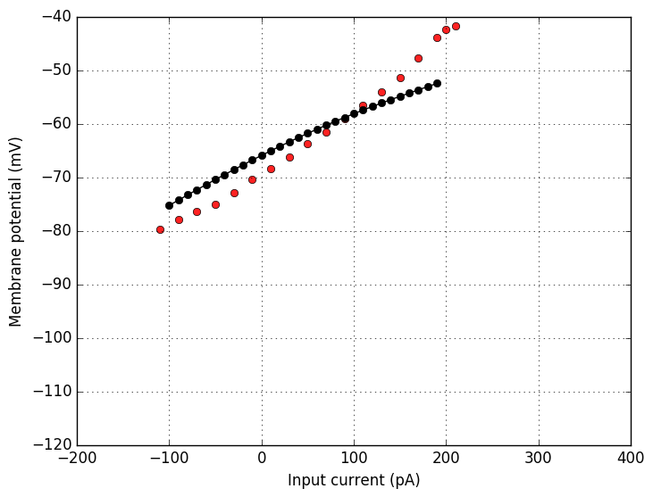</a>
</td>
</tr>
</table>  
 
<table border="1">
<tr>
<td width="130px">

<b>474267418</b>

Primary visual area, layer 2/3

aspiny

Htr3a-Cre_NO152

<a href="http://celltypes.brain-map.org/mouse/experiment/electrophysiology/474267418">Source data</a>

</td>
<td>
<a href="traces_474267418.png">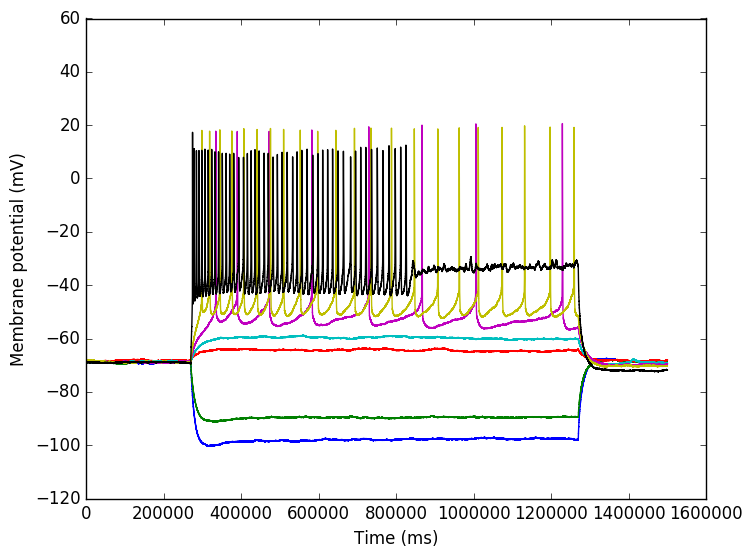</a>
</td>
<td>
<a href="spikes_474267418.png">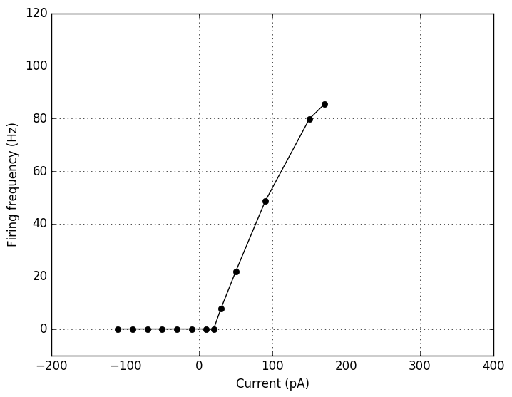</a>
</td>
<td>
<a href="subthreshold_474267418.png">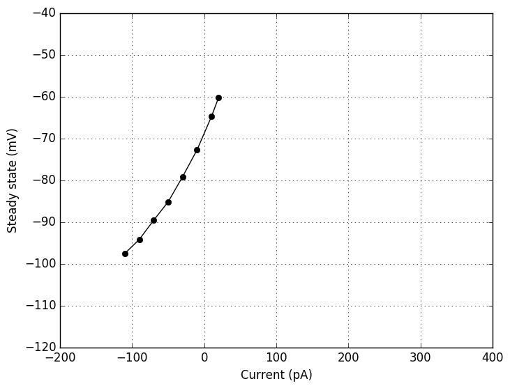</a>
</td>
</tr>
<tr>
<td width="130px">

<b>Izhikevich cell model tuned to dataset 474267418</b>

<a href="https://github.com/OpenSourceBrain/AllenInstituteNeuroML/blob/master/CellTypesDatabase/tune/tuned_cells/Izh_474267418.cell.nml">Tuned model</a>

</td>
<td>
<a href="../../../tune/tuned_cells/summary/Izh_474267418_traces.png">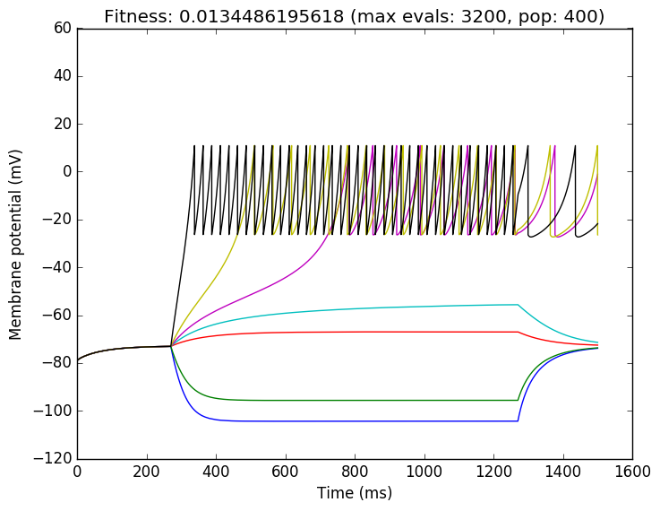</a>
</td>
<td>
<a href="../../../tune/tuned_cells/summary/Izh_474267418_if.png">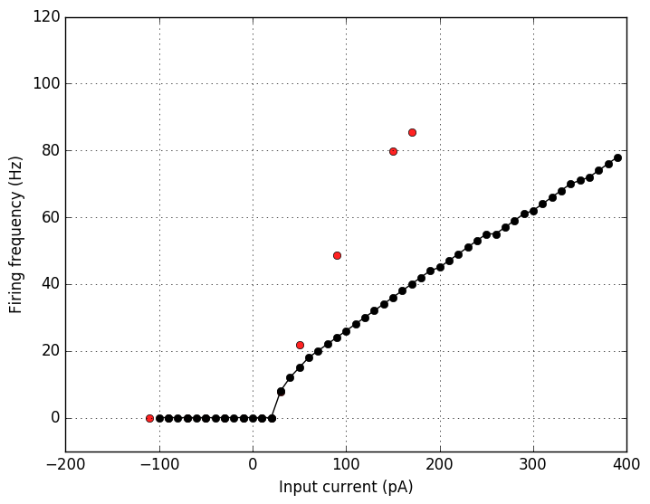</a>
</td>
<td>
<a href="../../../tune/tuned_cells/summary/Izh_474267418_iv.png">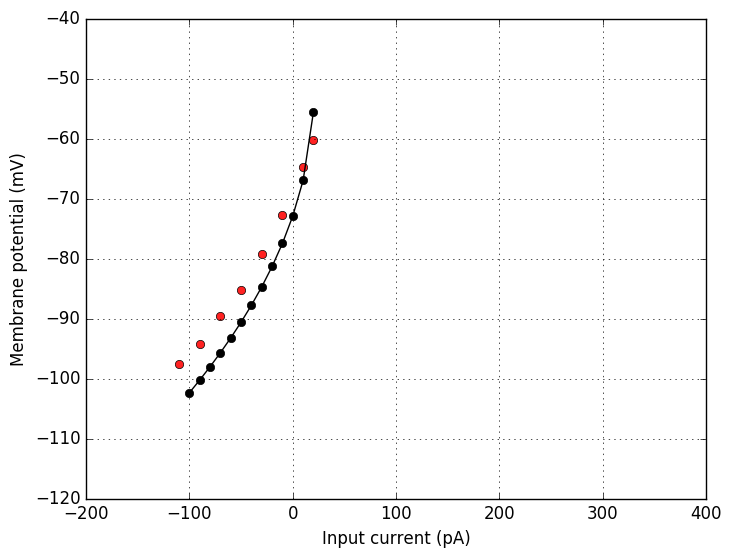</a>
</td>
</tr>
<tr>
<td width="130px">

<b>HH cell model tuned to dataset 474267418</b>

<a href="https://github.com/OpenSourceBrain/AllenInstituteNeuroML/blob/master/CellTypesDatabase/tune/tuned_cells/HH_474267418.cell.nml">Tuned model</a>

</td>
<td>
<a href="../../../tune/tuned_cells/summary/HH_474267418_traces.png">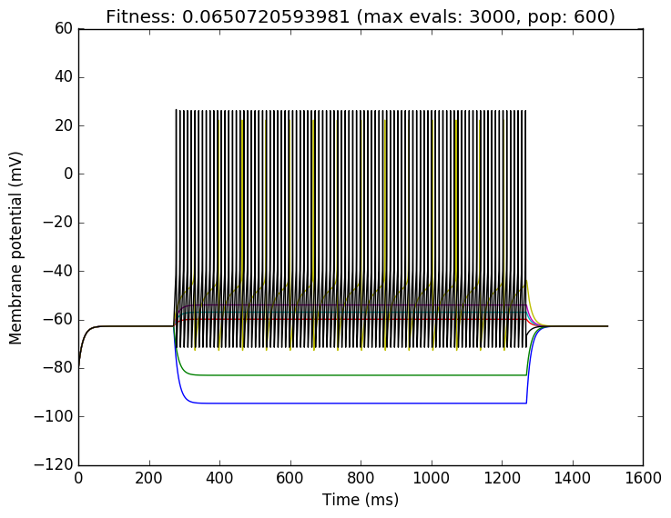</a>
</td>
<td>
<a href="../../../tune/tuned_cells/summary/HH_474267418_if.png">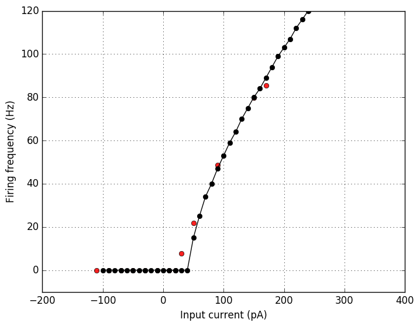</a>
</td>
<td>
<a href="../../../tune/tuned_cells/summary/HH_474267418_iv.png">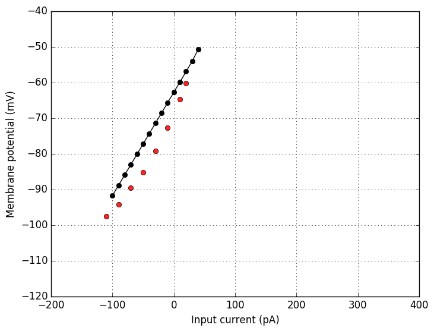</a>
</td>
</tr>
</table>  
 
<table border="1">
<tr>
<td width="130px">

<b>475057898</b>

Primary visual area, layer 5

sparsely spiny

Sst-IRES-Cre

<a href="http://celltypes.brain-map.org/mouse/experiment/electrophysiology/475057898">Source data</a>

</td>
<td>

</td>
<td>
<a href="spikes_475057898.png">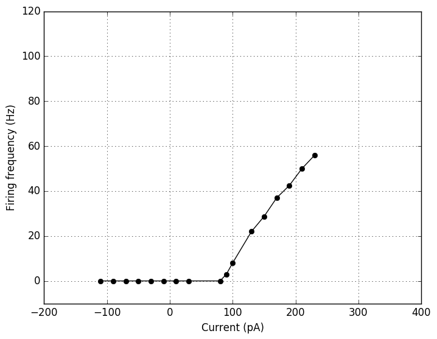</a>
</td>
<td>
<a href="subthreshold_475057898.png">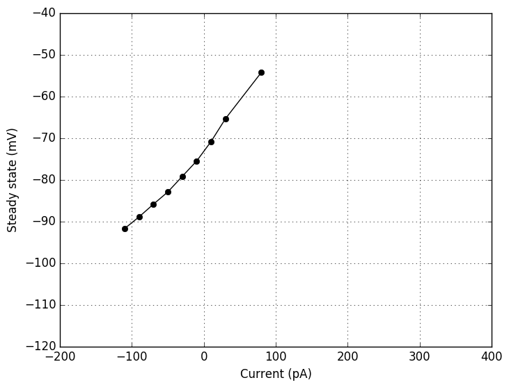</a>
</td>
</tr>
<tr>
<td width="130px">

<b>Izhikevich cell model tuned to dataset 475057898</b>

<a href="https://github.com/OpenSourceBrain/AllenInstituteNeuroML/blob/master/CellTypesDatabase/tune/tuned_cells/Izh_475057898.cell.nml">Tuned model</a>

</td>
<td>
<a href="../../../tune/tuned_cells/summary/Izh_475057898_traces.png">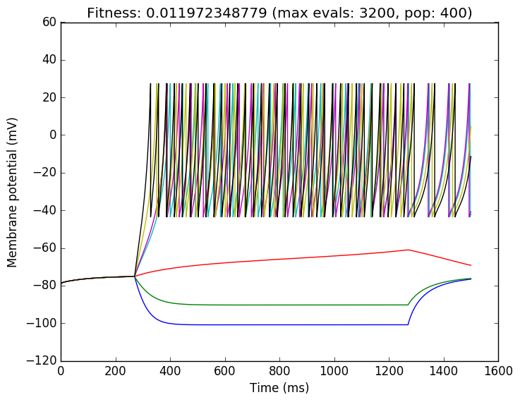</a>
</td>
<td>
<a href="../../../tune/tuned_cells/summary/Izh_475057898_if.png">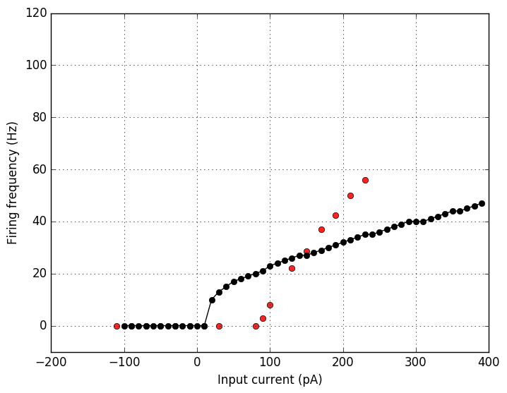</a>
</td>
<td>
<a href="../../../tune/tuned_cells/summary/Izh_475057898_iv.png">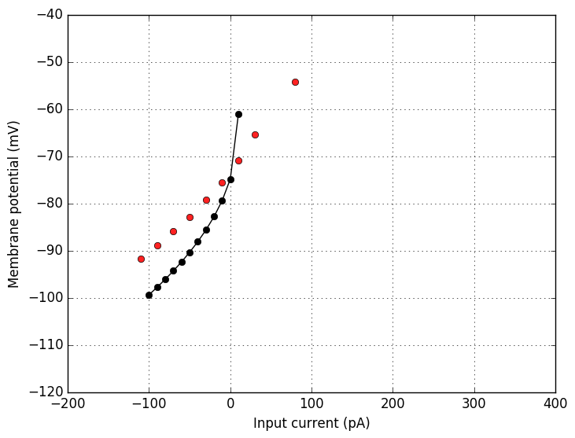</a>
</td>
</tr>
<tr>
<td width="130px">

<b>HH cell model tuned to dataset 475057898</b>

<a href="https://github.com/OpenSourceBrain/AllenInstituteNeuroML/blob/master/CellTypesDatabase/tune/tuned_cells/HH_475057898.cell.nml">Tuned model</a>

</td>
<td>

</td>
<td>
<a href="../../../tune/tuned_cells/summary/HH_475057898_if.png">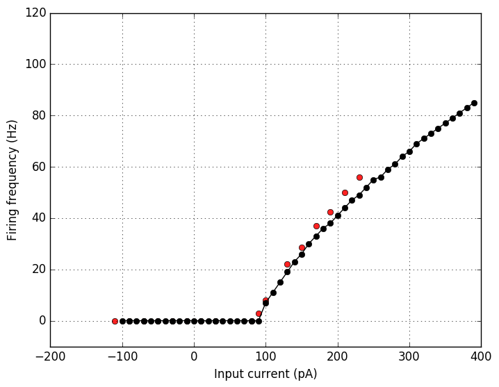</a>
</td>
<td>

</td>
</tr>
</table>  
 
<table border="1">
<tr>
<td width="130px">

<b>476048909</b>

Anterolateral visual area, layer 5

spiny

Rorb-IRES2-Cre

<a href="http://celltypes.brain-map.org/mouse/experiment/electrophysiology/476048909">Source data</a>

</td>
<td>
<a href="traces_476048909.png">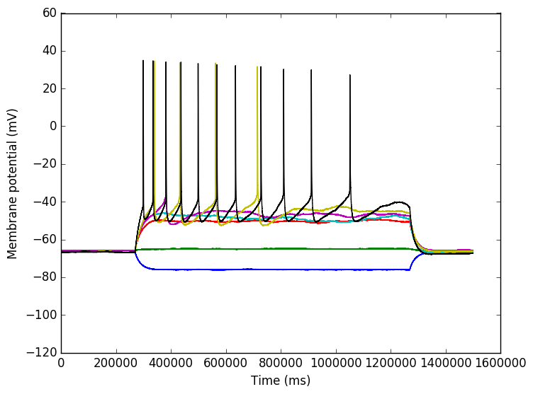</a>
</td>
<td>
<a href="spikes_476048909.png">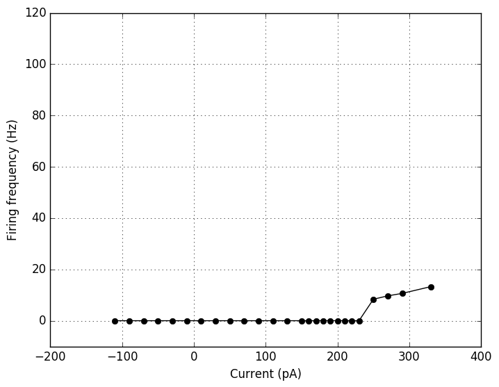</a>
</td>
<td>
<a href="subthreshold_476048909.png">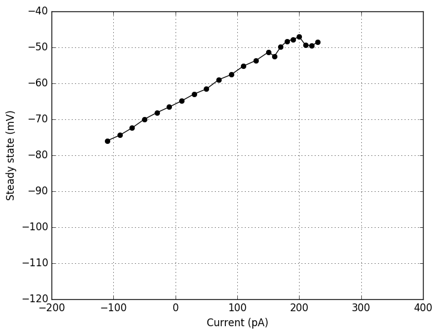</a>
</td>
</tr>
<tr>
<td width="130px">

<b>Izhikevich cell model tuned to dataset 476048909</b>

<a href="https://github.com/OpenSourceBrain/AllenInstituteNeuroML/blob/master/CellTypesDatabase/tune/tuned_cells/Izh_476048909.cell.nml">Tuned model</a>

</td>
<td>

</td>
<td>

</td>
<td>

</td>
</tr>
<tr>
<td width="130px">

<b>HH cell model tuned to dataset 476048909</b>

<a href="https://github.com/OpenSourceBrain/AllenInstituteNeuroML/blob/master/CellTypesDatabase/tune/tuned_cells/HH_476048909.cell.nml">Tuned model</a>

</td>
<td>

</td>
<td>

</td>
<td>

</td>
</tr>
</table>  
 
<table border="1">
<tr>
<td width="130px">

<b>476263004</b>

Primary visual area, layer 5

spiny

Scnn1a-Tg3-Cre

<a href="http://celltypes.brain-map.org/mouse/experiment/electrophysiology/476263004">Source data</a>

</td>
<td>
<a href="traces_476263004.png">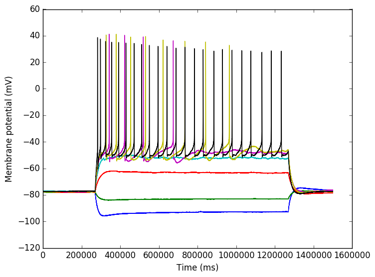</a>
</td>
<td>
<a href="spikes_476263004.png">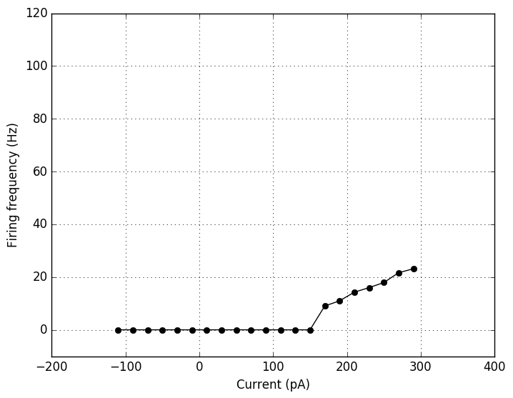</a>
</td>
<td>
<a href="subthreshold_476263004.png">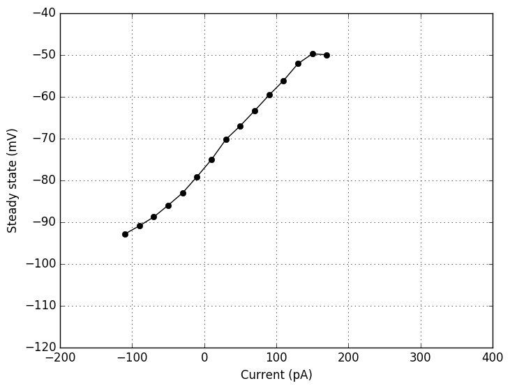</a>
</td>
</tr>
<tr>
<td width="130px">

<b>Izhikevich cell model tuned to dataset 476263004</b>

<a href="https://github.com/OpenSourceBrain/AllenInstituteNeuroML/blob/master/CellTypesDatabase/tune/tuned_cells/Izh_476263004.cell.nml">Tuned model</a>

</td>
<td>
<a href="../../../tune/tuned_cells/summary/Izh_476263004_traces.png">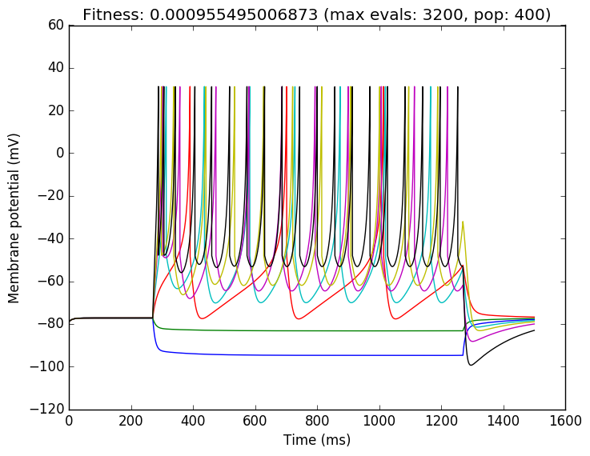</a>
</td>
<td>
<a href="../../../tune/tuned_cells/summary/Izh_476263004_if.png">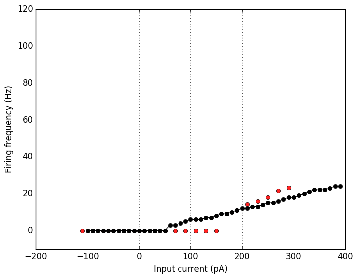</a>
</td>
<td>
<a href="../../../tune/tuned_cells/summary/Izh_476263004_iv.png">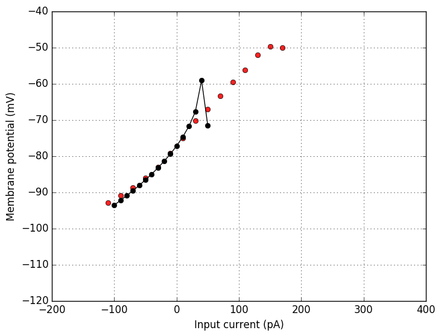</a>
</td>
</tr>
<tr>
<td width="130px">

<b>HH cell model tuned to dataset 476263004</b>

<a href="https://github.com/OpenSourceBrain/AllenInstituteNeuroML/blob/master/CellTypesDatabase/tune/tuned_cells/HH_476263004.cell.nml">Tuned model</a>

</td>
<td>
<a href="../../../tune/tuned_cells/summary/HH_476263004_traces.png">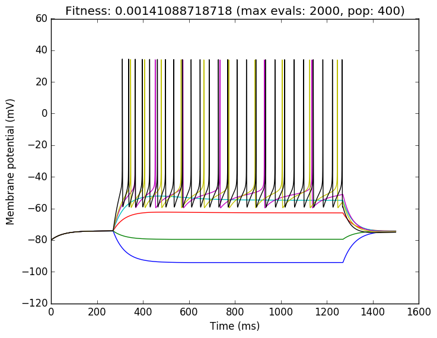</a>
</td>
<td>
<a href="../../../tune/tuned_cells/summary/HH_476263004_if.png">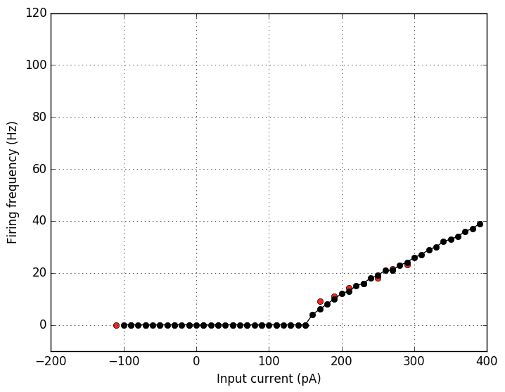</a>
</td>
<td>
<a href="../../../tune/tuned_cells/summary/HH_476263004_iv.png">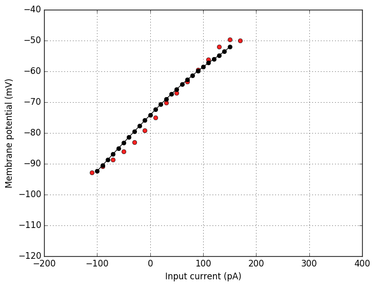</a>
</td>
</tr>
</table>  
 
<table border="1">
<tr>
<td width="130px">

<b>476451456</b>

Primary visual area, layer 4

spiny

Nr5a1-Cre

<a href="http://celltypes.brain-map.org/mouse/experiment/electrophysiology/476451456">Source data</a>

</td>
<td>
<a href="traces_476451456.png">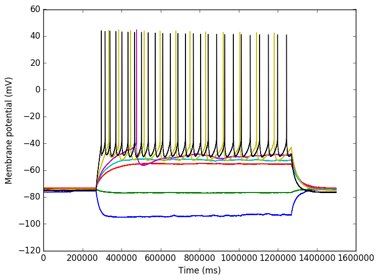</a>
</td>
<td>
<a href="spikes_476451456.png">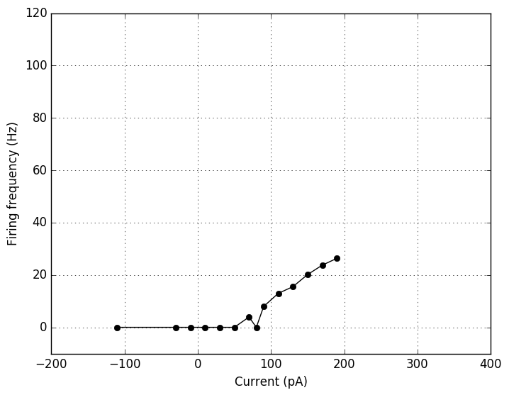</a>
</td>
<td>
<a href="subthreshold_476451456.png">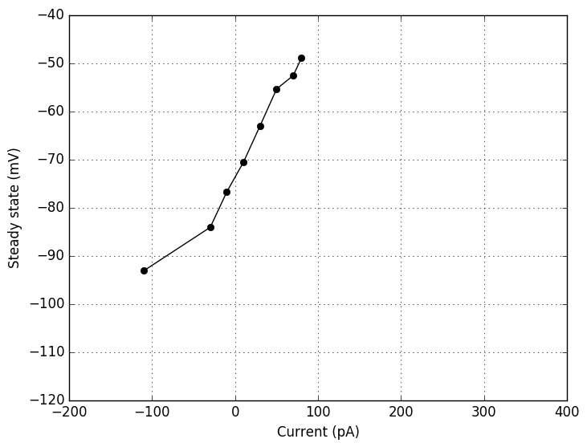</a>
</td>
</tr>
<tr>
<td width="130px">

<b>Izhikevich cell model tuned to dataset 476451456</b>

<a href="https://github.com/OpenSourceBrain/AllenInstituteNeuroML/blob/master/CellTypesDatabase/tune/tuned_cells/Izh_476451456.cell.nml">Tuned model</a>

</td>
<td>

</td>
<td>

</td>
<td>

</td>
</tr>
<tr>
<td width="130px">

<b>HH cell model tuned to dataset 476451456</b>

<a href="https://github.com/OpenSourceBrain/AllenInstituteNeuroML/blob/master/CellTypesDatabase/tune/tuned_cells/HH_476451456.cell.nml">Tuned model</a>

</td>
<td>
<a href="../../../tune/tuned_cells/summary/HH_476451456_traces.png">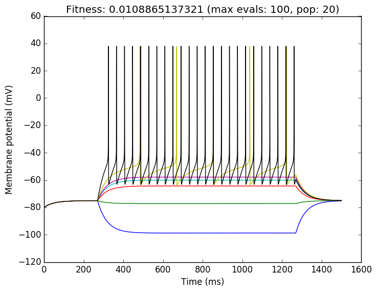</a>
</td>
<td>
<a href="../../../tune/tuned_cells/summary/HH_476451456_if.png">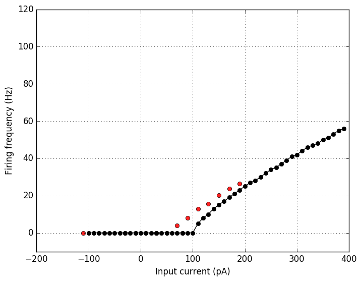</a>
</td>
<td>
<a href="../../../tune/tuned_cells/summary/HH_476451456_iv.png">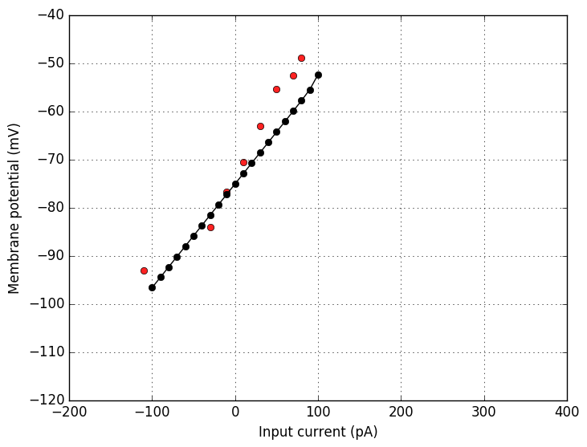</a>
</td>
</tr>
</table>  
 
<table border="1">
<tr>
<td width="130px">

<b>476457450</b>

Primary visual area, layer 4

spiny

Nr5a1-Cre

<a href="http://celltypes.brain-map.org/mouse/experiment/electrophysiology/476457450">Source data</a>

</td>
<td>
<a href="traces_476457450.png">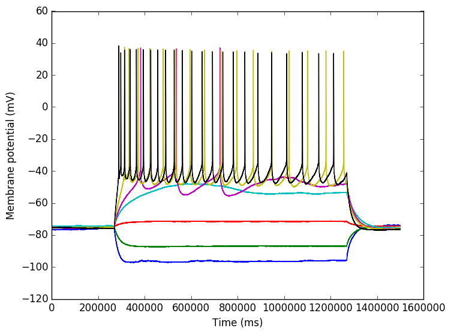</a>
</td>
<td>

</td>
<td>
<a href="subthreshold_476457450.png">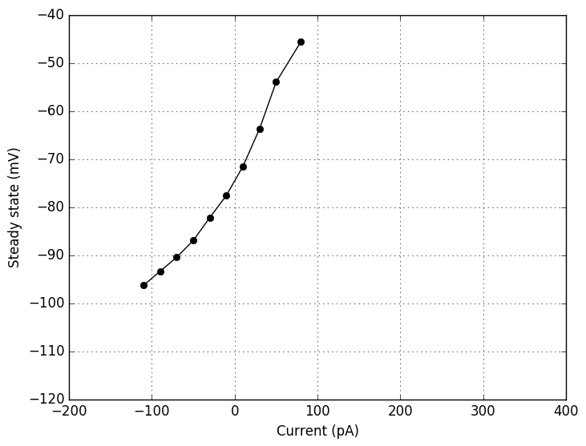</a>
</td>
</tr>
<tr>
<td width="130px">

<b>Izhikevich cell model tuned to dataset 476457450</b>

<a href="https://github.com/OpenSourceBrain/AllenInstituteNeuroML/blob/master/CellTypesDatabase/tune/tuned_cells/Izh_476457450.cell.nml">Tuned model</a>

</td>
<td>
<a href="../../../tune/tuned_cells/summary/Izh_476457450_traces.png">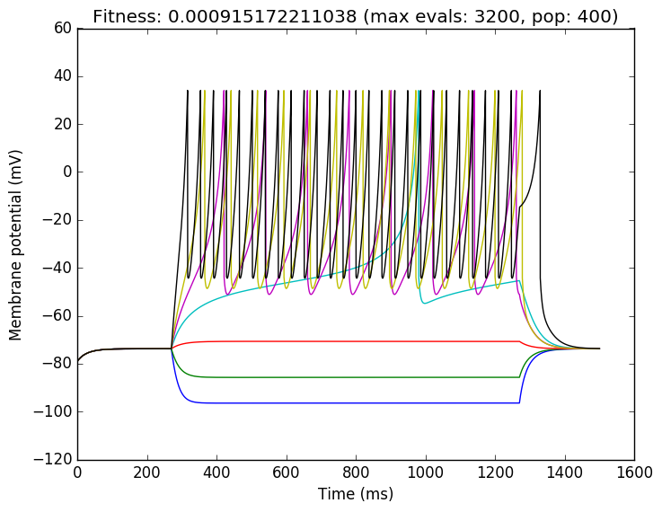</a>
</td>
<td>

</td>
<td>
<a href="../../../tune/tuned_cells/summary/Izh_476457450_iv.png">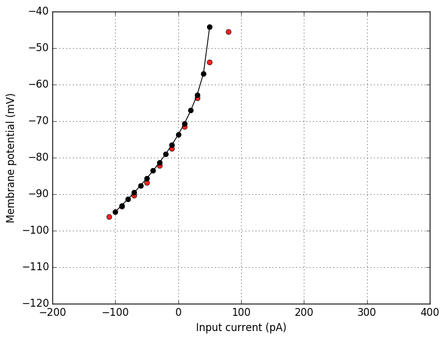</a>
</td>
</tr>
<tr>
<td width="130px">

<b>HH cell model tuned to dataset 476457450</b>

<a href="https://github.com/OpenSourceBrain/AllenInstituteNeuroML/blob/master/CellTypesDatabase/tune/tuned_cells/HH_476457450.cell.nml">Tuned model</a>

</td>
<td>
<a href="../../../tune/tuned_cells/summary/HH_476457450_traces.png">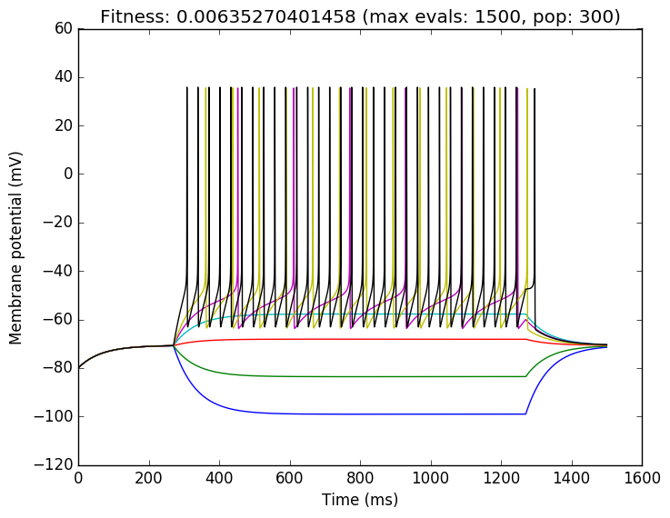</a>
</td>
<td>
<a href="../../../tune/tuned_cells/summary/HH_476457450_if.png">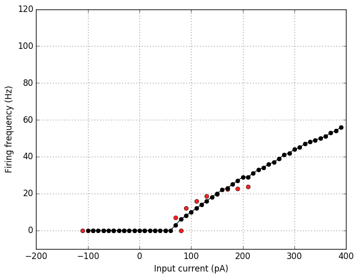</a>
</td>
<td>
<a href="../../../tune/tuned_cells/summary/HH_476457450_iv.png">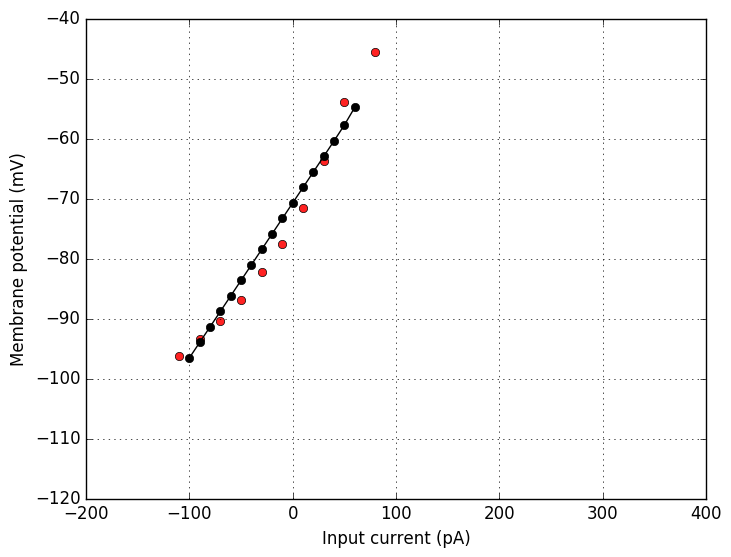</a>
</td>
</tr>
</table>  
 
<table border="1">
<tr>
<td width="130px">

<b>476686112</b>

Primary visual area, layer 2/3

aspiny

Sst-IRES-Cre

<a href="http://celltypes.brain-map.org/mouse/experiment/electrophysiology/476686112">Source data</a>

</td>
<td>
<a href="traces_476686112.png">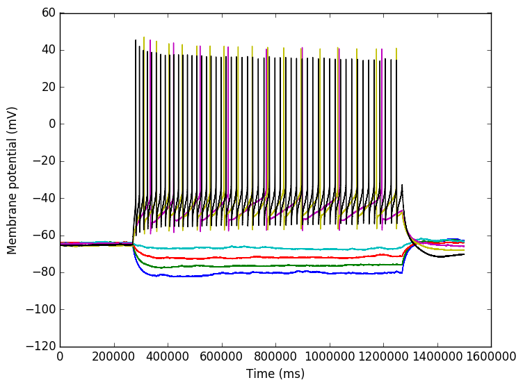</a>
</td>
<td>
<a href="spikes_476686112.png">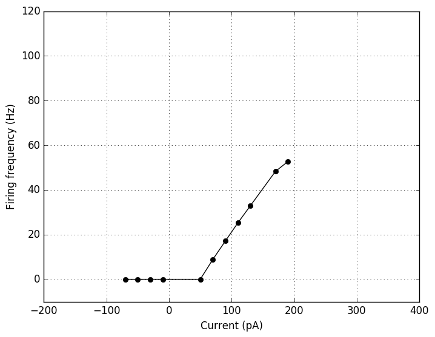</a>
</td>
<td>
<a href="subthreshold_476686112.png">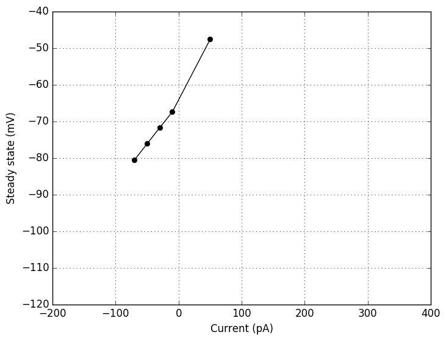</a>
</td>
</tr>
<tr>
<td width="130px">

<b>Izhikevich cell model tuned to dataset 476686112</b>

<a href="https://github.com/OpenSourceBrain/AllenInstituteNeuroML/blob/master/CellTypesDatabase/tune/tuned_cells/Izh_476686112.cell.nml">Tuned model</a>

</td>
<td>
<a href="../../../tune/tuned_cells/summary/Izh_476686112_traces.png">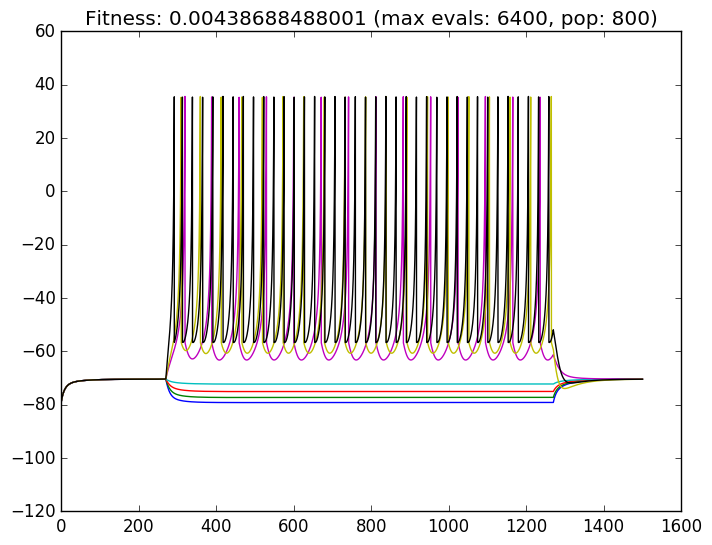</a>
</td>
<td>

</td>
<td>

</td>
</tr>
<tr>
<td width="130px">

<b>HH cell model tuned to dataset 476686112</b>

<a href="https://github.com/OpenSourceBrain/AllenInstituteNeuroML/blob/master/CellTypesDatabase/tune/tuned_cells/HH_476686112.cell.nml">Tuned model</a>

</td>
<td>

</td>
<td>

</td>
<td>
<a href="../../../tune/tuned_cells/summary/HH_476686112_iv.png">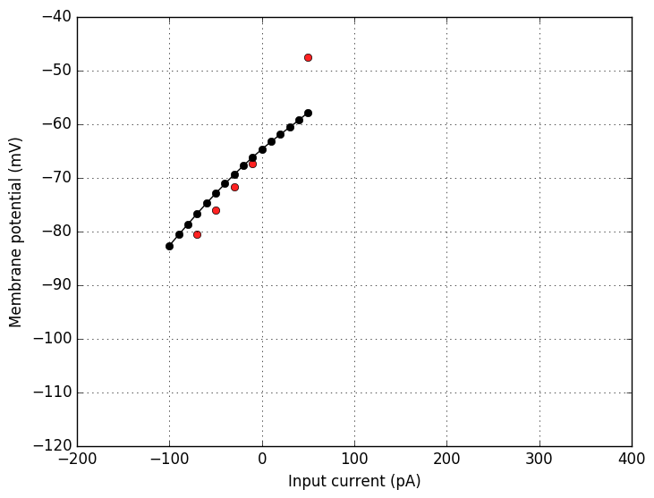</a>
</td>
</tr>
</table>  
 
<table border="1">
<tr>
<td width="130px">

<b>477127614</b>

Primary visual area, layer 2/3

spiny

Slc17a6-IRES-Cre

<a href="http://celltypes.brain-map.org/mouse/experiment/electrophysiology/477127614">Source data</a>

</td>
<td>
<a href="traces_477127614.png">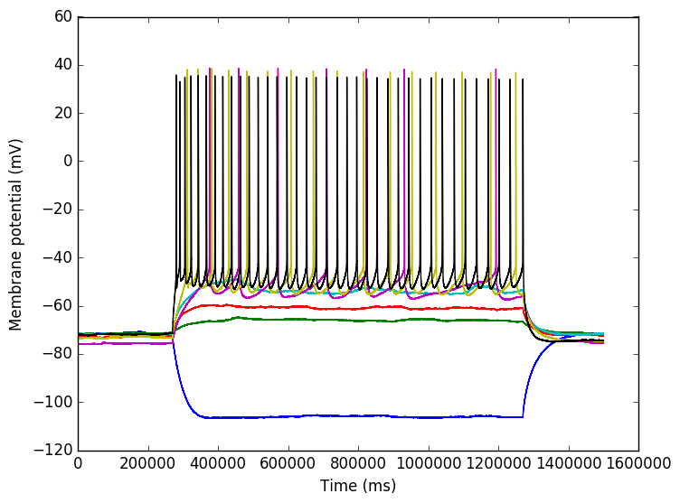</a>
</td>
<td>
<a href="spikes_477127614.png">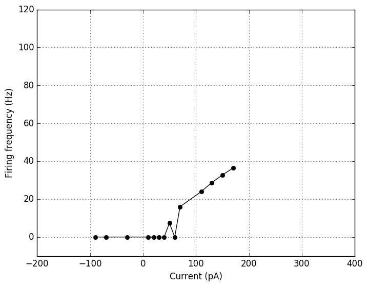</a>
</td>
<td>
<a href="subthreshold_477127614.png">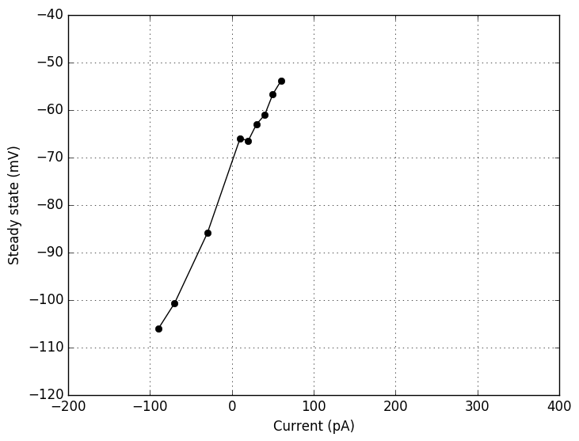</a>
</td>
</tr>
<tr>
<td width="130px">

<b>Izhikevich cell model tuned to dataset 477127614</b>

<a href="https://github.com/OpenSourceBrain/AllenInstituteNeuroML/blob/master/CellTypesDatabase/tune/tuned_cells/Izh_477127614.cell.nml">Tuned model</a>

</td>
<td>

</td>
<td>

</td>
<td>

</td>
</tr>
<tr>
<td width="130px">

<b>HH cell model tuned to dataset 477127614</b>

<a href="https://github.com/OpenSourceBrain/AllenInstituteNeuroML/blob/master/CellTypesDatabase/tune/tuned_cells/HH_477127614.cell.nml">Tuned model</a>

</td>
<td>

</td>
<td>

</td>
<td>
<a href="../../../tune/tuned_cells/summary/HH_477127614_iv.png">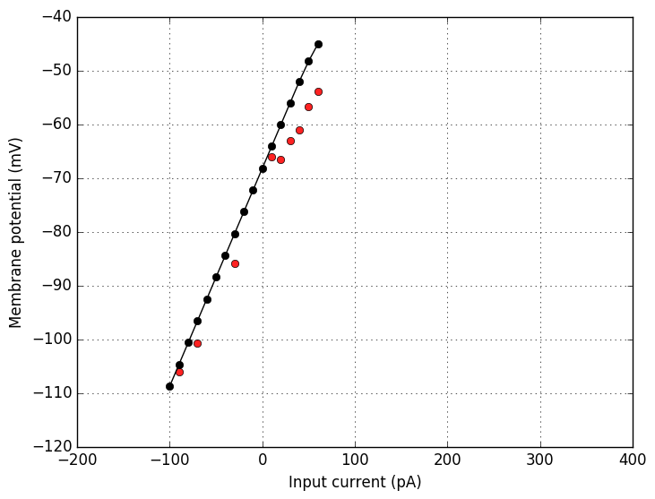</a>
</td>
</tr>
</table>  
 
<table border="1">
<tr>
<td width="130px">

<b>477135941</b>

Primary visual area, layer 4

spiny

Slc17a6-IRES-Cre

<a href="http://celltypes.brain-map.org/mouse/experiment/electrophysiology/477135941">Source data</a>

</td>
<td>
<a href="traces_477135941.png">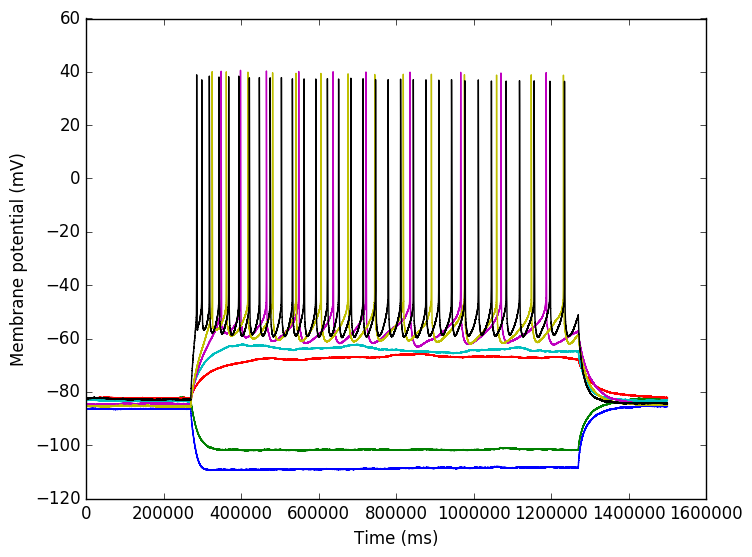</a>
</td>
<td>
<a href="spikes_477135941.png">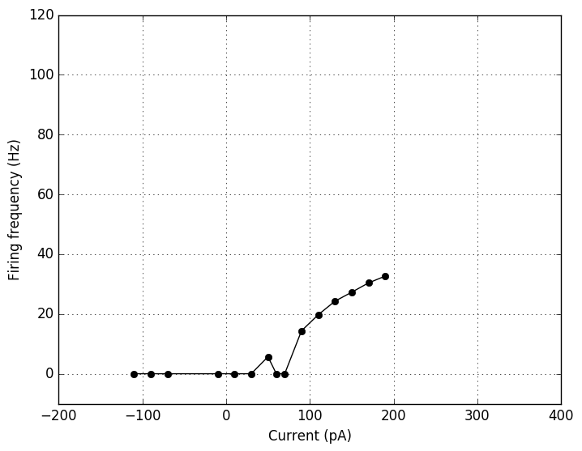</a>
</td>
<td>
<a href="subthreshold_477135941.png">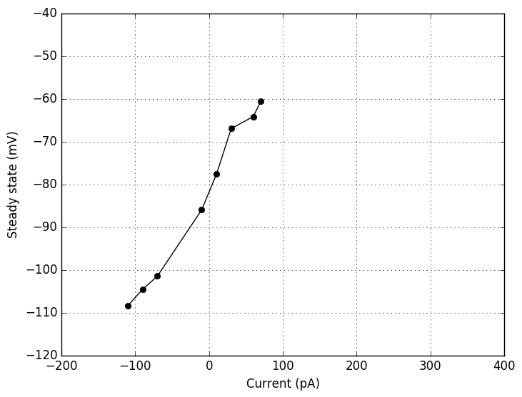</a>
</td>
</tr>
<tr>
<td width="130px">

<b>Izhikevich cell model tuned to dataset 477135941</b>

<a href="https://github.com/OpenSourceBrain/AllenInstituteNeuroML/blob/master/CellTypesDatabase/tune/tuned_cells/Izh_477135941.cell.nml">Tuned model</a>

</td>
<td>
<a href="../../../tune/tuned_cells/summary/Izh_477135941_traces.png">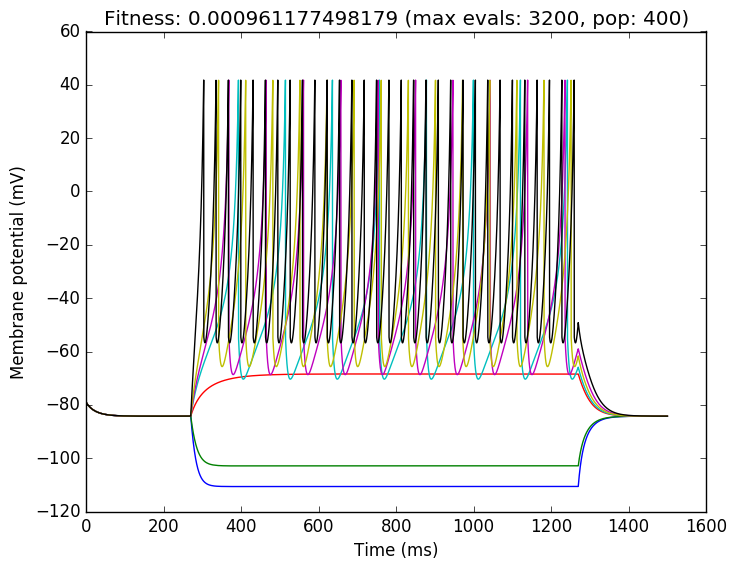</a>
</td>
<td>
<a href="../../../tune/tuned_cells/summary/Izh_477135941_if.png">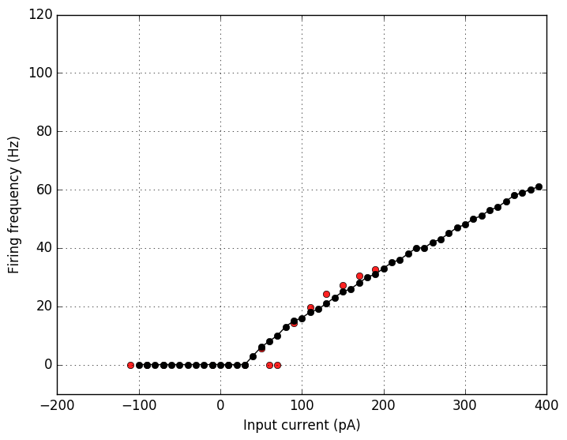</a>
</td>
<td>
<a href="../../../tune/tuned_cells/summary/Izh_477135941_iv.png">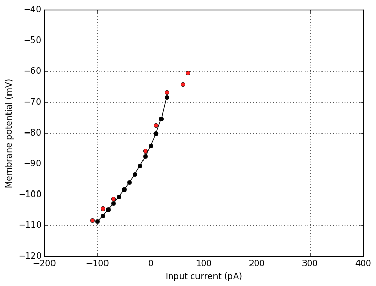</a>
</td>
</tr>
<tr>
<td width="130px">

<b>HH cell model tuned to dataset 477135941</b>

<a href="https://github.com/OpenSourceBrain/AllenInstituteNeuroML/blob/master/CellTypesDatabase/tune/tuned_cells/HH_477135941.cell.nml">Tuned model</a>

</td>
<td>

</td>
<td>
<a href="../../../tune/tuned_cells/summary/HH_477135941_if.png">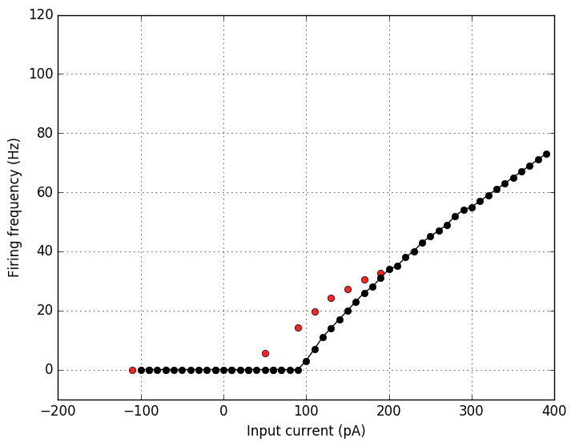</a>
</td>
<td>
<a href="../../../tune/tuned_cells/summary/HH_477135941_iv.png">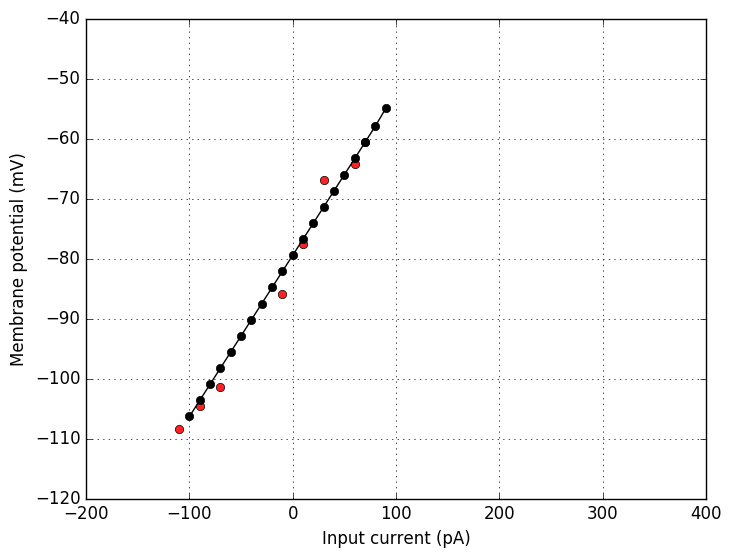</a>
</td>
</tr>
</table>  
 
<table border="1">
<tr>
<td width="130px">

<b>478058328</b>

Primary visual area, layer 6a

aspiny

Pvalb-IRES-Cre

<a href="http://celltypes.brain-map.org/mouse/experiment/electrophysiology/478058328">Source data</a>

</td>
<td>
<a href="traces_478058328.png">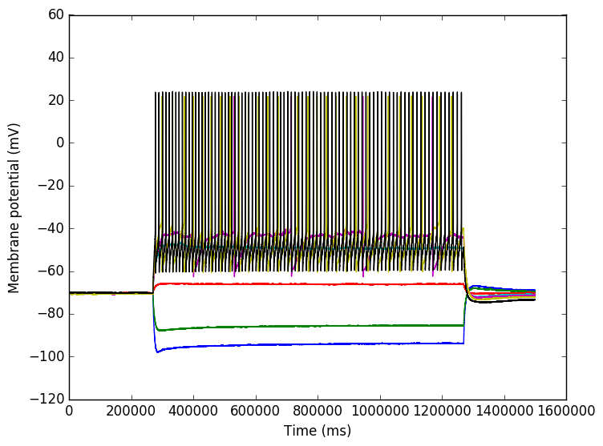</a>
</td>
<td>
<a href="spikes_478058328.png">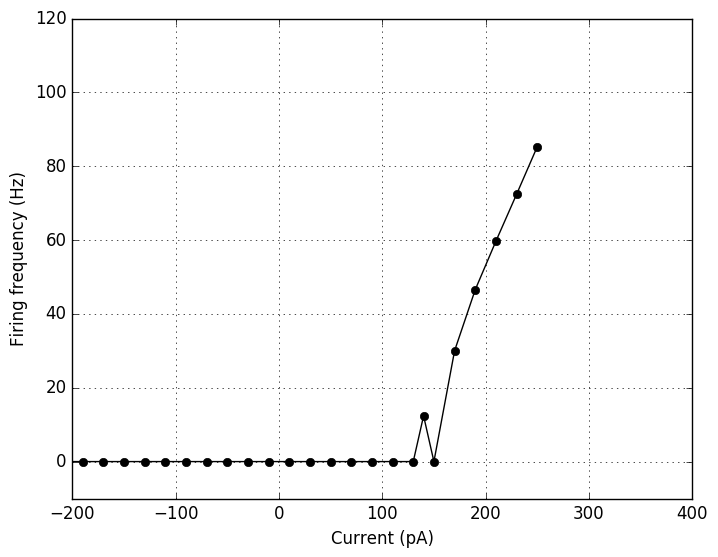</a>
</td>
<td>
<a href="subthreshold_478058328.png">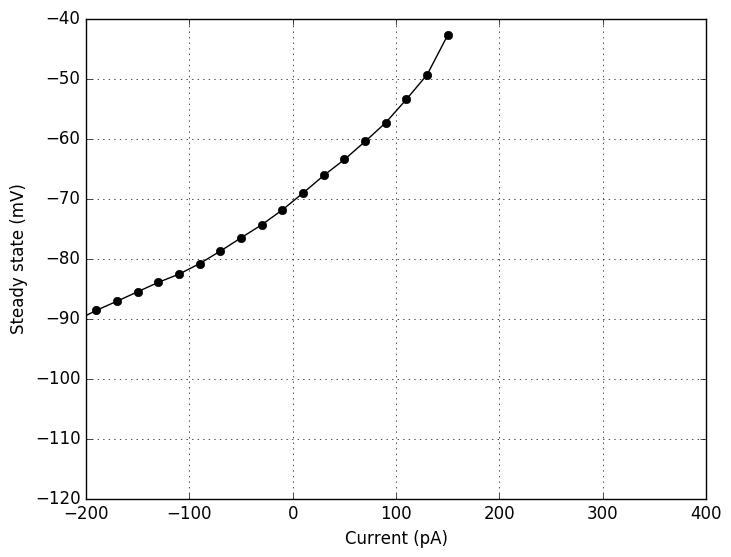</a>
</td>
</tr>
<tr>
<td width="130px">

<b>Izhikevich cell model tuned to dataset 478058328</b>

<a href="https://github.com/OpenSourceBrain/AllenInstituteNeuroML/blob/master/CellTypesDatabase/tune/tuned_cells/Izh_478058328.cell.nml">Tuned model</a>

</td>
<td>
<a href="../../../tune/tuned_cells/summary/Izh_478058328_traces.png">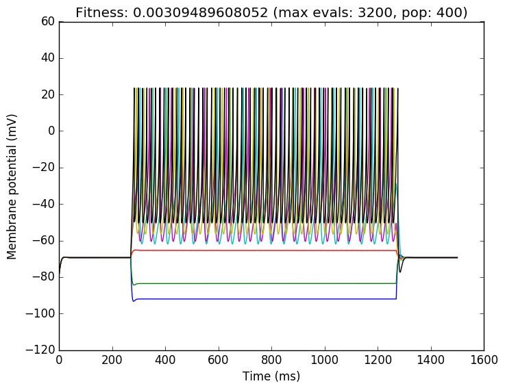</a>
</td>
<td>
<a href="../../../tune/tuned_cells/summary/Izh_478058328_if.png">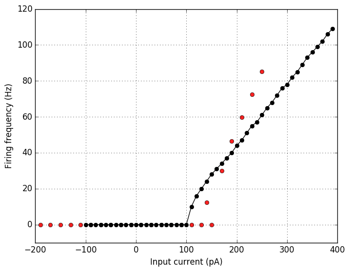</a>
</td>
<td>
<a href="../../../tune/tuned_cells/summary/Izh_478058328_iv.png">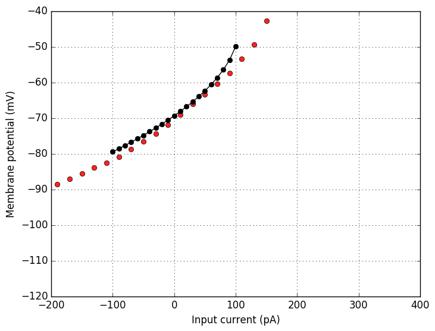</a>
</td>
</tr>
<tr>
<td width="130px">

<b>HH cell model tuned to dataset 478058328</b>

<a href="https://github.com/OpenSourceBrain/AllenInstituteNeuroML/blob/master/CellTypesDatabase/tune/tuned_cells/HH_478058328.cell.nml">Tuned model</a>

</td>
<td>

</td>
<td>
<a href="../../../tune/tuned_cells/summary/HH_478058328_if.png">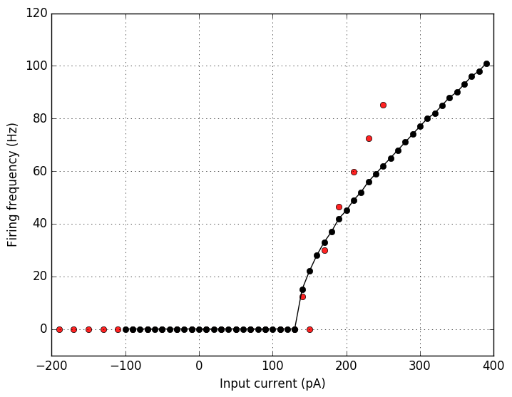</a>
</td>
<td>
<a href="../../../tune/tuned_cells/summary/HH_478058328_iv.png">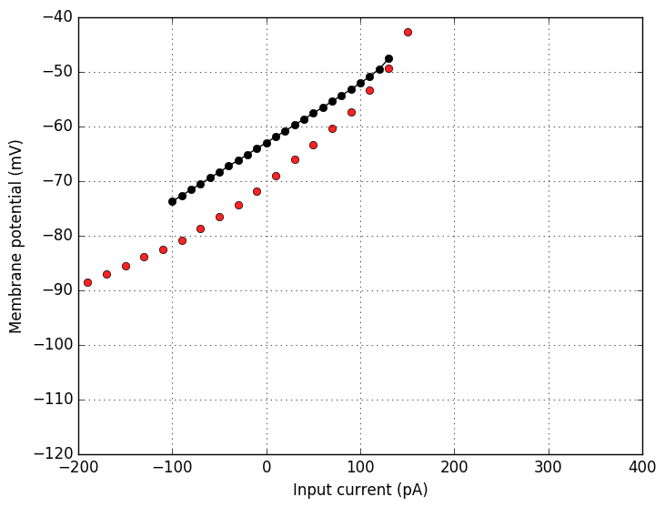</a>
</td>
</tr>
</table>  
 
<table border="1">
<tr>
<td width="130px">

<b>478110866</b>

Primary visual area, layer 5

aspiny

Htr3a-Cre_NO152

<a href="http://celltypes.brain-map.org/mouse/experiment/electrophysiology/478110866">Source data</a>

</td>
<td>
<a href="traces_478110866.png">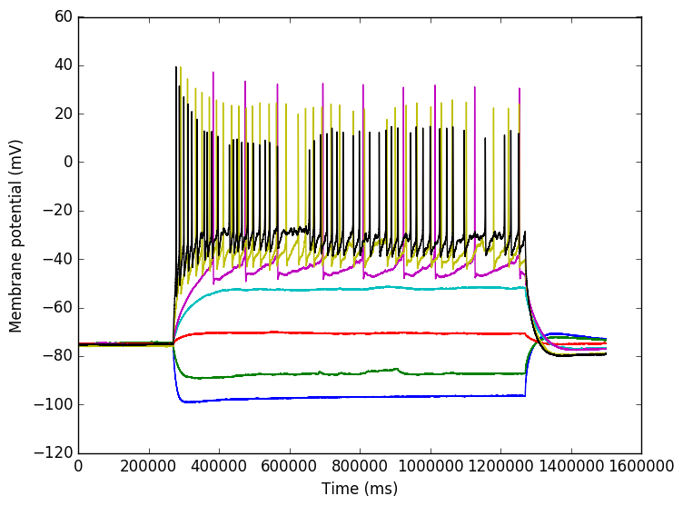</a>
</td>
<td>
<a href="spikes_478110866.png">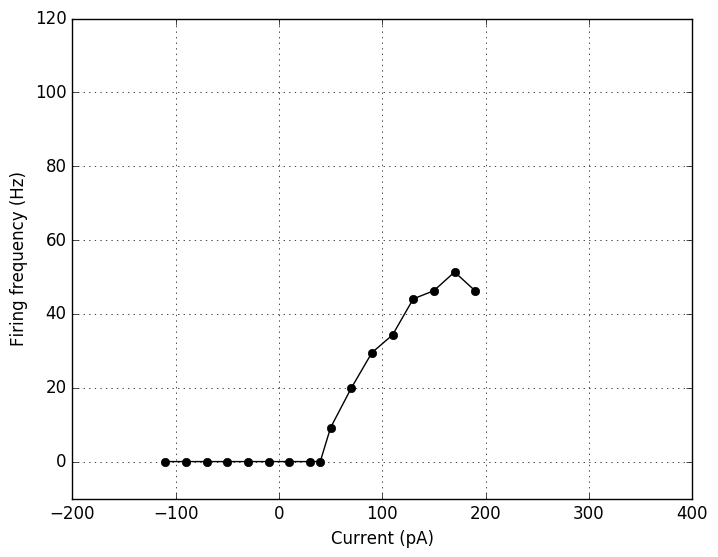</a>
</td>
<td>

</td>
</tr>
<tr>
<td width="130px">

<b>Izhikevich cell model tuned to dataset 478110866</b>

<a href="https://github.com/OpenSourceBrain/AllenInstituteNeuroML/blob/master/CellTypesDatabase/tune/tuned_cells/Izh_478110866.cell.nml">Tuned model</a>

</td>
<td>
<a href="../../../tune/tuned_cells/summary/Izh_478110866_traces.png">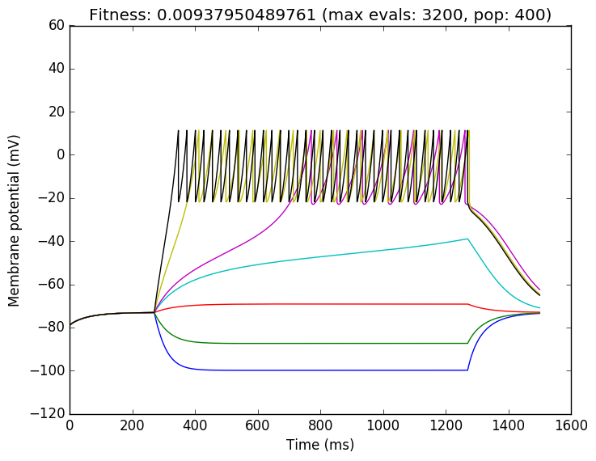</a>
</td>
<td>
<a href="../../../tune/tuned_cells/summary/Izh_478110866_if.png">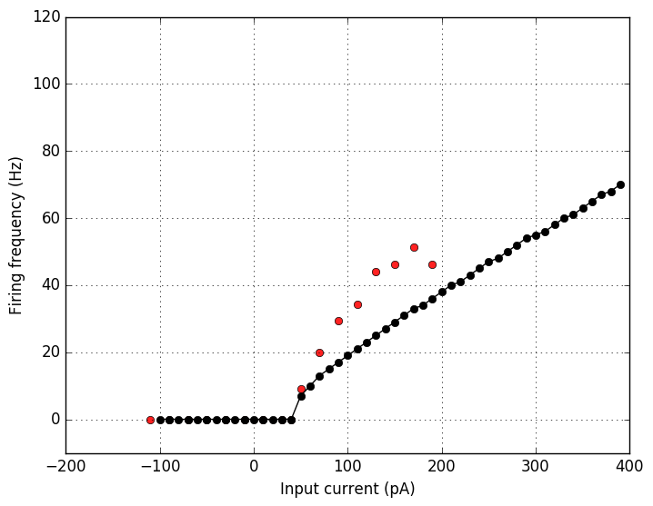</a>
</td>
<td>
<a href="../../../tune/tuned_cells/summary/Izh_478110866_iv.png">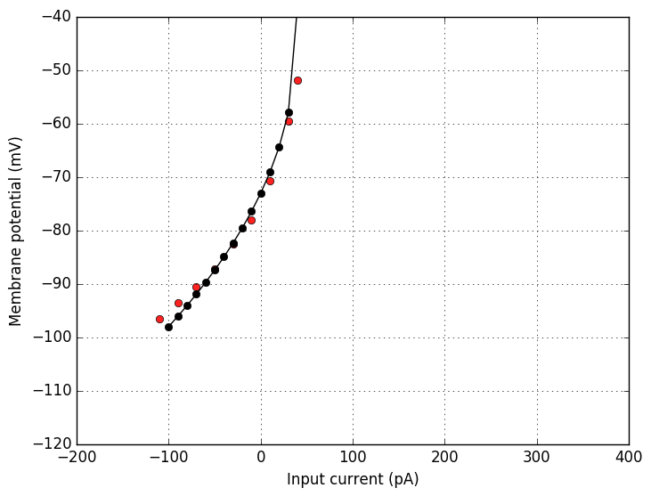</a>
</td>
</tr>
<tr>
<td width="130px">

<b>HH cell model tuned to dataset 478110866</b>

<a href="https://github.com/OpenSourceBrain/AllenInstituteNeuroML/blob/master/CellTypesDatabase/tune/tuned_cells/HH_478110866.cell.nml">Tuned model</a>

</td>
<td>

</td>
<td>
<a href="../../../tune/tuned_cells/summary/HH_478110866_if.png">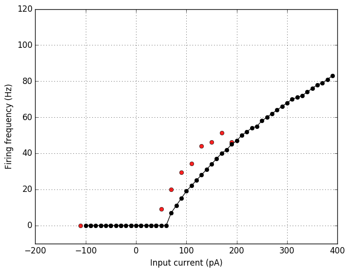</a>
</td>
<td>
<a href="../../../tune/tuned_cells/summary/HH_478110866_iv.png">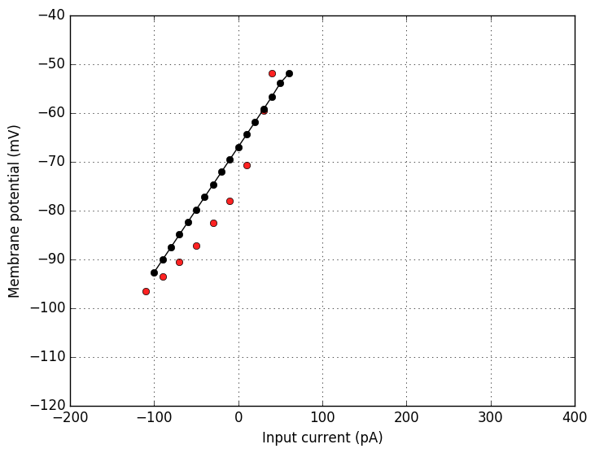</a>
</td>
</tr>
</table>  
 
<table border="1">
<tr>
<td width="130px">

<b>478499902</b>

Primary visual area, layer 2/3

spiny

Rorb-IRES2-Cre

<a href="http://celltypes.brain-map.org/mouse/experiment/electrophysiology/478499902">Source data</a>

</td>
<td>
<a href="traces_478499902.png">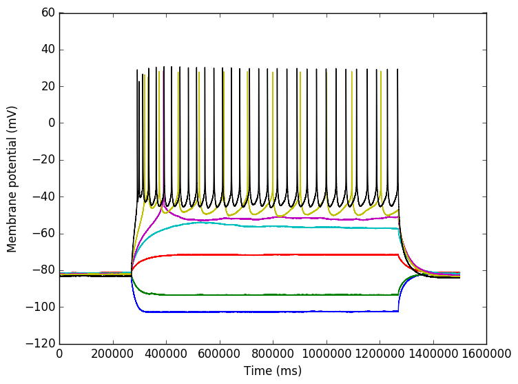</a>
</td>
<td>
<a href="spikes_478499902.png">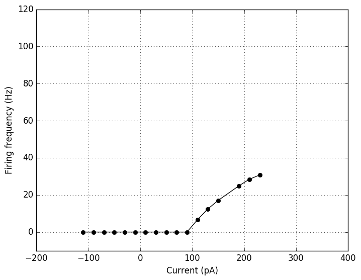</a>
</td>
<td>
<a href="subthreshold_478499902.png">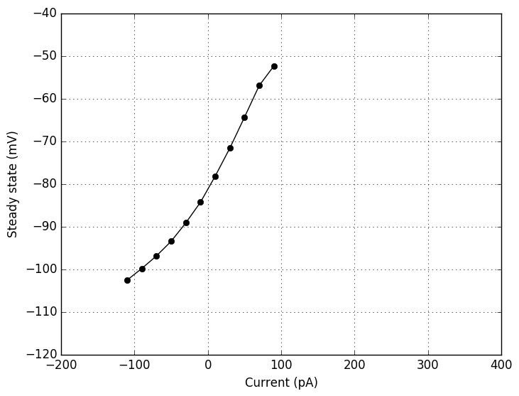</a>
</td>
</tr>
<tr>
<td width="130px">

<b>Izhikevich cell model tuned to dataset 478499902</b>

<a href="https://github.com/OpenSourceBrain/AllenInstituteNeuroML/blob/master/CellTypesDatabase/tune/tuned_cells/Izh_478499902.cell.nml">Tuned model</a>

</td>
<td>

</td>
<td>

</td>
<td>

</td>
</tr>
<tr>
<td width="130px">

<b>HH cell model tuned to dataset 478499902</b>

<a href="https://github.com/OpenSourceBrain/AllenInstituteNeuroML/blob/master/CellTypesDatabase/tune/tuned_cells/HH_478499902.cell.nml">Tuned model</a>

</td>
<td>

</td>
<td>

</td>
<td>

</td>
</tr>
</table>  
 
<table border="1">
<tr>
<td width="130px">

<b>478793814</b>

Primary visual area, layer 5

aspiny

Pvalb-IRES-Cre

<a href="http://celltypes.brain-map.org/mouse/experiment/electrophysiology/478793814">Source data</a>

</td>
<td>
<a href="traces_478793814.png">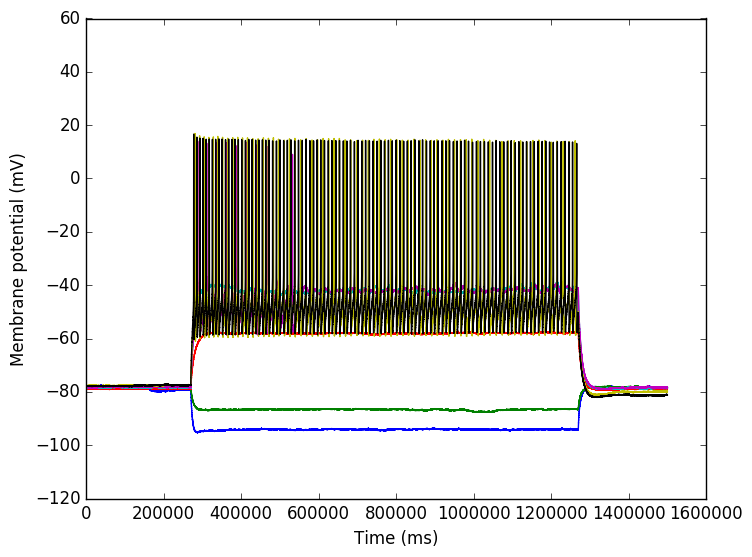</a>
</td>
<td>
<a href="spikes_478793814.png">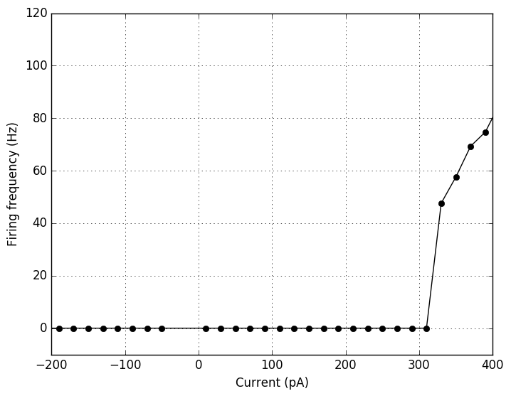</a>
</td>
<td>
<a href="subthreshold_478793814.png">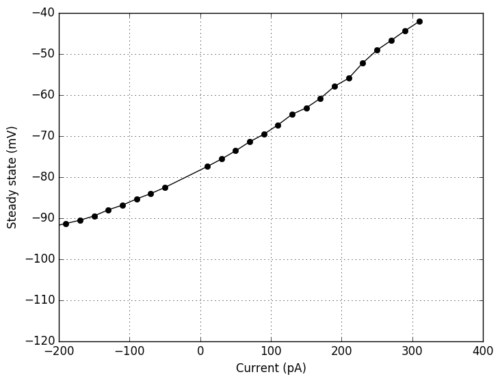</a>
</td>
</tr>
<tr>
<td width="130px">

<b>Izhikevich cell model tuned to dataset 478793814</b>

<a href="https://github.com/OpenSourceBrain/AllenInstituteNeuroML/blob/master/CellTypesDatabase/tune/tuned_cells/Izh_478793814.cell.nml">Tuned model</a>

</td>
<td>
<a href="../../../tune/tuned_cells/summary/Izh_478793814_traces.png">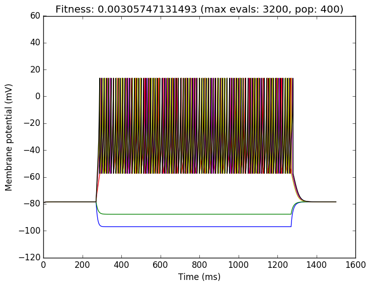</a>
</td>
<td>
<a href="../../../tune/tuned_cells/summary/Izh_478793814_if.png">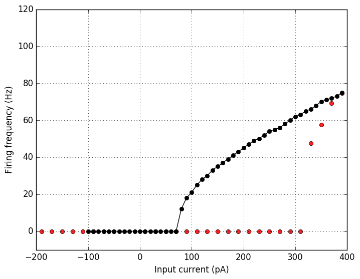</a>
</td>
<td>
<a href="../../../tune/tuned_cells/summary/Izh_478793814_iv.png">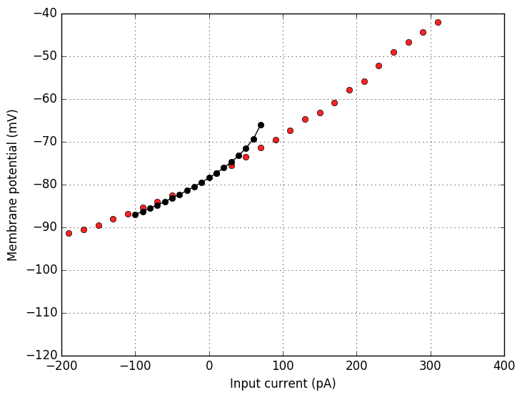</a>
</td>
</tr>
<tr>
<td width="130px">

<b>HH cell model tuned to dataset 478793814</b>

<a href="https://github.com/OpenSourceBrain/AllenInstituteNeuroML/blob/master/CellTypesDatabase/tune/tuned_cells/HH_478793814.cell.nml">Tuned model</a>

</td>
<td>

</td>
<td>
<a href="../../../tune/tuned_cells/summary/HH_478793814_if.png">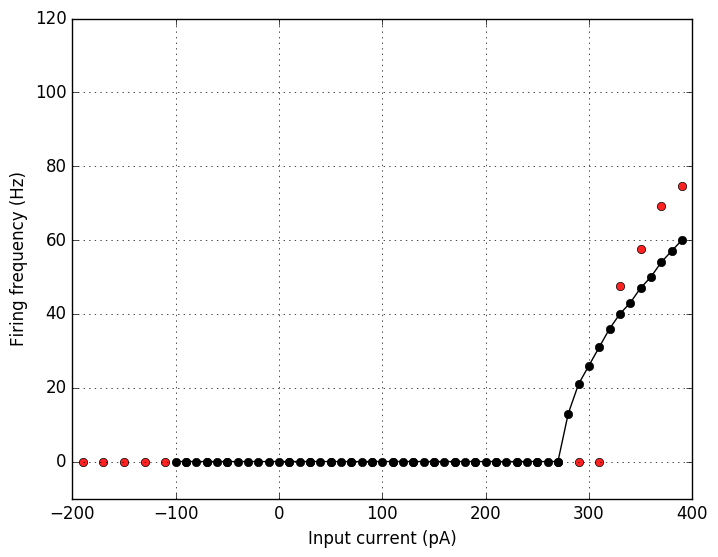</a>
</td>
<td>
<a href="../../../tune/tuned_cells/summary/HH_478793814_iv.png">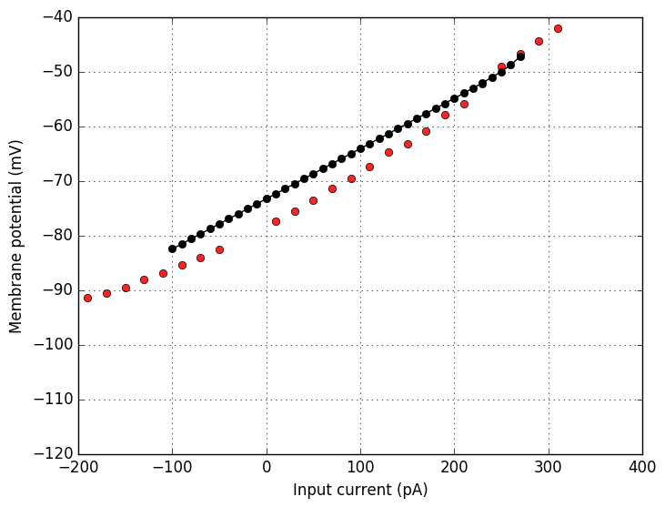</a>
</td>
</tr>
</table>  
 
<table border="1">
<tr>
<td width="130px">

<b>478828646</b>

Primary visual area, layer 6a

aspiny

Pvalb-IRES-Cre

<a href="http://celltypes.brain-map.org/mouse/experiment/electrophysiology/478828646">Source data</a>

</td>
<td>
<a href="traces_478828646.png">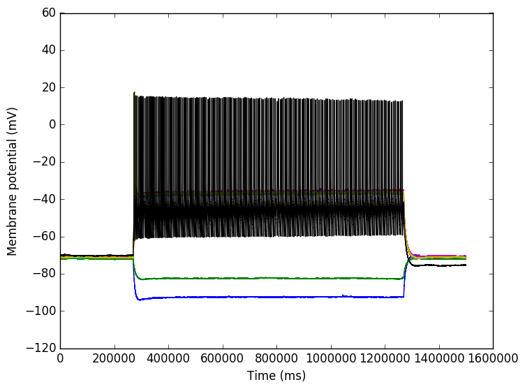</a>
</td>
<td>
<a href="spikes_478828646.png">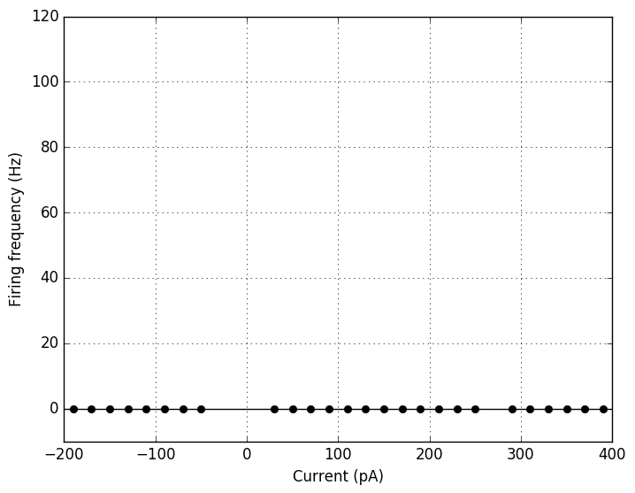</a>
</td>
<td>

</td>
</tr>
<tr>
<td width="130px">

<b>Izhikevich cell model tuned to dataset 478828646</b>

<a href="https://github.com/OpenSourceBrain/AllenInstituteNeuroML/blob/master/CellTypesDatabase/tune/tuned_cells/Izh_478828646.cell.nml">Tuned model</a>

</td>
<td>

</td>
<td>

</td>
<td>

</td>
</tr>
<tr>
<td width="130px">

<b>HH cell model tuned to dataset 478828646</b>

<a href="https://github.com/OpenSourceBrain/AllenInstituteNeuroML/blob/master/CellTypesDatabase/tune/tuned_cells/HH_478828646.cell.nml">Tuned model</a>

</td>
<td>

</td>
<td>

</td>
<td>

</td>
</tr>
</table>  
 
<table border="1">
<tr>
<td width="130px">

<b>478888083</b>

Primary visual area, layer 4

aspiny

Scnn1a-Tg2-Cre

<a href="http://celltypes.brain-map.org/mouse/experiment/electrophysiology/478888083">Source data</a>

</td>
<td>
<a href="traces_478888083.png">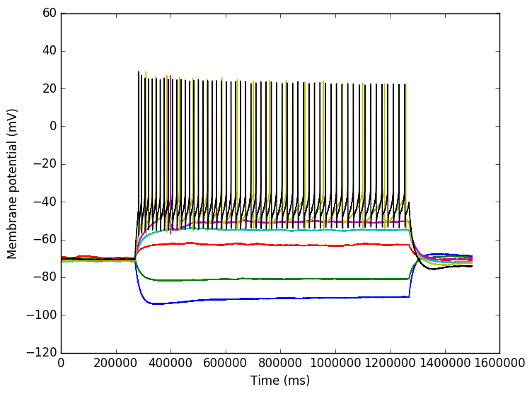</a>
</td>
<td>
<a href="spikes_478888083.png">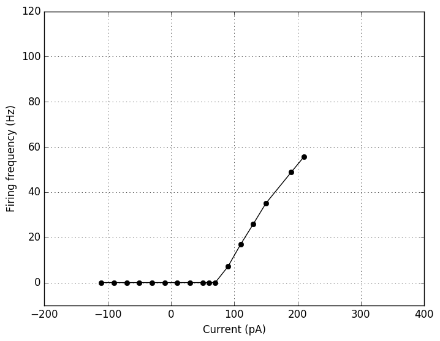</a>
</td>
<td>

</td>
</tr>
<tr>
<td width="130px">

<b>Izhikevich cell model tuned to dataset 478888083</b>

<a href="https://github.com/OpenSourceBrain/AllenInstituteNeuroML/blob/master/CellTypesDatabase/tune/tuned_cells/Izh_478888083.cell.nml">Tuned model</a>

</td>
<td>

</td>
<td>

</td>
<td>

</td>
</tr>
<tr>
<td width="130px">

<b>HH cell model tuned to dataset 478888083</b>

<a href="https://github.com/OpenSourceBrain/AllenInstituteNeuroML/blob/master/CellTypesDatabase/tune/tuned_cells/HH_478888083.cell.nml">Tuned model</a>

</td>
<td>

</td>
<td>

</td>
<td>

</td>
</tr>
</table>  
 
<table border="1">
<tr>
<td width="130px">

<b>479010903</b>

Primary visual area, layer 5

spiny

Pvalb-IRES-Cre

<a href="http://celltypes.brain-map.org/mouse/experiment/electrophysiology/479010903">Source data</a>

</td>
<td>
<a href="traces_479010903.png">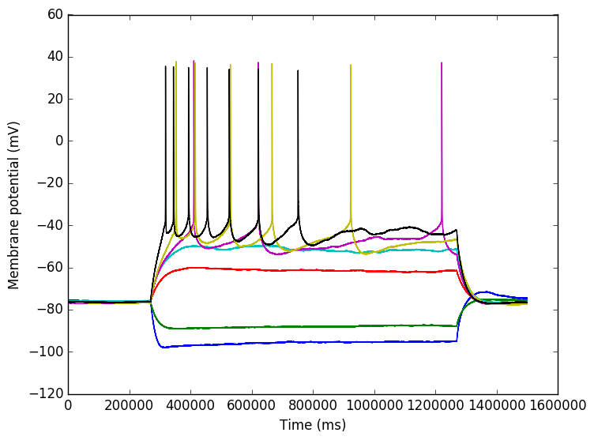</a>
</td>
<td>
<a href="spikes_479010903.png">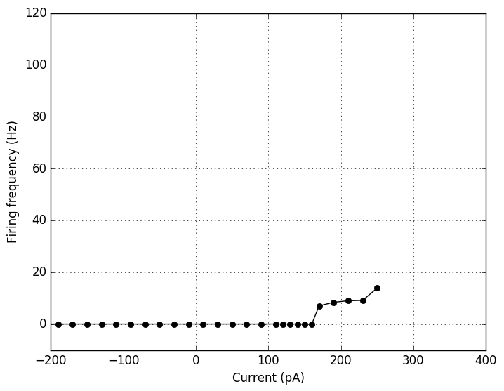</a>
</td>
<td>
<a href="subthreshold_479010903.png">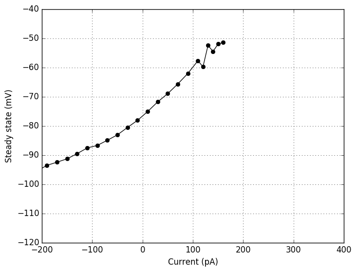</a>
</td>
</tr>
<tr>
<td width="130px">

<b>Izhikevich cell model tuned to dataset 479010903</b>

<a href="https://github.com/OpenSourceBrain/AllenInstituteNeuroML/blob/master/CellTypesDatabase/tune/tuned_cells/Izh_479010903.cell.nml">Tuned model</a>

</td>
<td>
<a href="../../../tune/tuned_cells/summary/Izh_479010903_traces.png">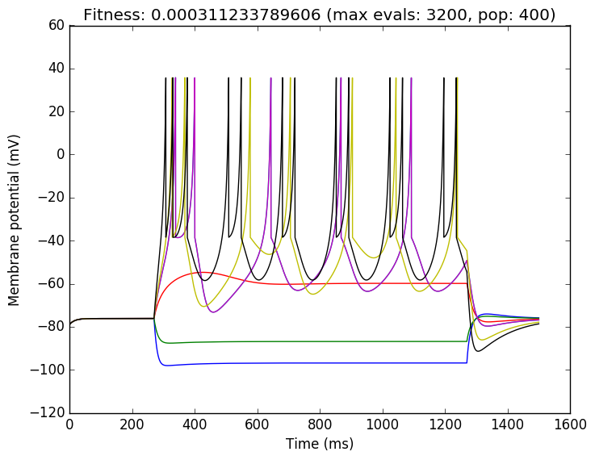</a>
</td>
<td>
<a href="../../../tune/tuned_cells/summary/Izh_479010903_if.png">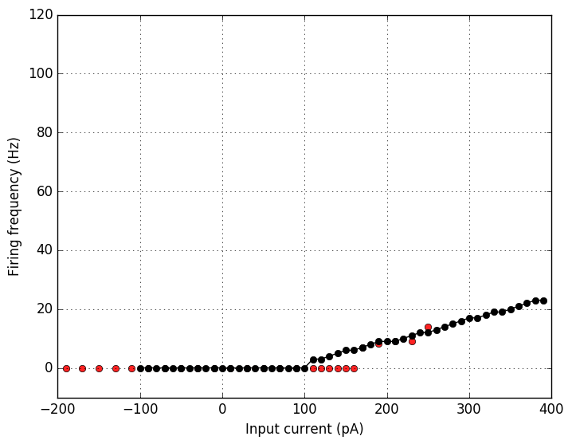</a>
</td>
<td>
<a href="../../../tune/tuned_cells/summary/Izh_479010903_iv.png">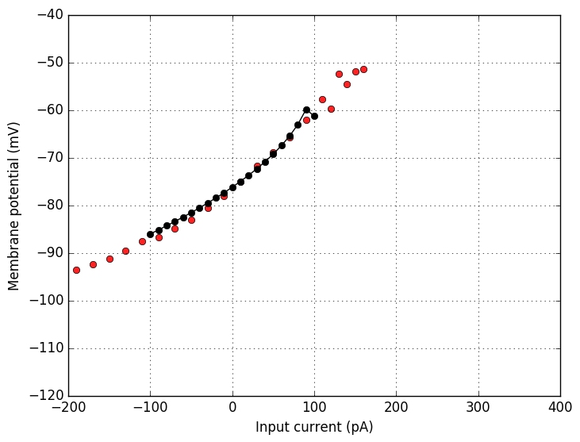</a>
</td>
</tr>
<tr>
<td width="130px">

<b>HH cell model tuned to dataset 479010903</b>

<a href="https://github.com/OpenSourceBrain/AllenInstituteNeuroML/blob/master/CellTypesDatabase/tune/tuned_cells/HH_479010903.cell.nml">Tuned model</a>

</td>
<td>
<a href="../../../tune/tuned_cells/summary/HH_479010903_traces.png">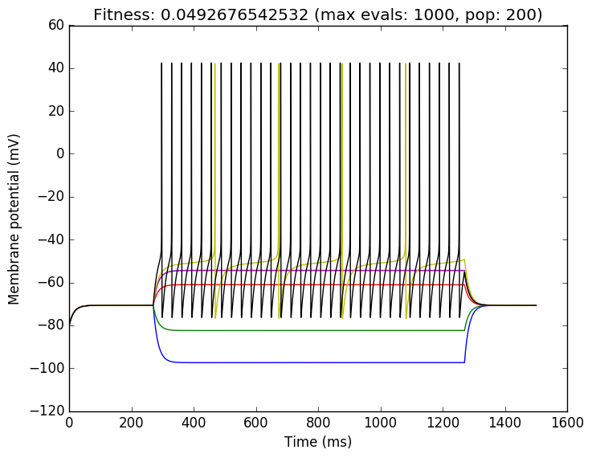</a>
</td>
<td>
<a href="../../../tune/tuned_cells/summary/HH_479010903_if.png">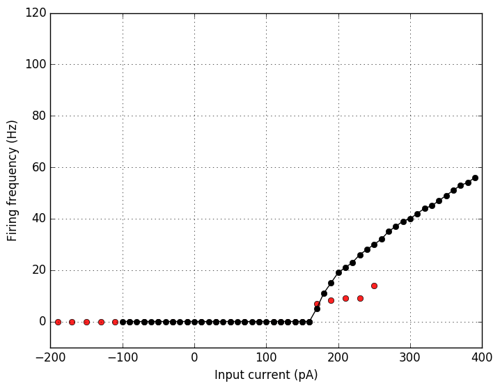</a>
</td>
<td>
<a href="../../../tune/tuned_cells/summary/HH_479010903_iv.png">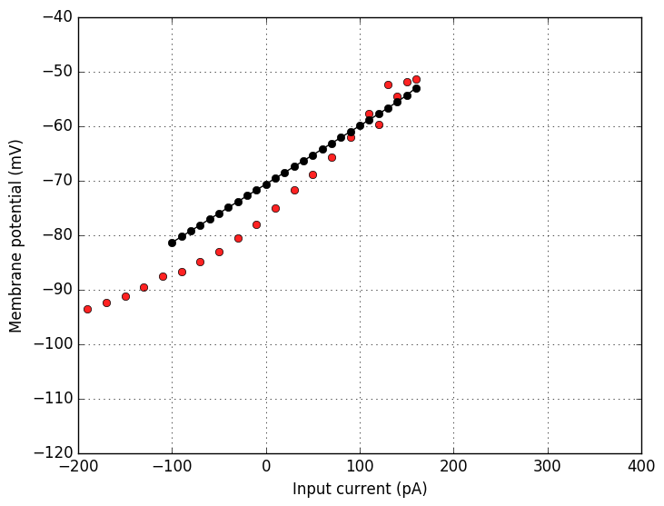</a>
</td>
</tr>
</table>  
 
<table border="1">
<tr>
<td width="130px">

<b>479179020</b>

Primary visual area, layer 4

spiny

Rorb-IRES2-Cre

<a href="http://celltypes.brain-map.org/mouse/experiment/electrophysiology/479179020">Source data</a>

</td>
<td>
<a href="traces_479179020.png">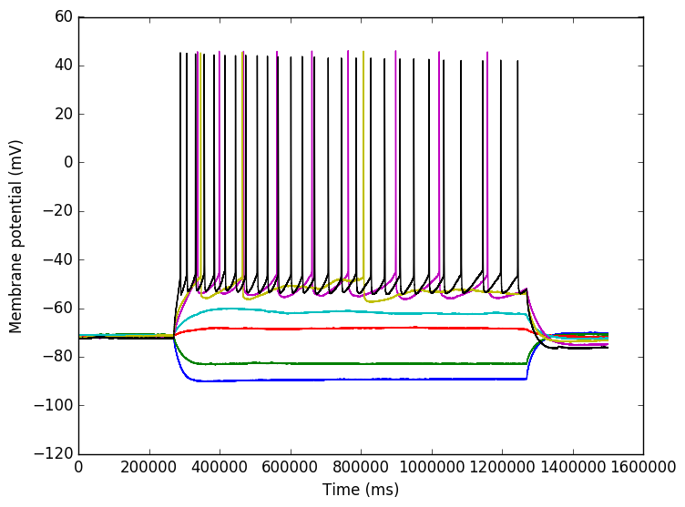</a>
</td>
<td>
<a href="spikes_479179020.png">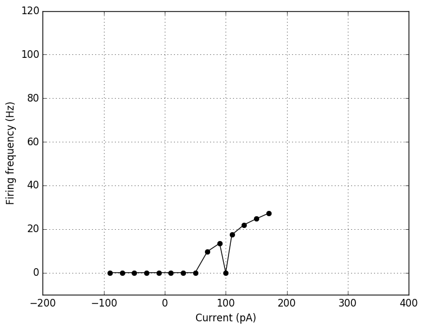</a>
</td>
<td>
<a href="subthreshold_479179020.png">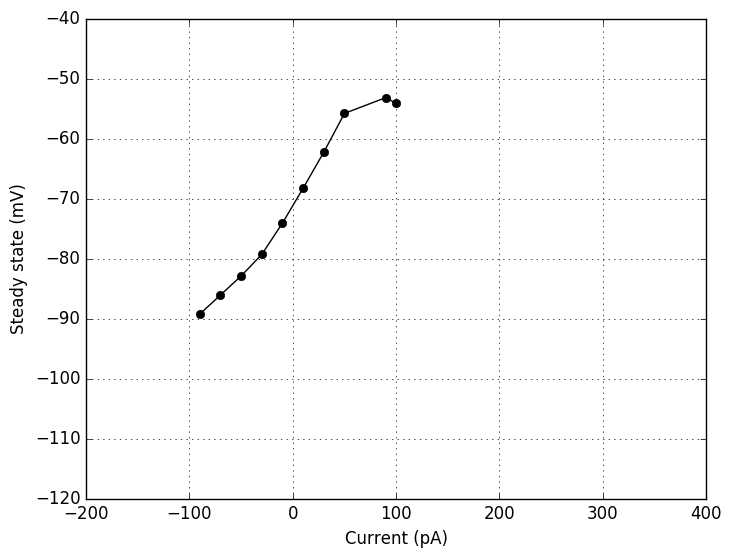</a>
</td>
</tr>
<tr>
<td width="130px">

<b>Izhikevich cell model tuned to dataset 479179020</b>

<a href="https://github.com/OpenSourceBrain/AllenInstituteNeuroML/blob/master/CellTypesDatabase/tune/tuned_cells/Izh_479179020.cell.nml">Tuned model</a>

</td>
<td>
<a href="../../../tune/tuned_cells/summary/Izh_479179020_traces.png">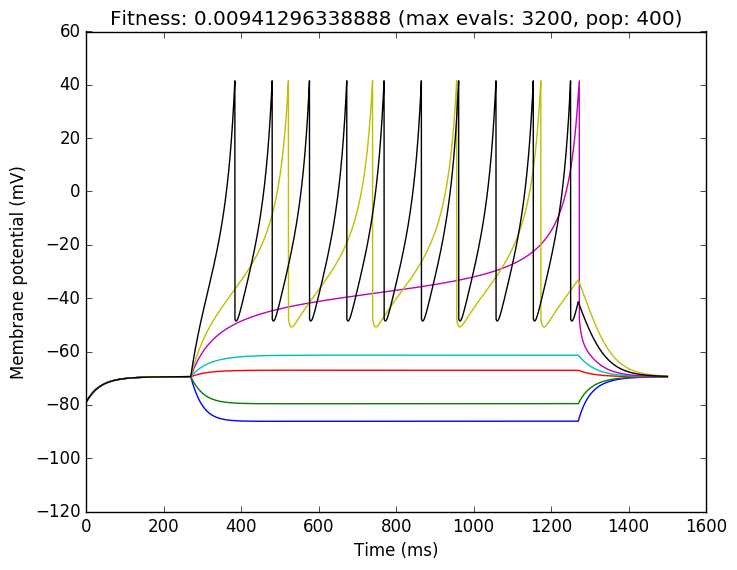</a>
</td>
<td>
<a href="../../../tune/tuned_cells/summary/Izh_479179020_if.png">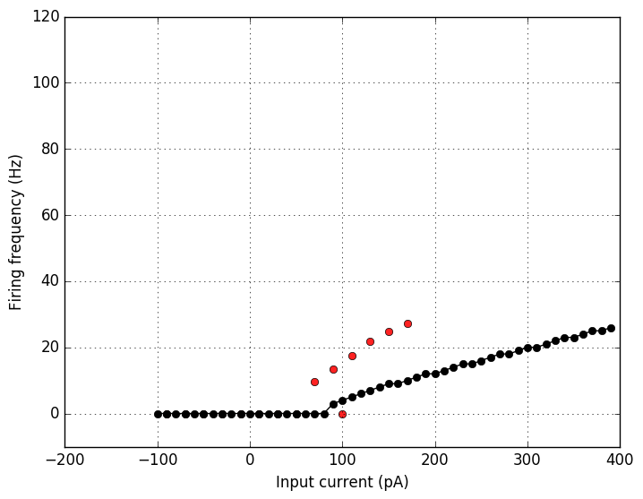</a>
</td>
<td>
<a href="../../../tune/tuned_cells/summary/Izh_479179020_iv.png">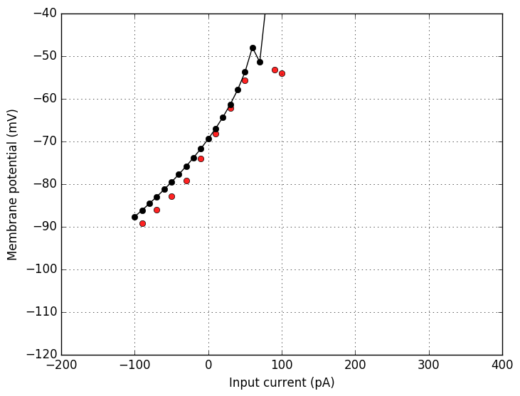</a>
</td>
</tr>
<tr>
<td width="130px">

<b>HH cell model tuned to dataset 479179020</b>

<a href="https://github.com/OpenSourceBrain/AllenInstituteNeuroML/blob/master/CellTypesDatabase/tune/tuned_cells/HH_479179020.cell.nml">Tuned model</a>

</td>
<td>

</td>
<td>
<a href="../../../tune/tuned_cells/summary/HH_479179020_if.png">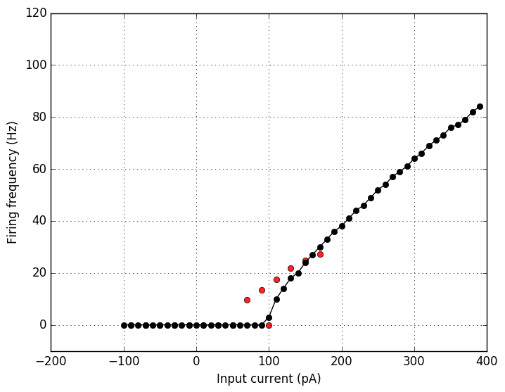</a>
</td>
<td>
<a href="../../../tune/tuned_cells/summary/HH_479179020_iv.png">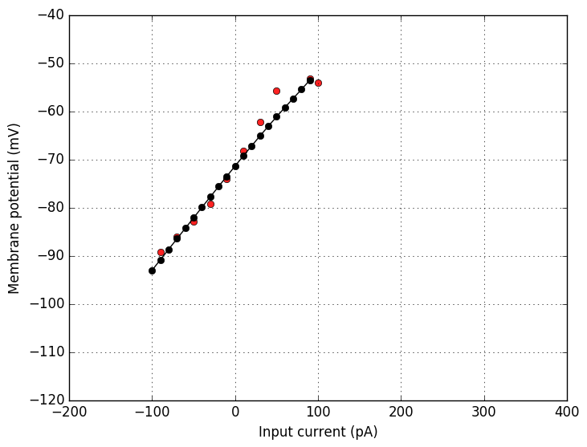</a>
</td>
</tr>
</table>  
 
<table border="1">
<tr>
<td width="130px">

<b>479220013</b>

Primary visual area, layer 2/3

aspiny

Htr3a-Cre_NO152

<a href="http://celltypes.brain-map.org/mouse/experiment/electrophysiology/479220013">Source data</a>

</td>
<td>
<a href="traces_479220013.png">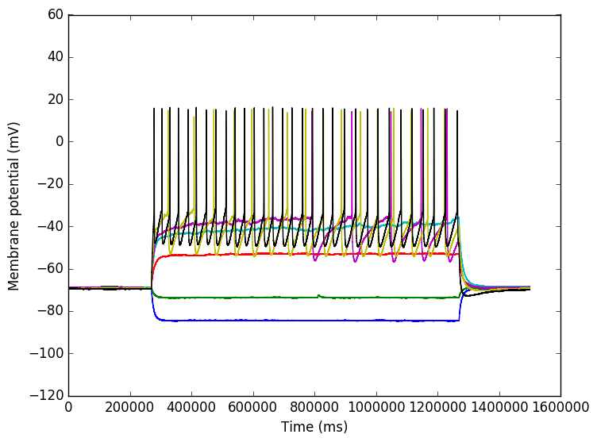</a>
</td>
<td>

</td>
<td>
<a href="subthreshold_479220013.png">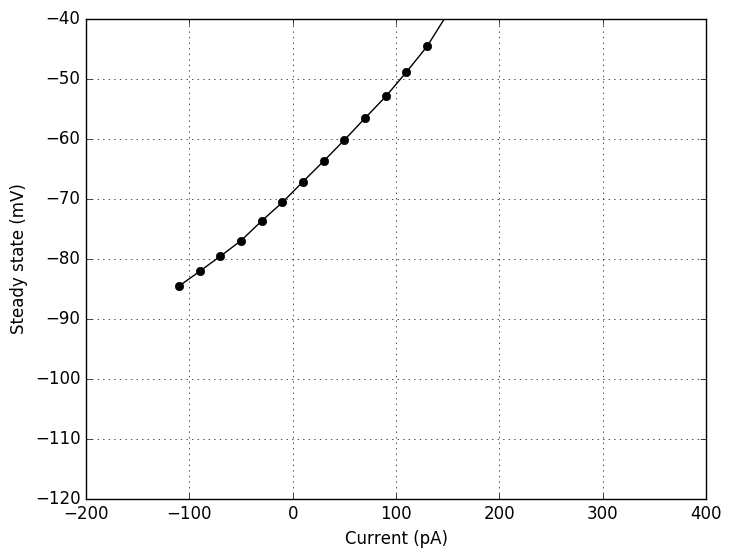</a>
</td>
</tr>
<tr>
<td width="130px">

<b>Izhikevich cell model tuned to dataset 479220013</b>

<a href="https://github.com/OpenSourceBrain/AllenInstituteNeuroML/blob/master/CellTypesDatabase/tune/tuned_cells/Izh_479220013.cell.nml">Tuned model</a>

</td>
<td>
<a href="../../../tune/tuned_cells/summary/Izh_479220013_traces.png">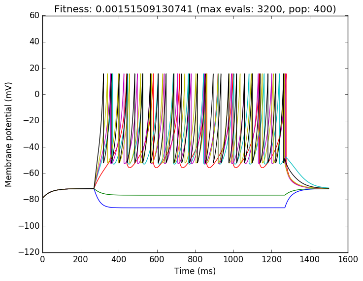</a>
</td>
<td>
<a href="../../../tune/tuned_cells/summary/Izh_479220013_if.png">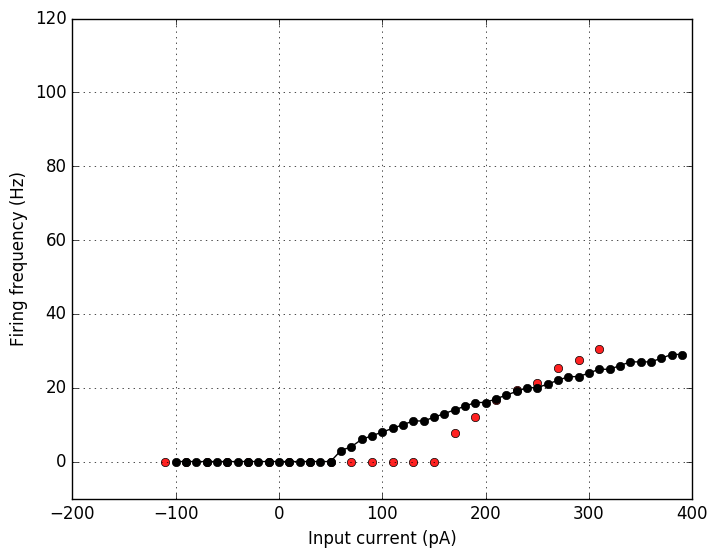</a>
</td>
<td>
<a href="../../../tune/tuned_cells/summary/Izh_479220013_iv.png">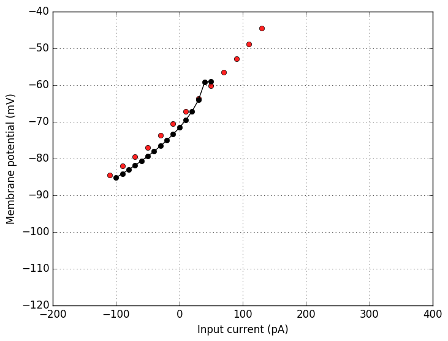</a>
</td>
</tr>
<tr>
<td width="130px">

<b>HH cell model tuned to dataset 479220013</b>

<a href="https://github.com/OpenSourceBrain/AllenInstituteNeuroML/blob/master/CellTypesDatabase/tune/tuned_cells/HH_479220013.cell.nml">Tuned model</a>

</td>
<td>

</td>
<td>
<a href="../../../tune/tuned_cells/summary/HH_479220013_if.png">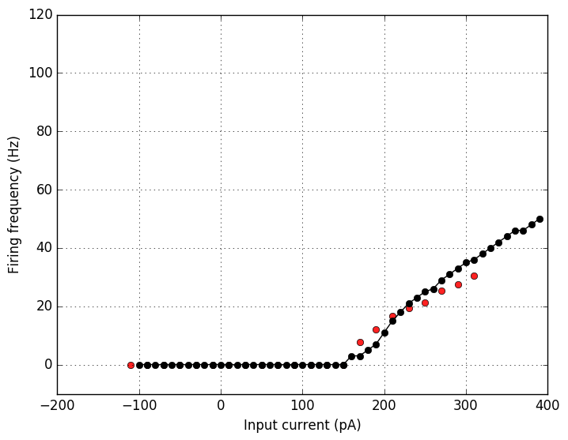</a>
</td>
<td>
<a href="../../../tune/tuned_cells/summary/HH_479220013_iv.png">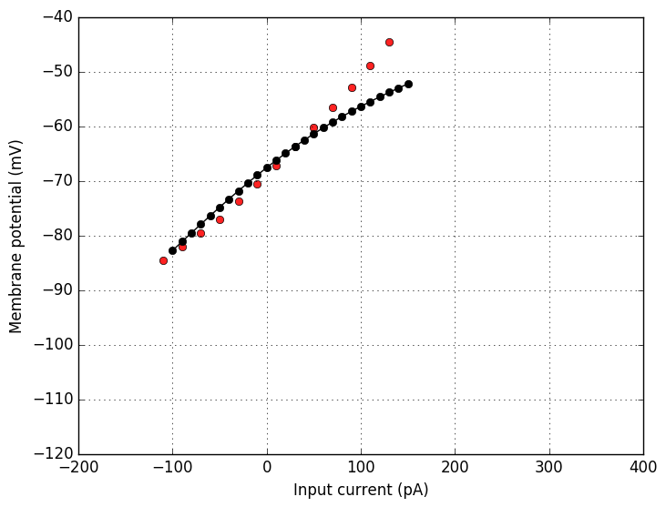</a>
</td>
</tr>
</table>  
 
<table border="1">
<tr>
<td width="130px">

<b>479704527</b>

Primary visual area, layer 4

spiny

Rbp4-Cre_KL100

<a href="http://celltypes.brain-map.org/mouse/experiment/electrophysiology/479704527">Source data</a>

</td>
<td>

</td>
<td>
<a href="spikes_479704527.png">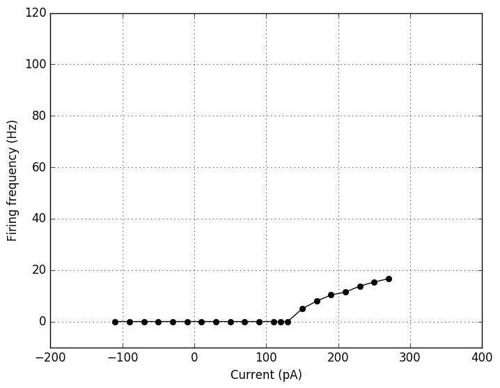</a>
</td>
<td>
<a href="subthreshold_479704527.png">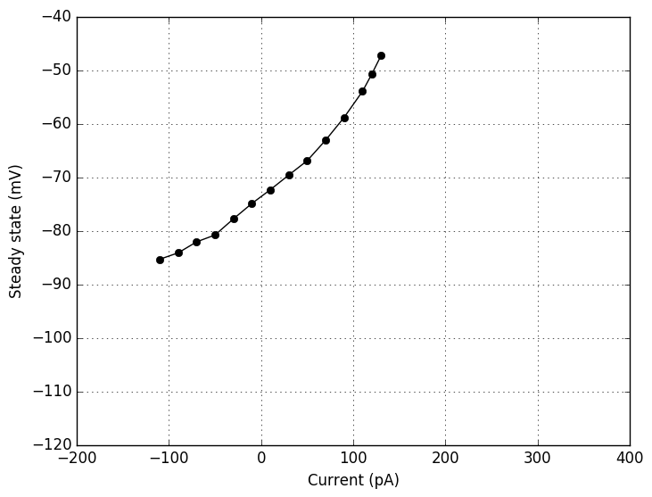</a>
</td>
</tr>
<tr>
<td width="130px">

<b>Izhikevich cell model tuned to dataset 479704527</b>

<a href="https://github.com/OpenSourceBrain/AllenInstituteNeuroML/blob/master/CellTypesDatabase/tune/tuned_cells/Izh_479704527.cell.nml">Tuned model</a>

</td>
<td>

</td>
<td>

</td>
<td>

</td>
</tr>
<tr>
<td width="130px">

<b>HH cell model tuned to dataset 479704527</b>

<a href="https://github.com/OpenSourceBrain/AllenInstituteNeuroML/blob/master/CellTypesDatabase/tune/tuned_cells/HH_479704527.cell.nml">Tuned model</a>

</td>
<td>

</td>
<td>

</td>
<td>
<a href="../../../tune/tuned_cells/summary/HH_479704527_iv.png">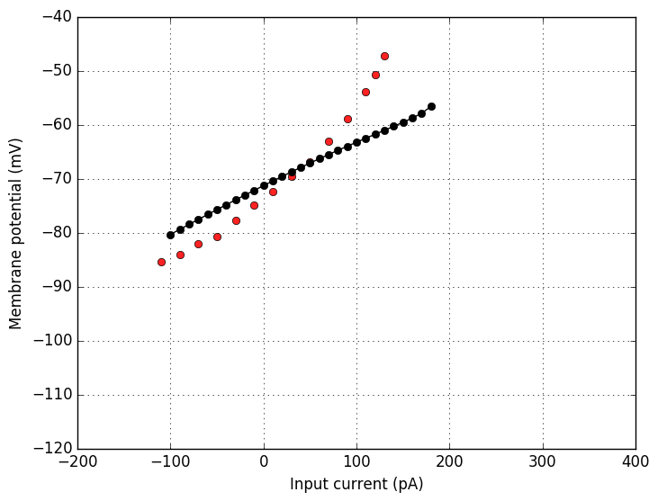</a>
</td>
</tr>
</table>  
 
<table border="1">
<tr>
<td width="130px">

<b>479721491</b>

Primary visual area, layer 5

spiny

Rbp4-Cre_KL100

<a href="http://celltypes.brain-map.org/mouse/experiment/electrophysiology/479721491">Source data</a>

</td>
<td>

</td>
<td>
<a href="spikes_479721491.png">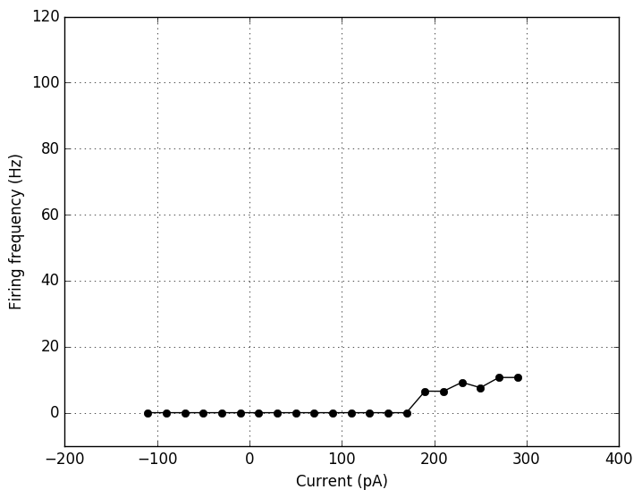</a>
</td>
<td>
<a href="subthreshold_479721491.png">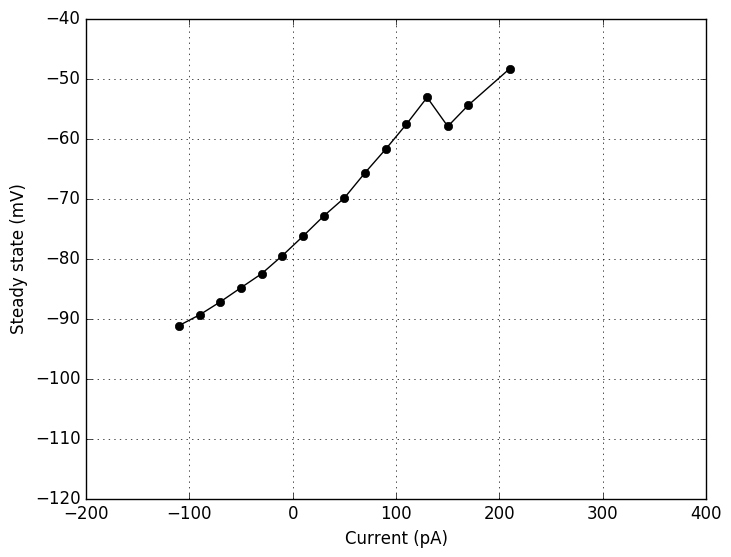</a>
</td>
</tr>
<tr>
<td width="130px">

<b>Izhikevich cell model tuned to dataset 479721491</b>

<a href="https://github.com/OpenSourceBrain/AllenInstituteNeuroML/blob/master/CellTypesDatabase/tune/tuned_cells/Izh_479721491.cell.nml">Tuned model</a>

</td>
<td>

</td>
<td>

</td>
<td>

</td>
</tr>
<tr>
<td width="130px">

<b>HH cell model tuned to dataset 479721491</b>

<a href="https://github.com/OpenSourceBrain/AllenInstituteNeuroML/blob/master/CellTypesDatabase/tune/tuned_cells/HH_479721491.cell.nml">Tuned model</a>

</td>
<td>

</td>
<td>

</td>
<td>

</td>
</tr>
</table>  
 
<table border="1">
<tr>
<td width="130px">

<b>479728896</b>

Primary visual area, layer 4

spiny

Rbp4-Cre_KL100

<a href="http://celltypes.brain-map.org/mouse/experiment/electrophysiology/479728896">Source data</a>

</td>
<td>
<a href="traces_479728896.png">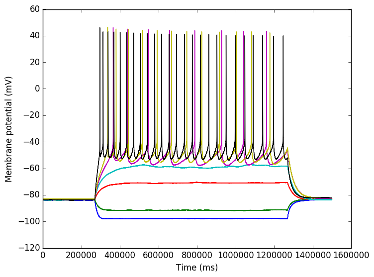</a>
</td>
<td>
<a href="spikes_479728896.png">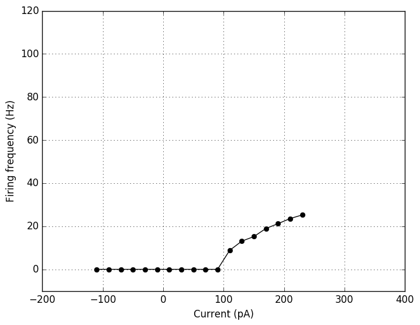</a>
</td>
<td>
<a href="subthreshold_479728896.png">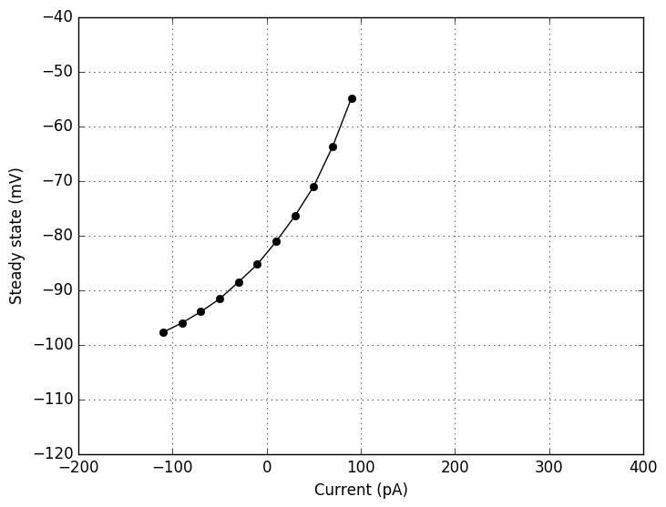</a>
</td>
</tr>
<tr>
<td width="130px">

<b>Izhikevich cell model tuned to dataset 479728896</b>

<a href="https://github.com/OpenSourceBrain/AllenInstituteNeuroML/blob/master/CellTypesDatabase/tune/tuned_cells/Izh_479728896.cell.nml">Tuned model</a>

</td>
<td>
<a href="../../../tune/tuned_cells/summary/Izh_479728896_traces.png">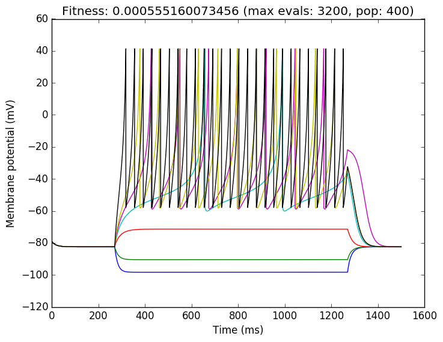</a>
</td>
<td>

</td>
<td>
<a href="../../../tune/tuned_cells/summary/Izh_479728896_iv.png">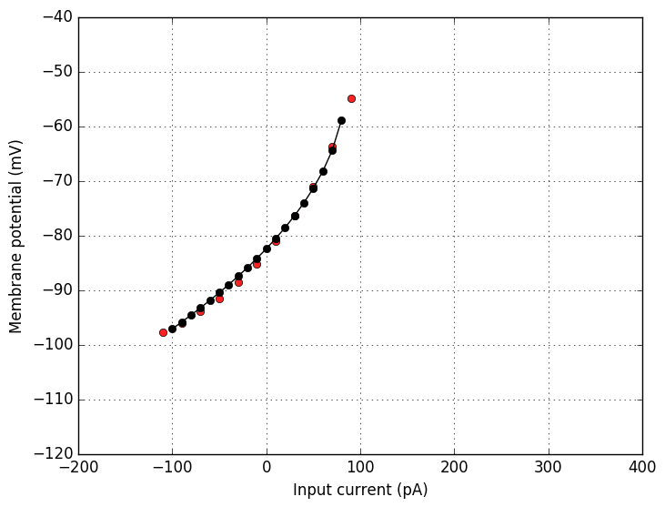</a>
</td>
</tr>
<tr>
<td width="130px">

<b>HH cell model tuned to dataset 479728896</b>

<a href="https://github.com/OpenSourceBrain/AllenInstituteNeuroML/blob/master/CellTypesDatabase/tune/tuned_cells/HH_479728896.cell.nml">Tuned model</a>

</td>
<td>

</td>
<td>
<a href="../../../tune/tuned_cells/summary/HH_479728896_if.png">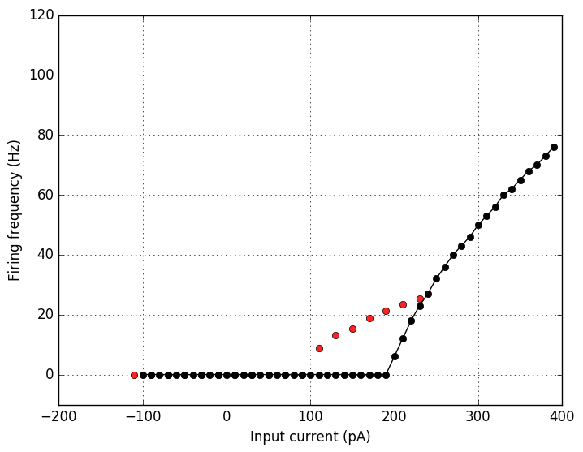</a>
</td>
<td>
<a href="../../../tune/tuned_cells/summary/HH_479728896_iv.png">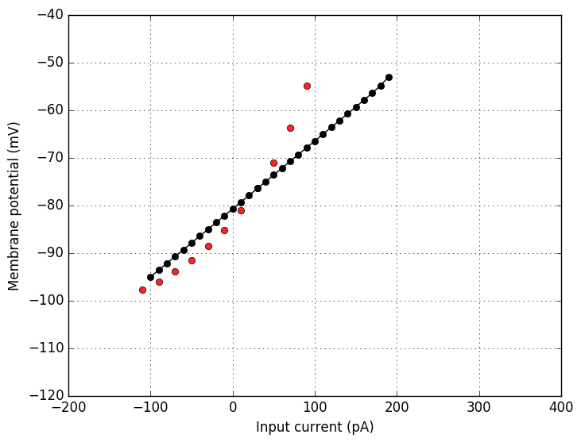</a>
</td>
</tr>
</table>  
 
<table border="1">
<tr>
<td width="130px">

<b>479770916</b>

Anteromedial visual area, layer 5

spiny

Rorb-IRES2-Cre

<a href="http://celltypes.brain-map.org/mouse/experiment/electrophysiology/479770916">Source data</a>

</td>
<td>
<a href="traces_479770916.png">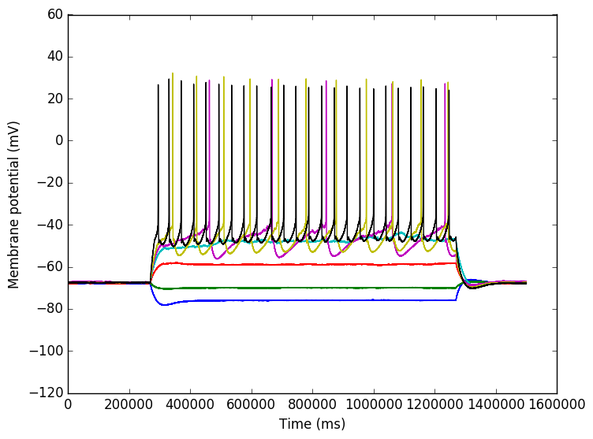</a>
</td>
<td>
<a href="spikes_479770916.png">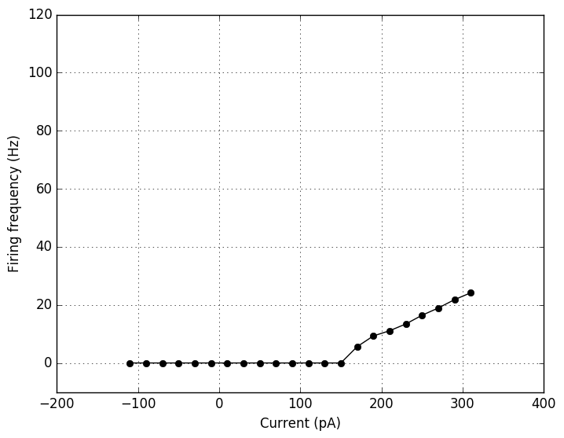</a>
</td>
<td>
<a href="subthreshold_479770916.png">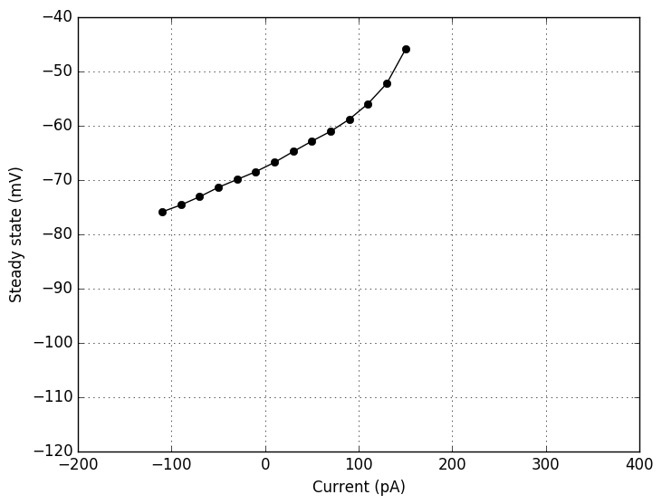</a>
</td>
</tr>
<tr>
<td width="130px">

<b>Izhikevich cell model tuned to dataset 479770916</b>

<a href="https://github.com/OpenSourceBrain/AllenInstituteNeuroML/blob/master/CellTypesDatabase/tune/tuned_cells/Izh_479770916.cell.nml">Tuned model</a>

</td>
<td>
<a href="../../../tune/tuned_cells/summary/Izh_479770916_traces.png">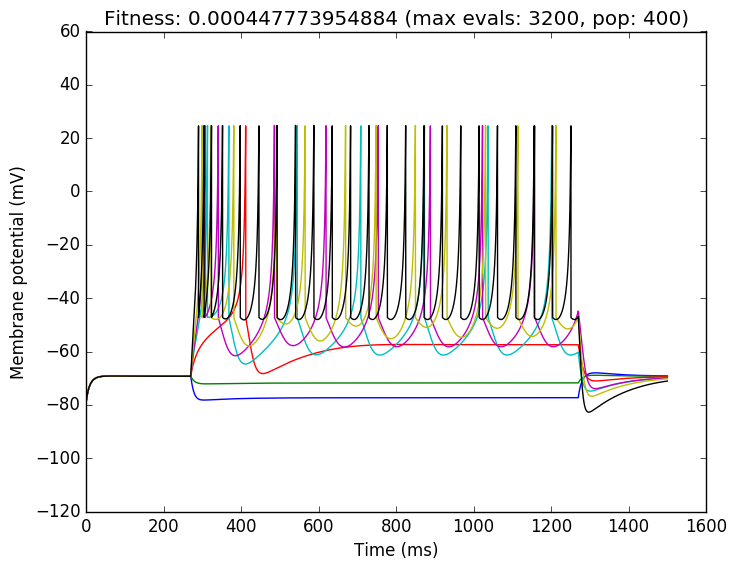</a>
</td>
<td>
<a href="../../../tune/tuned_cells/summary/Izh_479770916_if.png">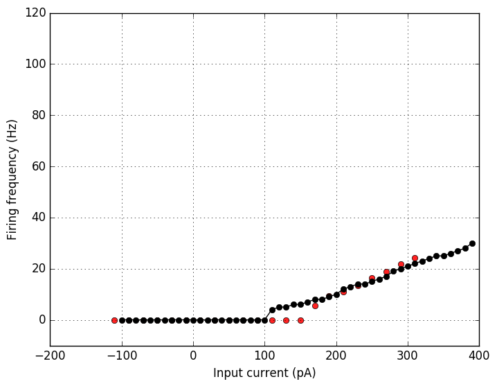</a>
</td>
<td>
<a href="../../../tune/tuned_cells/summary/Izh_479770916_iv.png">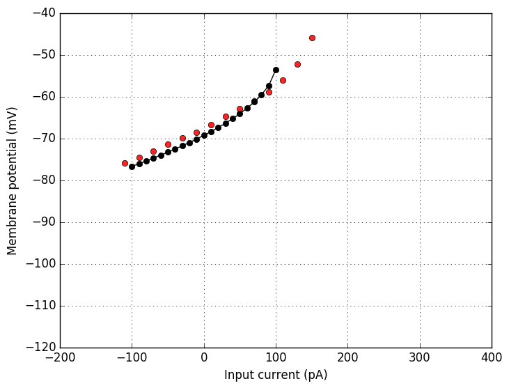</a>
</td>
</tr>
<tr>
<td width="130px">

<b>HH cell model tuned to dataset 479770916</b>

<a href="https://github.com/OpenSourceBrain/AllenInstituteNeuroML/blob/master/CellTypesDatabase/tune/tuned_cells/HH_479770916.cell.nml">Tuned model</a>

</td>
<td>

</td>
<td>
<a href="../../../tune/tuned_cells/summary/HH_479770916_if.png">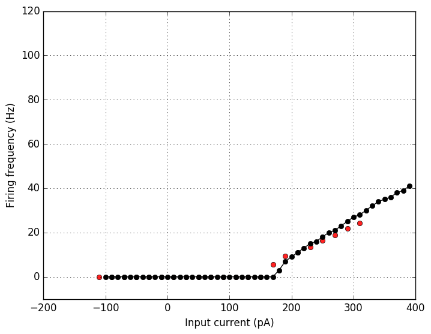</a>
</td>
<td>
<a href="../../../tune/tuned_cells/summary/HH_479770916_iv.png">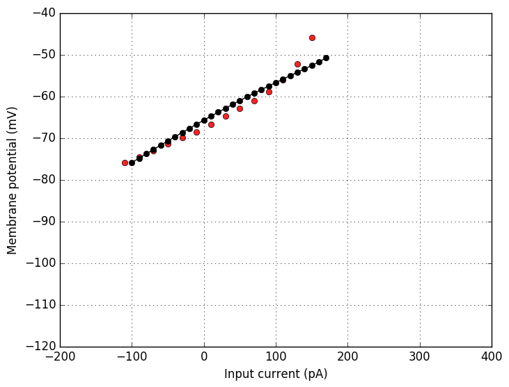</a>
</td>
</tr>
</table>  
 
<table border="1">
<tr>
<td width="130px">

<b>480124551</b>

Primary visual area, layer 4

spiny

Rorb-IRES2-Cre

<a href="http://celltypes.brain-map.org/mouse/experiment/electrophysiology/480124551">Source data</a>

</td>
<td>
<a href="traces_480124551.png">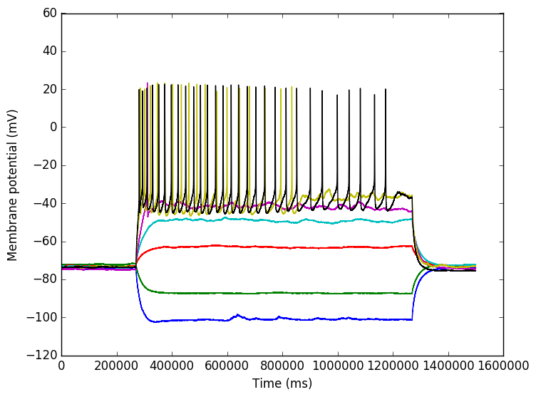</a>
</td>
<td>
<a href="spikes_480124551.png">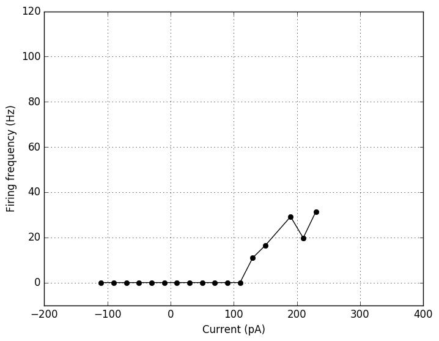</a>
</td>
<td>
<a href="subthreshold_480124551.png">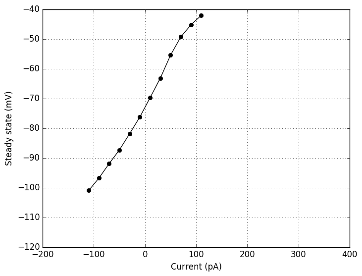</a>
</td>
</tr>
<tr>
<td width="130px">

<b>Izhikevich cell model tuned to dataset 480124551</b>

<a href="https://github.com/OpenSourceBrain/AllenInstituteNeuroML/blob/master/CellTypesDatabase/tune/tuned_cells/Izh_480124551.cell.nml">Tuned model</a>

</td>
<td>

</td>
<td>

</td>
<td>

</td>
</tr>
<tr>
<td width="130px">

<b>HH cell model tuned to dataset 480124551</b>

<a href="https://github.com/OpenSourceBrain/AllenInstituteNeuroML/blob/master/CellTypesDatabase/tune/tuned_cells/HH_480124551.cell.nml">Tuned model</a>

</td>
<td>

</td>
<td>

</td>
<td>

</td>
</tr>
</table>  
 
<table border="1">
<tr>
<td width="130px">

<b>480169178</b>

Primary visual area, layer 5

spiny

Rorb-IRES2-Cre

<a href="http://celltypes.brain-map.org/mouse/experiment/electrophysiology/480169178">Source data</a>

</td>
<td>
<a href="traces_480169178.png">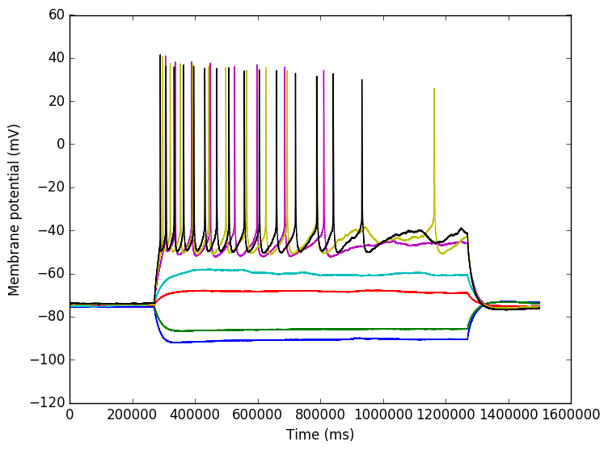</a>
</td>
<td>

</td>
<td>
<a href="subthreshold_480169178.png">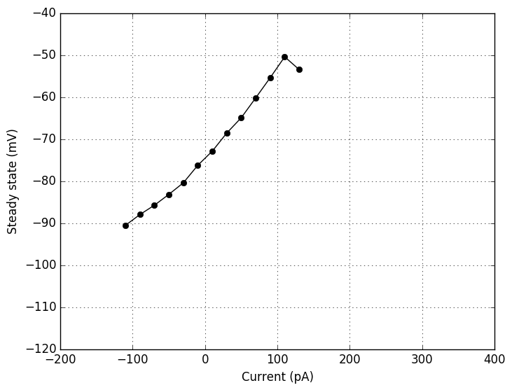</a>
</td>
</tr>
<tr>
<td width="130px">

<b>Izhikevich cell model tuned to dataset 480169178</b>

<a href="https://github.com/OpenSourceBrain/AllenInstituteNeuroML/blob/master/CellTypesDatabase/tune/tuned_cells/Izh_480169178.cell.nml">Tuned model</a>

</td>
<td>
<a href="../../../tune/tuned_cells/summary/Izh_480169178_traces.png">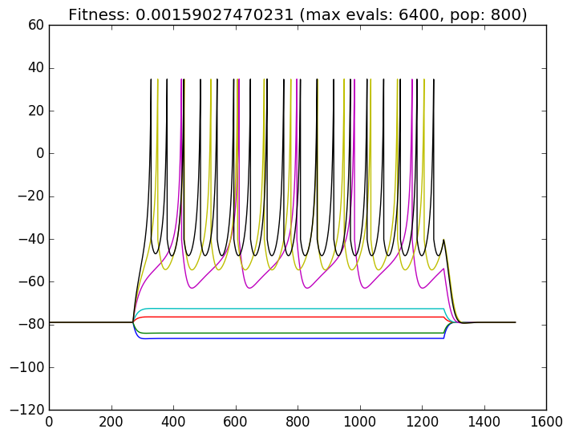</a>
</td>
<td>
<a href="../../../tune/tuned_cells/summary/Izh_480169178_if.png">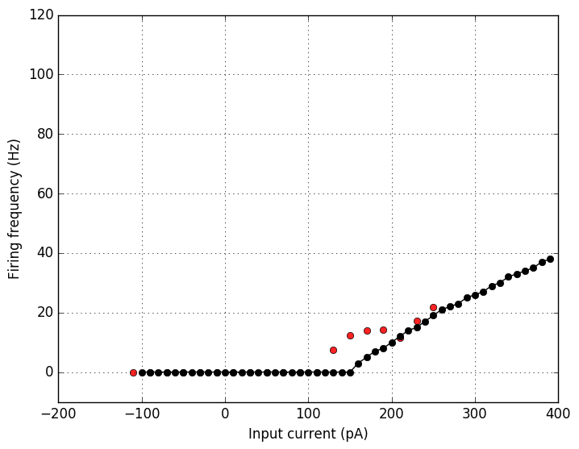</a>
</td>
<td>

</td>
</tr>
<tr>
<td width="130px">

<b>HH cell model tuned to dataset 480169178</b>

<a href="https://github.com/OpenSourceBrain/AllenInstituteNeuroML/blob/master/CellTypesDatabase/tune/tuned_cells/HH_480169178.cell.nml">Tuned model</a>

</td>
<td>

</td>
<td>
<a href="../../../tune/tuned_cells/summary/HH_480169178_if.png">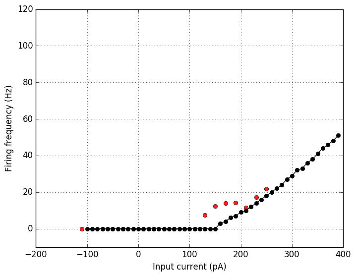</a>
</td>
<td>
<a href="../../../tune/tuned_cells/summary/HH_480169178_iv.png">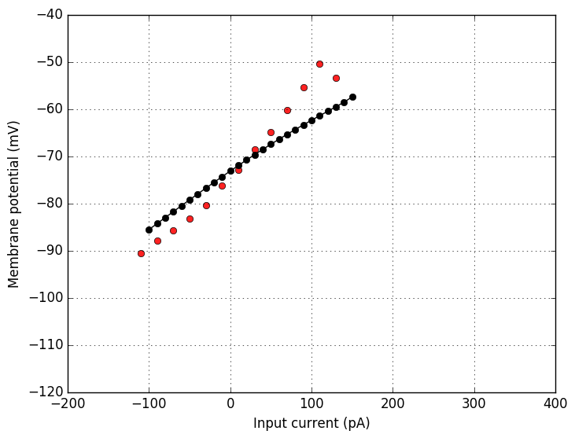</a>
</td>
</tr>
</table>  
 
<table border="1">
<tr>
<td width="130px">

<b>480351780</b>

Primary visual area, layer 5

spiny

Rorb-IRES2-Cre

<a href="http://celltypes.brain-map.org/mouse/experiment/electrophysiology/480351780">Source data</a>

</td>
<td>
<a href="traces_480351780.png">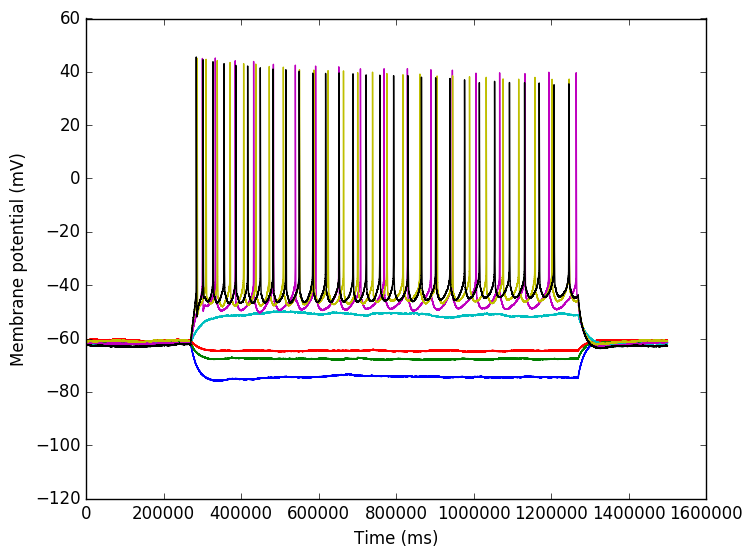</a>
</td>
<td>
<a href="spikes_480351780.png">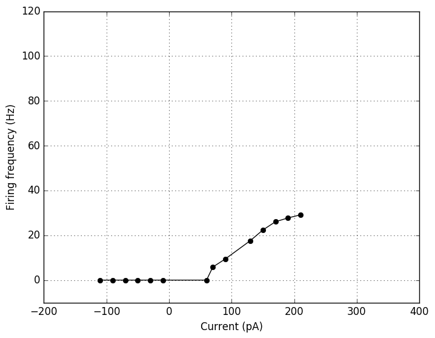</a>
</td>
<td>
<a href="subthreshold_480351780.png">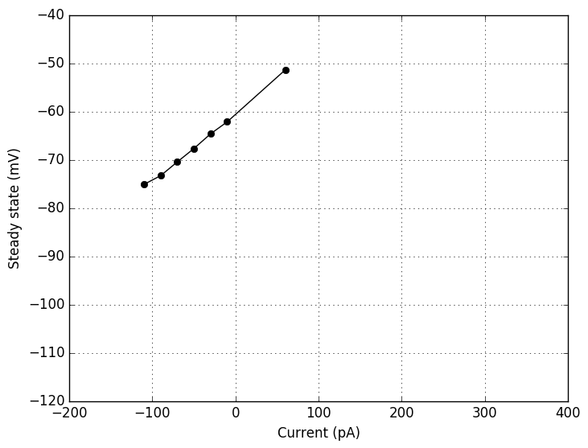</a>
</td>
</tr>
<tr>
<td width="130px">

<b>Izhikevich cell model tuned to dataset 480351780</b>

<a href="https://github.com/OpenSourceBrain/AllenInstituteNeuroML/blob/master/CellTypesDatabase/tune/tuned_cells/Izh_480351780.cell.nml">Tuned model</a>

</td>
<td>

</td>
<td>

</td>
<td>

</td>
</tr>
<tr>
<td width="130px">

<b>HH cell model tuned to dataset 480351780</b>

<a href="https://github.com/OpenSourceBrain/AllenInstituteNeuroML/blob/master/CellTypesDatabase/tune/tuned_cells/HH_480351780.cell.nml">Tuned model</a>

</td>
<td>
<a href="../../../tune/tuned_cells/summary/HH_480351780_traces.png">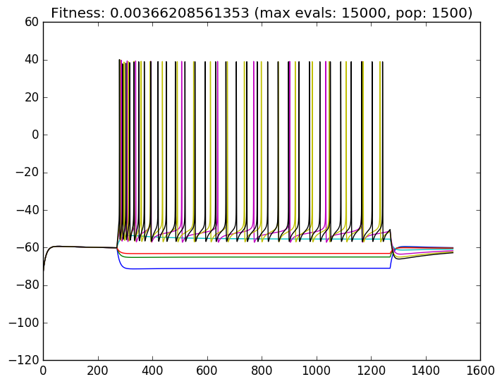</a>
</td>
<td>

</td>
<td>
<a href="../../../tune/tuned_cells/summary/HH_480351780_iv.png">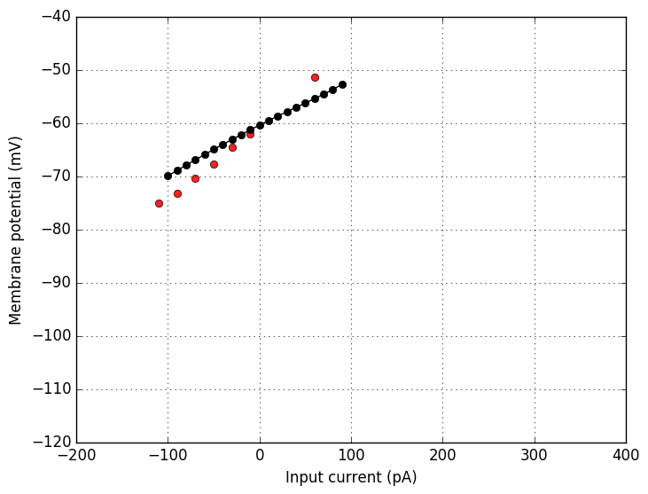</a>
</td>
</tr>
</table>  
 
<table border="1">
<tr>
<td width="130px">

<b>480353286</b>

Primary visual area, layer 5

spiny

Rorb-IRES2-Cre

<a href="http://celltypes.brain-map.org/mouse/experiment/electrophysiology/480353286">Source data</a>

</td>
<td>
<a href="traces_480353286.png">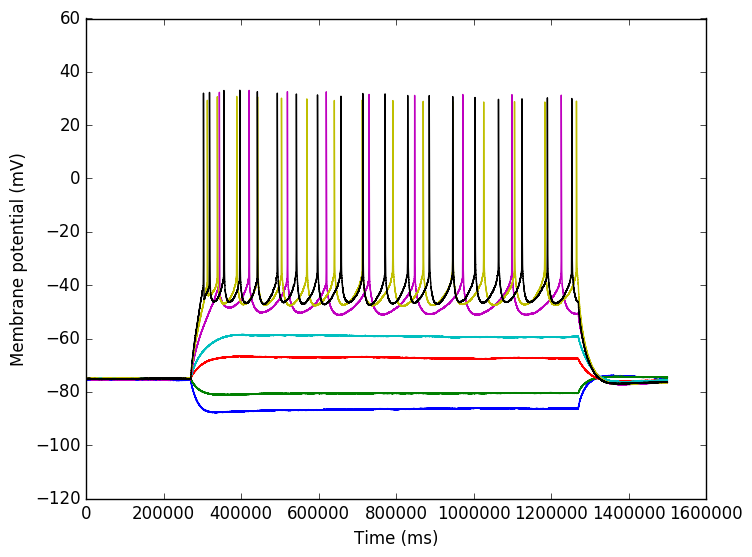</a>
</td>
<td>
<a href="spikes_480353286.png">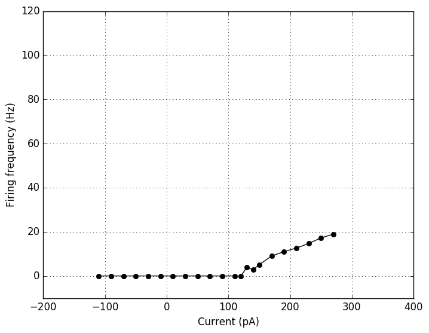</a>
</td>
<td>
<a href="subthreshold_480353286.png">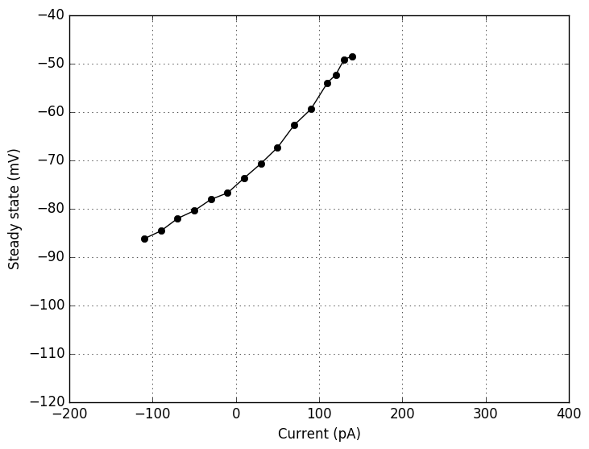</a>
</td>
</tr>
<tr>
<td width="130px">

<b>Izhikevich cell model tuned to dataset 480353286</b>

<a href="https://github.com/OpenSourceBrain/AllenInstituteNeuroML/blob/master/CellTypesDatabase/tune/tuned_cells/Izh_480353286.cell.nml">Tuned model</a>

</td>
<td>

</td>
<td>

</td>
<td>

</td>
</tr>
<tr>
<td width="130px">

<b>HH cell model tuned to dataset 480353286</b>

<a href="https://github.com/OpenSourceBrain/AllenInstituteNeuroML/blob/master/CellTypesDatabase/tune/tuned_cells/HH_480353286.cell.nml">Tuned model</a>

</td>
<td>

</td>
<td>

</td>
<td>

</td>
</tr>
</table>  
 
<table border="1">
<tr>
<td width="130px">

<b>483101699</b>

Lateral visual area, layer 4

spiny

Cux2-CreERT2

<a href="http://celltypes.brain-map.org/mouse/experiment/electrophysiology/483101699">Source data</a>

</td>
<td>
<a href="traces_483101699.png">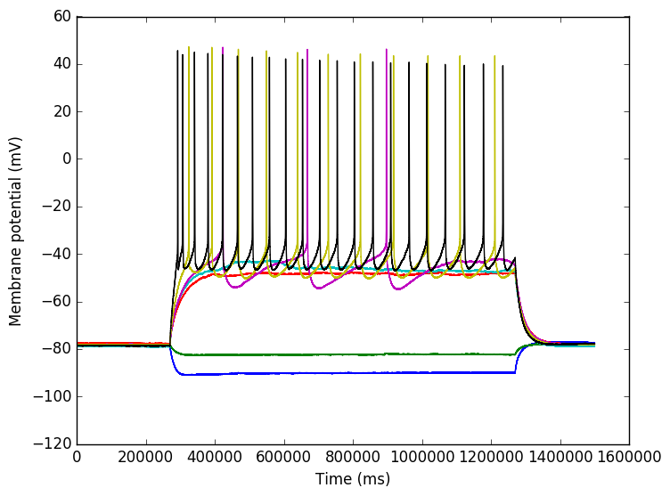</a>
</td>
<td>
<a href="spikes_483101699.png">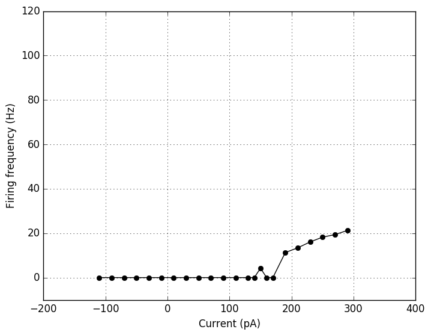</a>
</td>
<td>
<a href="subthreshold_483101699.png">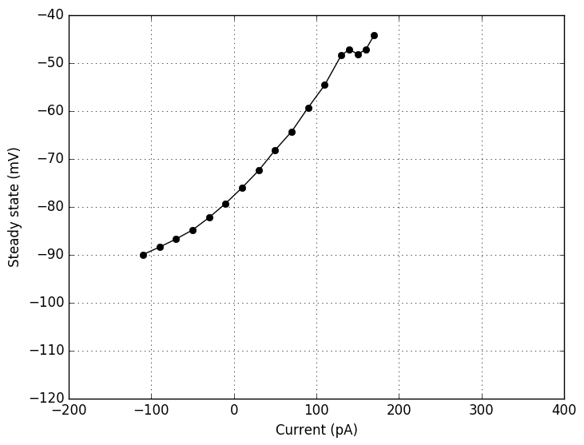</a>
</td>
</tr>
<tr>
<td width="130px">

<b>Izhikevich cell model tuned to dataset 483101699</b>

<a href="https://github.com/OpenSourceBrain/AllenInstituteNeuroML/blob/master/CellTypesDatabase/tune/tuned_cells/Izh_483101699.cell.nml">Tuned model</a>

</td>
<td>
<a href="../../../tune/tuned_cells/summary/Izh_483101699_traces.png">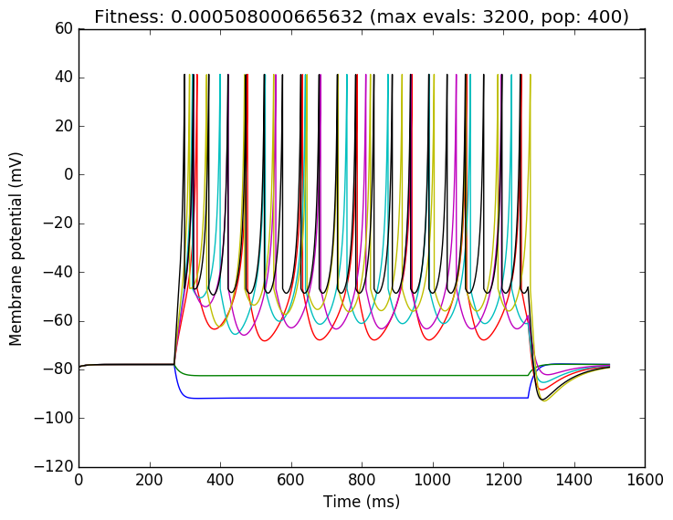</a>
</td>
<td>
<a href="../../../tune/tuned_cells/summary/Izh_483101699_if.png">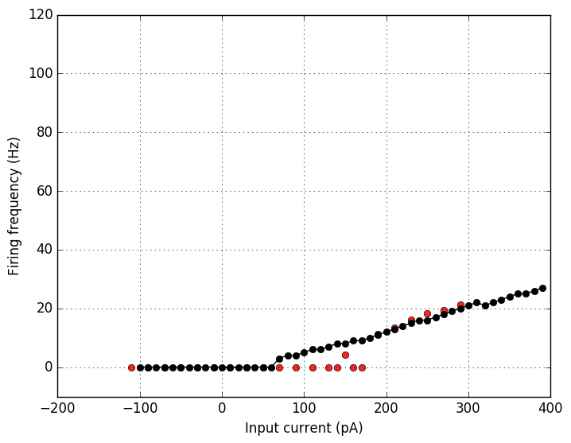</a>
</td>
<td>
<a href="../../../tune/tuned_cells/summary/Izh_483101699_iv.png">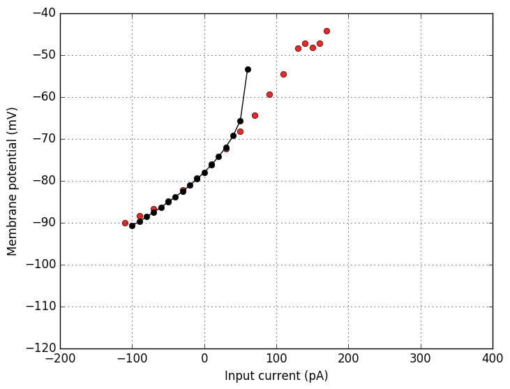</a>
</td>
</tr>
<tr>
<td width="130px">

<b>HH cell model tuned to dataset 483101699</b>

<a href="https://github.com/OpenSourceBrain/AllenInstituteNeuroML/blob/master/CellTypesDatabase/tune/tuned_cells/HH_483101699.cell.nml">Tuned model</a>

</td>
<td>

</td>
<td>

</td>
<td>
<a href="../../../tune/tuned_cells/summary/HH_483101699_iv.png">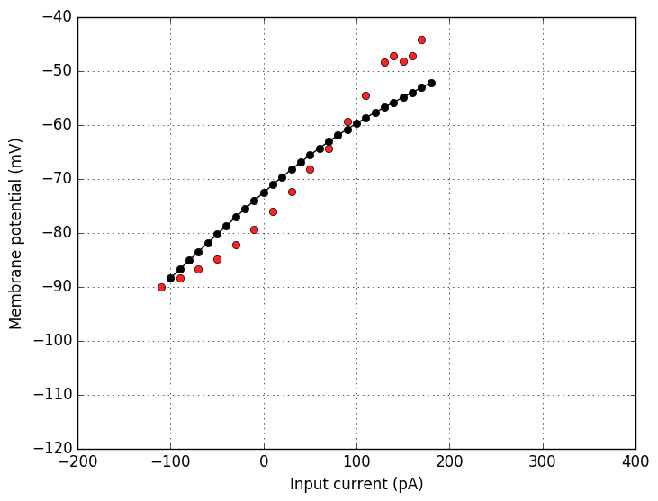</a>
</td>
</tr>
</table>  
 
<table border="1">
<tr>
<td width="130px">

<b>484559000</b>

Primary visual area, layer 5

spiny

Rorb-IRES2-Cre

<a href="http://celltypes.brain-map.org/mouse/experiment/electrophysiology/484559000">Source data</a>

</td>
<td>
<a href="traces_484559000.png">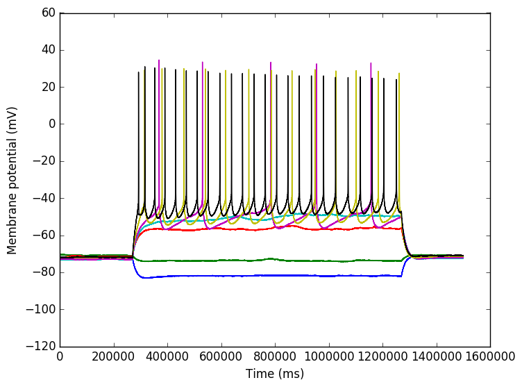</a>
</td>
<td>
<a href="spikes_484559000.png">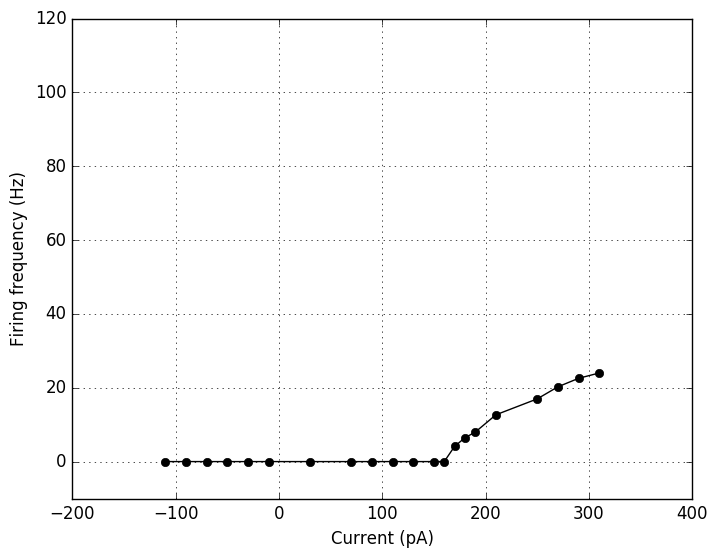</a>
</td>
<td>
<a href="subthreshold_484559000.png">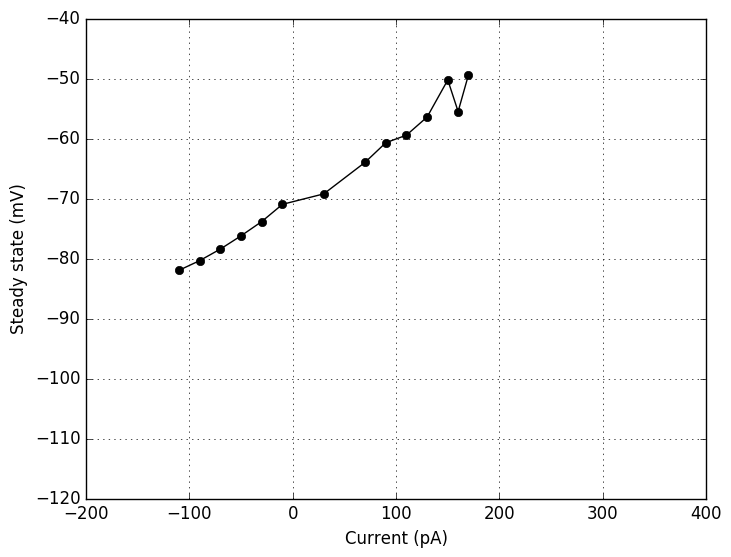</a>
</td>
</tr>
<tr>
<td width="130px">

<b>Izhikevich cell model tuned to dataset 484559000</b>

<a href="https://github.com/OpenSourceBrain/AllenInstituteNeuroML/blob/master/CellTypesDatabase/tune/tuned_cells/Izh_484559000.cell.nml">Tuned model</a>

</td>
<td>
<a href="../../../tune/tuned_cells/summary/Izh_484559000_traces.png">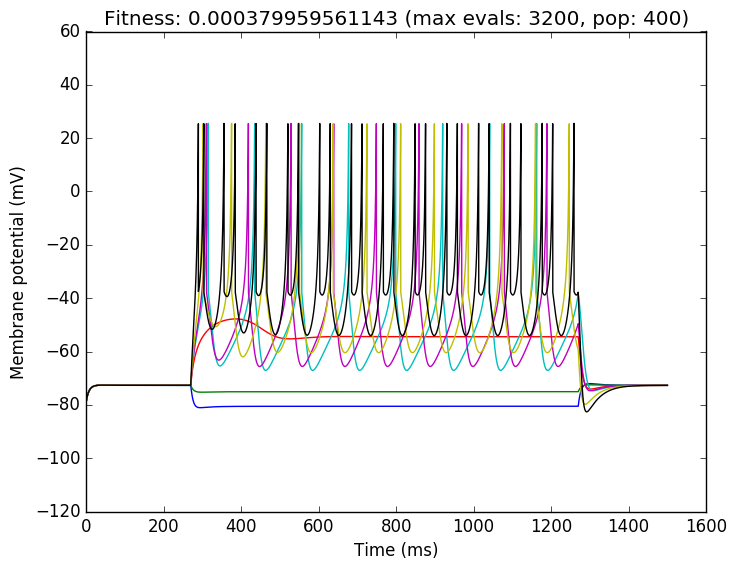</a>
</td>
<td>
<a href="../../../tune/tuned_cells/summary/Izh_484559000_if.png">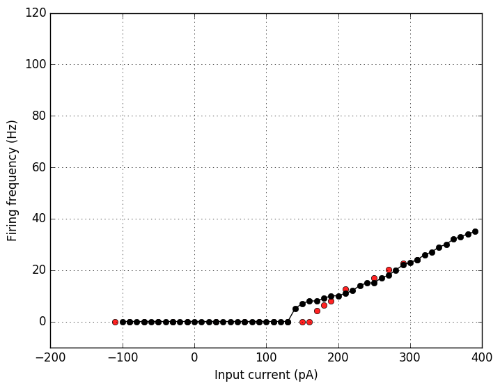</a>
</td>
<td>
<a href="../../../tune/tuned_cells/summary/Izh_484559000_iv.png">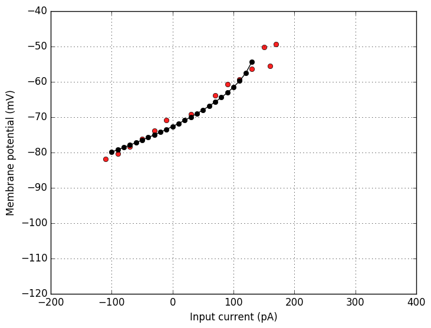</a>
</td>
</tr>
<tr>
<td width="130px">

<b>HH cell model tuned to dataset 484559000</b>

<a href="https://github.com/OpenSourceBrain/AllenInstituteNeuroML/blob/master/CellTypesDatabase/tune/tuned_cells/HH_484559000.cell.nml">Tuned model</a>

</td>
<td>

</td>
<td>
<a href="../../../tune/tuned_cells/summary/HH_484559000_if.png">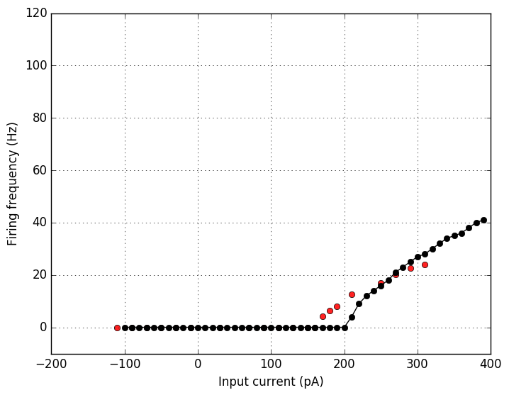</a>
</td>
<td>
<a href="../../../tune/tuned_cells/summary/HH_484559000_iv.png">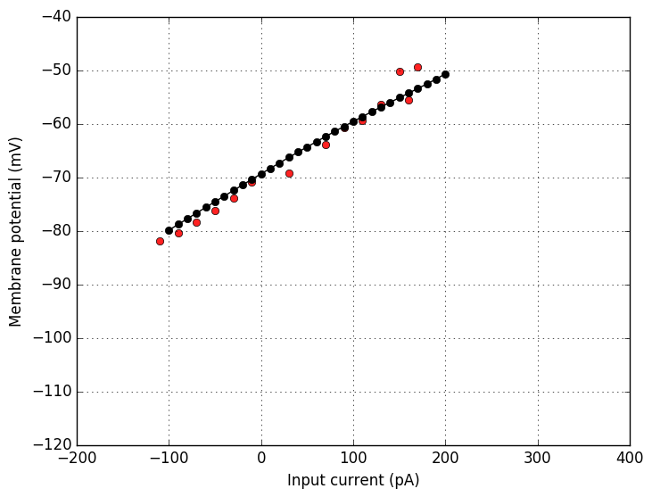</a>
</td>
</tr>
</table>  
 
<table border="1">
<tr>
<td width="130px">

<b>484635029</b>

Primary visual area, layer 2/3

aspiny

Pvalb-IRES-Cre

<a href="http://celltypes.brain-map.org/mouse/experiment/electrophysiology/484635029">Source data</a>

</td>
<td>
<a href="traces_484635029.png">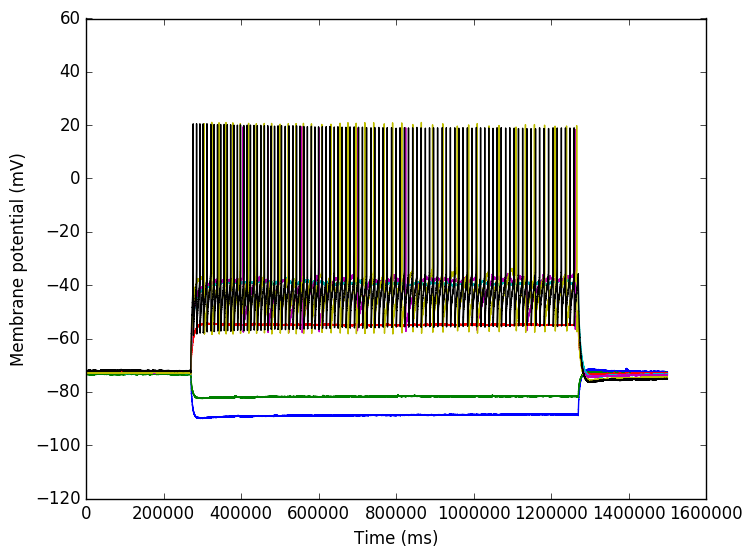</a>
</td>
<td>
<a href="spikes_484635029.png">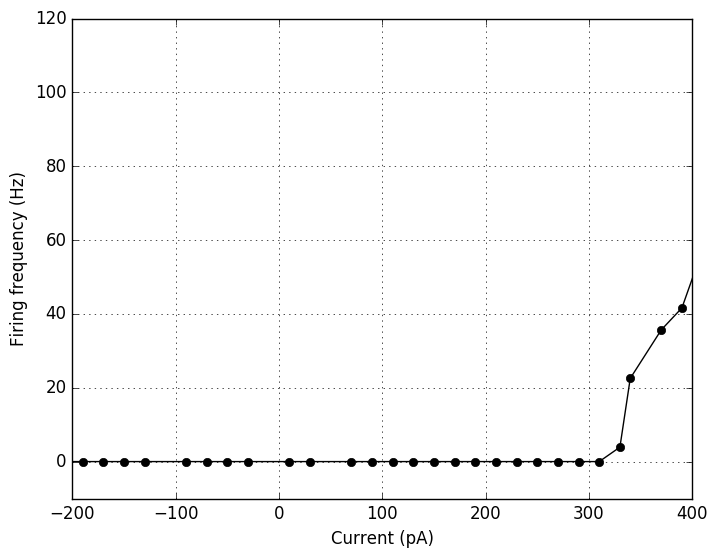</a>
</td>
<td>
<a href="subthreshold_484635029.png">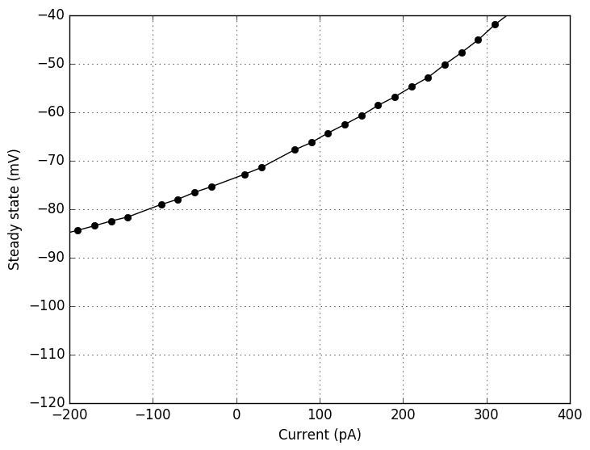</a>
</td>
</tr>
<tr>
<td width="130px">

<b>Izhikevich cell model tuned to dataset 484635029</b>

<a href="https://github.com/OpenSourceBrain/AllenInstituteNeuroML/blob/master/CellTypesDatabase/tune/tuned_cells/Izh_484635029.cell.nml">Tuned model</a>

</td>
<td>
<a href="../../../tune/tuned_cells/summary/Izh_484635029_traces.png">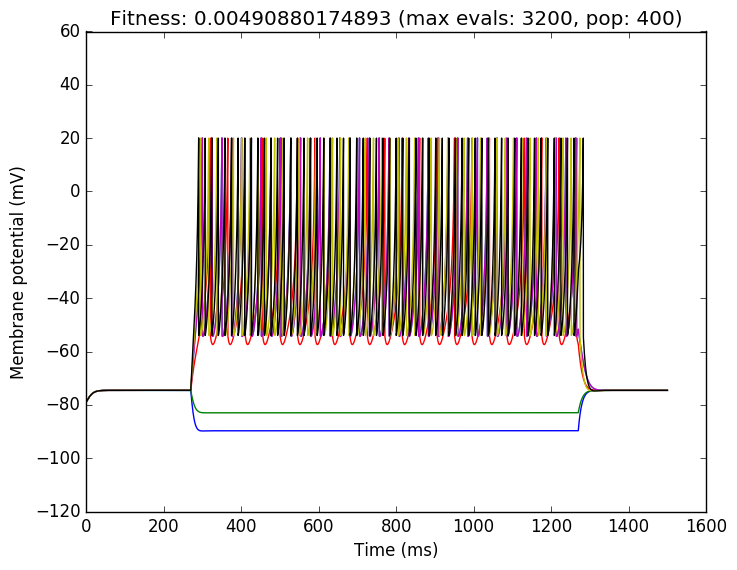</a>
</td>
<td>
<a href="../../../tune/tuned_cells/summary/Izh_484635029_if.png">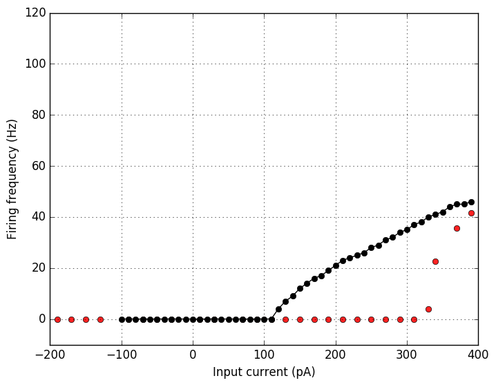</a>
</td>
<td>

</td>
</tr>
<tr>
<td width="130px">

<b>HH cell model tuned to dataset 484635029</b>

<a href="https://github.com/OpenSourceBrain/AllenInstituteNeuroML/blob/master/CellTypesDatabase/tune/tuned_cells/HH_484635029.cell.nml">Tuned model</a>

</td>
<td>
<a href="../../../tune/tuned_cells/summary/HH_484635029_traces.png">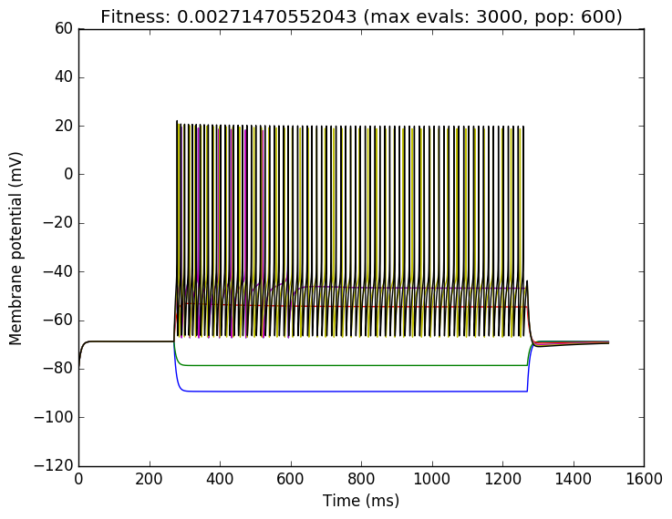</a>
</td>
<td>
<a href="../../../tune/tuned_cells/summary/HH_484635029_if.png">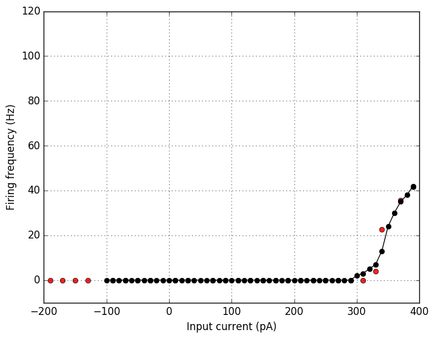</a>
</td>
<td>
<a href="../../../tune/tuned_cells/summary/HH_484635029_iv.png">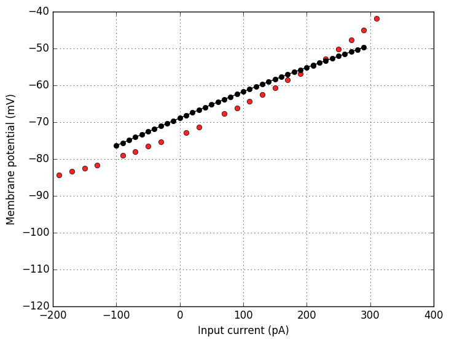</a>
</td>
</tr>
</table>  
 
<table border="1">
<tr>
<td width="130px">

<b>484679812</b>

Primary visual area, layer 4

spiny

Rorb-IRES2-Cre

<a href="http://celltypes.brain-map.org/mouse/experiment/electrophysiology/484679812">Source data</a>

</td>
<td>
<a href="traces_484679812.png">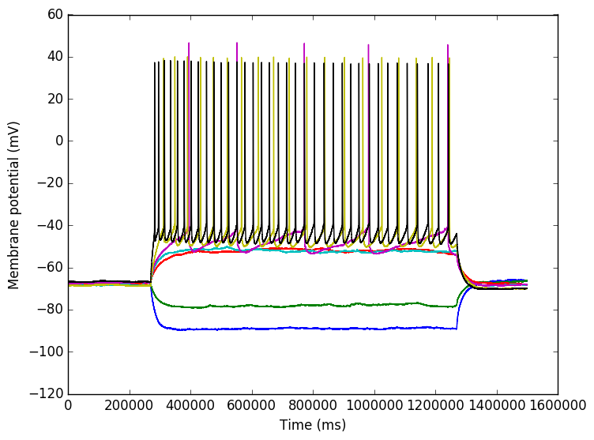</a>
</td>
<td>
<a href="spikes_484679812.png">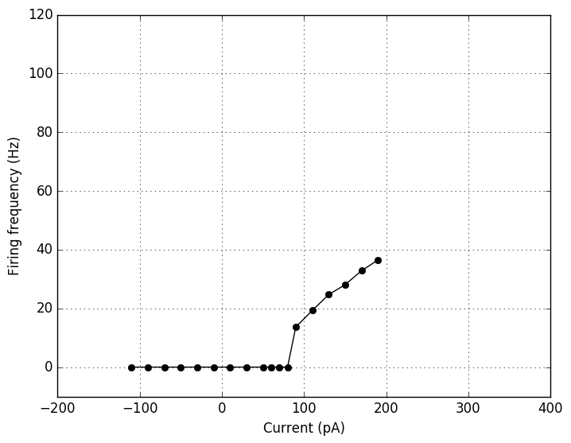</a>
</td>
<td>
<a href="subthreshold_484679812.png">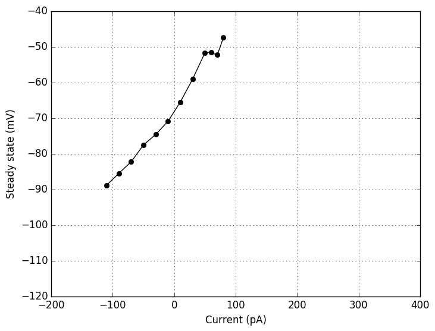</a>
</td>
</tr>
<tr>
<td width="130px">

<b>Izhikevich cell model tuned to dataset 484679812</b>

<a href="https://github.com/OpenSourceBrain/AllenInstituteNeuroML/blob/master/CellTypesDatabase/tune/tuned_cells/Izh_484679812.cell.nml">Tuned model</a>

</td>
<td>
<a href="../../../tune/tuned_cells/summary/Izh_484679812_traces.png">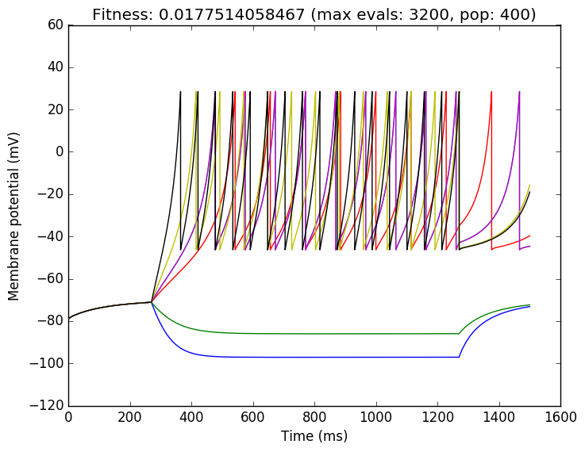</a>
</td>
<td>
<a href="../../../tune/tuned_cells/summary/Izh_484679812_if.png">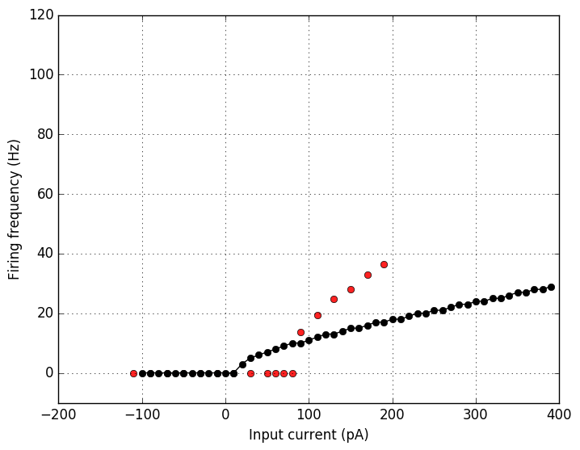</a>
</td>
<td>
<a href="../../../tune/tuned_cells/summary/Izh_484679812_iv.png">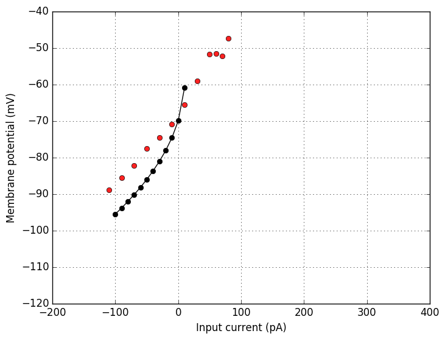</a>
</td>
</tr>
<tr>
<td width="130px">

<b>HH cell model tuned to dataset 484679812</b>

<a href="https://github.com/OpenSourceBrain/AllenInstituteNeuroML/blob/master/CellTypesDatabase/tune/tuned_cells/HH_484679812.cell.nml">Tuned model</a>

</td>
<td>
<a href="../../../tune/tuned_cells/summary/HH_484679812_traces.png">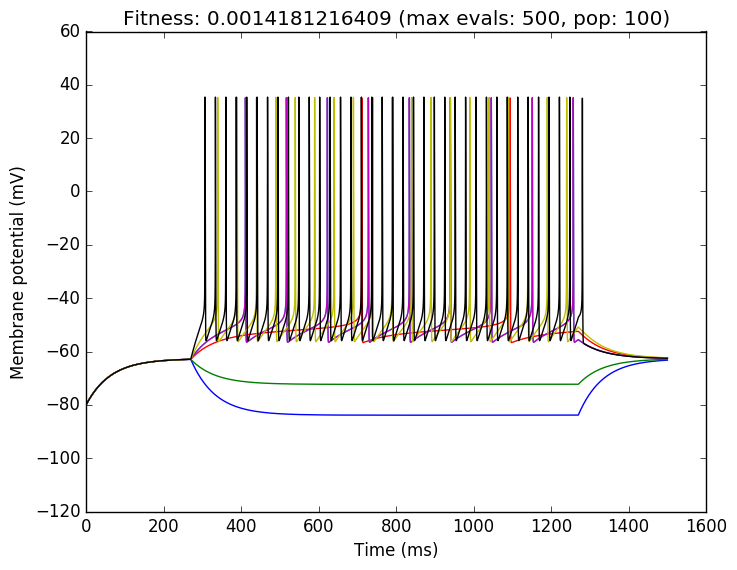</a>
</td>
<td>
<a href="../../../tune/tuned_cells/summary/HH_484679812_if.png">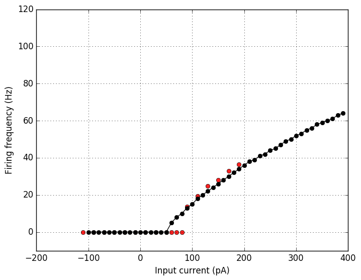</a>
</td>
<td>
<a href="../../../tune/tuned_cells/summary/HH_484679812_iv.png">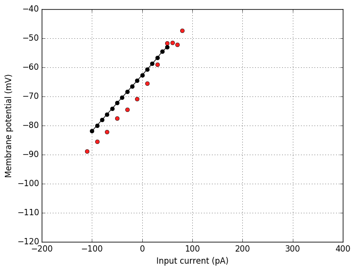</a>
</td>
</tr>
</table>  
 
<table border="1">
<tr>
<td width="130px">

<b>484742372</b>

Primary visual area, layer 5

aspiny

Pvalb-IRES-Cre

<a href="http://celltypes.brain-map.org/mouse/experiment/electrophysiology/484742372">Source data</a>

</td>
<td>
<a href="traces_484742372.png">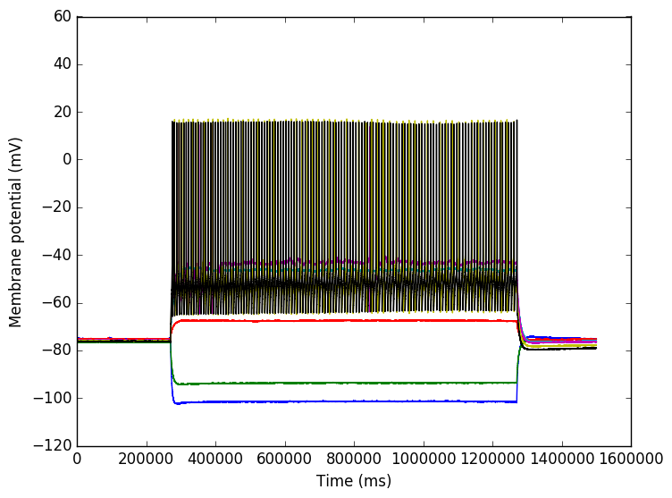</a>
</td>
<td>
<a href="spikes_484742372.png">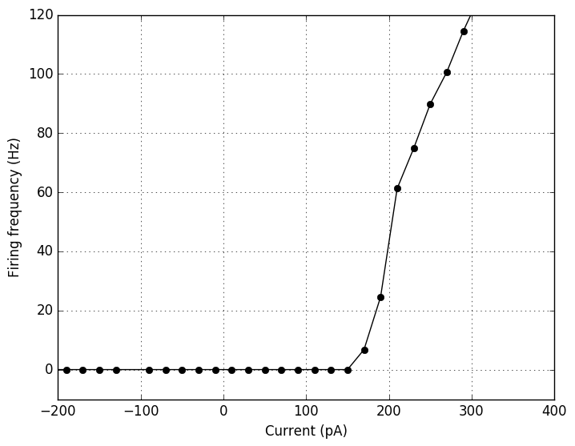</a>
</td>
<td>
<a href="subthreshold_484742372.png">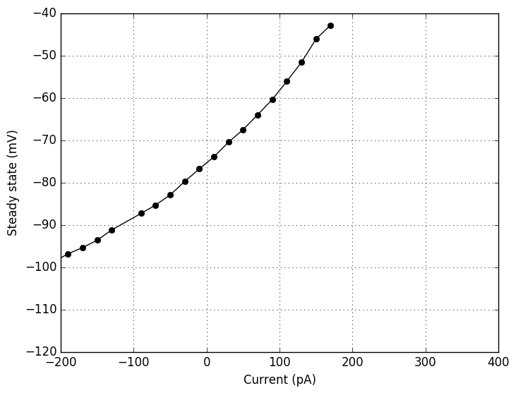</a>
</td>
</tr>
<tr>
<td width="130px">

<b>Izhikevich cell model tuned to dataset 484742372</b>

<a href="https://github.com/OpenSourceBrain/AllenInstituteNeuroML/blob/master/CellTypesDatabase/tune/tuned_cells/Izh_484742372.cell.nml">Tuned model</a>

</td>
<td>
<a href="../../../tune/tuned_cells/summary/Izh_484742372_traces.png">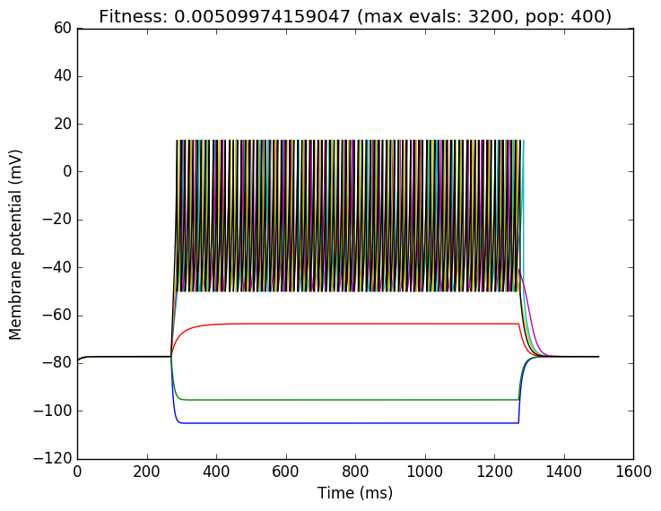</a>
</td>
<td>
<a href="../../../tune/tuned_cells/summary/Izh_484742372_if.png">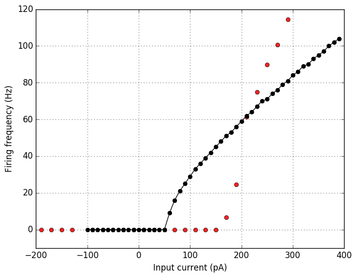</a>
</td>
<td>

</td>
</tr>
<tr>
<td width="130px">

<b>HH cell model tuned to dataset 484742372</b>

<a href="https://github.com/OpenSourceBrain/AllenInstituteNeuroML/blob/master/CellTypesDatabase/tune/tuned_cells/HH_484742372.cell.nml">Tuned model</a>

</td>
<td>

</td>
<td>
<a href="../../../tune/tuned_cells/summary/HH_484742372_if.png">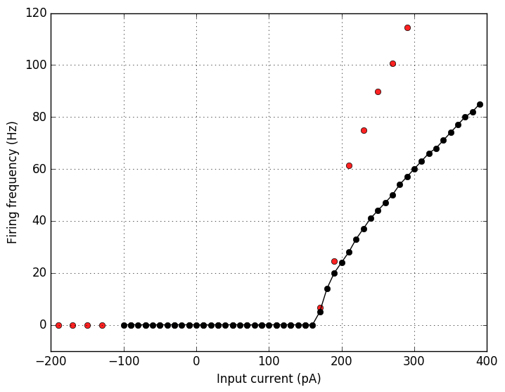</a>
</td>
<td>
<a href="../../../tune/tuned_cells/summary/HH_484742372_iv.png">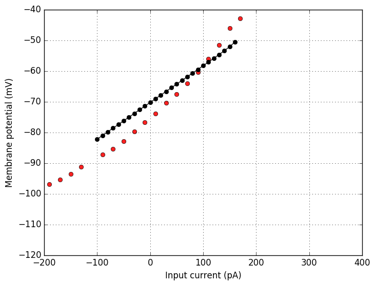</a>
</td>
</tr>
</table>  
 
<table border="1">
<tr>
<td width="130px">

<b>485058595</b>

Primary visual area, layer 4

aspiny

Sst-IRES-Cre

<a href="http://celltypes.brain-map.org/mouse/experiment/electrophysiology/485058595">Source data</a>

</td>
<td>
<a href="traces_485058595.png">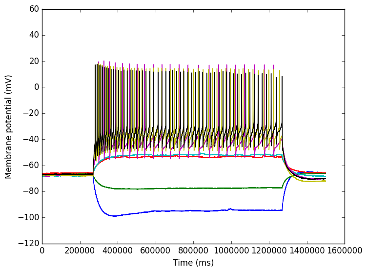</a>
</td>
<td>
<a href="spikes_485058595.png">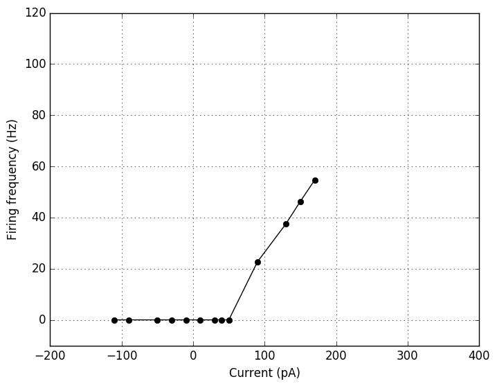</a>
</td>
<td>
<a href="subthreshold_485058595.png">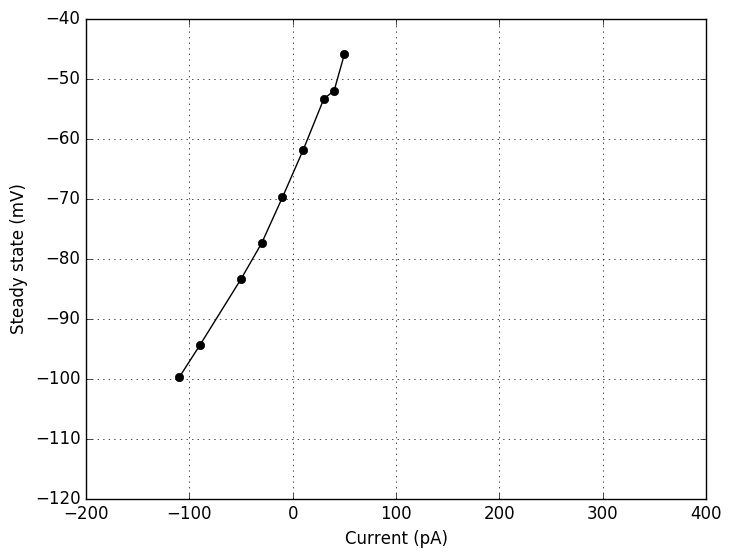</a>
</td>
</tr>
<tr>
<td width="130px">

<b>Izhikevich cell model tuned to dataset 485058595</b>

<a href="https://github.com/OpenSourceBrain/AllenInstituteNeuroML/blob/master/CellTypesDatabase/tune/tuned_cells/Izh_485058595.cell.nml">Tuned model</a>

</td>
<td>

</td>
<td>

</td>
<td>
<a href="../../../tune/tuned_cells/summary/Izh_485058595_iv.png">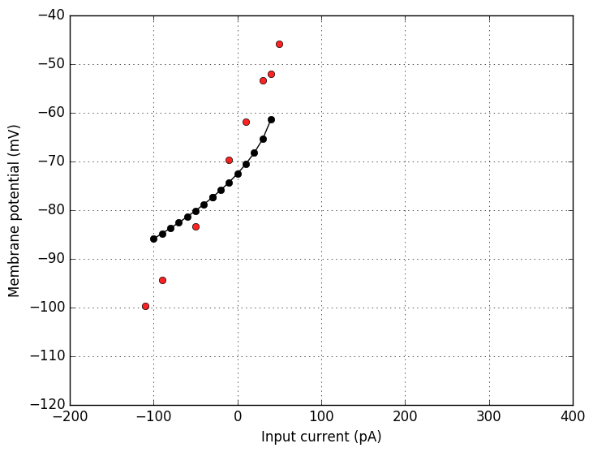</a>
</td>
</tr>
<tr>
<td width="130px">

<b>HH cell model tuned to dataset 485058595</b>

<a href="https://github.com/OpenSourceBrain/AllenInstituteNeuroML/blob/master/CellTypesDatabase/tune/tuned_cells/HH_485058595.cell.nml">Tuned model</a>

</td>
<td>

</td>
<td>

</td>
<td>

</td>
</tr>
</table>  
 
<table border="1">
<tr>
<td width="130px">

<b>485184849</b>

Primary visual area, layer 2/3

aspiny

Pvalb-IRES-Cre

<a href="http://celltypes.brain-map.org/mouse/experiment/electrophysiology/485184849">Source data</a>

</td>
<td>
<a href="traces_485184849.png">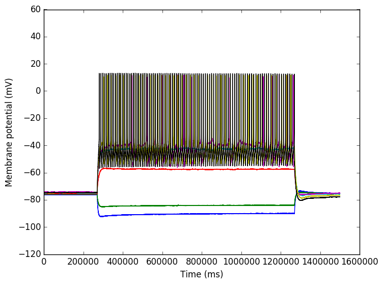</a>
</td>
<td>
<a href="spikes_485184849.png">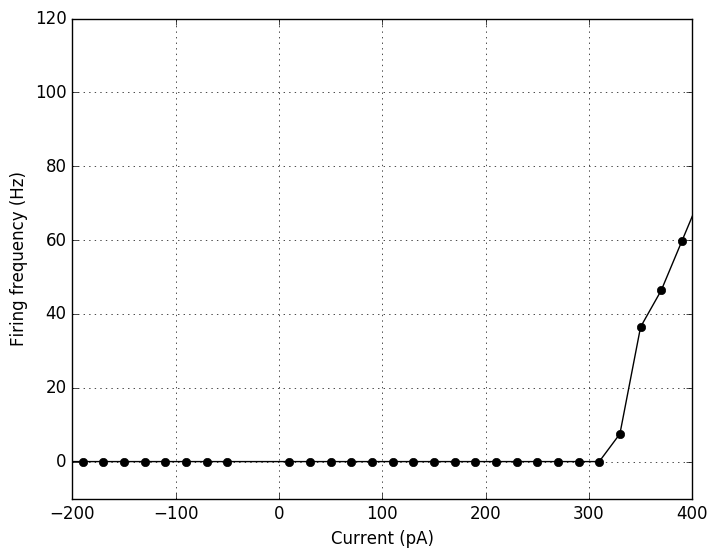</a>
</td>
<td>
<a href="subthreshold_485184849.png">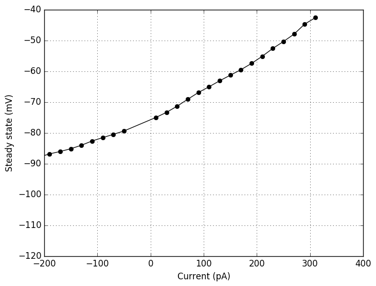</a>
</td>
</tr>
<tr>
<td width="130px">

<b>Izhikevich cell model tuned to dataset 485184849</b>

<a href="https://github.com/OpenSourceBrain/AllenInstituteNeuroML/blob/master/CellTypesDatabase/tune/tuned_cells/Izh_485184849.cell.nml">Tuned model</a>

</td>
<td>
<a href="../../../tune/tuned_cells/summary/Izh_485184849_traces.png">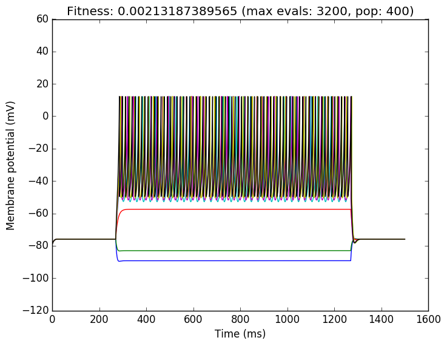</a>
</td>
<td>
<a href="../../../tune/tuned_cells/summary/Izh_485184849_if.png">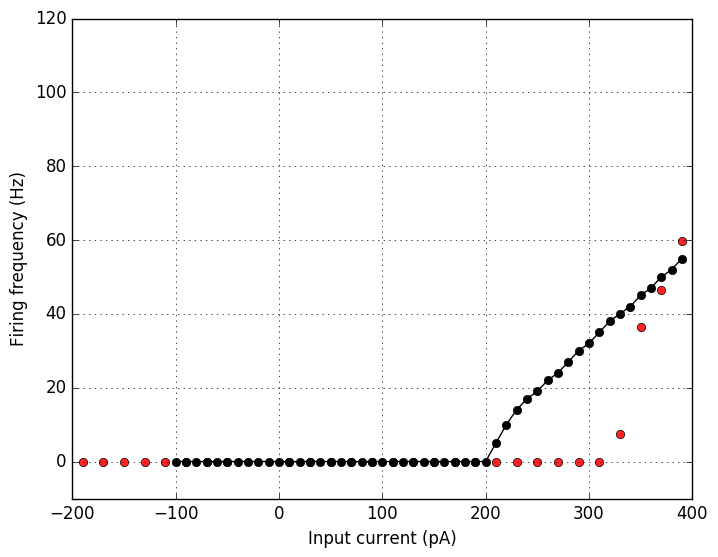</a>
</td>
<td>
<a href="../../../tune/tuned_cells/summary/Izh_485184849_iv.png">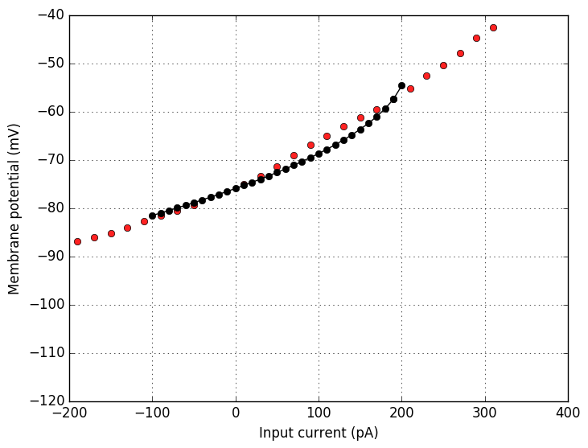</a>
</td>
</tr>
<tr>
<td width="130px">

<b>HH cell model tuned to dataset 485184849</b>

<a href="https://github.com/OpenSourceBrain/AllenInstituteNeuroML/blob/master/CellTypesDatabase/tune/tuned_cells/HH_485184849.cell.nml">Tuned model</a>

</td>
<td>
<a href="../../../tune/tuned_cells/summary/HH_485184849_traces.png">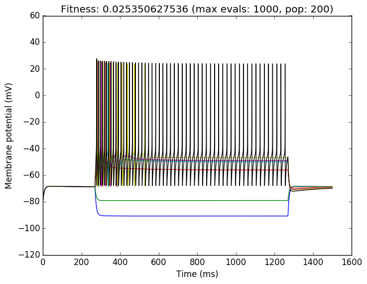</a>
</td>
<td>

</td>
<td>
<a href="../../../tune/tuned_cells/summary/HH_485184849_iv.png">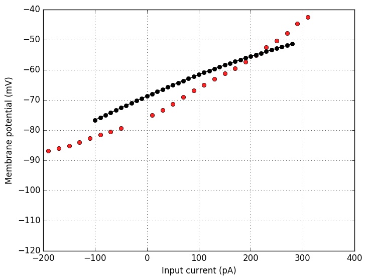</a>
</td>
</tr>
</table>  
 
<table border="1">
<tr>
<td width="130px">

<b>485468180</b>

Primary visual area, layer 2/3

spiny

Nr5a1-Cre

<a href="http://celltypes.brain-map.org/mouse/experiment/electrophysiology/485468180">Source data</a>

</td>
<td>
<a href="traces_485468180.png">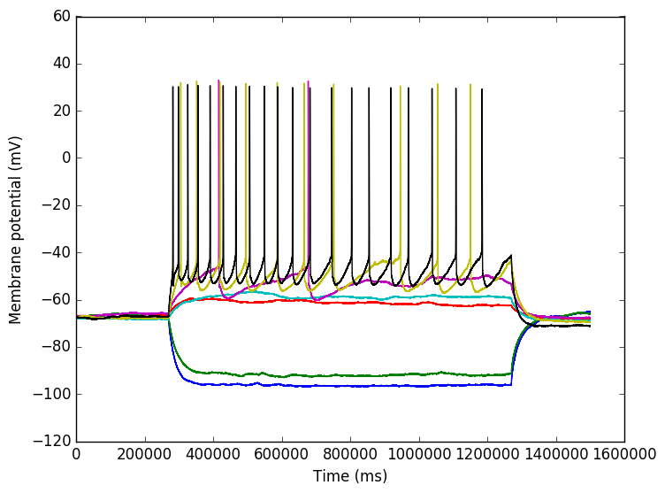</a>
</td>
<td>
<a href="spikes_485468180.png">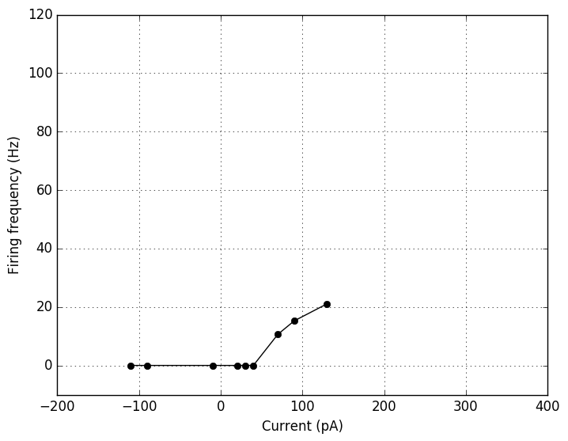</a>
</td>
<td>
<a href="subthreshold_485468180.png">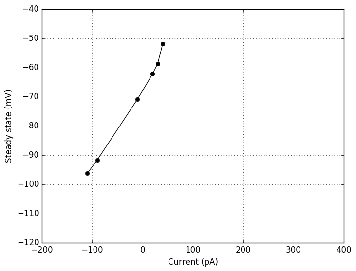</a>
</td>
</tr>
<tr>
<td width="130px">

<b>Izhikevich cell model tuned to dataset 485468180</b>

<a href="https://github.com/OpenSourceBrain/AllenInstituteNeuroML/blob/master/CellTypesDatabase/tune/tuned_cells/Izh_485468180.cell.nml">Tuned model</a>

</td>
<td>

</td>
<td>

</td>
<td>

</td>
</tr>
<tr>
<td width="130px">

<b>HH cell model tuned to dataset 485468180</b>

<a href="https://github.com/OpenSourceBrain/AllenInstituteNeuroML/blob/master/CellTypesDatabase/tune/tuned_cells/HH_485468180.cell.nml">Tuned model</a>

</td>
<td>

</td>
<td>

</td>
<td>

</td>
</tr>
</table>  
 
<table border="1">
<tr>
<td width="130px">

<b>485574721</b>

Primary visual area, layer 4

spiny

Rbp4-Cre_KL100

<a href="http://celltypes.brain-map.org/mouse/experiment/electrophysiology/485574721">Source data</a>

</td>
<td>
<a href="traces_485574721.png">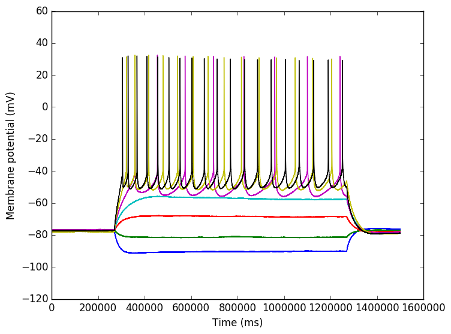</a>
</td>
<td>
<a href="spikes_485574721.png">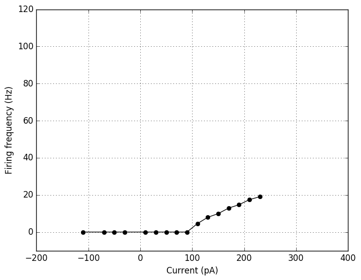</a>
</td>
<td>
<a href="subthreshold_485574721.png">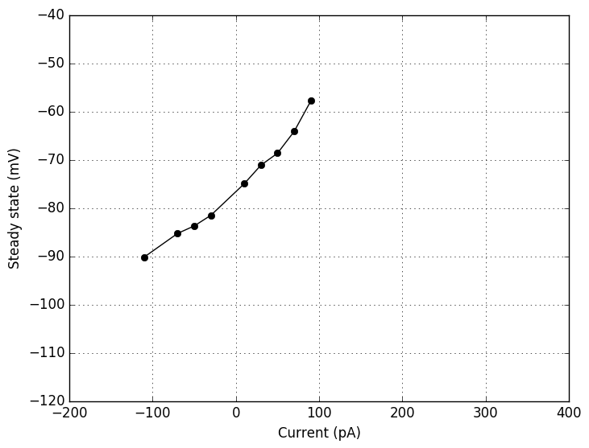</a>
</td>
</tr>
<tr>
<td width="130px">

<b>Izhikevich cell model tuned to dataset 485574721</b>

<a href="https://github.com/OpenSourceBrain/AllenInstituteNeuroML/blob/master/CellTypesDatabase/tune/tuned_cells/Izh_485574721.cell.nml">Tuned model</a>

</td>
<td>
<a href="../../../tune/tuned_cells/summary/Izh_485574721_traces.png">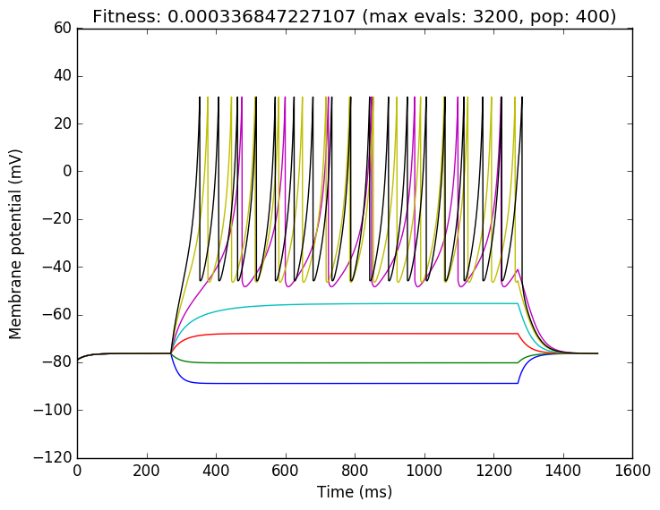</a>
</td>
<td>
<a href="../../../tune/tuned_cells/summary/Izh_485574721_if.png">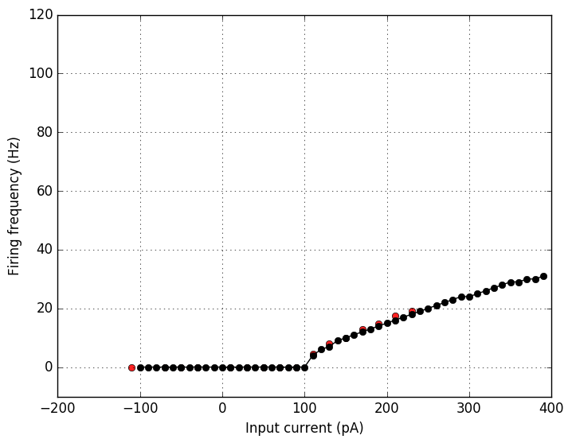</a>
</td>
<td>
<a href="../../../tune/tuned_cells/summary/Izh_485574721_iv.png">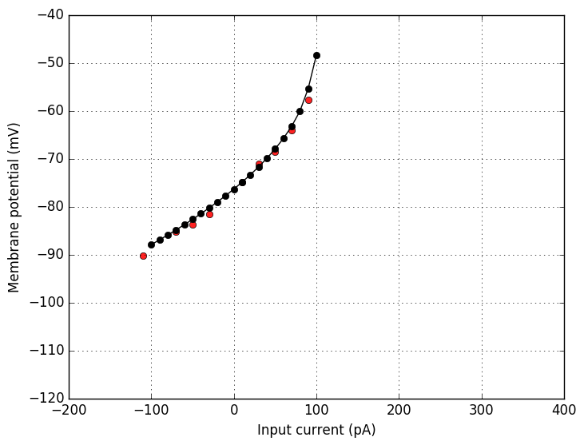</a>
</td>
</tr>
<tr>
<td width="130px">

<b>HH cell model tuned to dataset 485574721</b>

<a href="https://github.com/OpenSourceBrain/AllenInstituteNeuroML/blob/master/CellTypesDatabase/tune/tuned_cells/HH_485574721.cell.nml">Tuned model</a>

</td>
<td>
<a href="../../../tune/tuned_cells/summary/HH_485574721_traces.png">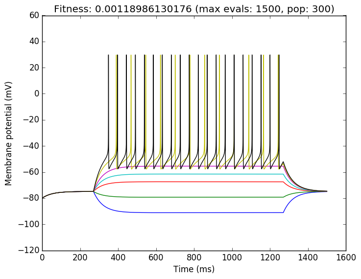</a>
</td>
<td>
<a href="../../../tune/tuned_cells/summary/HH_485574721_if.png">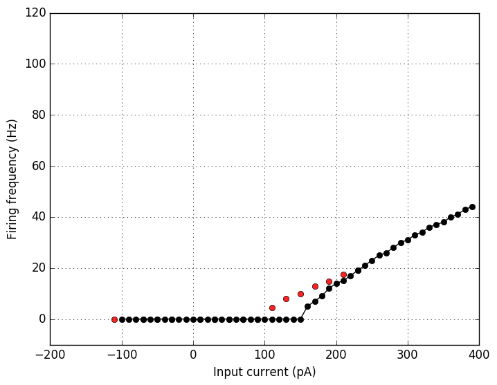</a>
</td>
<td>
<a href="../../../tune/tuned_cells/summary/HH_485574721_iv.png">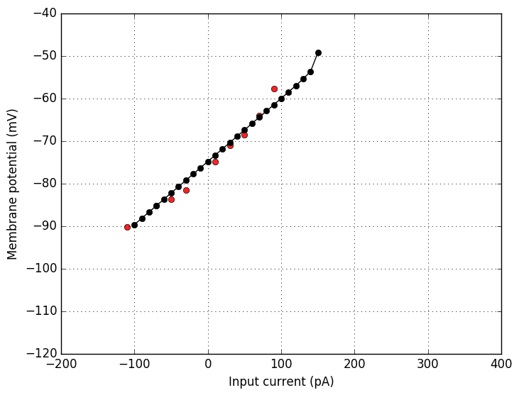</a>
</td>
</tr>
</table>  
 
<table border="1">
<tr>
<td width="130px">

<b>485836906</b>

Primary visual area, layer 4

spiny

Rorb-IRES2-Cre

<a href="http://celltypes.brain-map.org/mouse/experiment/electrophysiology/485836906">Source data</a>

</td>
<td>
<a href="traces_485836906.png">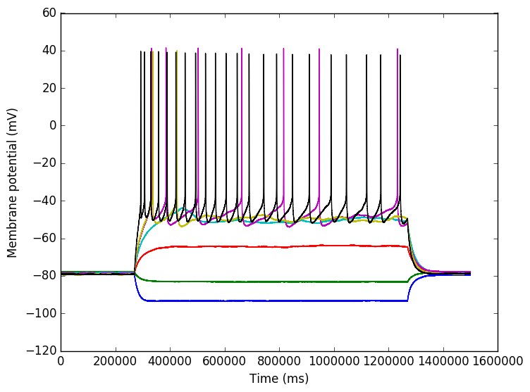</a>
</td>
<td>
<a href="spikes_485836906.png">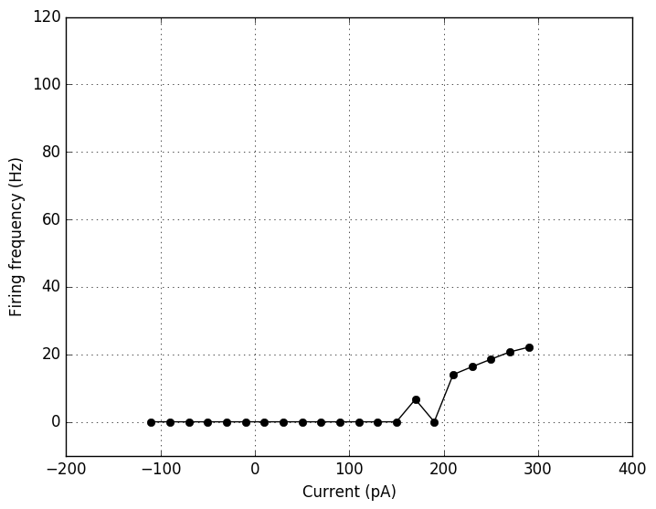</a>
</td>
<td>
<a href="subthreshold_485836906.png">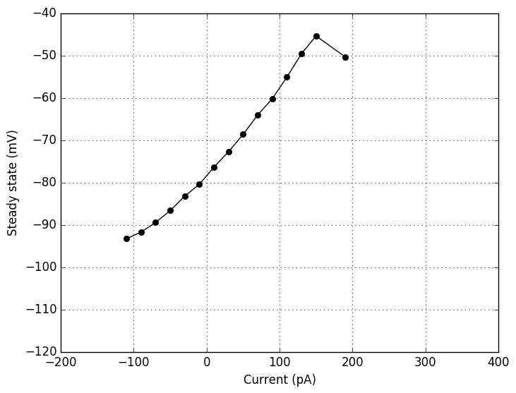</a>
</td>
</tr>
<tr>
<td width="130px">

<b>Izhikevich cell model tuned to dataset 485836906</b>

<a href="https://github.com/OpenSourceBrain/AllenInstituteNeuroML/blob/master/CellTypesDatabase/tune/tuned_cells/Izh_485836906.cell.nml">Tuned model</a>

</td>
<td>

</td>
<td>

</td>
<td>

</td>
</tr>
<tr>
<td width="130px">

<b>HH cell model tuned to dataset 485836906</b>

<a href="https://github.com/OpenSourceBrain/AllenInstituteNeuroML/blob/master/CellTypesDatabase/tune/tuned_cells/HH_485836906.cell.nml">Tuned model</a>

</td>
<td>

</td>
<td>

</td>
<td>

</td>
</tr>
</table>  
 
<table border="1">
<tr>
<td width="130px">

<b>485837504</b>

Primary visual area, layer 5

spiny

Rorb-IRES2-Cre

<a href="http://celltypes.brain-map.org/mouse/experiment/electrophysiology/485837504">Source data</a>

</td>
<td>
<a href="traces_485837504.png">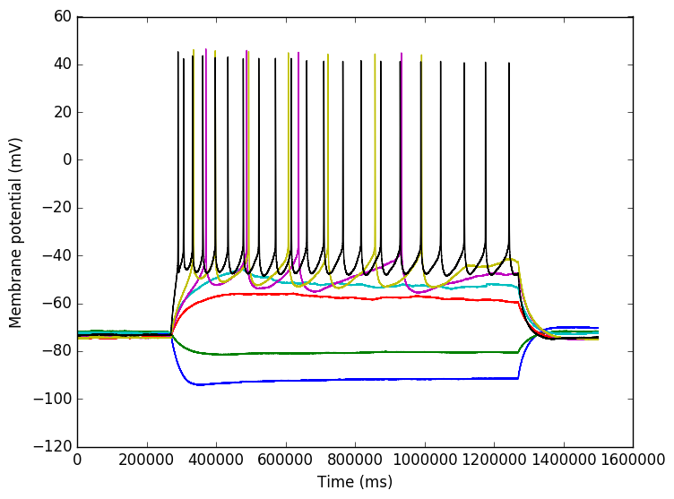</a>
</td>
<td>
<a href="spikes_485837504.png">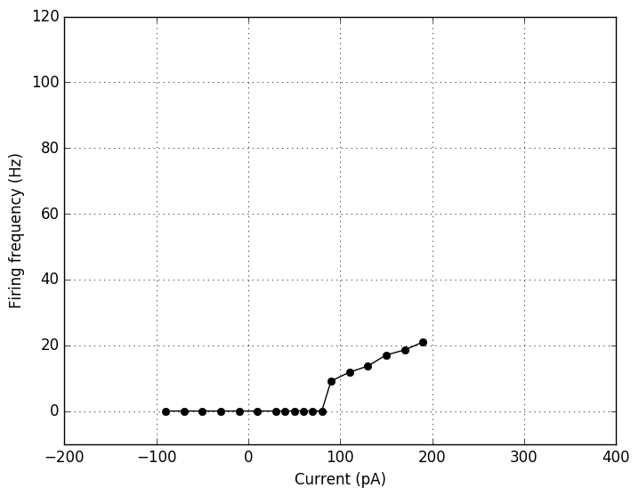</a>
</td>
<td>
<a href="subthreshold_485837504.png">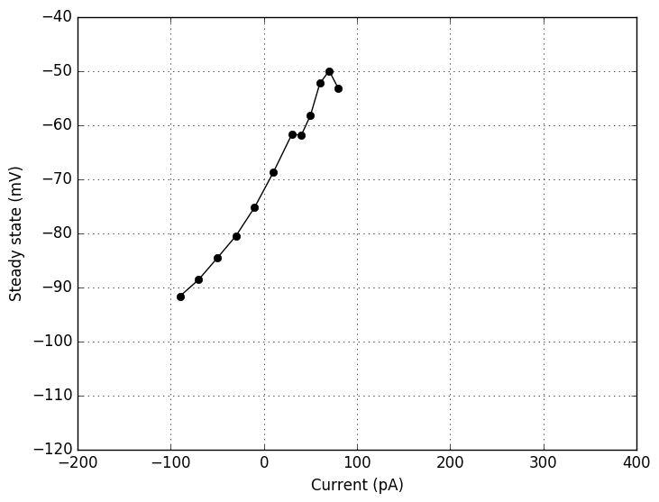</a>
</td>
</tr>
<tr>
<td width="130px">

<b>Izhikevich cell model tuned to dataset 485837504</b>

<a href="https://github.com/OpenSourceBrain/AllenInstituteNeuroML/blob/master/CellTypesDatabase/tune/tuned_cells/Izh_485837504.cell.nml">Tuned model</a>

</td>
<td>
<a href="../../../tune/tuned_cells/summary/Izh_485837504_traces.png">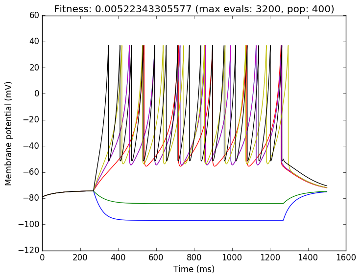</a>
</td>
<td>
<a href="../../../tune/tuned_cells/summary/Izh_485837504_if.png">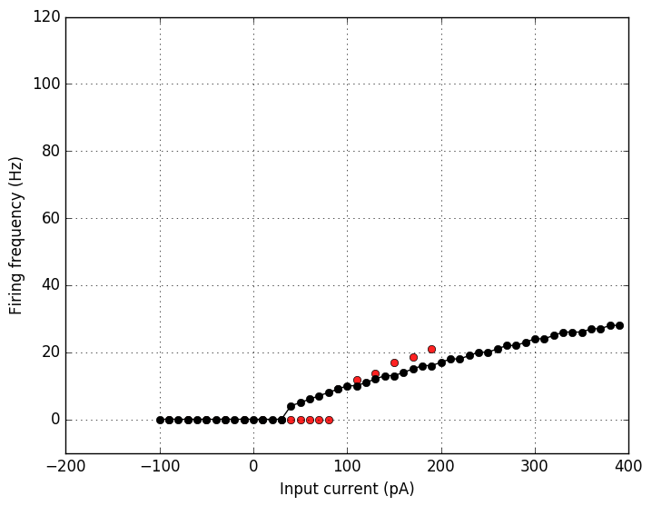</a>
</td>
<td>
<a href="../../../tune/tuned_cells/summary/Izh_485837504_iv.png">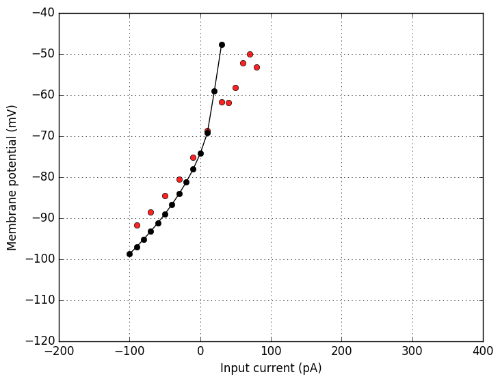</a>
</td>
</tr>
<tr>
<td width="130px">

<b>HH cell model tuned to dataset 485837504</b>

<a href="https://github.com/OpenSourceBrain/AllenInstituteNeuroML/blob/master/CellTypesDatabase/tune/tuned_cells/HH_485837504.cell.nml">Tuned model</a>

</td>
<td>

</td>
<td>

</td>
<td>
<a href="../../../tune/tuned_cells/summary/HH_485837504_iv.png">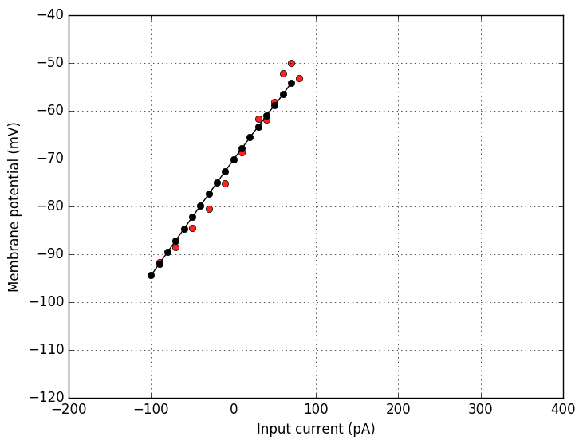</a>
</td>
</tr>
</table>  
 
<table border="1">
<tr>
<td width="130px">

<b>485838981</b>

Primary visual area, layer 5

spiny

Rbp4-Cre_KL100

<a href="http://celltypes.brain-map.org/mouse/experiment/electrophysiology/485838981">Source data</a>

</td>
<td>
<a href="traces_485838981.png">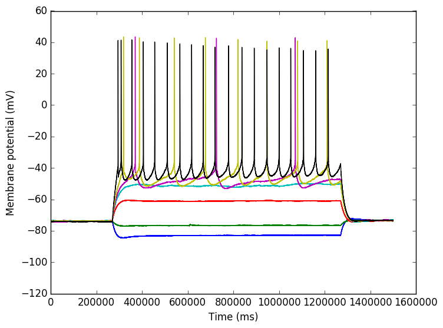</a>
</td>
<td>
<a href="spikes_485838981.png">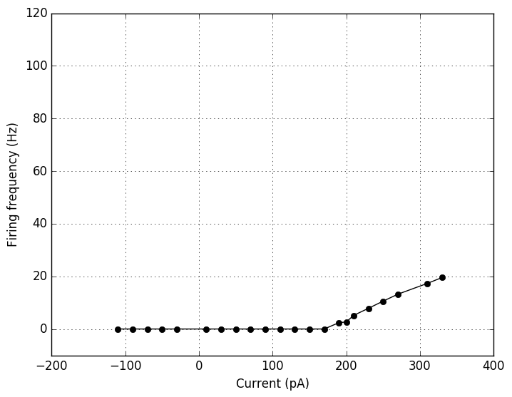</a>
</td>
<td>
<a href="subthreshold_485838981.png">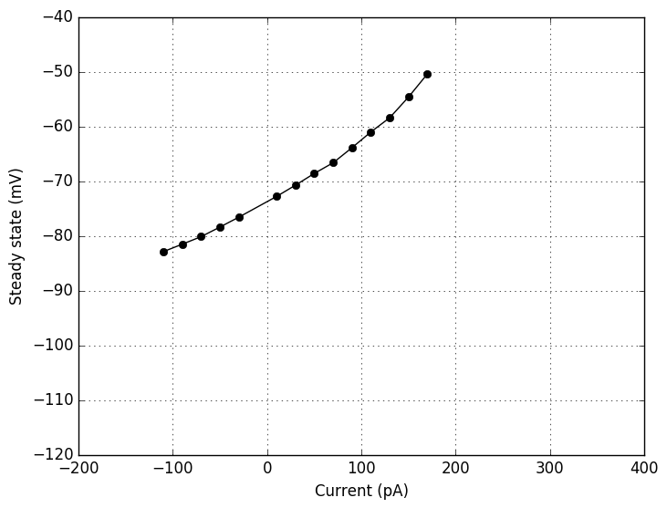</a>
</td>
</tr>
<tr>
<td width="130px">

<b>Izhikevich cell model tuned to dataset 485838981</b>

<a href="https://github.com/OpenSourceBrain/AllenInstituteNeuroML/blob/master/CellTypesDatabase/tune/tuned_cells/Izh_485838981.cell.nml">Tuned model</a>

</td>
<td>

</td>
<td>
<a href="../../../tune/tuned_cells/summary/Izh_485838981_if.png">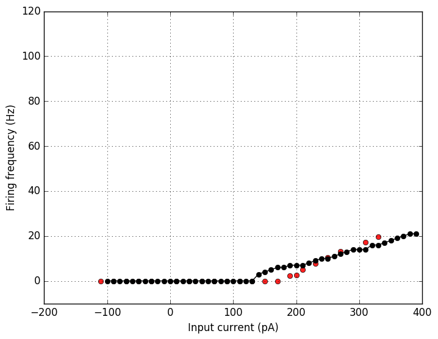</a>
</td>
<td>

</td>
</tr>
<tr>
<td width="130px">

<b>HH cell model tuned to dataset 485838981</b>

<a href="https://github.com/OpenSourceBrain/AllenInstituteNeuroML/blob/master/CellTypesDatabase/tune/tuned_cells/HH_485838981.cell.nml">Tuned model</a>

</td>
<td>

</td>
<td>
<a href="../../../tune/tuned_cells/summary/HH_485838981_if.png">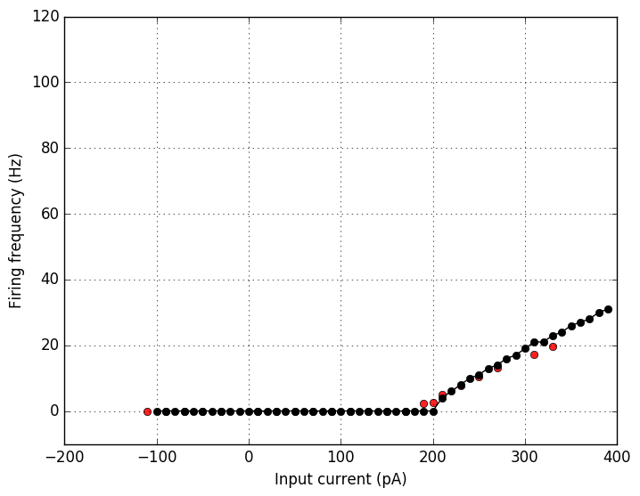</a>
</td>
<td>
<a href="../../../tune/tuned_cells/summary/HH_485838981_iv.png">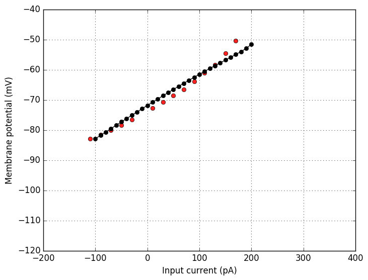</a>
</td>
</tr>
</table>  
 
<table border="1">
<tr>
<td width="130px">

<b>485931158</b>

Primary visual area, layer 4

spiny

Rorb-IRES2-Cre

<a href="http://celltypes.brain-map.org/mouse/experiment/electrophysiology/485931158">Source data</a>

</td>
<td>
<a href="traces_485931158.png">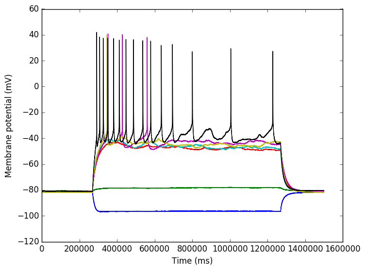</a>
</td>
<td>

</td>
<td>
<a href="subthreshold_485931158.png">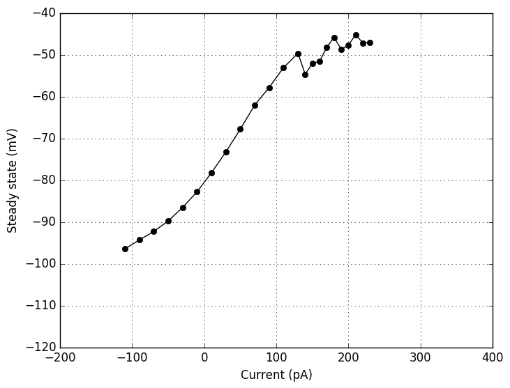</a>
</td>
</tr>
<tr>
<td width="130px">

<b>Izhikevich cell model tuned to dataset 485931158</b>

<a href="https://github.com/OpenSourceBrain/AllenInstituteNeuroML/blob/master/CellTypesDatabase/tune/tuned_cells/Izh_485931158.cell.nml">Tuned model</a>

</td>
<td>

</td>
<td>

</td>
<td>

</td>
</tr>
<tr>
<td width="130px">

<b>HH cell model tuned to dataset 485931158</b>

<a href="https://github.com/OpenSourceBrain/AllenInstituteNeuroML/blob/master/CellTypesDatabase/tune/tuned_cells/HH_485931158.cell.nml">Tuned model</a>

</td>
<td>

</td>
<td>

</td>
<td>

</td>
</tr>
</table>  
 
<table border="1">
<tr>
<td width="130px">

<b>486052980</b>

Primary visual area, layer 5

spiny

Rbp4-Cre_KL100

<a href="http://celltypes.brain-map.org/mouse/experiment/electrophysiology/486052980">Source data</a>

</td>
<td>
<a href="traces_486052980.png">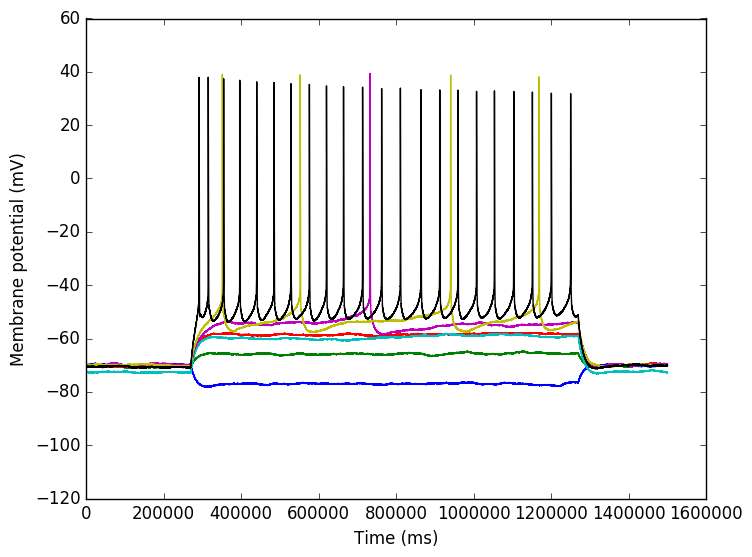</a>
</td>
<td>
<a href="spikes_486052980.png">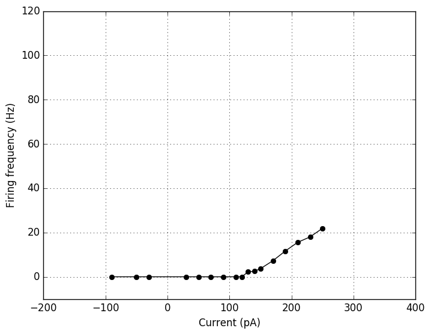</a>
</td>
<td>
<a href="subthreshold_486052980.png">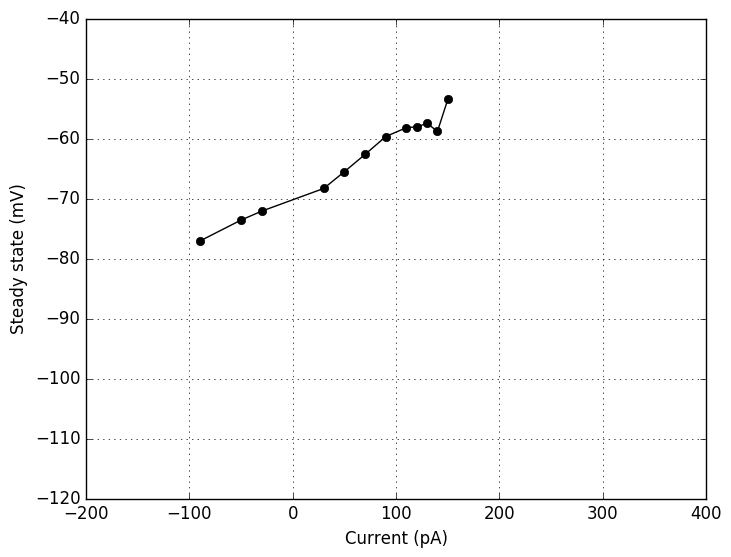</a>
</td>
</tr>
<tr>
<td width="130px">

<b>Izhikevich cell model tuned to dataset 486052980</b>

<a href="https://github.com/OpenSourceBrain/AllenInstituteNeuroML/blob/master/CellTypesDatabase/tune/tuned_cells/Izh_486052980.cell.nml">Tuned model</a>

</td>
<td>

</td>
<td>

</td>
<td>

</td>
</tr>
<tr>
<td width="130px">

<b>HH cell model tuned to dataset 486052980</b>

<a href="https://github.com/OpenSourceBrain/AllenInstituteNeuroML/blob/master/CellTypesDatabase/tune/tuned_cells/HH_486052980.cell.nml">Tuned model</a>

</td>
<td>

</td>
<td>

</td>
<td>

</td>
</tr>
</table>  
 
<table border="1">
<tr>
<td width="130px">

<b>486110216</b>

Primary visual area, layer 5

spiny

Rbp4-Cre_KL100

<a href="http://celltypes.brain-map.org/mouse/experiment/electrophysiology/486110216">Source data</a>

</td>
<td>
<a href="traces_486110216.png">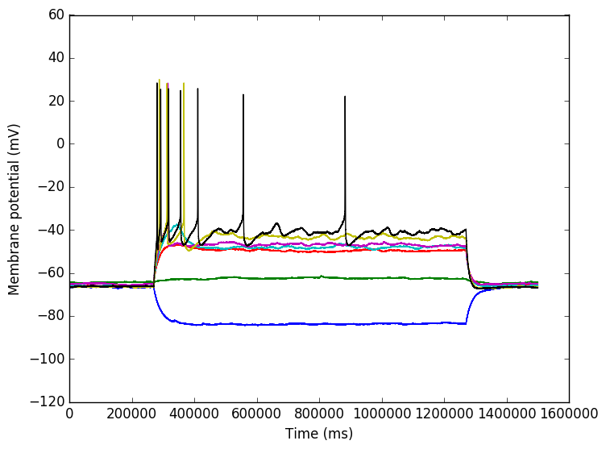</a>
</td>
<td>
<a href="spikes_486110216.png">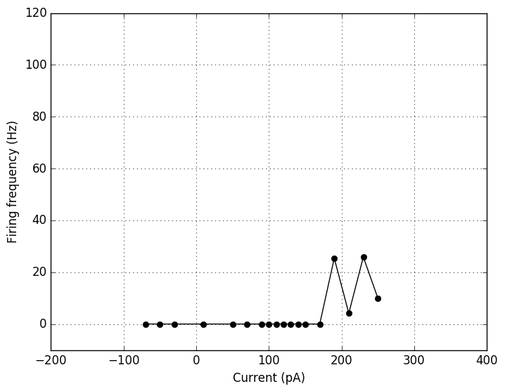</a>
</td>
<td>

</td>
</tr>
<tr>
<td width="130px">

<b>Izhikevich cell model tuned to dataset 486110216</b>

<a href="https://github.com/OpenSourceBrain/AllenInstituteNeuroML/blob/master/CellTypesDatabase/tune/tuned_cells/Izh_486110216.cell.nml">Tuned model</a>

</td>
<td>

</td>
<td>

</td>
<td>

</td>
</tr>
<tr>
<td width="130px">

<b>HH cell model tuned to dataset 486110216</b>

<a href="https://github.com/OpenSourceBrain/AllenInstituteNeuroML/blob/master/CellTypesDatabase/tune/tuned_cells/HH_486110216.cell.nml">Tuned model</a>

</td>
<td>

</td>
<td>

</td>
<td>

</td>
</tr>
</table>  
 
<table border="1">
<tr>
<td width="130px">

<b>486111903</b>

Primary visual area, layer 5

spiny

Rbp4-Cre_KL100

<a href="http://celltypes.brain-map.org/mouse/experiment/electrophysiology/486111903">Source data</a>

</td>
<td>
<a href="traces_486111903.png">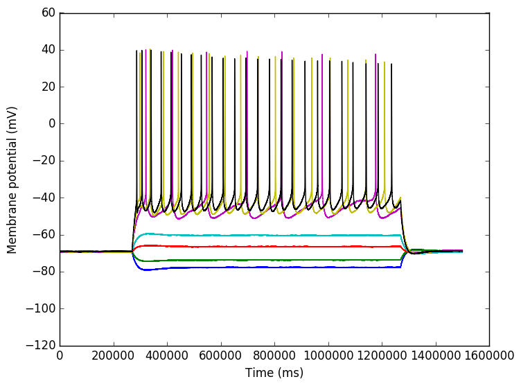</a>
</td>
<td>
<a href="spikes_486111903.png">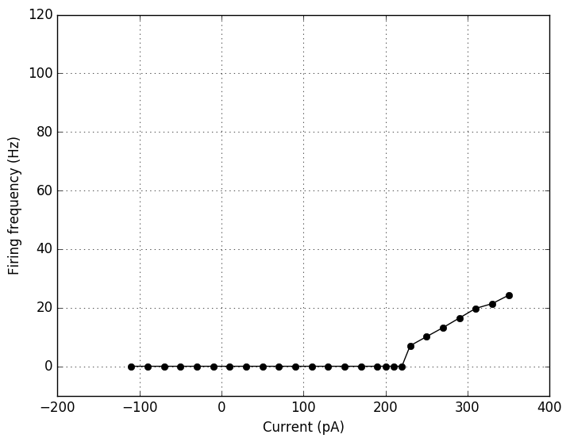</a>
</td>
<td>
<a href="subthreshold_486111903.png">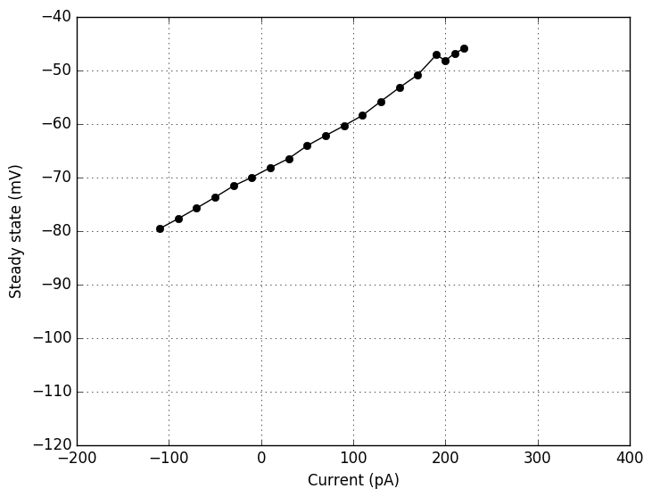</a>
</td>
</tr>
<tr>
<td width="130px">

<b>Izhikevich cell model tuned to dataset 486111903</b>

<a href="https://github.com/OpenSourceBrain/AllenInstituteNeuroML/blob/master/CellTypesDatabase/tune/tuned_cells/Izh_486111903.cell.nml">Tuned model</a>

</td>
<td>
<a href="../../../tune/tuned_cells/summary/Izh_486111903_traces.png">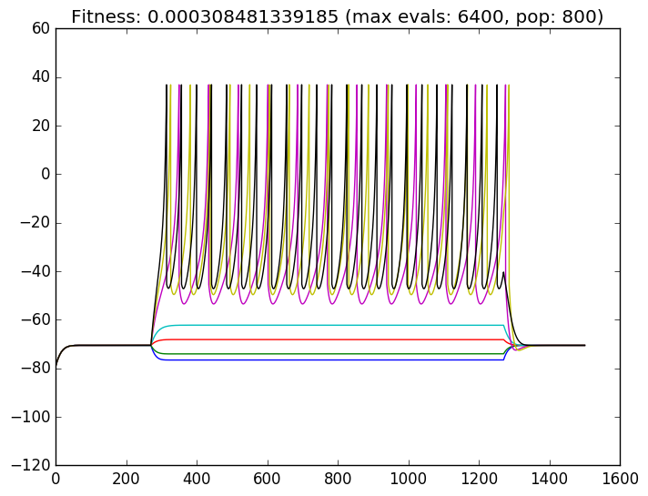</a>
</td>
<td>

</td>
<td>
<a href="../../../tune/tuned_cells/summary/Izh_486111903_iv.png">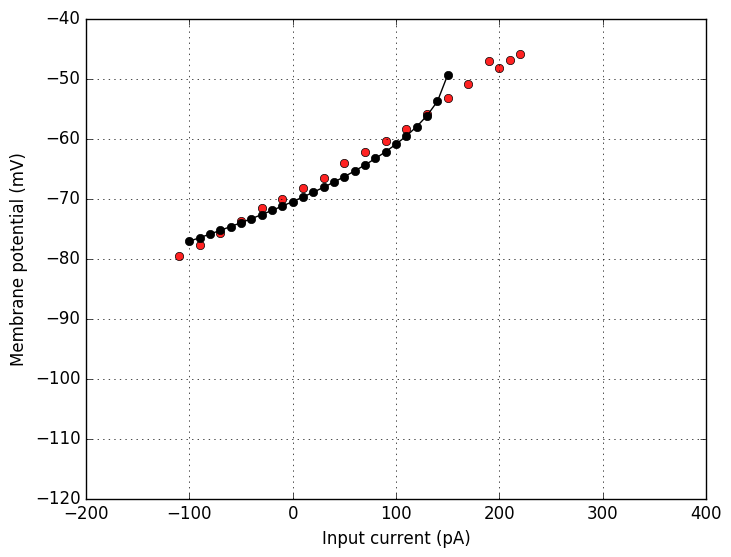</a>
</td>
</tr>
<tr>
<td width="130px">

<b>HH cell model tuned to dataset 486111903</b>

<a href="https://github.com/OpenSourceBrain/AllenInstituteNeuroML/blob/master/CellTypesDatabase/tune/tuned_cells/HH_486111903.cell.nml">Tuned model</a>

</td>
<td>

</td>
<td>
<a href="../../../tune/tuned_cells/summary/HH_486111903_if.png">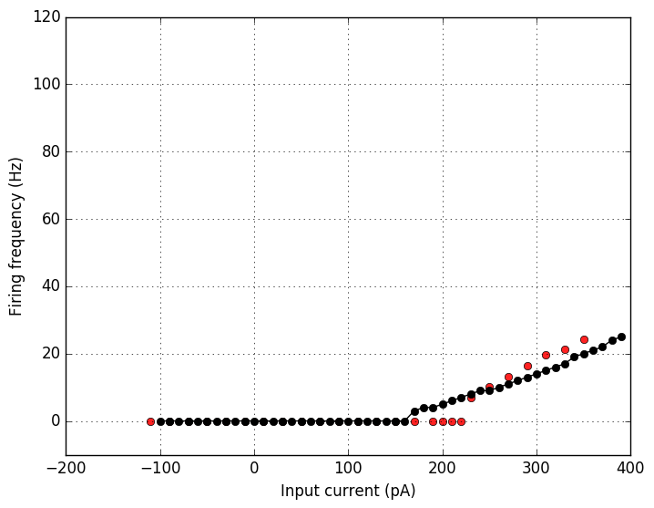</a>
</td>
<td>
<a href="../../../tune/tuned_cells/summary/HH_486111903_iv.png">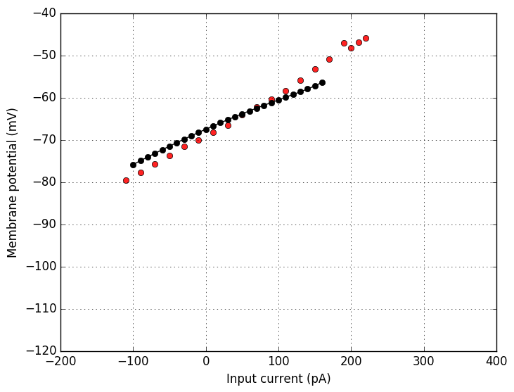</a>
</td>
</tr>
</table>  
 
<table border="1">
<tr>
<td width="130px">

<b>486132712</b>

Primary visual area, layer 4

spiny

Rbp4-Cre_KL100

<a href="http://celltypes.brain-map.org/mouse/experiment/electrophysiology/486132712">Source data</a>

</td>
<td>
<a href="traces_486132712.png">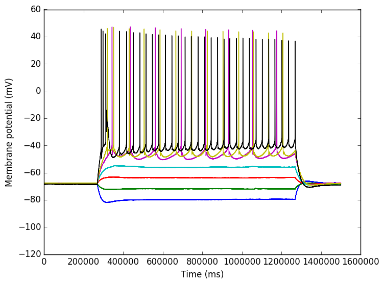</a>
</td>
<td>
<a href="spikes_486132712.png">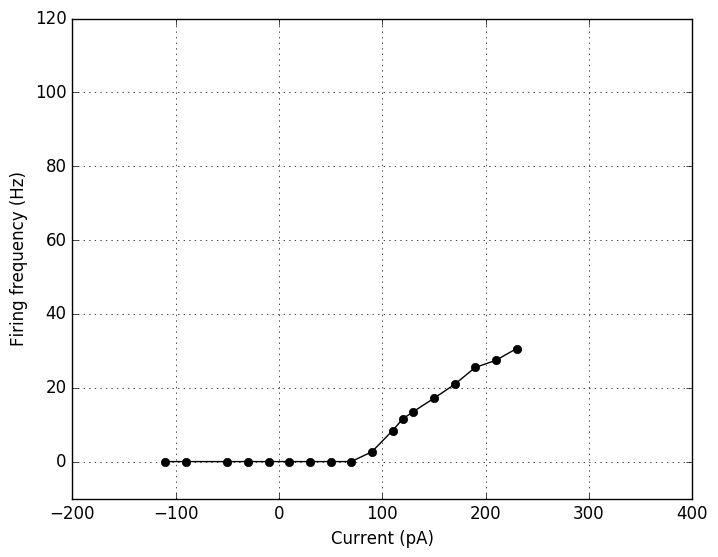</a>
</td>
<td>
<a href="subthreshold_486132712.png">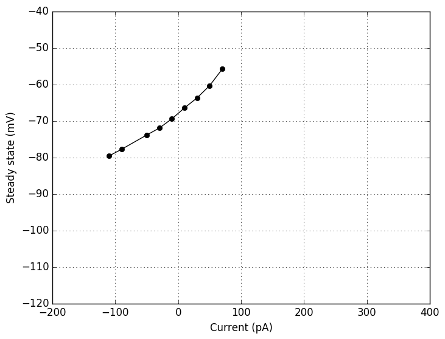</a>
</td>
</tr>
<tr>
<td width="130px">

<b>Izhikevich cell model tuned to dataset 486132712</b>

<a href="https://github.com/OpenSourceBrain/AllenInstituteNeuroML/blob/master/CellTypesDatabase/tune/tuned_cells/Izh_486132712.cell.nml">Tuned model</a>

</td>
<td>
<a href="../../../tune/tuned_cells/summary/Izh_486132712_traces.png">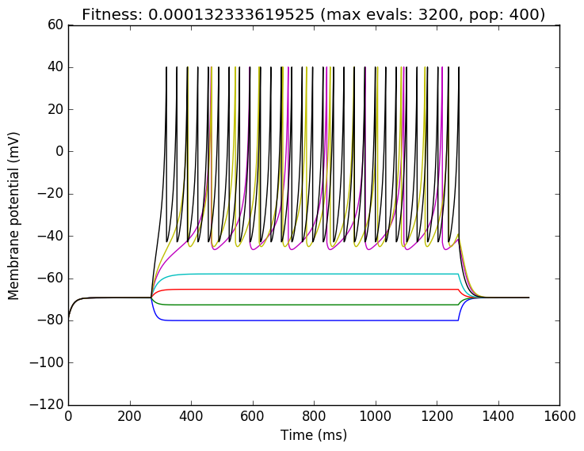</a>
</td>
<td>
<a href="../../../tune/tuned_cells/summary/Izh_486132712_if.png">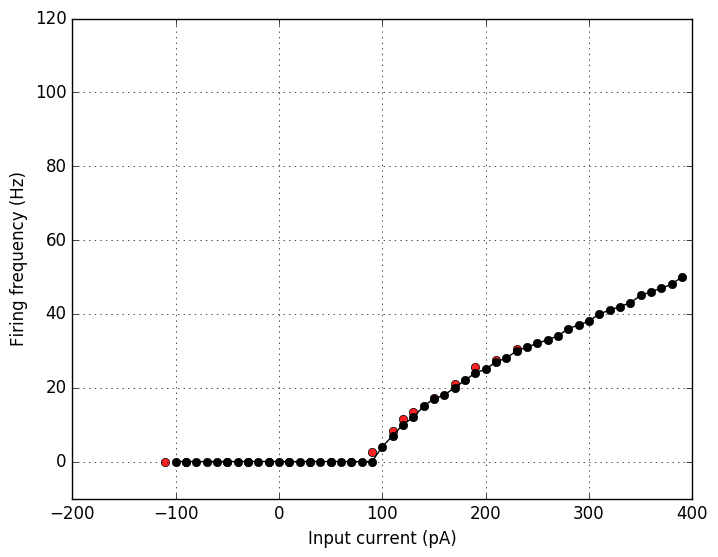</a>
</td>
<td>
<a href="../../../tune/tuned_cells/summary/Izh_486132712_iv.png">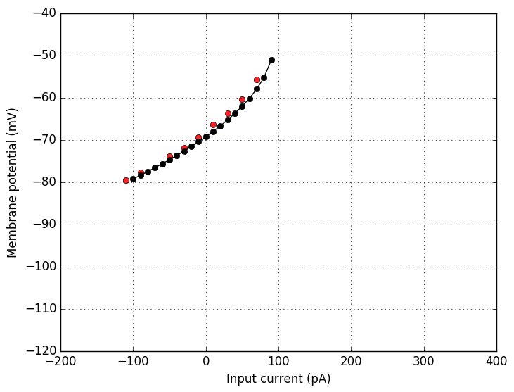</a>
</td>
</tr>
<tr>
<td width="130px">

<b>HH cell model tuned to dataset 486132712</b>

<a href="https://github.com/OpenSourceBrain/AllenInstituteNeuroML/blob/master/CellTypesDatabase/tune/tuned_cells/HH_486132712.cell.nml">Tuned model</a>

</td>
<td>

</td>
<td>
<a href="../../../tune/tuned_cells/summary/HH_486132712_if.png">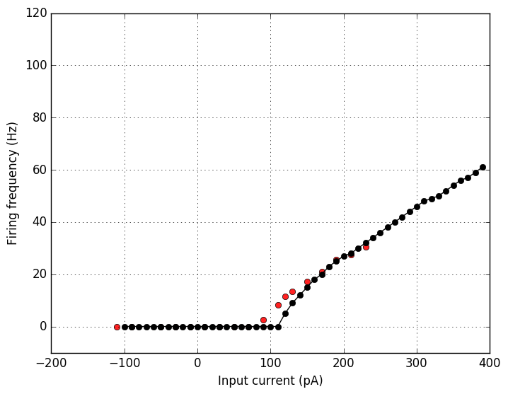</a>
</td>
<td>
<a href="../../../tune/tuned_cells/summary/HH_486132712_iv.png">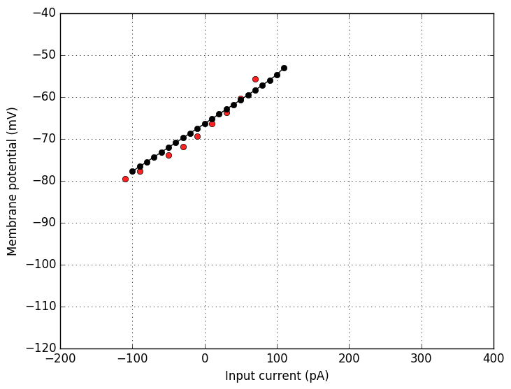</a>
</td>
</tr>
</table>  
 
<table border="1">
<tr>
<td width="130px">

<b>486239338</b>

Primary visual area, layer 4

spiny

Cux2-CreERT2

<a href="http://celltypes.brain-map.org/mouse/experiment/electrophysiology/486239338">Source data</a>

</td>
<td>
<a href="traces_486239338.png">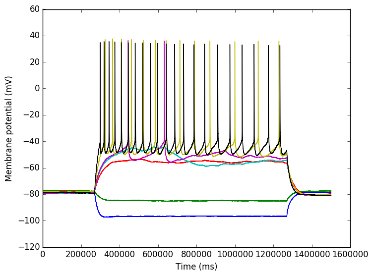</a>
</td>
<td>
<a href="spikes_486239338.png">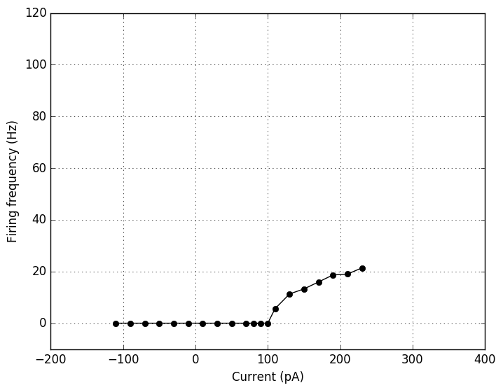</a>
</td>
<td>
<a href="subthreshold_486239338.png">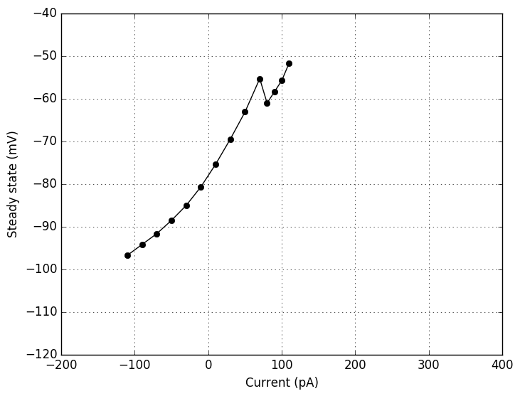</a>
</td>
</tr>
<tr>
<td width="130px">

<b>Izhikevich cell model tuned to dataset 486239338</b>

<a href="https://github.com/OpenSourceBrain/AllenInstituteNeuroML/blob/master/CellTypesDatabase/tune/tuned_cells/Izh_486239338.cell.nml">Tuned model</a>

</td>
<td>

</td>
<td>

</td>
<td>

</td>
</tr>
<tr>
<td width="130px">

<b>HH cell model tuned to dataset 486239338</b>

<a href="https://github.com/OpenSourceBrain/AllenInstituteNeuroML/blob/master/CellTypesDatabase/tune/tuned_cells/HH_486239338.cell.nml">Tuned model</a>

</td>
<td>

</td>
<td>

</td>
<td>

</td>
</tr>
</table>  
 
<table border="1">
<tr>
<td width="130px">

<b>486560376</b>

Primary visual area, layer 4

spiny

Cux2-CreERT2

<a href="http://celltypes.brain-map.org/mouse/experiment/electrophysiology/486560376">Source data</a>

</td>
<td>
<a href="traces_486560376.png">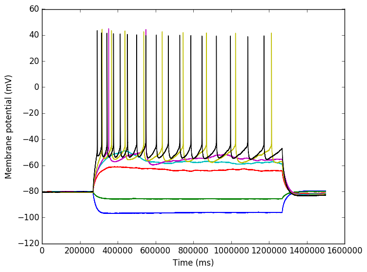</a>
</td>
<td>
<a href="spikes_486560376.png">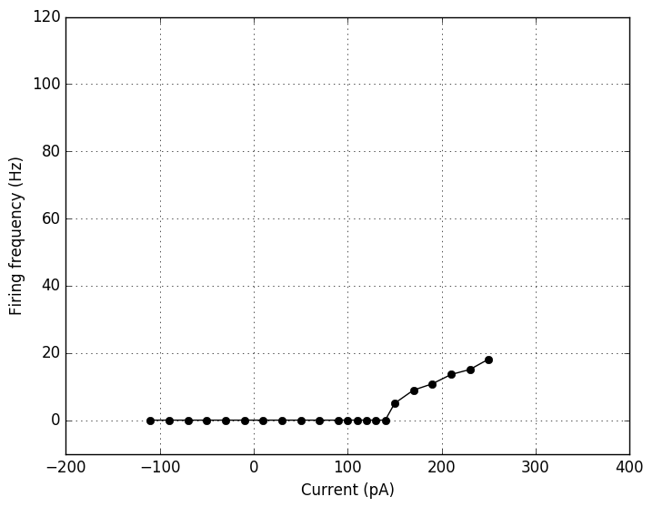</a>
</td>
<td>
<a href="subthreshold_486560376.png">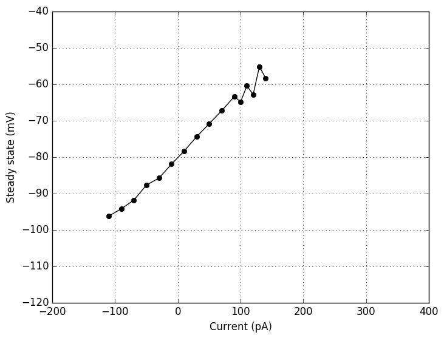</a>
</td>
</tr>
<tr>
<td width="130px">

<b>Izhikevich cell model tuned to dataset 486560376</b>

<a href="https://github.com/OpenSourceBrain/AllenInstituteNeuroML/blob/master/CellTypesDatabase/tune/tuned_cells/Izh_486560376.cell.nml">Tuned model</a>

</td>
<td>

</td>
<td>

</td>
<td>

</td>
</tr>
<tr>
<td width="130px">

<b>HH cell model tuned to dataset 486560376</b>

<a href="https://github.com/OpenSourceBrain/AllenInstituteNeuroML/blob/master/CellTypesDatabase/tune/tuned_cells/HH_486560376.cell.nml">Tuned model</a>

</td>
<td>

</td>
<td>

</td>
<td>

</td>
</tr>
</table>  
 
<table border="1">
<tr>
<td width="130px">

<b>486893033</b>

Primary visual area, layer 4

spiny

Scnn1a-Tg3-Cre

<a href="http://celltypes.brain-map.org/mouse/experiment/electrophysiology/486893033">Source data</a>

</td>
<td>
<a href="traces_486893033.png">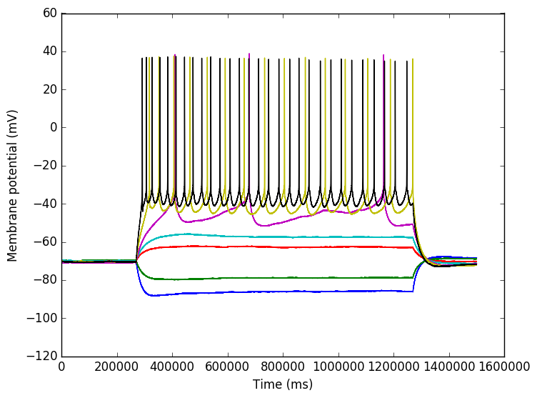</a>
</td>
<td>
<a href="spikes_486893033.png">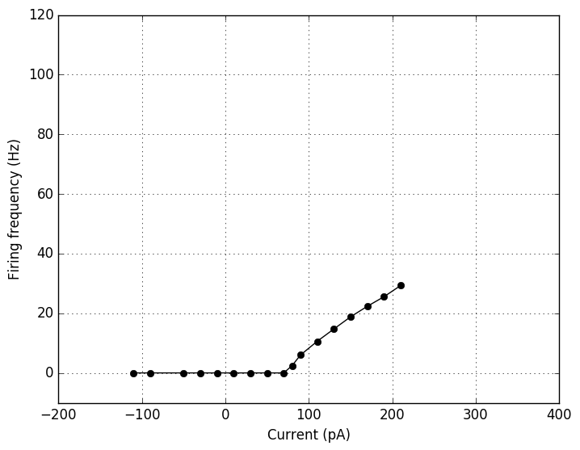</a>
</td>
<td>
<a href="subthreshold_486893033.png">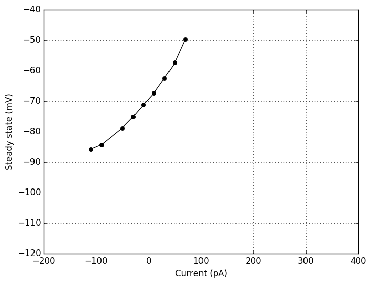</a>
</td>
</tr>
<tr>
<td width="130px">

<b>Izhikevich cell model tuned to dataset 486893033</b>

<a href="https://github.com/OpenSourceBrain/AllenInstituteNeuroML/blob/master/CellTypesDatabase/tune/tuned_cells/Izh_486893033.cell.nml">Tuned model</a>

</td>
<td>
<a href="../../../tune/tuned_cells/summary/Izh_486893033_traces.png">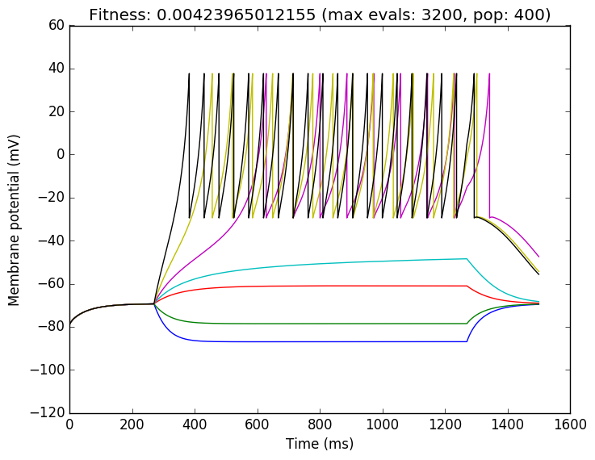</a>
</td>
<td>
<a href="../../../tune/tuned_cells/summary/Izh_486893033_if.png">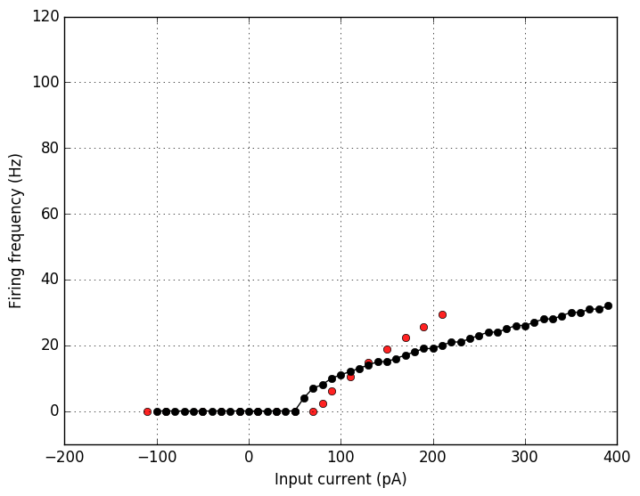</a>
</td>
<td>
<a href="../../../tune/tuned_cells/summary/Izh_486893033_iv.png">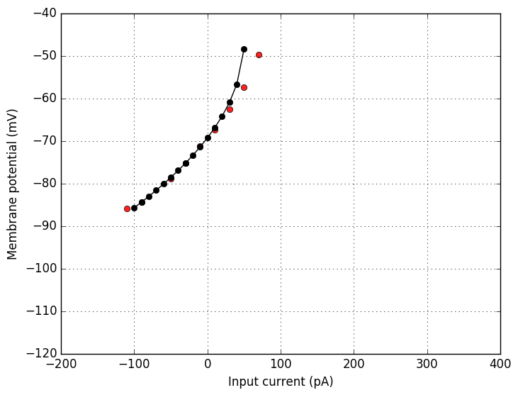</a>
</td>
</tr>
<tr>
<td width="130px">

<b>HH cell model tuned to dataset 486893033</b>

<a href="https://github.com/OpenSourceBrain/AllenInstituteNeuroML/blob/master/CellTypesDatabase/tune/tuned_cells/HH_486893033.cell.nml">Tuned model</a>

</td>
<td>

</td>
<td>
<a href="../../../tune/tuned_cells/summary/HH_486893033_if.png">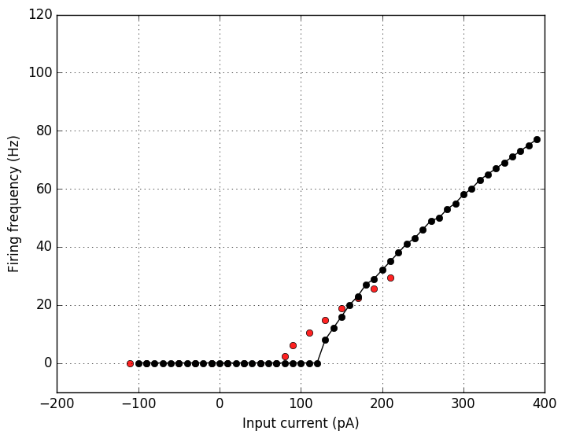</a>
</td>
<td>
<a href="../../../tune/tuned_cells/summary/HH_486893033_iv.png">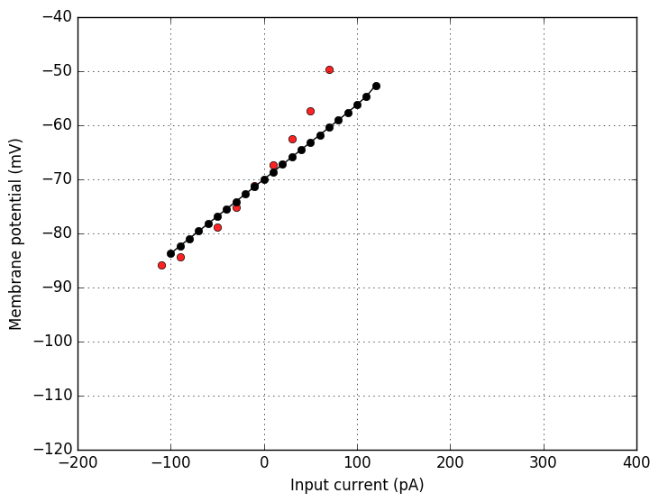</a>
</td>
</tr>
</table>  
 
<table border="1">
<tr>
<td width="130px">

<b>487601493</b>

Primary visual area, layer 4

spiny

Cux2-CreERT2

<a href="http://celltypes.brain-map.org/mouse/experiment/electrophysiology/487601493">Source data</a>

</td>
<td>
<a href="traces_487601493.png">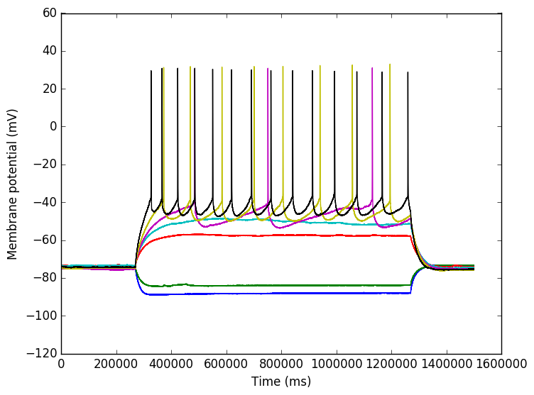</a>
</td>
<td>
<a href="spikes_487601493.png">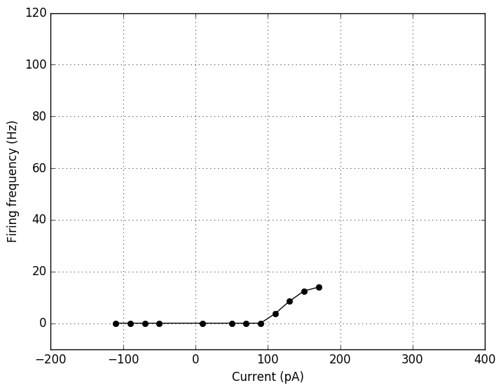</a>
</td>
<td>
<a href="subthreshold_487601493.png">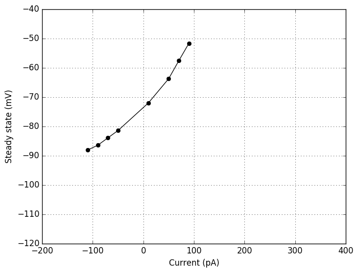</a>
</td>
</tr>
<tr>
<td width="130px">

<b>Izhikevich cell model tuned to dataset 487601493</b>

<a href="https://github.com/OpenSourceBrain/AllenInstituteNeuroML/blob/master/CellTypesDatabase/tune/tuned_cells/Izh_487601493.cell.nml">Tuned model</a>

</td>
<td>
<a href="../../../tune/tuned_cells/summary/Izh_487601493_traces.png">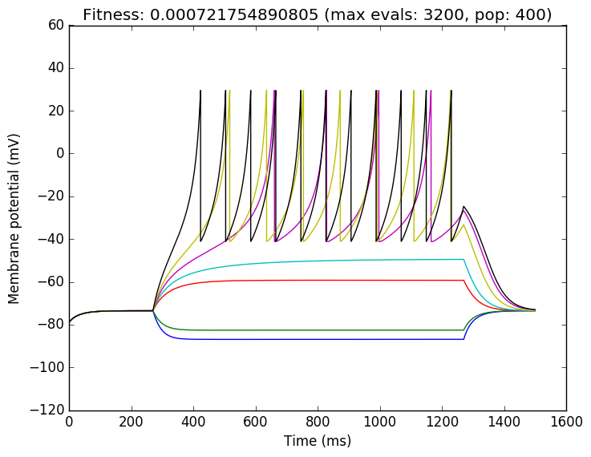</a>
</td>
<td>
<a href="../../../tune/tuned_cells/summary/Izh_487601493_if.png">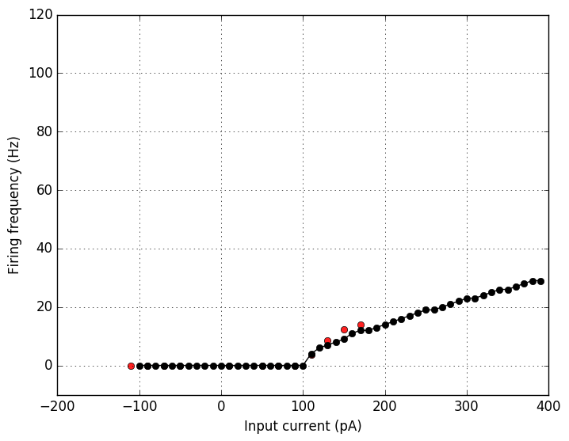</a>
</td>
<td>

</td>
</tr>
<tr>
<td width="130px">

<b>HH cell model tuned to dataset 487601493</b>

<a href="https://github.com/OpenSourceBrain/AllenInstituteNeuroML/blob/master/CellTypesDatabase/tune/tuned_cells/HH_487601493.cell.nml">Tuned model</a>

</td>
<td>

</td>
<td>
<a href="../../../tune/tuned_cells/summary/HH_487601493_if.png">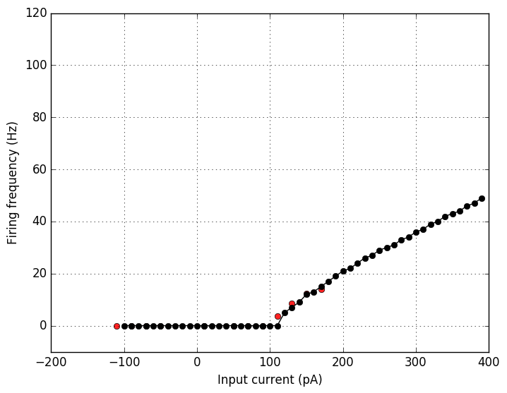</a>
</td>
<td>
<a href="../../../tune/tuned_cells/summary/HH_487601493_iv.png">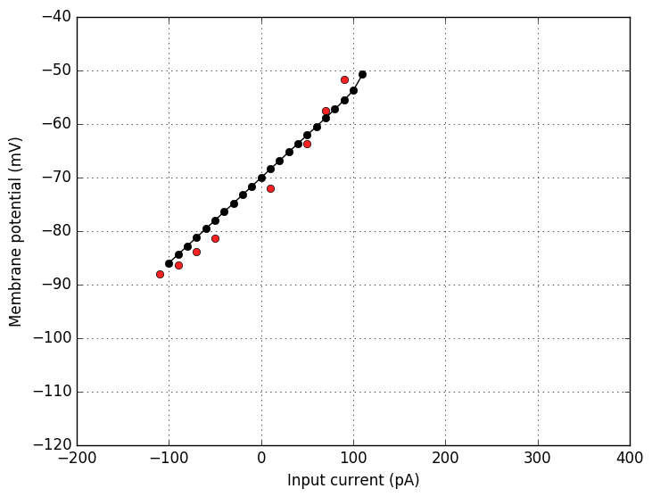</a>
</td>
</tr>
</table>  
 
<table border="1">
<tr>
<td width="130px">

<b>487664663</b>

posteromedial visual area, layer 5

spiny

Rbp4-Cre_KL100

<a href="http://celltypes.brain-map.org/mouse/experiment/electrophysiology/487664663">Source data</a>

</td>
<td>
<a href="traces_487664663.png">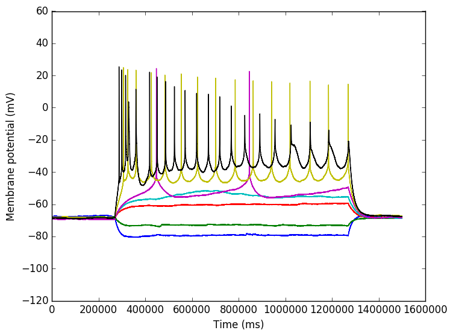</a>
</td>
<td>
<a href="spikes_487664663.png">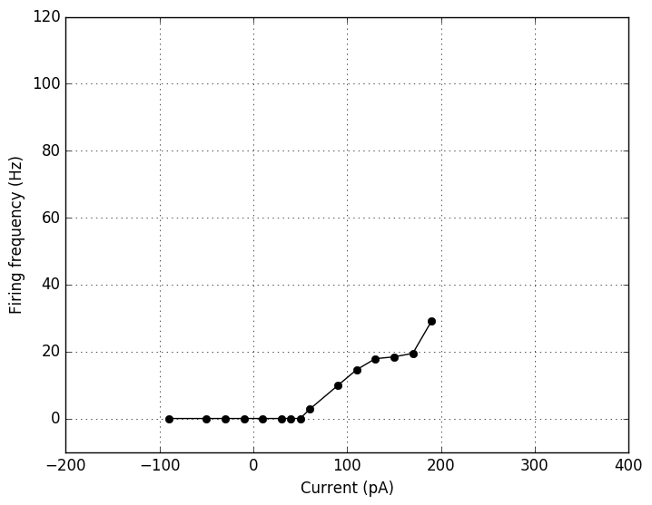</a>
</td>
<td>
<a href="subthreshold_487664663.png">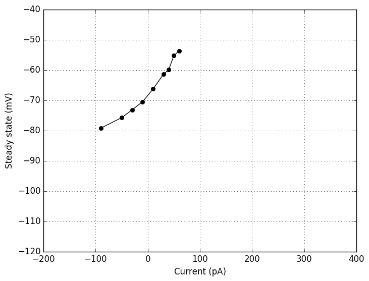</a>
</td>
</tr>
<tr>
<td width="130px">

<b>Izhikevich cell model tuned to dataset 487664663</b>

<a href="https://github.com/OpenSourceBrain/AllenInstituteNeuroML/blob/master/CellTypesDatabase/tune/tuned_cells/Izh_487664663.cell.nml">Tuned model</a>

</td>
<td>

</td>
<td>

</td>
<td>

</td>
</tr>
<tr>
<td width="130px">

<b>HH cell model tuned to dataset 487664663</b>

<a href="https://github.com/OpenSourceBrain/AllenInstituteNeuroML/blob/master/CellTypesDatabase/tune/tuned_cells/HH_487664663.cell.nml">Tuned model</a>

</td>
<td>

</td>
<td>

</td>
<td>

</td>
</tr>
</table>  
 
<table border="1">
<tr>
<td width="130px">

<b>487667205</b>

Primary visual area, layer 4

aspiny

Pvalb-IRES-Cre

<a href="http://celltypes.brain-map.org/mouse/experiment/electrophysiology/487667205">Source data</a>

</td>
<td>
<a href="traces_487667205.png">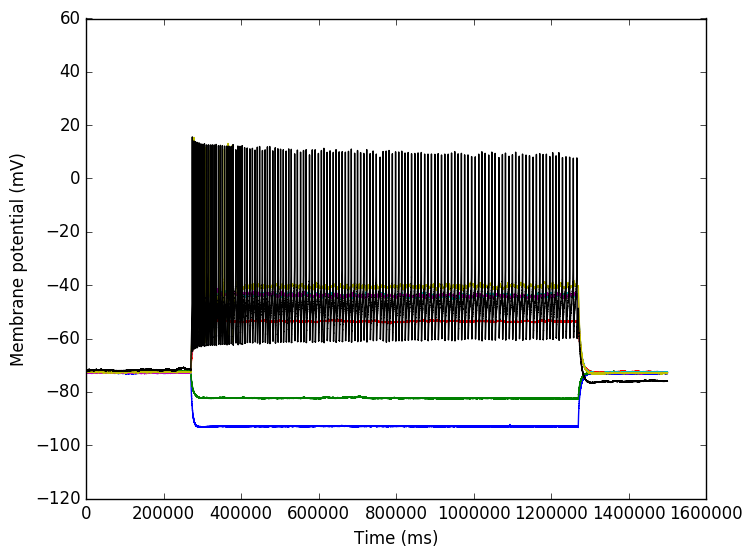</a>
</td>
<td>

</td>
<td>
<a href="subthreshold_487667205.png">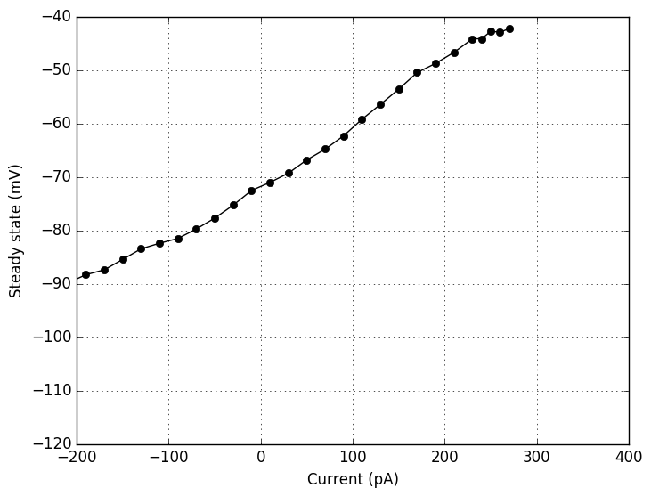</a>
</td>
</tr>
<tr>
<td width="130px">

<b>Izhikevich cell model tuned to dataset 487667205</b>

<a href="https://github.com/OpenSourceBrain/AllenInstituteNeuroML/blob/master/CellTypesDatabase/tune/tuned_cells/Izh_487667205.cell.nml">Tuned model</a>

</td>
<td>

</td>
<td>

</td>
<td>

</td>
</tr>
<tr>
<td width="130px">

<b>HH cell model tuned to dataset 487667205</b>

<a href="https://github.com/OpenSourceBrain/AllenInstituteNeuroML/blob/master/CellTypesDatabase/tune/tuned_cells/HH_487667205.cell.nml">Tuned model</a>

</td>
<td>
<a href="../../../tune/tuned_cells/summary/HH_487667205_traces.png">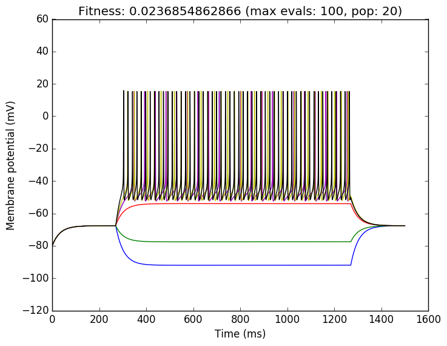</a>
</td>
<td>
<a href="../../../tune/tuned_cells/summary/HH_487667205_if.png">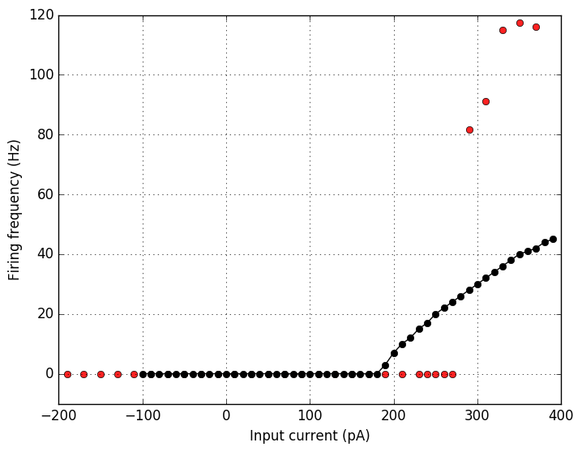</a>
</td>
<td>
<a href="../../../tune/tuned_cells/summary/HH_487667205_iv.png">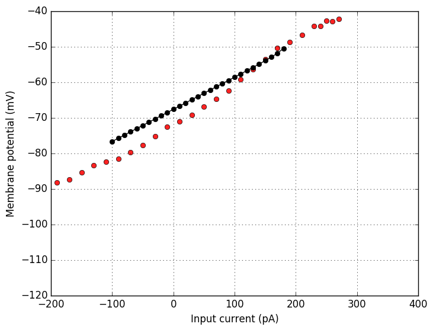</a>
</td>
</tr>
</table>  
 
<table border="1">
<tr>
<td width="130px">

<b>488674910</b>

Primary visual area, layer 6a

aspiny

Ntsr1-Cre_GN220

<a href="http://celltypes.brain-map.org/mouse/experiment/electrophysiology/488674910">Source data</a>

</td>
<td>
<a href="traces_488674910.png">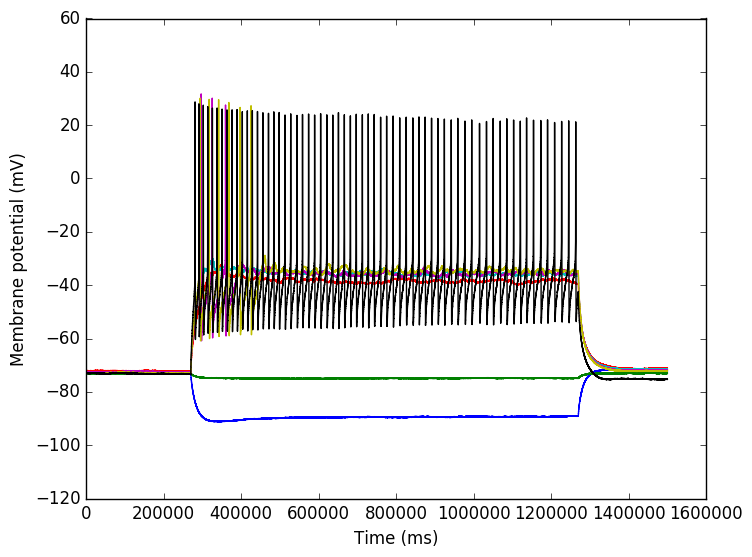</a>
</td>
<td>
<a href="spikes_488674910.png">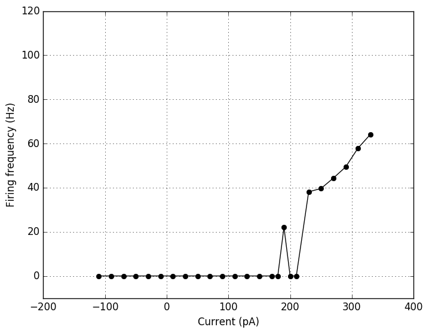</a>
</td>
<td>
<a href="subthreshold_488674910.png">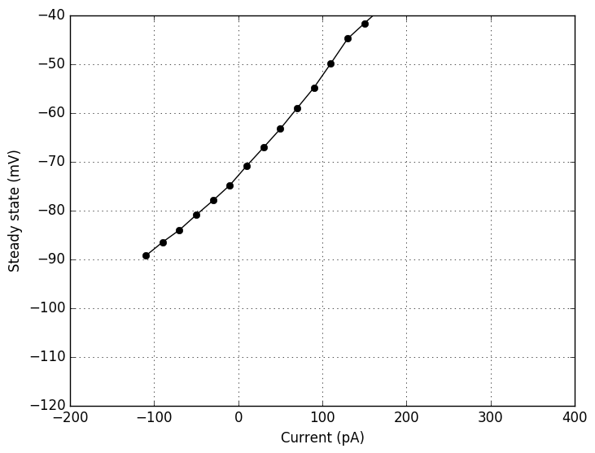</a>
</td>
</tr>
<tr>
<td width="130px">

<b>Izhikevich cell model tuned to dataset 488674910</b>

<a href="https://github.com/OpenSourceBrain/AllenInstituteNeuroML/blob/master/CellTypesDatabase/tune/tuned_cells/Izh_488674910.cell.nml">Tuned model</a>

</td>
<td>
<a href="../../../tune/tuned_cells/summary/Izh_488674910_traces.png">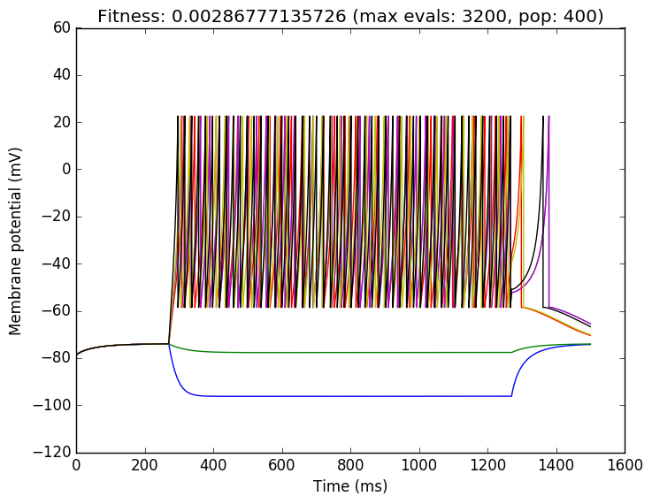</a>
</td>
<td>
<a href="../../../tune/tuned_cells/summary/Izh_488674910_if.png">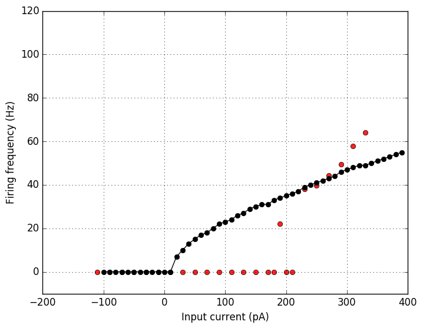</a>
</td>
<td>
<a href="../../../tune/tuned_cells/summary/Izh_488674910_iv.png">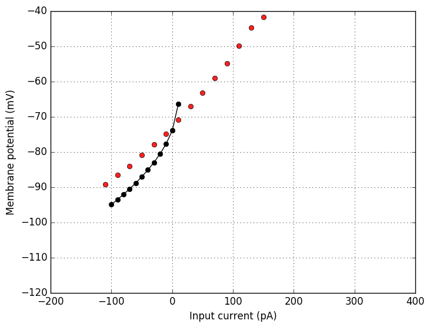</a>
</td>
</tr>
<tr>
<td width="130px">

<b>HH cell model tuned to dataset 488674910</b>

<a href="https://github.com/OpenSourceBrain/AllenInstituteNeuroML/blob/master/CellTypesDatabase/tune/tuned_cells/HH_488674910.cell.nml">Tuned model</a>

</td>
<td>
<a href="../../../tune/tuned_cells/summary/HH_488674910_traces.png">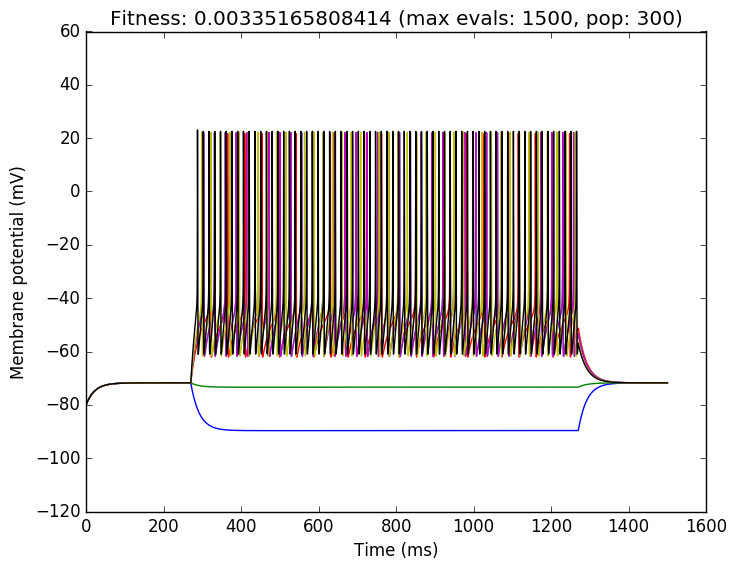</a>
</td>
<td>
<a href="../../../tune/tuned_cells/summary/HH_488674910_if.png">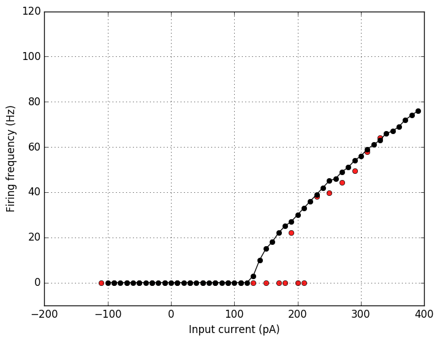</a>
</td>
<td>
<a href="../../../tune/tuned_cells/summary/HH_488674910_iv.png">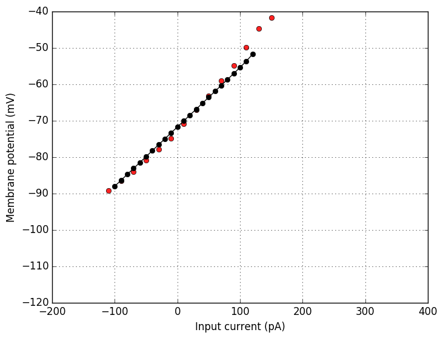</a>
</td>
</tr>
</table>  
 
<table border="1">
<tr>
<td width="130px">

<b>488679042</b>

Primary visual area, layer 5

spiny

Rorb-IRES2-Cre

<a href="http://celltypes.brain-map.org/mouse/experiment/electrophysiology/488679042">Source data</a>

</td>
<td>
<a href="traces_488679042.png">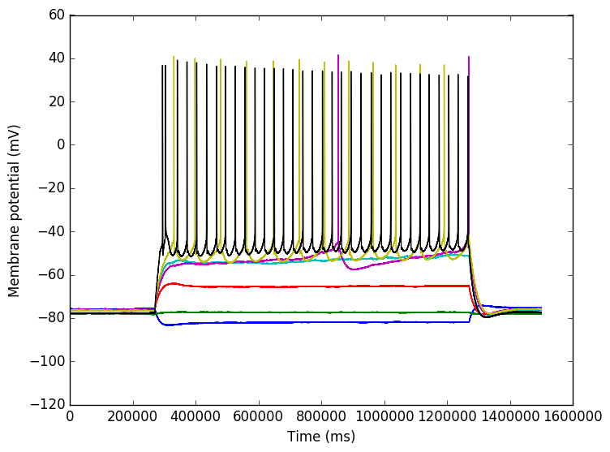</a>
</td>
<td>
<a href="spikes_488679042.png">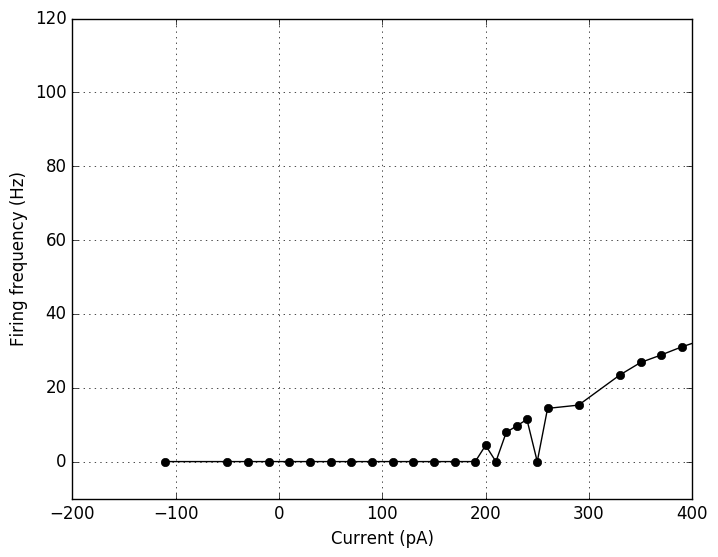</a>
</td>
<td>
<a href="subthreshold_488679042.png">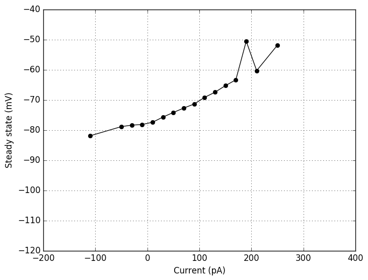</a>
</td>
</tr>
<tr>
<td width="130px">

<b>Izhikevich cell model tuned to dataset 488679042</b>

<a href="https://github.com/OpenSourceBrain/AllenInstituteNeuroML/blob/master/CellTypesDatabase/tune/tuned_cells/Izh_488679042.cell.nml">Tuned model</a>

</td>
<td>

</td>
<td>

</td>
<td>

</td>
</tr>
<tr>
<td width="130px">

<b>HH cell model tuned to dataset 488679042</b>

<a href="https://github.com/OpenSourceBrain/AllenInstituteNeuroML/blob/master/CellTypesDatabase/tune/tuned_cells/HH_488679042.cell.nml">Tuned model</a>

</td>
<td>
<a href="../../../tune/tuned_cells/summary/HH_488679042_traces.png">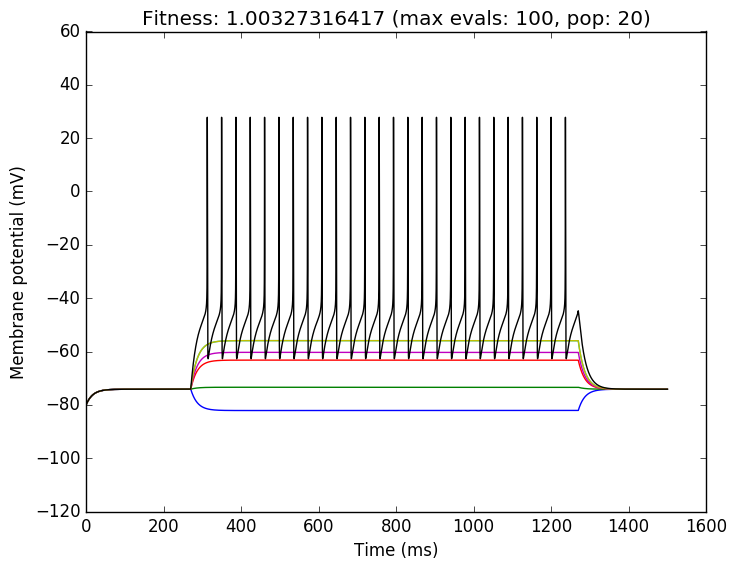</a>
</td>
<td>
<a href="../../../tune/tuned_cells/summary/HH_488679042_if.png">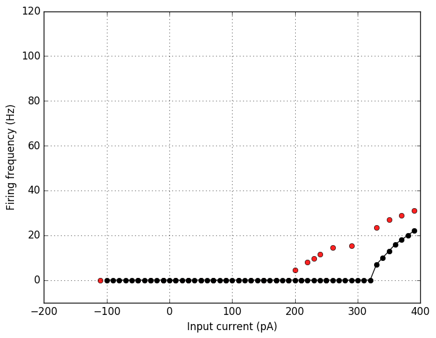</a>
</td>
<td>
<a href="../../../tune/tuned_cells/summary/HH_488679042_iv.png">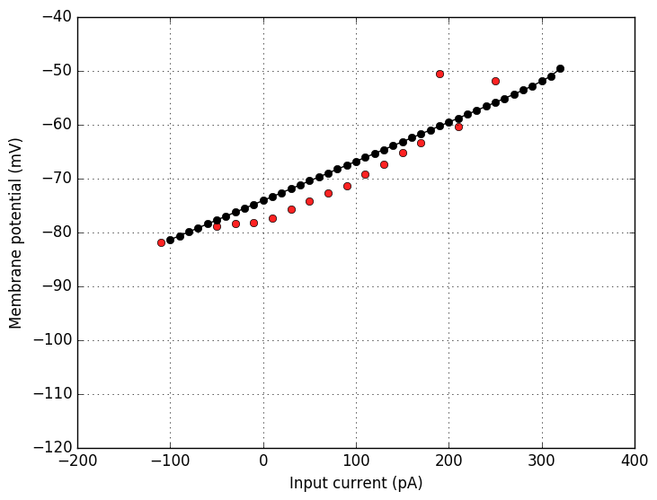</a>
</td>
</tr>
</table>  
 
<table border="1">
<tr>
<td width="130px">

<b>488680917</b>

Primary visual area, layer 5

spiny

Rorb-IRES2-Cre

<a href="http://celltypes.brain-map.org/mouse/experiment/electrophysiology/488680917">Source data</a>

</td>
<td>
<a href="traces_488680917.png">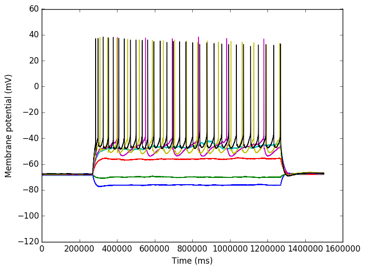</a>
</td>
<td>
<a href="spikes_488680917.png">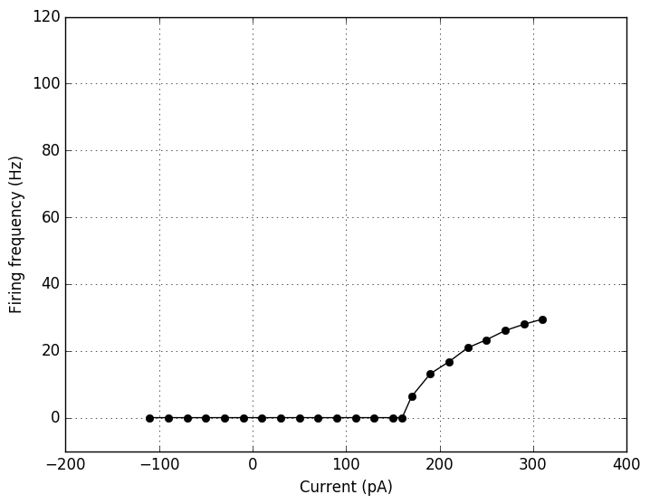</a>
</td>
<td>
<a href="subthreshold_488680917.png">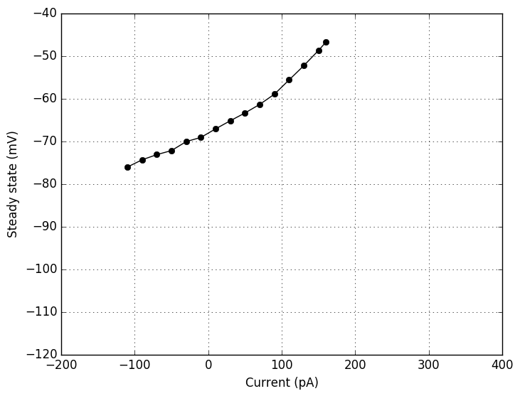</a>
</td>
</tr>
<tr>
<td width="130px">

<b>Izhikevich cell model tuned to dataset 488680917</b>

<a href="https://github.com/OpenSourceBrain/AllenInstituteNeuroML/blob/master/CellTypesDatabase/tune/tuned_cells/Izh_488680917.cell.nml">Tuned model</a>

</td>
<td>
<a href="../../../tune/tuned_cells/summary/Izh_488680917_traces.png">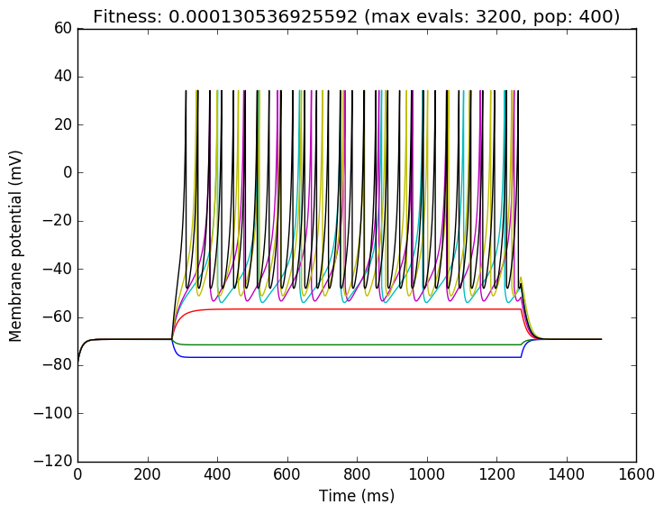</a>
</td>
<td>
<a href="../../../tune/tuned_cells/summary/Izh_488680917_if.png">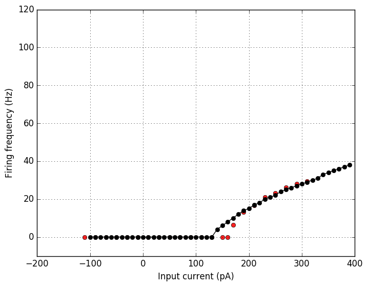</a>
</td>
<td>
<a href="../../../tune/tuned_cells/summary/Izh_488680917_iv.png">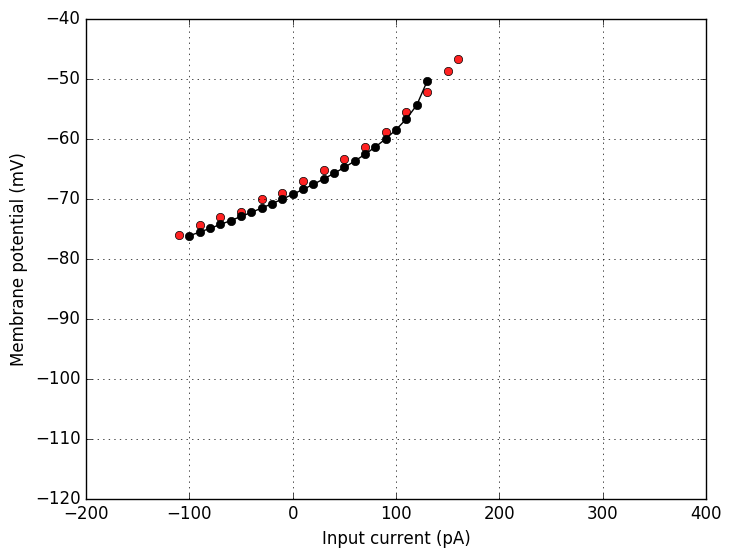</a>
</td>
</tr>
<tr>
<td width="130px">

<b>HH cell model tuned to dataset 488680917</b>

<a href="https://github.com/OpenSourceBrain/AllenInstituteNeuroML/blob/master/CellTypesDatabase/tune/tuned_cells/HH_488680917.cell.nml">Tuned model</a>

</td>
<td>

</td>
<td>
<a href="../../../tune/tuned_cells/summary/HH_488680917_if.png">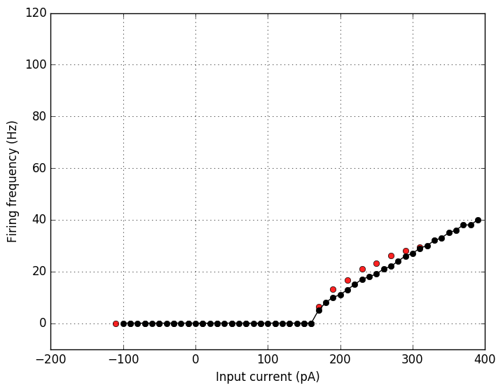</a>
</td>
<td>
<a href="../../../tune/tuned_cells/summary/HH_488680917_iv.png">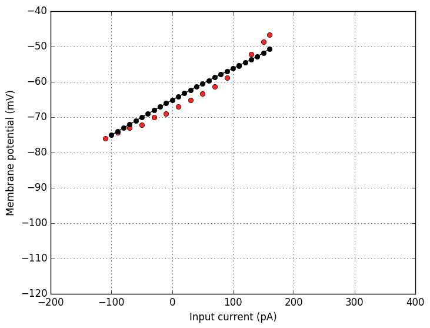</a>
</td>
</tr>
</table>  
 
<table border="1">
<tr>
<td width="130px">

<b>488695444</b>

Primary visual area, layer 5

spiny

Rorb-IRES2-Cre

<a href="http://celltypes.brain-map.org/mouse/experiment/electrophysiology/488695444">Source data</a>

</td>
<td>

</td>
<td>
<a href="spikes_488695444.png">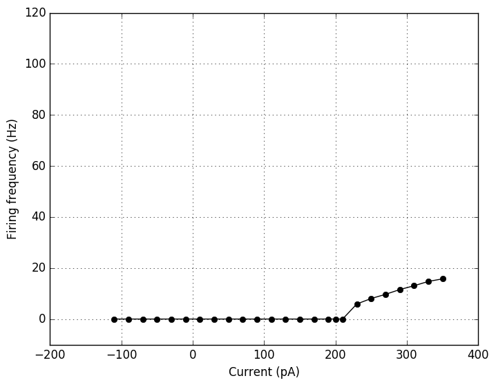</a>
</td>
<td>
<a href="subthreshold_488695444.png">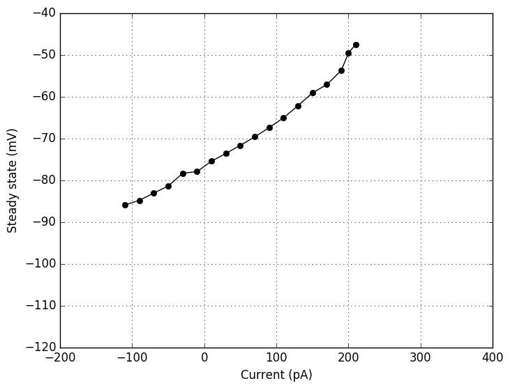</a>
</td>
</tr>
<tr>
<td width="130px">

<b>Izhikevich cell model tuned to dataset 488695444</b>

<a href="https://github.com/OpenSourceBrain/AllenInstituteNeuroML/blob/master/CellTypesDatabase/tune/tuned_cells/Izh_488695444.cell.nml">Tuned model</a>

</td>
<td>

</td>
<td>

</td>
<td>

</td>
</tr>
<tr>
<td width="130px">

<b>HH cell model tuned to dataset 488695444</b>

<a href="https://github.com/OpenSourceBrain/AllenInstituteNeuroML/blob/master/CellTypesDatabase/tune/tuned_cells/HH_488695444.cell.nml">Tuned model</a>

</td>
<td>

</td>
<td>

</td>
<td>

</td>
</tr>
</table>  
 
<table border="1">
<tr>
<td width="130px">

<b>488697163</b>

Primary visual area, layer 5

spiny

Rorb-IRES2-Cre

<a href="http://celltypes.brain-map.org/mouse/experiment/electrophysiology/488697163">Source data</a>

</td>
<td>
<a href="traces_488697163.png">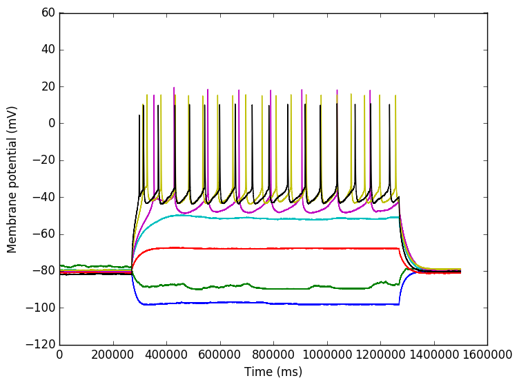</a>
</td>
<td>

</td>
<td>
<a href="subthreshold_488697163.png">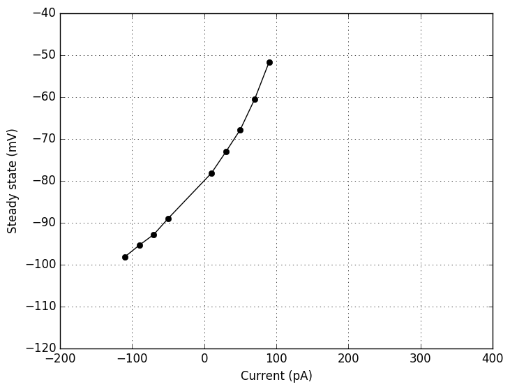</a>
</td>
</tr>
<tr>
<td width="130px">

<b>Izhikevich cell model tuned to dataset 488697163</b>

<a href="https://github.com/OpenSourceBrain/AllenInstituteNeuroML/blob/master/CellTypesDatabase/tune/tuned_cells/Izh_488697163.cell.nml">Tuned model</a>

</td>
<td>
<a href="../../../tune/tuned_cells/summary/Izh_488697163_traces.png">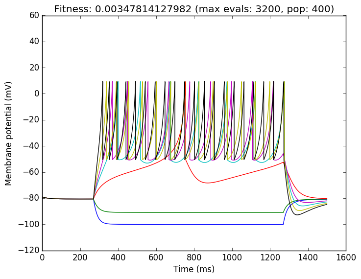</a>
</td>
<td>
<a href="../../../tune/tuned_cells/summary/Izh_488697163_if.png">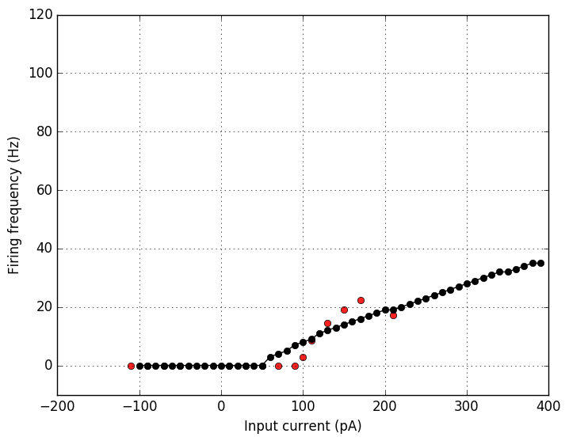</a>
</td>
<td>
<a href="../../../tune/tuned_cells/summary/Izh_488697163_iv.png">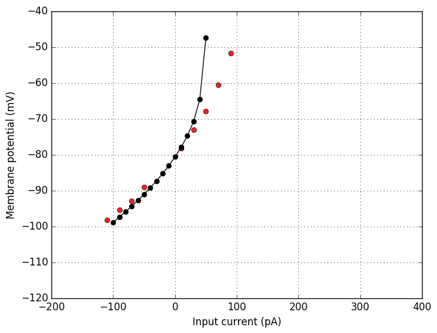</a>
</td>
</tr>
<tr>
<td width="130px">

<b>HH cell model tuned to dataset 488697163</b>

<a href="https://github.com/OpenSourceBrain/AllenInstituteNeuroML/blob/master/CellTypesDatabase/tune/tuned_cells/HH_488697163.cell.nml">Tuned model</a>

</td>
<td>
<a href="../../../tune/tuned_cells/summary/HH_488697163_traces.png">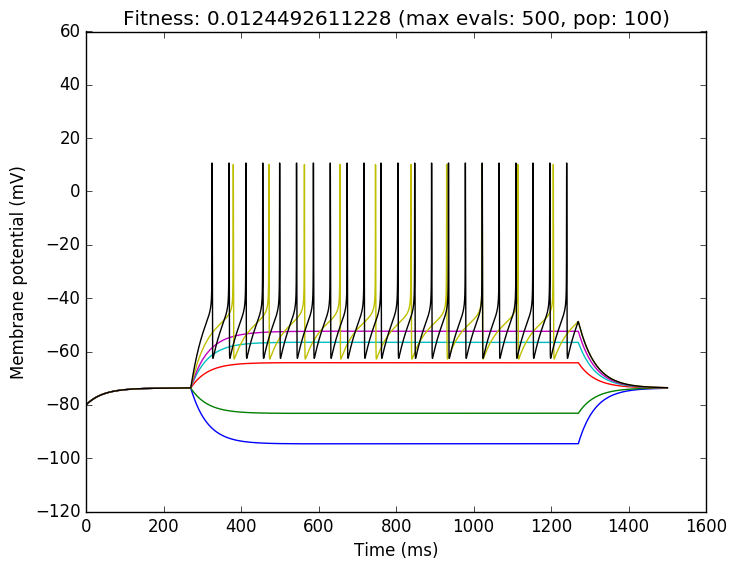</a>
</td>
<td>
<a href="../../../tune/tuned_cells/summary/HH_488697163_if.png">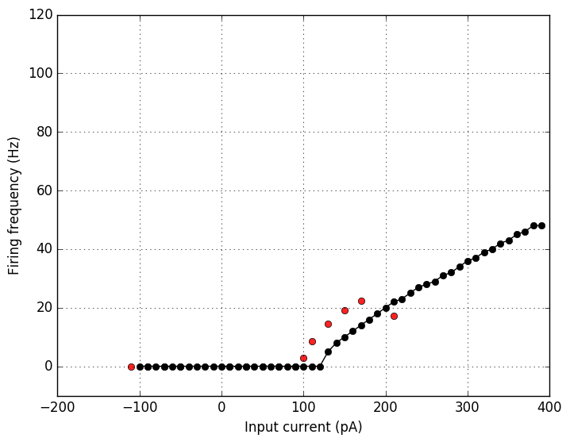</a>
</td>
<td>
<a href="../../../tune/tuned_cells/summary/HH_488697163_iv.png">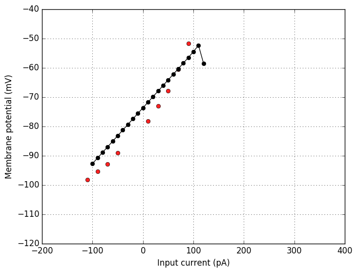</a>
</td>
</tr>
</table>  
 
