
Cell models tuned to data extracted from Cell Types Database. Note: these are preliminary models designed to test the framework for generating NeuroML models from this data, not the final, optimised models.

<table border="1">
<tr>
<td width="130px">

<b>464198958</b>

Primary visual area, layer 5

aspiny

Sst-IRES-Cre

<a href="http://celltypes.brain-map.org/mouse/experiment/electrophysiology/464198958">Source data</a>

</td>
<td>
<a href="traces_464198958.png">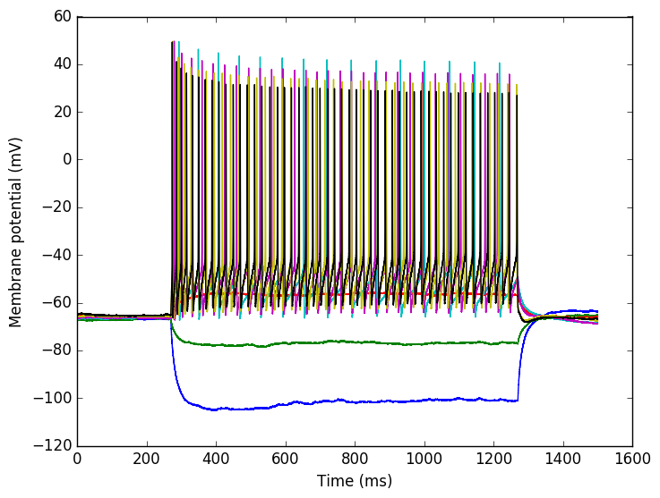</a>
</td>
<td>
<a href="spikes_464198958.png">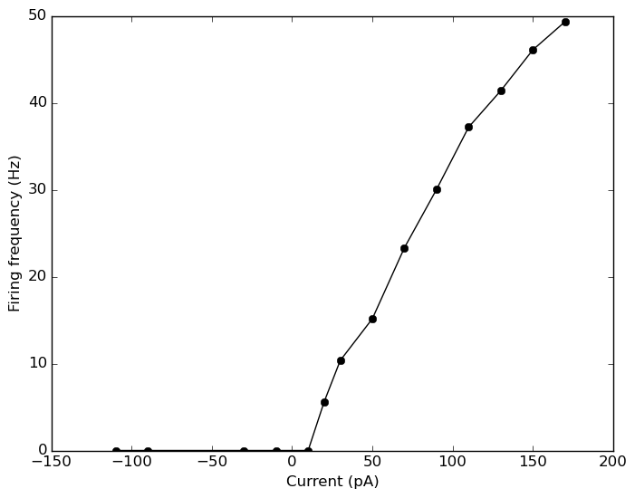</a>
</td>
<td>
<a href="subthreshold_464198958.png">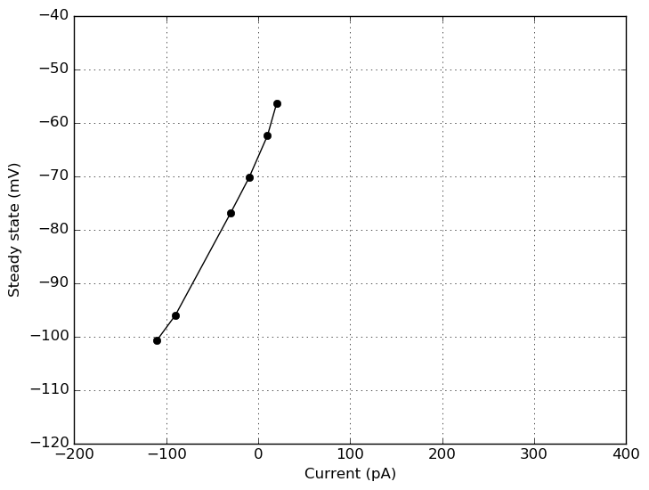</a>
</td>
</tr>
<tr>
<td width="130px">

<b>Izhikevich cell model tuned to dataset 464198958</b>

<a href="https://github.com/OpenSourceBrain/AllenInstituteNeuroML/blob/master/CellTypesDatabase/tune/tuned_cells/Izh/Izh_464198958.cell.nml">Tuned model</a>

</td>
<td>
<a href="../../tune/tuned_cells/summary/Izh_464198958_traces.png">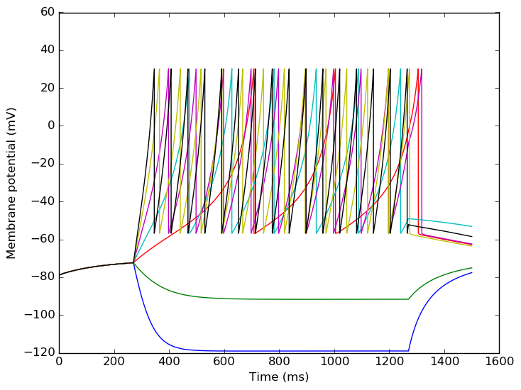</a>
</td>
<td>
<a href="../../tune/tuned_cells/summary/Izh_464198958_if.png">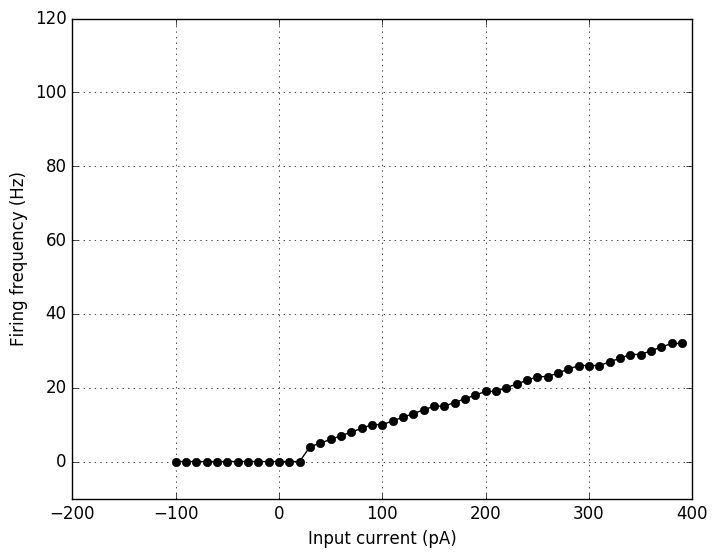</a>
</td>
<td>
<a href="../../tune/tuned_cells/summary/Izh_464198958_iv.png">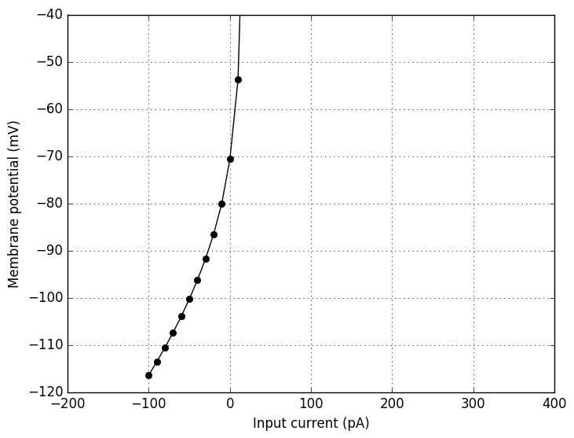</a>
</td>
</tr>
<tr>
<td width="130px">

<b>HH cell model tuned to dataset 464198958</b>

<a href="https://github.com/OpenSourceBrain/AllenInstituteNeuroML/blob/master/CellTypesDatabase/tune/tuned_cells/HH/HH_464198958.cell.nml">Tuned model</a>

</td>
<td>
<a href="../../tune/tuned_cells/summary/HH_464198958_traces.png">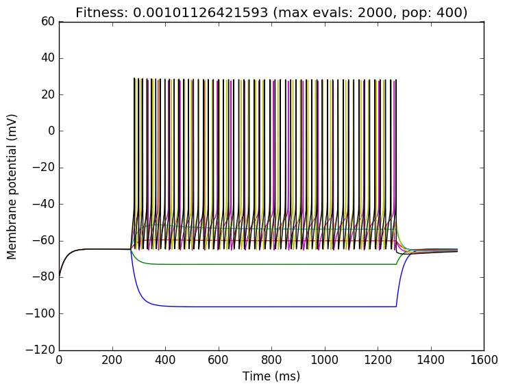</a>
</td>
<td>
<a href="../../tune/tuned_cells/summary/HH_464198958_if.png">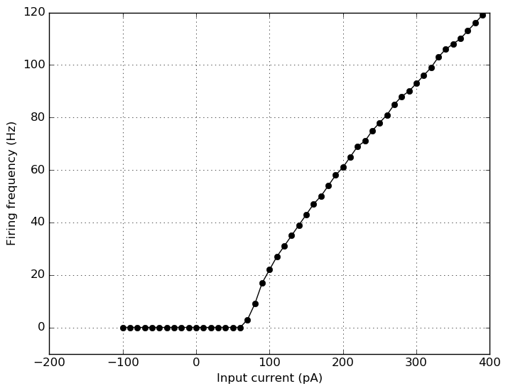</a>
</td>
<td>
<a href="../../tune/tuned_cells/summary/HH_464198958_iv.png">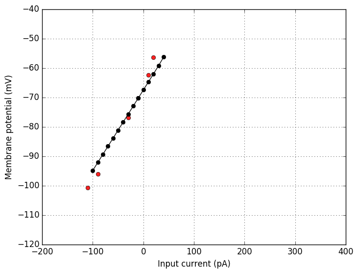</a>
</td>
</tr>
<tr>
<td width="130px">

<b>HH2 cell model tuned to dataset 464198958</b>

<a href="https://github.com/OpenSourceBrain/AllenInstituteNeuroML/blob/master/CellTypesDatabase/tune/tuned_cells/HH2/HH2_464198958.cell.nml">Tuned model</a>

</td>
<td>
<a href="../../tune/tuned_cells/summary/HH2_464198958_traces.png">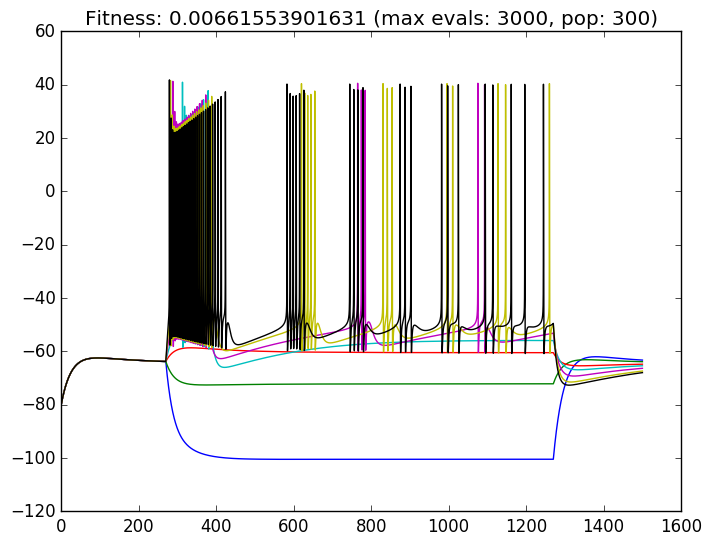</a>
</td>
<td>
<a href="../../tune/tuned_cells/summary/HH2_464198958_if.png">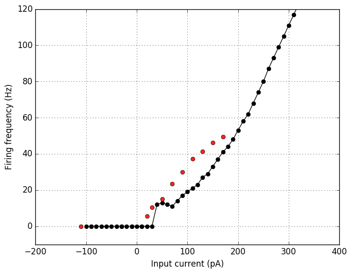</a>
</td>
<td>
<a href="../../tune/tuned_cells/summary/HH2_464198958_iv.png">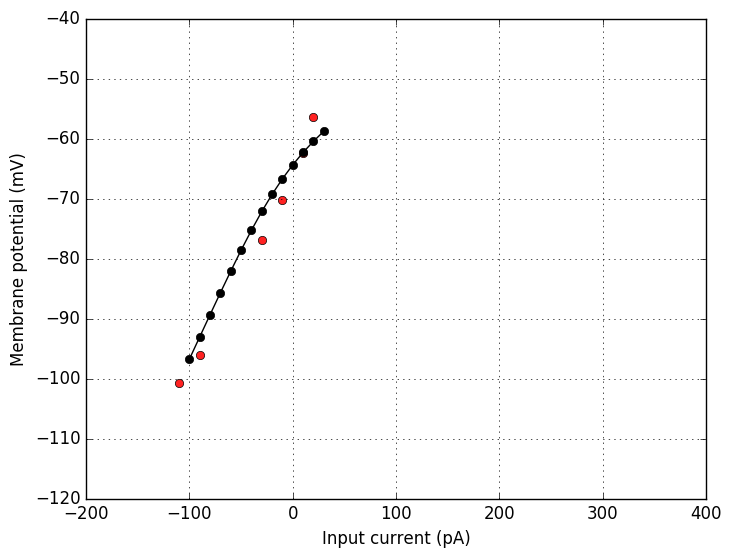</a>
</td>
</tr>
<tr>
<td width="130px">

<b>Allen HH cell model tuned to dataset 464198958</b>

<a href="https://github.com/OpenSourceBrain/AllenInstituteNeuroML/blob/master/CellTypesDatabase/tune/tuned_cells/AllenHH/AllenHH_464198958.cell.nml">Tuned model</a>

</td>
<td>
<a href="../../tune/tuned_cells/summary/AllenHH_464198958_traces.png">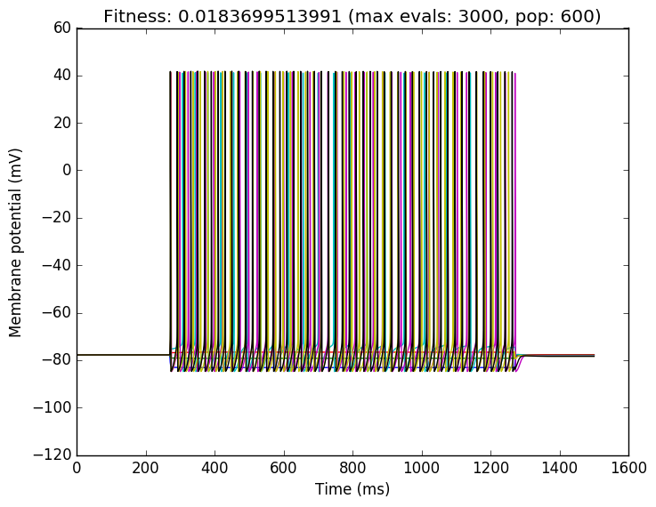</a>
</td>
<td>
<a href="../../tune/tuned_cells/summary/AllenHH_464198958_if.png">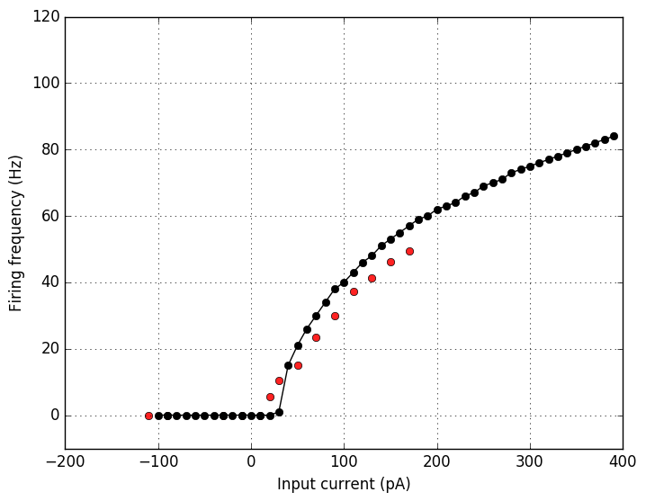</a>
</td>
<td>
<a href="../../tune/tuned_cells/summary/AllenHH_464198958_iv.png">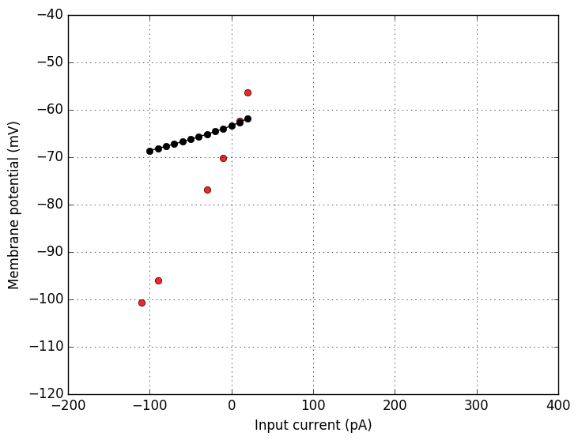</a>
</td>
</tr>
</table>  
 
<table border="1">
<tr>
<td width="130px">

<b>468120757</b>

Primary visual area, layer 5

spiny

Scnn1a-Tg3-Cre

<a href="http://celltypes.brain-map.org/mouse/experiment/electrophysiology/468120757">Source data</a>

</td>
<td>
<a href="traces_468120757.png">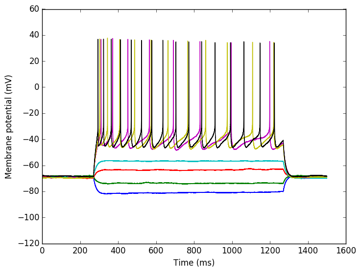</a>
</td>
<td>
<a href="spikes_468120757.png">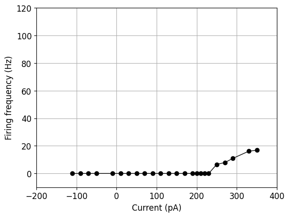</a>
</td>
<td>
<a href="subthreshold_468120757.png">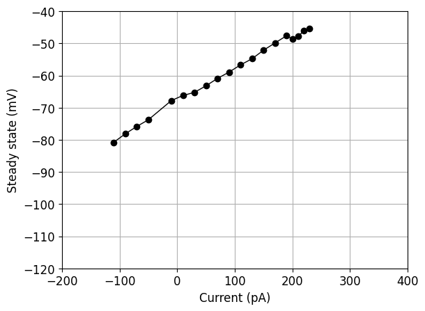</a>
</td>
</tr>
<tr>
<td width="130px">

<b>Izhikevich cell model tuned to dataset 468120757</b>

<a href="https://github.com/OpenSourceBrain/AllenInstituteNeuroML/blob/master/CellTypesDatabase/tune/tuned_cells/Izh/Izh_468120757.cell.nml">Tuned model</a>

</td>
<td>
<a href="../../tune/tuned_cells/summary/Izh_468120757_traces.png">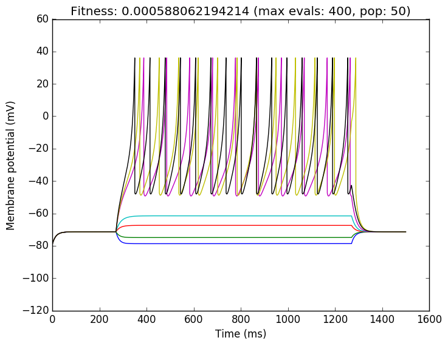</a>
</td>
<td>
<a href="../../tune/tuned_cells/summary/Izh_468120757_if.png">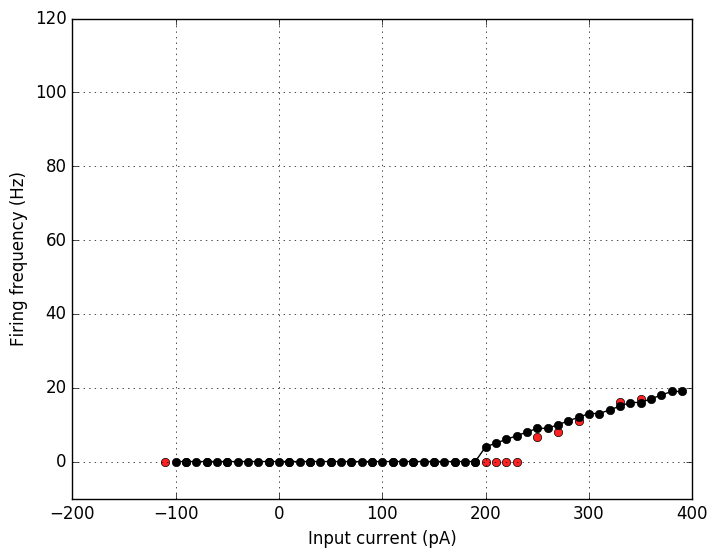</a>
</td>
<td>
<a href="../../tune/tuned_cells/summary/Izh_468120757_iv.png">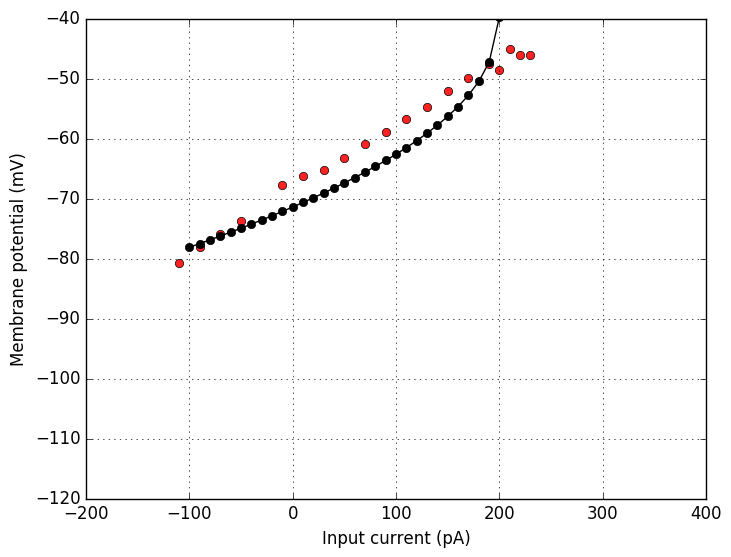</a>
</td>
</tr>
<tr>
<td width="130px">

<b>HH cell model tuned to dataset 468120757</b>

<a href="https://github.com/OpenSourceBrain/AllenInstituteNeuroML/blob/master/CellTypesDatabase/tune/tuned_cells/HH/HH_468120757.cell.nml">Tuned model</a>

</td>
<td>
<a href="../../tune/tuned_cells/summary/HH_468120757_traces.png">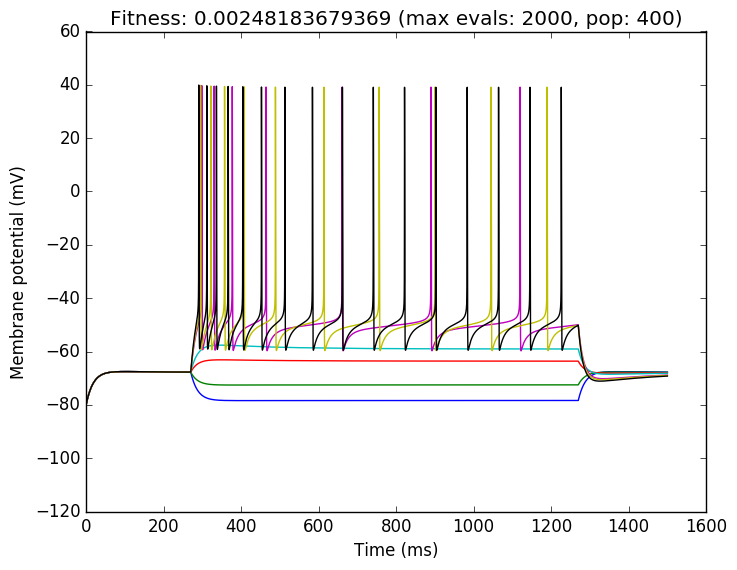</a>
</td>
<td>
<a href="../../tune/tuned_cells/summary/HH_468120757_if.png">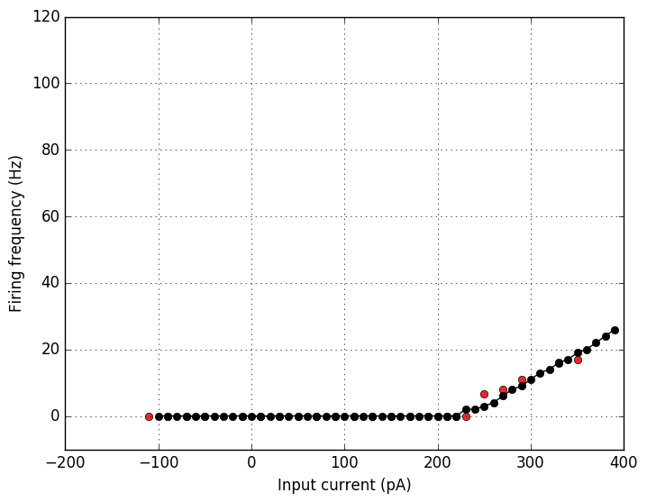</a>
</td>
<td>
<a href="../../tune/tuned_cells/summary/HH_468120757_iv.png">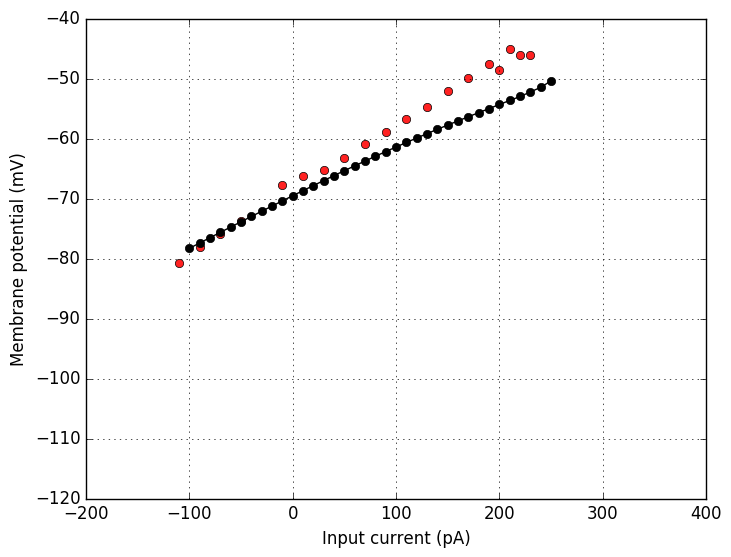</a>
</td>
</tr>
<tr>
<td width="130px">

<b>HH2 cell model tuned to dataset 468120757</b>

<a href="https://github.com/OpenSourceBrain/AllenInstituteNeuroML/blob/master/CellTypesDatabase/tune/tuned_cells/HH2/HH2_468120757.cell.nml">Tuned model</a>

</td>
<td>
<a href="../../tune/tuned_cells/summary/HH2_468120757_traces.png">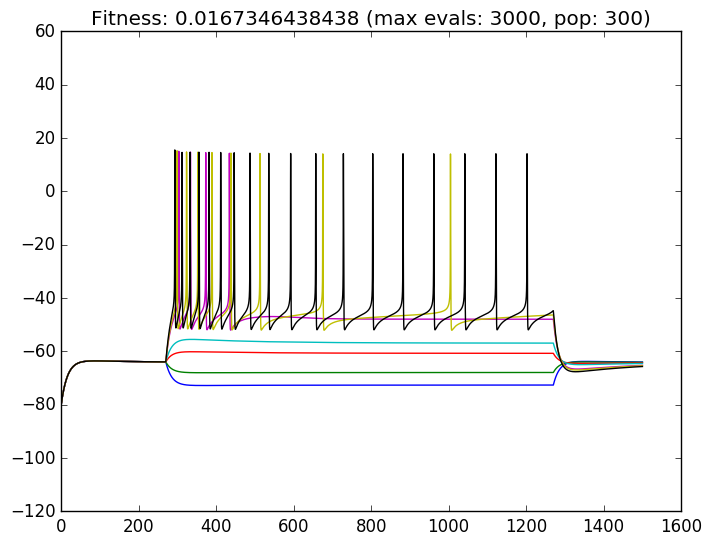</a>
</td>
<td>
<a href="../../tune/tuned_cells/summary/HH2_468120757_if.png">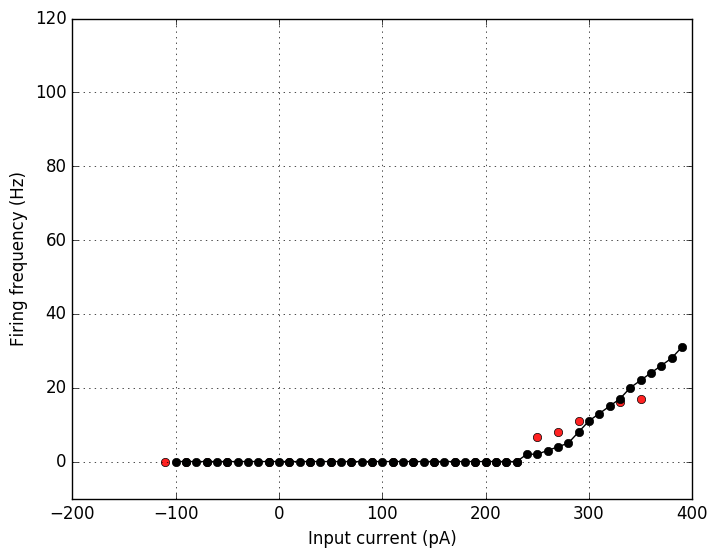</a>
</td>
<td>
<a href="../../tune/tuned_cells/summary/HH2_468120757_iv.png">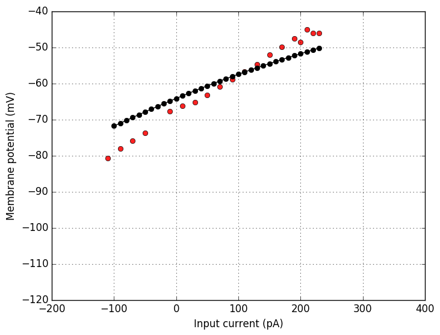</a>
</td>
</tr>
<tr>
<td width="130px">

<b>Allen HH cell model tuned to dataset 468120757</b>

<a href="https://github.com/OpenSourceBrain/AllenInstituteNeuroML/blob/master/CellTypesDatabase/tune/tuned_cells/AllenHH/AllenHH_468120757.cell.nml">Tuned model</a>

</td>
<td>
<a href="../../tune/tuned_cells/summary/AllenHH_468120757_traces.png">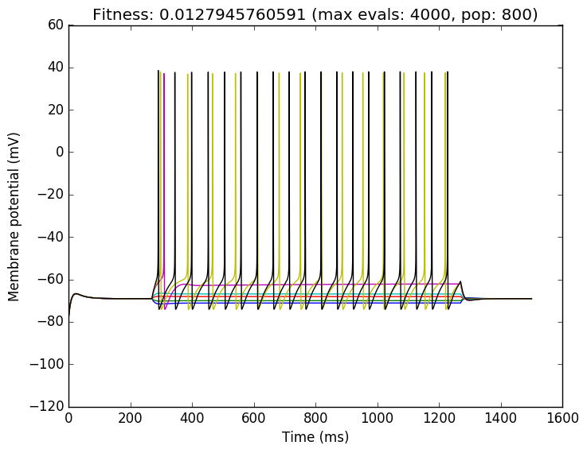</a>
</td>
<td>
<a href="../../tune/tuned_cells/summary/AllenHH_468120757_if.png">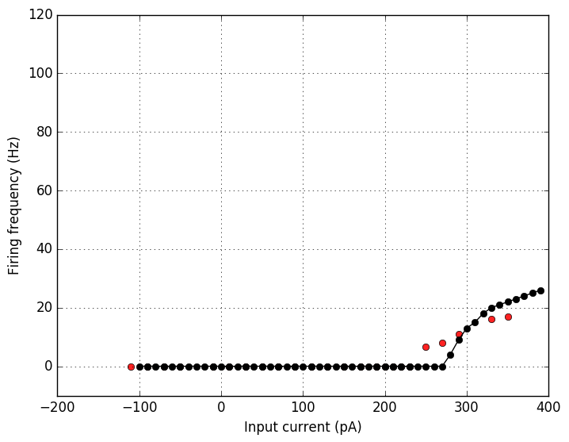</a>
</td>
<td>
<a href="../../tune/tuned_cells/summary/AllenHH_468120757_iv.png">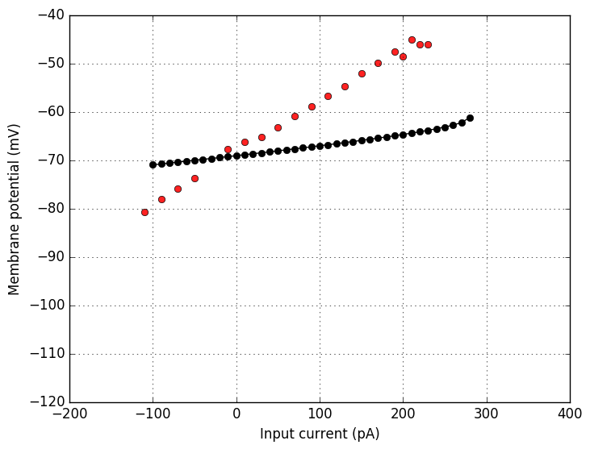</a>
</td>
</tr>
</table>  
 
<table border="1">
<tr>
<td width="130px">

<b>476686112</b>

Primary visual area, layer 2/3

aspiny

Sst-IRES-Cre

<a href="http://celltypes.brain-map.org/mouse/experiment/electrophysiology/476686112">Source data</a>

</td>
<td>
<a href="traces_476686112.png">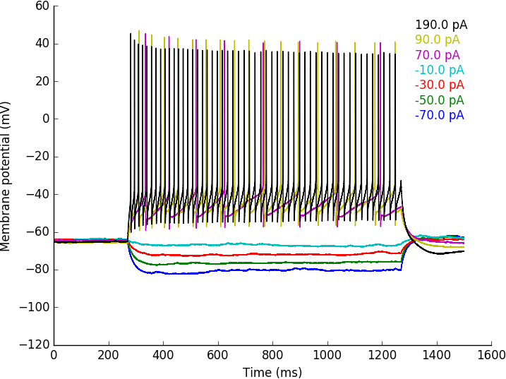</a>
</td>
<td>
<a href="spikes_476686112.png">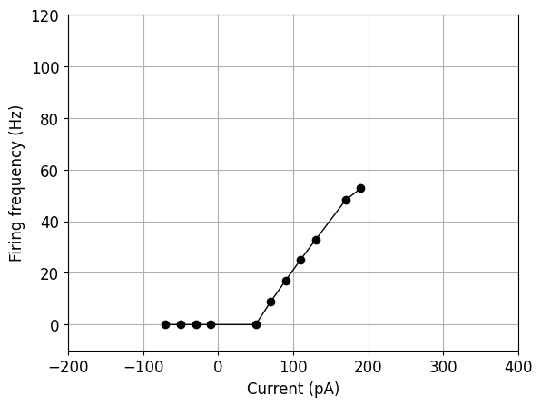</a>
</td>
<td>
<a href="subthreshold_476686112.png">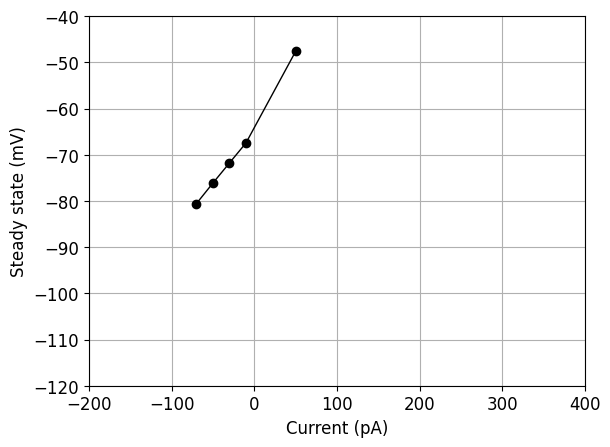</a>
</td>
</tr>
<tr>
<td width="130px">

<b>Izhikevich cell model tuned to dataset 476686112</b>

<a href="https://github.com/OpenSourceBrain/AllenInstituteNeuroML/blob/master/CellTypesDatabase/tune/tuned_cells/Izh/Izh_476686112.cell.nml">Tuned model</a>

</td>
<td>
<a href="../../tune/tuned_cells/summary/Izh_476686112_traces.png">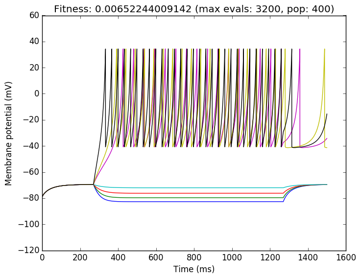</a>
</td>
<td>
<a href="../../tune/tuned_cells/summary/Izh_476686112_if.png">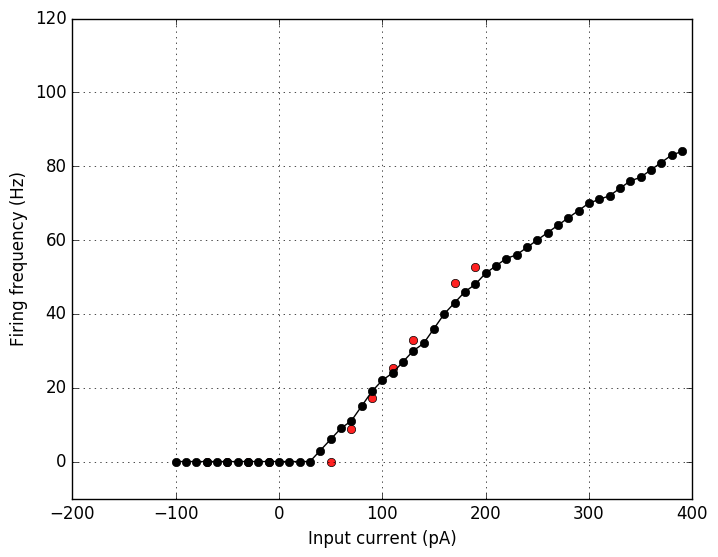</a>
</td>
<td>
<a href="../../tune/tuned_cells/summary/Izh_476686112_iv.png">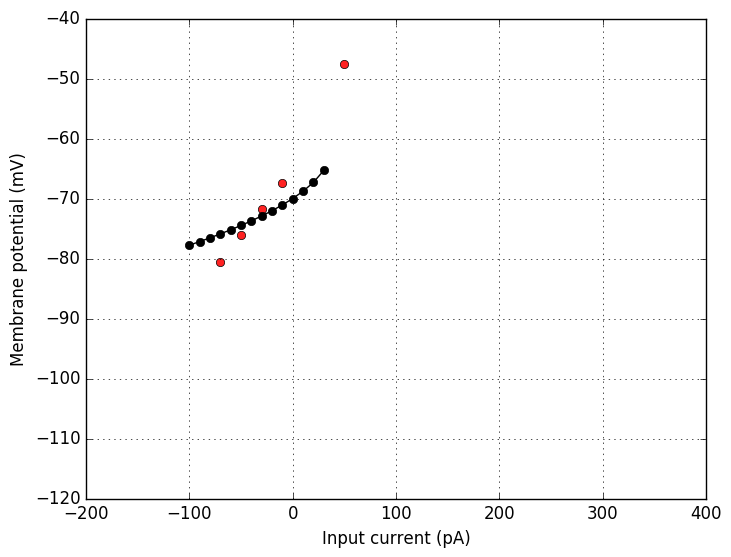</a>
</td>
</tr>
<tr>
<td width="130px">

<b>HH cell model tuned to dataset 476686112</b>

<a href="https://github.com/OpenSourceBrain/AllenInstituteNeuroML/blob/master/CellTypesDatabase/tune/tuned_cells/HH/HH_476686112.cell.nml">Tuned model</a>

</td>
<td>
<a href="../../tune/tuned_cells/summary/HH_476686112_traces.png">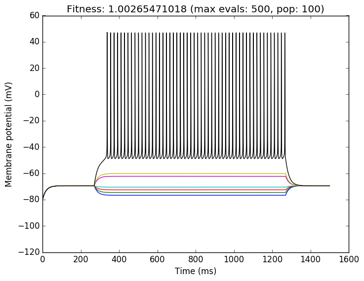</a>
</td>
<td>
<a href="../../tune/tuned_cells/summary/HH_476686112_if.png">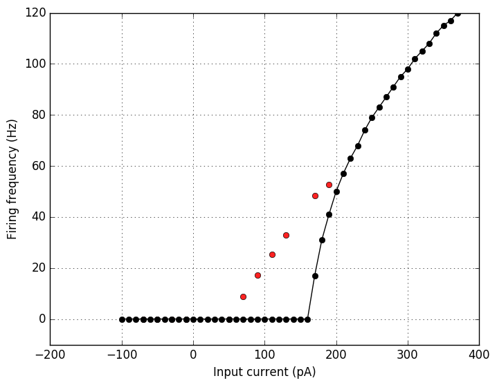</a>
</td>
<td>
<a href="../../tune/tuned_cells/summary/HH_476686112_iv.png">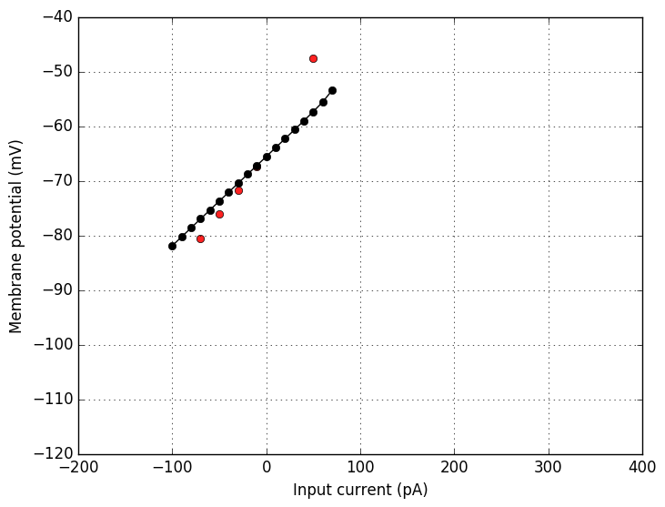</a>
</td>
</tr>
<tr>
<td width="130px">

<b>HH2 cell model tuned to dataset 476686112</b>

<a href="https://github.com/OpenSourceBrain/AllenInstituteNeuroML/blob/master/CellTypesDatabase/tune/tuned_cells/HH2/HH2_476686112.cell.nml">Tuned model</a>

</td>
<td>
<a href="../../tune/tuned_cells/summary/HH2_476686112_traces.png">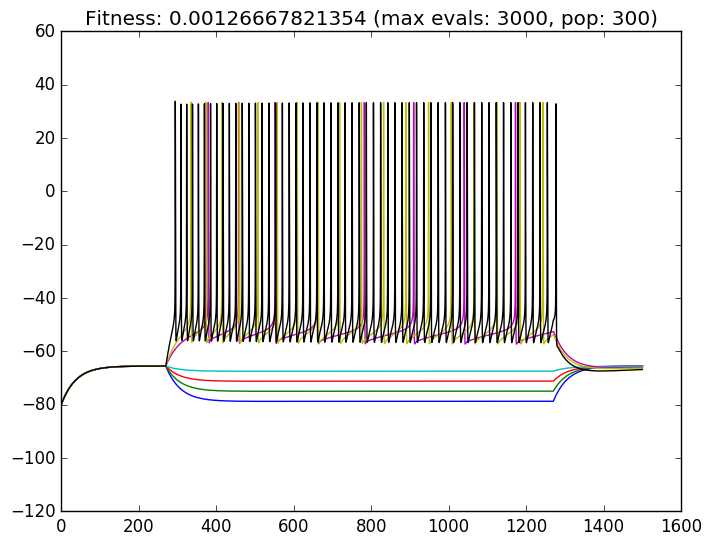</a>
</td>
<td>
<a href="../../tune/tuned_cells/summary/HH2_476686112_if.png">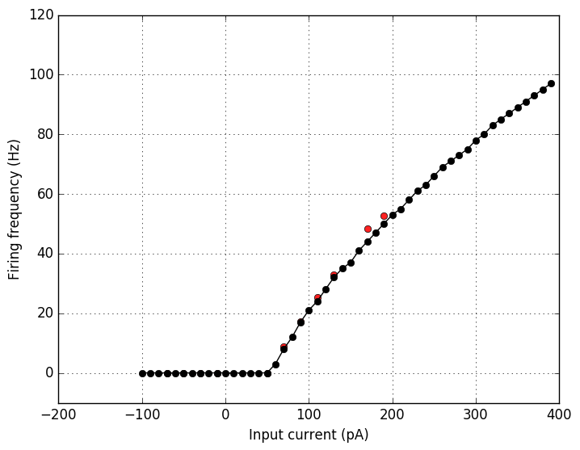</a>
</td>
<td>
<a href="../../tune/tuned_cells/summary/HH2_476686112_iv.png">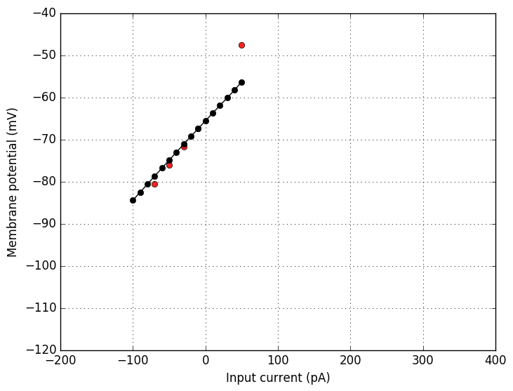</a>
</td>
</tr>
<tr>
<td width="130px">

<b>Allen HH cell model tuned to dataset 476686112</b>

<a href="https://github.com/OpenSourceBrain/AllenInstituteNeuroML/blob/master/CellTypesDatabase/tune/tuned_cells/AllenHH/AllenHH_476686112.cell.nml">Tuned model</a>

</td>
<td>
<a href="../../tune/tuned_cells/summary/AllenHH_476686112_traces.png">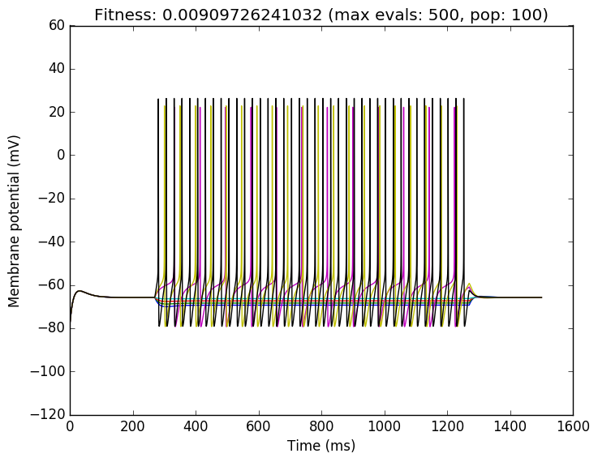</a>
</td>
<td>
<a href="../../tune/tuned_cells/summary/AllenHH_476686112_if.png">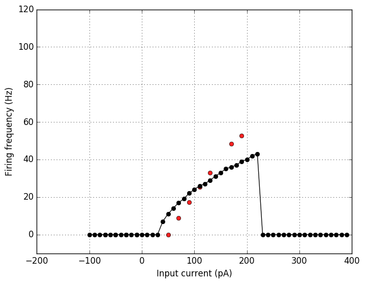</a>
</td>
<td>
<a href="../../tune/tuned_cells/summary/AllenHH_476686112_iv.png">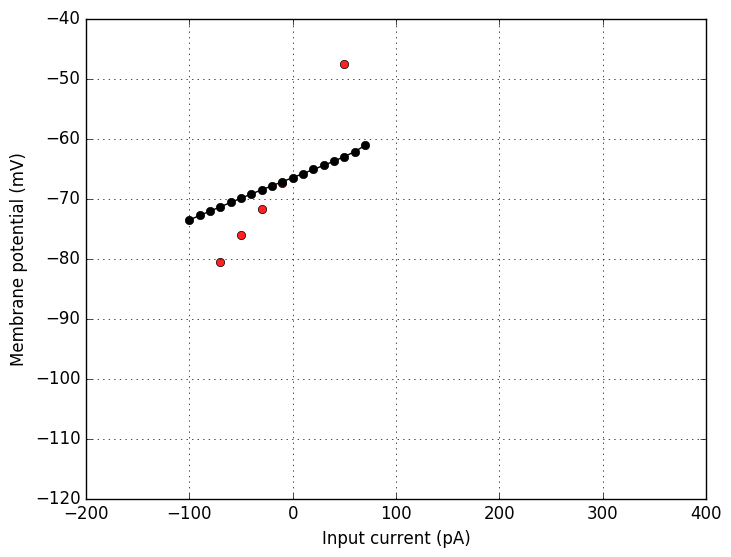</a>
</td>
</tr>
</table>  
 
<table border="1">
<tr>
<td width="130px">

<b>477127614</b>

Primary visual area, layer 2/3

spiny

Slc17a6-IRES-Cre

<a href="http://celltypes.brain-map.org/mouse/experiment/electrophysiology/477127614">Source data</a>

</td>
<td>
<a href="traces_477127614.png">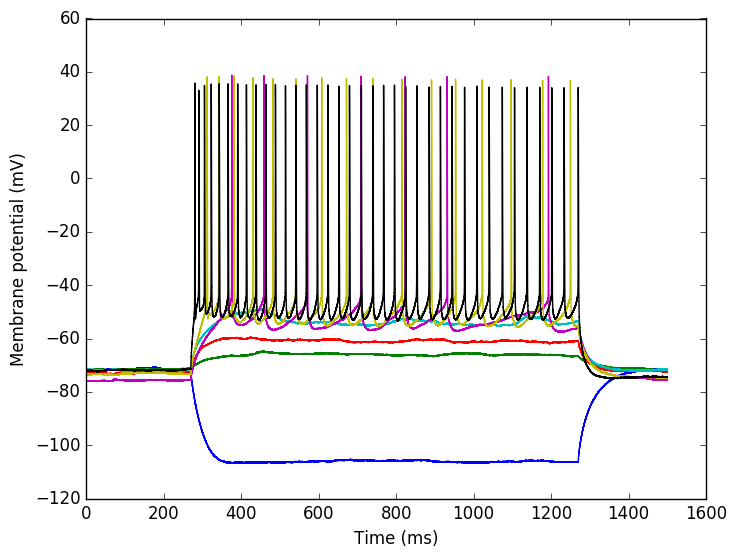</a>
</td>
<td>
<a href="spikes_477127614.png">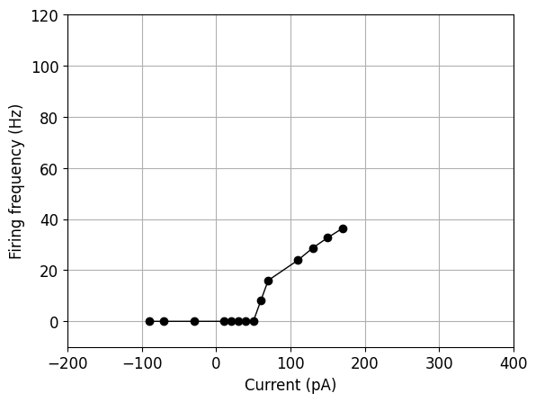</a>
</td>
<td>
<a href="subthreshold_477127614.png">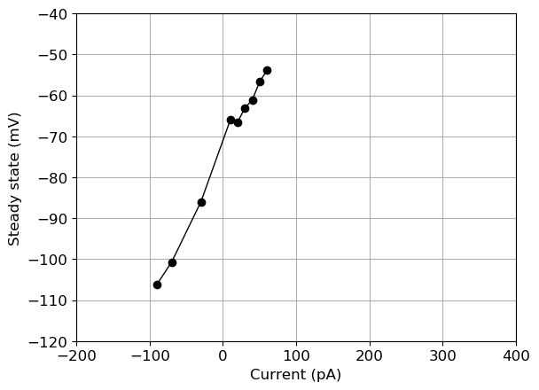</a>
</td>
</tr>
<tr>
<td width="130px">

<b>Izhikevich cell model tuned to dataset 477127614</b>

<a href="https://github.com/OpenSourceBrain/AllenInstituteNeuroML/blob/master/CellTypesDatabase/tune/tuned_cells/Izh/Izh_477127614.cell.nml">Tuned model</a>

</td>
<td>
<a href="../../tune/tuned_cells/summary/Izh_477127614_traces.png">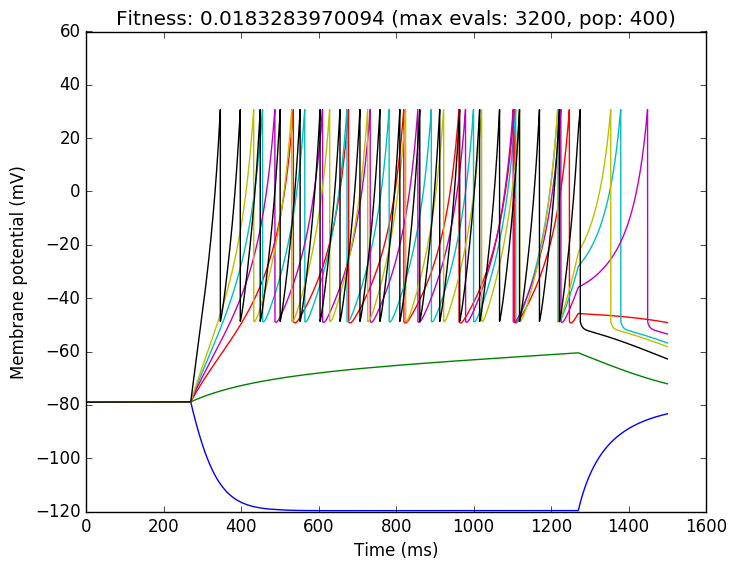</a>
</td>
<td>
<a href="../../tune/tuned_cells/summary/Izh_477127614_if.png">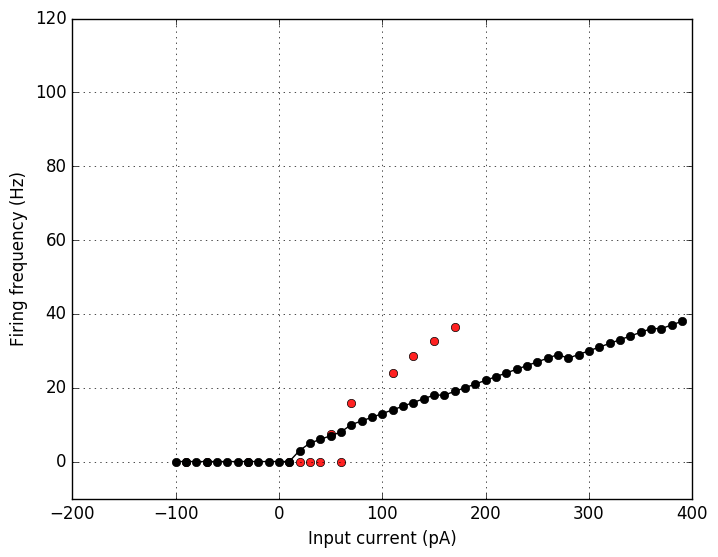</a>
</td>
<td>
<a href="../../tune/tuned_cells/summary/Izh_477127614_iv.png">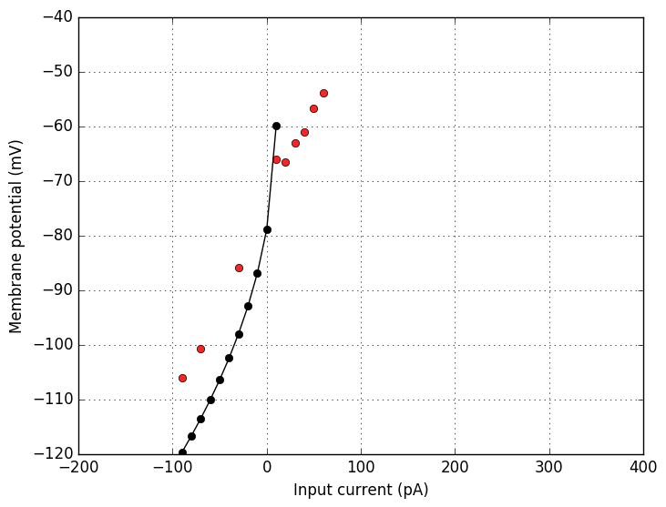</a>
</td>
</tr>
<tr>
<td width="130px">

<b>HH cell model tuned to dataset 477127614</b>

<a href="https://github.com/OpenSourceBrain/AllenInstituteNeuroML/blob/master/CellTypesDatabase/tune/tuned_cells/HH/HH_477127614.cell.nml">Tuned model</a>

</td>
<td>
<a href="../../tune/tuned_cells/summary/HH_477127614_traces.png">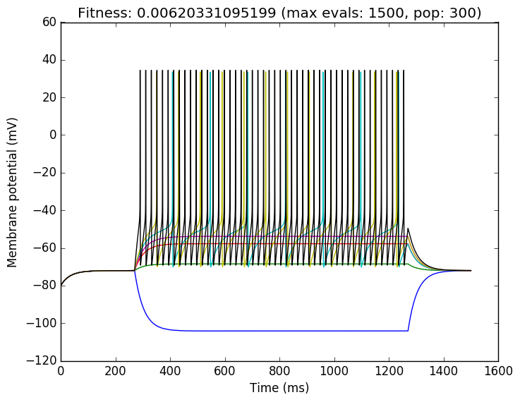</a>
</td>
<td>
<a href="../../tune/tuned_cells/summary/HH_477127614_if.png">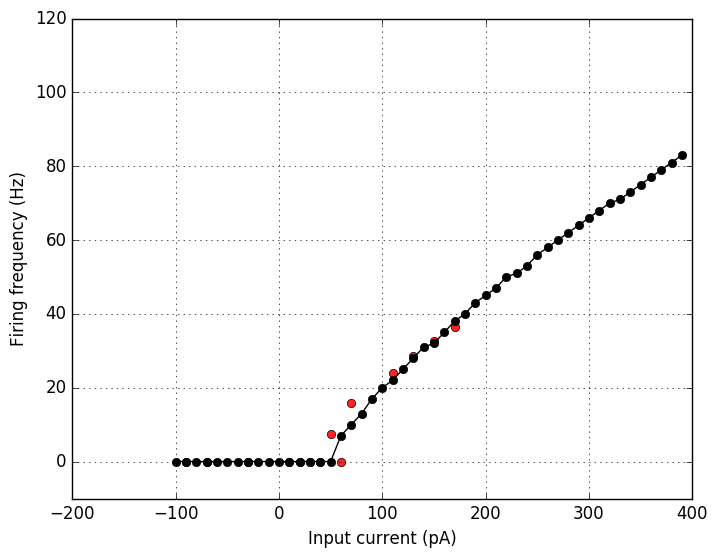</a>
</td>
<td>
<a href="../../tune/tuned_cells/summary/HH_477127614_iv.png">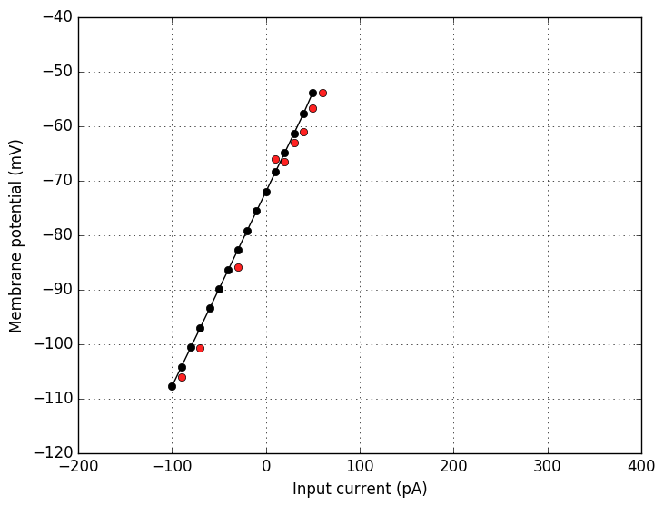</a>
</td>
</tr>
<tr>
<td width="130px">

<b>HH2 cell model tuned to dataset 477127614</b>

<a href="https://github.com/OpenSourceBrain/AllenInstituteNeuroML/blob/master/CellTypesDatabase/tune/tuned_cells/HH2/HH2_477127614.cell.nml">Tuned model</a>

</td>
<td>
<a href="../../tune/tuned_cells/summary/HH2_477127614_traces.png">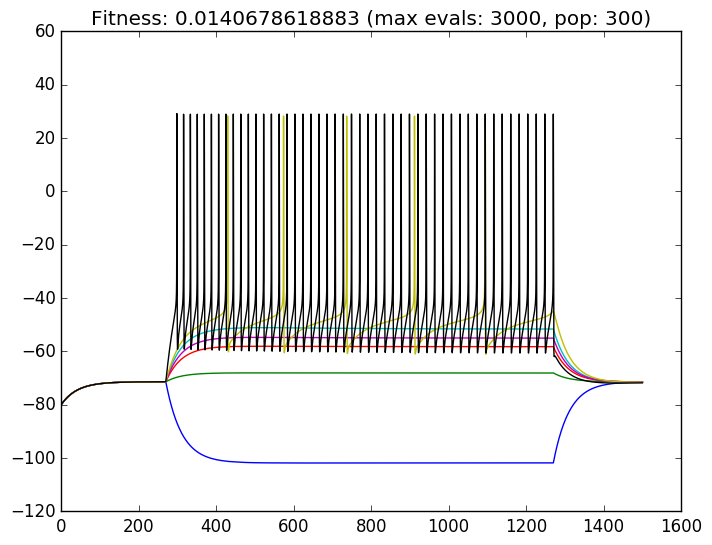</a>
</td>
<td>
<a href="../../tune/tuned_cells/summary/HH2_477127614_if.png">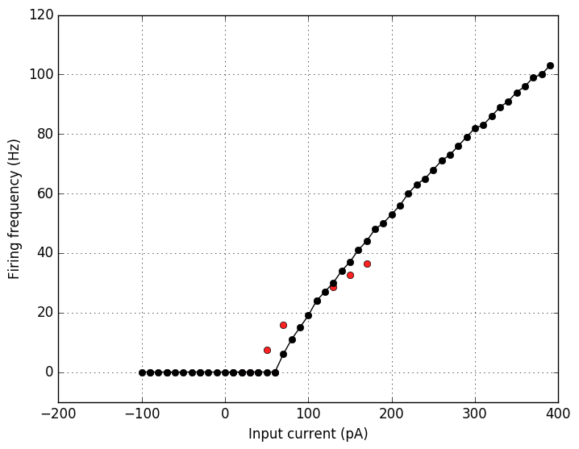</a>
</td>
<td>
<a href="../../tune/tuned_cells/summary/HH2_477127614_iv.png">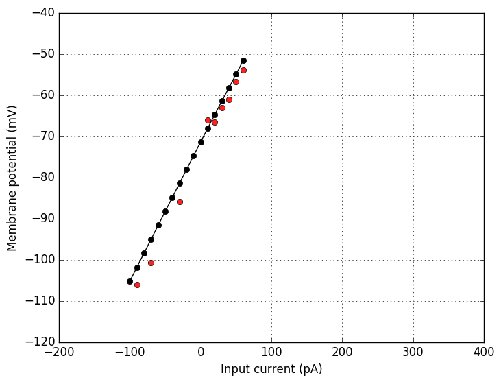</a>
</td>
</tr>
<tr>
<td width="130px">

<b>Allen HH cell model tuned to dataset 477127614</b>

<a href="https://github.com/OpenSourceBrain/AllenInstituteNeuroML/blob/master/CellTypesDatabase/tune/tuned_cells/AllenHH/AllenHH_477127614.cell.nml">Tuned model</a>

</td>
<td>
<a href="../../tune/tuned_cells/summary/AllenHH_477127614_traces.png">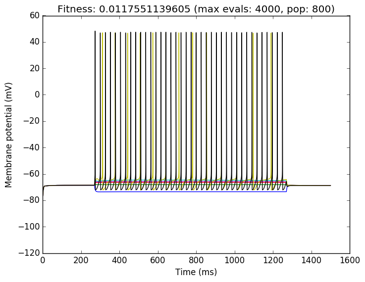</a>
</td>
<td>
<a href="../../tune/tuned_cells/summary/AllenHH_477127614_if.png">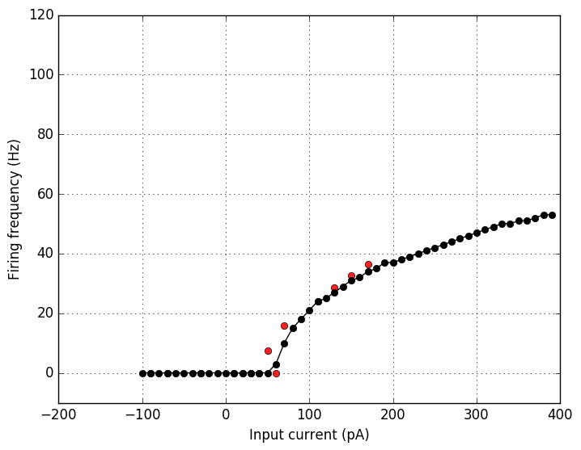</a>
</td>
<td>
<a href="../../tune/tuned_cells/summary/AllenHH_477127614_iv.png">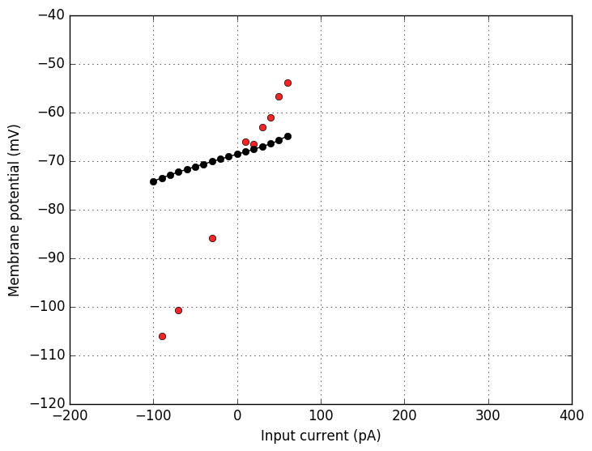</a>
</td>
</tr>
</table>  
 
<table border="1">
<tr>
<td width="130px">

<b>479704527</b>

Primary visual area, layer 4

spiny

Rbp4-Cre_KL100

<a href="http://celltypes.brain-map.org/mouse/experiment/electrophysiology/479704527">Source data</a>

</td>
<td>
<a href="traces_479704527.png">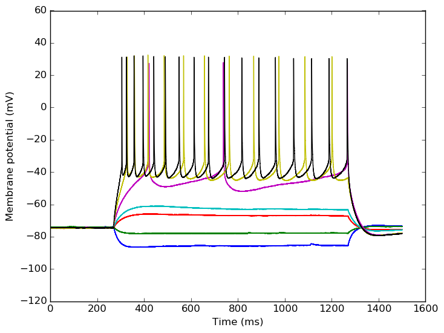</a>
</td>
<td>
<a href="spikes_479704527.png">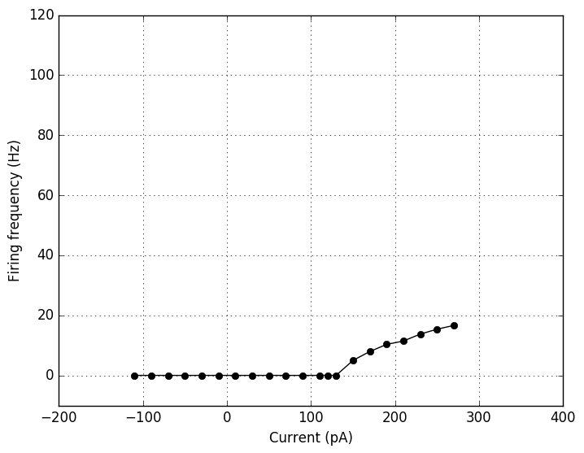</a>
</td>
<td>
<a href="subthreshold_479704527.png">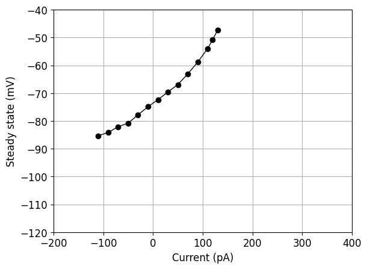</a>
</td>
</tr>
<tr>
<td width="130px">

<b>Izhikevich cell model tuned to dataset 479704527</b>

<a href="https://github.com/OpenSourceBrain/AllenInstituteNeuroML/blob/master/CellTypesDatabase/tune/tuned_cells/Izh/Izh_479704527.cell.nml">Tuned model</a>

</td>
<td>
<a href="../../tune/tuned_cells/summary/Izh_479704527_traces.png">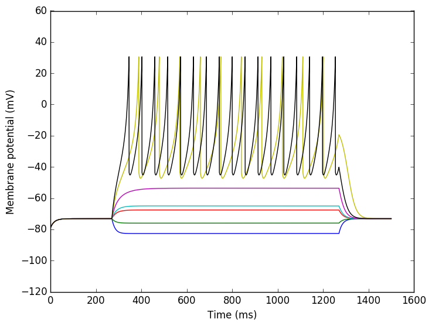</a>
</td>
<td>
<a href="../../tune/tuned_cells/summary/Izh_479704527_if.png">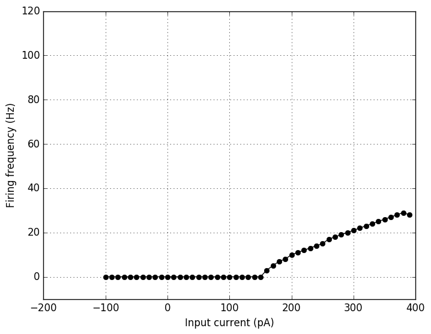</a>
</td>
<td>
<a href="../../tune/tuned_cells/summary/Izh_479704527_iv.png">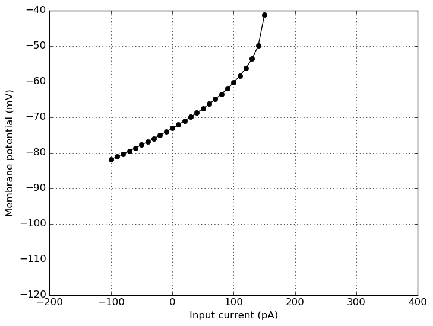</a>
</td>
</tr>
<tr>
<td width="130px">

<b>HH cell model tuned to dataset 479704527</b>

<a href="https://github.com/OpenSourceBrain/AllenInstituteNeuroML/blob/master/CellTypesDatabase/tune/tuned_cells/HH/HH_479704527.cell.nml">Tuned model</a>

</td>
<td>
<a href="../../tune/tuned_cells/summary/HH_479704527_traces.png">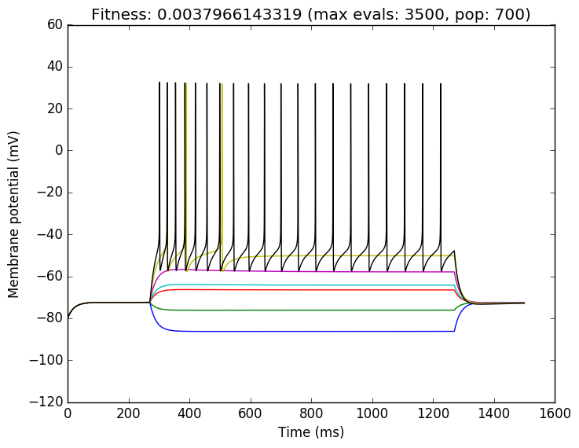</a>
</td>
<td>
<a href="../../tune/tuned_cells/summary/HH_479704527_if.png">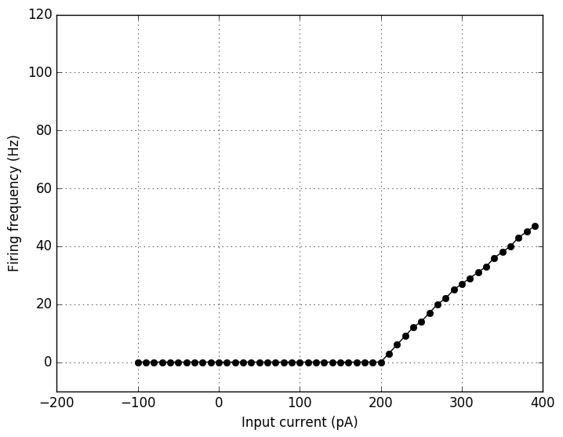</a>
</td>
<td>
<a href="../../tune/tuned_cells/summary/HH_479704527_iv.png">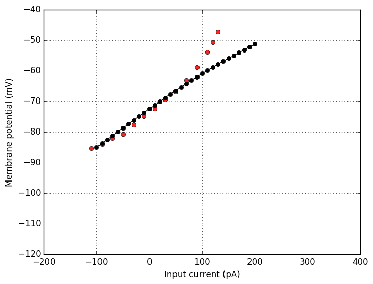</a>
</td>
</tr>
<tr>
<td width="130px">

<b>HH2 cell model tuned to dataset 479704527</b>

<a href="https://github.com/OpenSourceBrain/AllenInstituteNeuroML/blob/master/CellTypesDatabase/tune/tuned_cells/HH2/HH2_479704527.cell.nml">Tuned model</a>

</td>
<td>
<a href="../../tune/tuned_cells/summary/HH2_479704527_traces.png">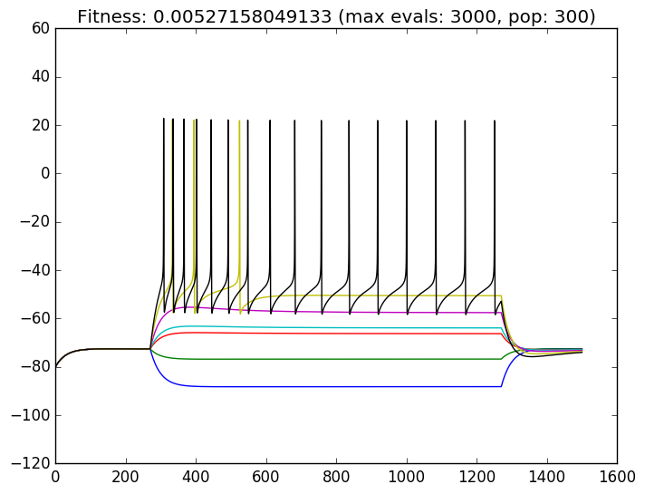</a>
</td>
<td>
<a href="../../tune/tuned_cells/summary/HH2_479704527_if.png">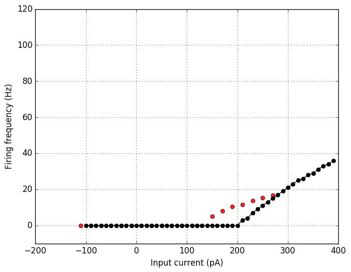</a>
</td>
<td>
<a href="../../tune/tuned_cells/summary/HH2_479704527_iv.png">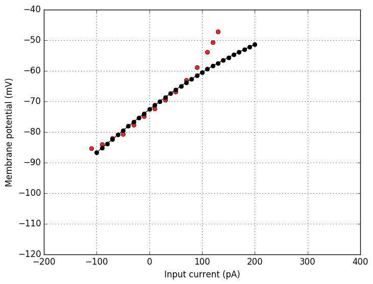</a>
</td>
</tr>
<tr>
<td width="130px">

<b>Allen HH cell model tuned to dataset 479704527</b>

<a href="https://github.com/OpenSourceBrain/AllenInstituteNeuroML/blob/master/CellTypesDatabase/tune/tuned_cells/AllenHH/AllenHH_479704527.cell.nml">Tuned model</a>

</td>
<td>
<a href="../../tune/tuned_cells/summary/AllenHH_479704527_traces.png">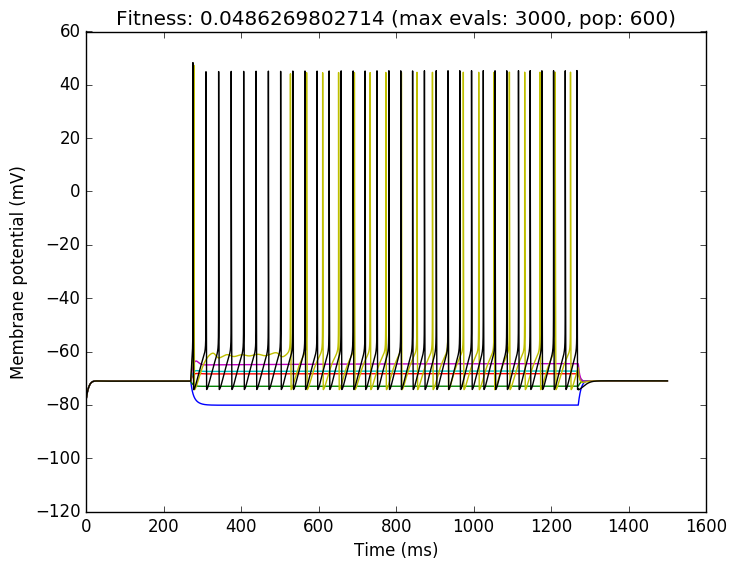</a>
</td>
<td>
<a href="../../tune/tuned_cells/summary/AllenHH_479704527_if.png">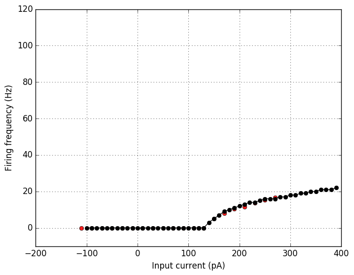</a>
</td>
<td>
<a href="../../tune/tuned_cells/summary/AllenHH_479704527_iv.png">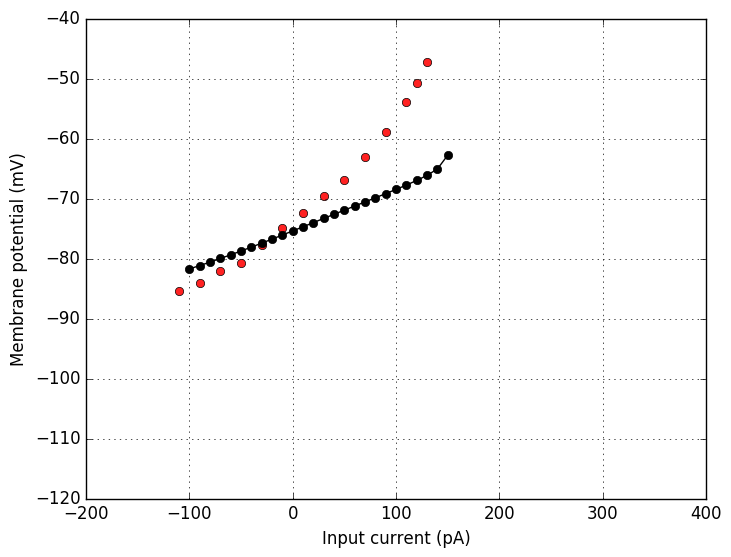</a>
</td>
</tr>
</table>  
 
<table border="1">
<tr>
<td width="130px">

<b>480169178</b>

Primary visual area, layer 5

spiny

Rorb-IRES2-Cre

<a href="http://celltypes.brain-map.org/mouse/experiment/electrophysiology/480169178">Source data</a>

</td>
<td>
<a href="traces_480169178.png">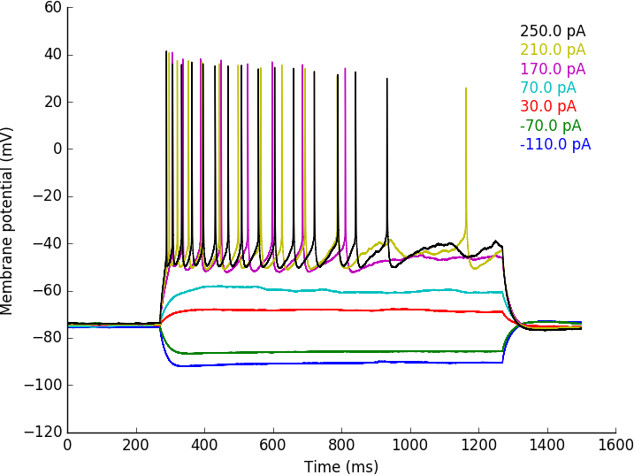</a>
</td>
<td>
<a href="spikes_480169178.png">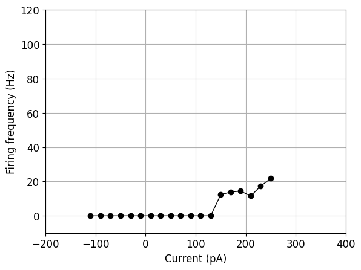</a>
</td>
<td>
<a href="subthreshold_480169178.png">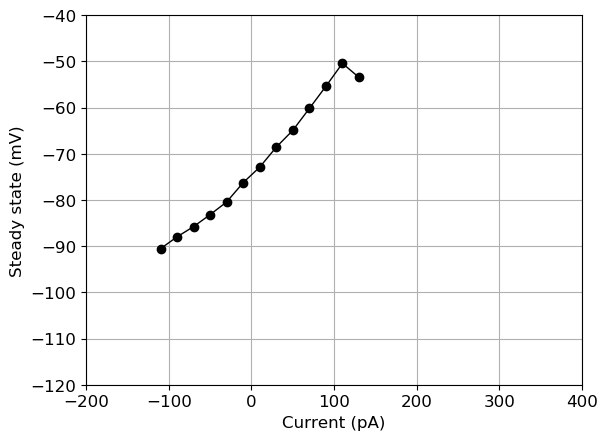</a>
</td>
</tr>
<tr>
<td width="130px">

<b>Izhikevich cell model tuned to dataset 480169178</b>

<a href="https://github.com/OpenSourceBrain/AllenInstituteNeuroML/blob/master/CellTypesDatabase/tune/tuned_cells/Izh/Izh_480169178.cell.nml">Tuned model</a>

</td>
<td>
<a href="../../tune/tuned_cells/summary/Izh_480169178_traces.png">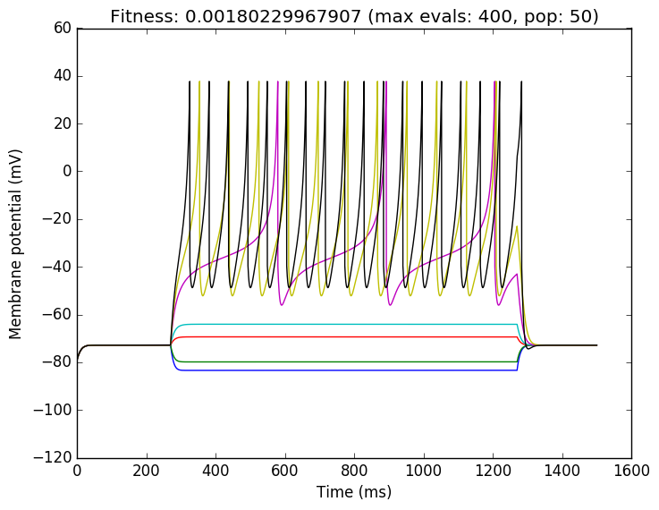</a>
</td>
<td>
<a href="../../tune/tuned_cells/summary/Izh_480169178_if.png">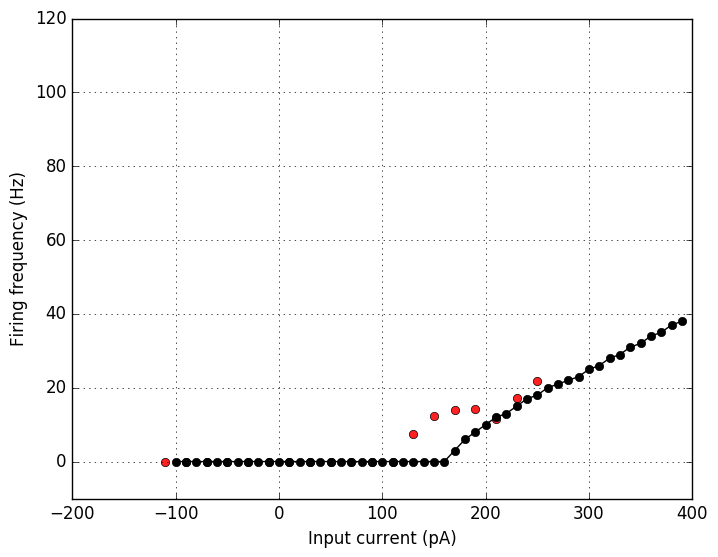</a>
</td>
<td>
<a href="../../tune/tuned_cells/summary/Izh_480169178_iv.png">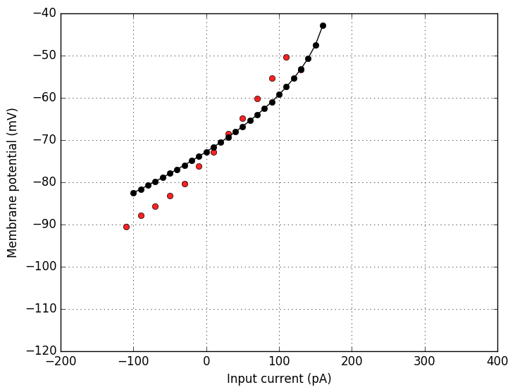</a>
</td>
</tr>
<tr>
<td width="130px">

<b>HH cell model tuned to dataset 480169178</b>

<a href="https://github.com/OpenSourceBrain/AllenInstituteNeuroML/blob/master/CellTypesDatabase/tune/tuned_cells/HH/HH_480169178.cell.nml">Tuned model</a>

</td>
<td>
<a href="../../tune/tuned_cells/summary/HH_480169178_traces.png">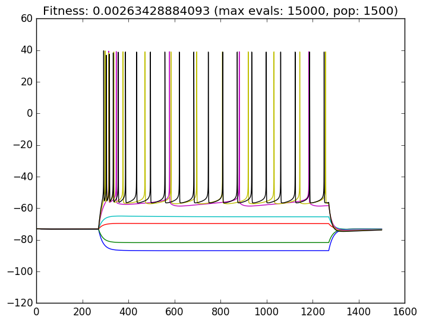</a>
</td>
<td>
<a href="../../tune/tuned_cells/summary/HH_480169178_if.png">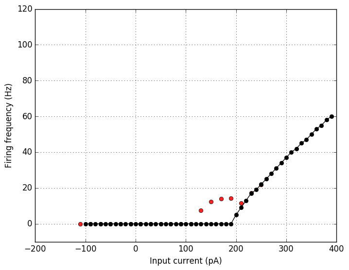</a>
</td>
<td>
<a href="../../tune/tuned_cells/summary/HH_480169178_iv.png">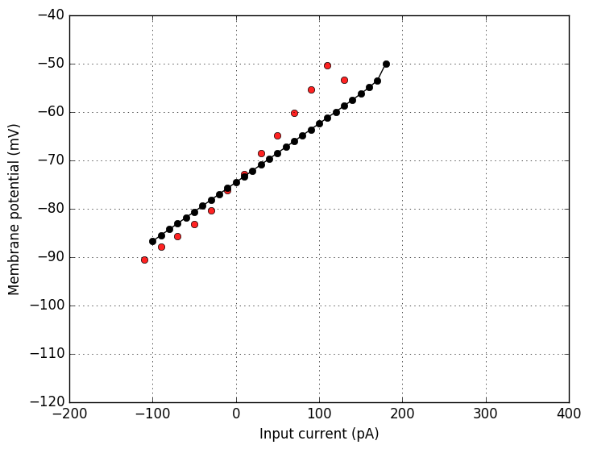</a>
</td>
</tr>
<tr>
<td width="130px">

<b>HH2 cell model tuned to dataset 480169178</b>

<a href="https://github.com/OpenSourceBrain/AllenInstituteNeuroML/blob/master/CellTypesDatabase/tune/tuned_cells/HH2/HH2_480169178.cell.nml">Tuned model</a>

</td>
<td>
<a href="../../tune/tuned_cells/summary/HH2_480169178_traces.png">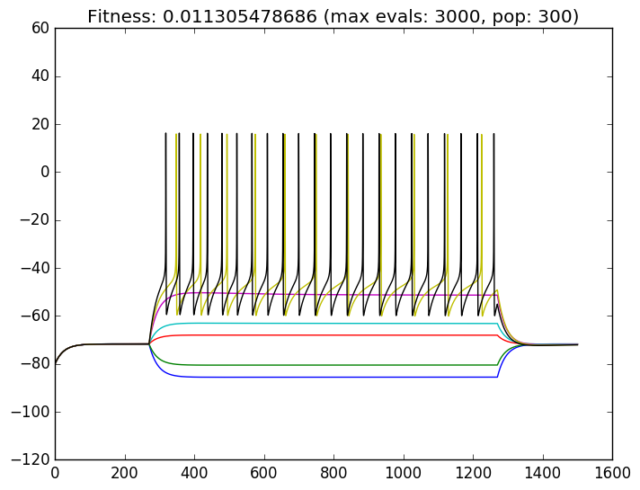</a>
</td>
<td>
<a href="../../tune/tuned_cells/summary/HH2_480169178_if.png">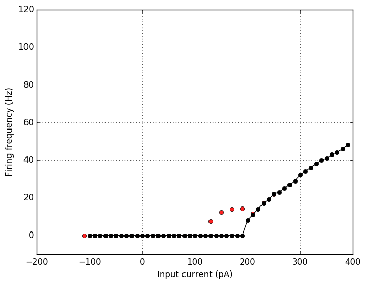</a>
</td>
<td>
<a href="../../tune/tuned_cells/summary/HH2_480169178_iv.png">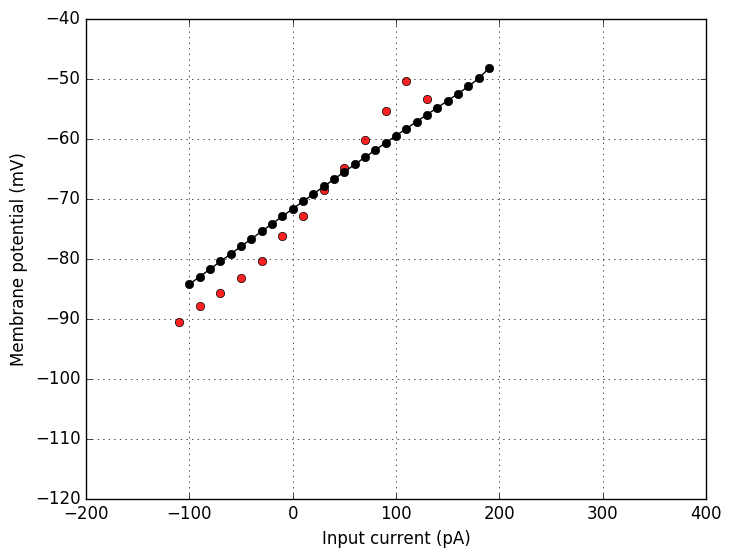</a>
</td>
</tr>
<tr>
<td width="130px">

<b>Allen HH cell model tuned to dataset 480169178</b>

<a href="https://github.com/OpenSourceBrain/AllenInstituteNeuroML/blob/master/CellTypesDatabase/tune/tuned_cells/AllenHH/AllenHH_480169178.cell.nml">Tuned model</a>

</td>
<td>
<a href="../../tune/tuned_cells/summary/AllenHH_480169178_traces.png">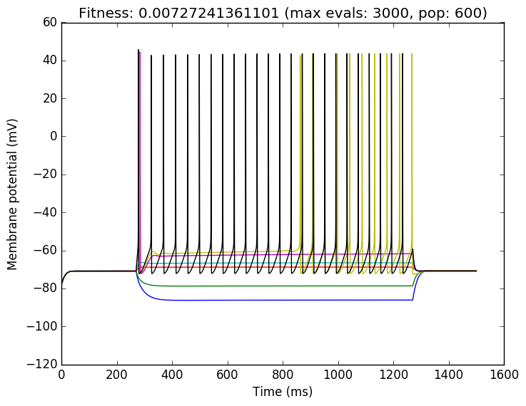</a>
</td>
<td>
<a href="../../tune/tuned_cells/summary/AllenHH_480169178_if.png">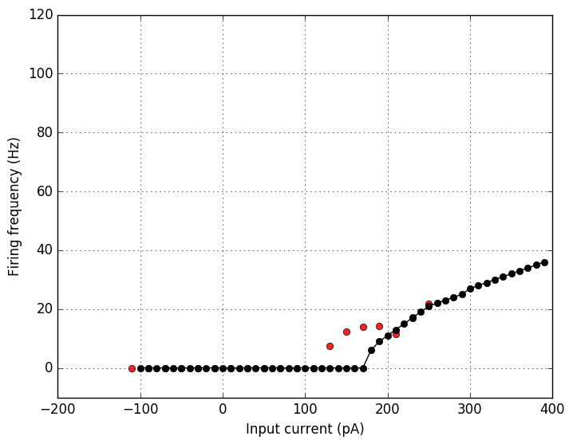</a>
</td>
<td>
<a href="../../tune/tuned_cells/summary/AllenHH_480169178_iv.png">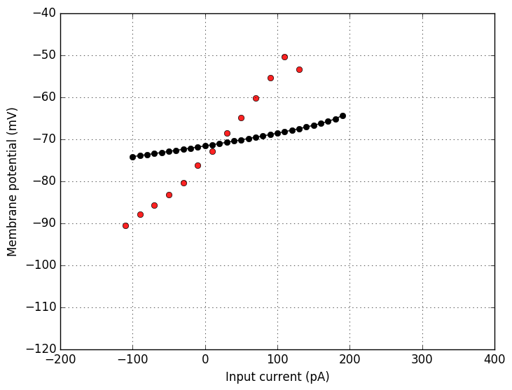</a>
</td>
</tr>
</table>  
 
<table border="1">
<tr>
<td width="130px">

<b>480351780</b>

Primary visual area, layer 5

spiny

Rorb-IRES2-Cre

<a href="http://celltypes.brain-map.org/mouse/experiment/electrophysiology/480351780">Source data</a>

</td>
<td>
<a href="traces_480351780.png">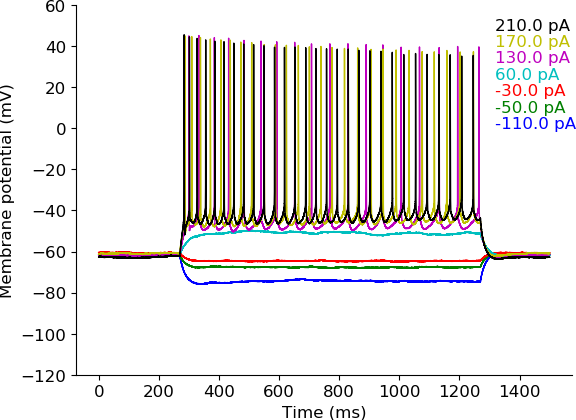</a>
</td>
<td>
<a href="spikes_480351780.png">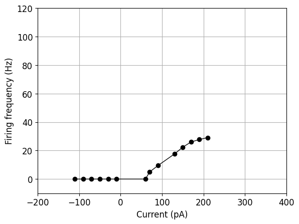</a>
</td>
<td>
<a href="subthreshold_480351780.png">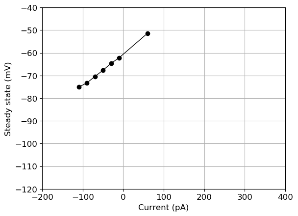</a>
</td>
</tr>
<tr>
<td width="130px">

<b>Izhikevich cell model tuned to dataset 480351780</b>

<a href="https://github.com/OpenSourceBrain/AllenInstituteNeuroML/blob/master/CellTypesDatabase/tune/tuned_cells/Izh/Izh_480351780.cell.nml">Tuned model</a>

</td>
<td>
<a href="../../tune/tuned_cells/summary/Izh_480351780_traces.png">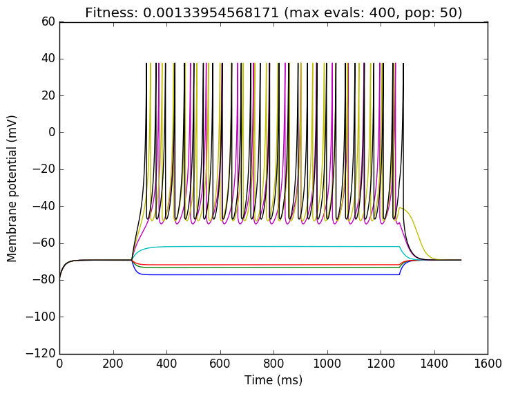</a>
</td>
<td>
<a href="../../tune/tuned_cells/summary/Izh_480351780_if.png">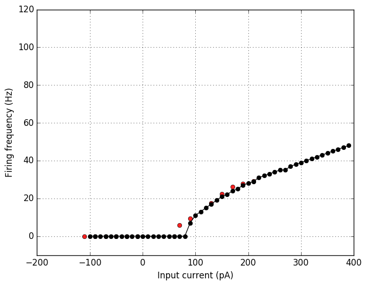</a>
</td>
<td>
<a href="../../tune/tuned_cells/summary/Izh_480351780_iv.png">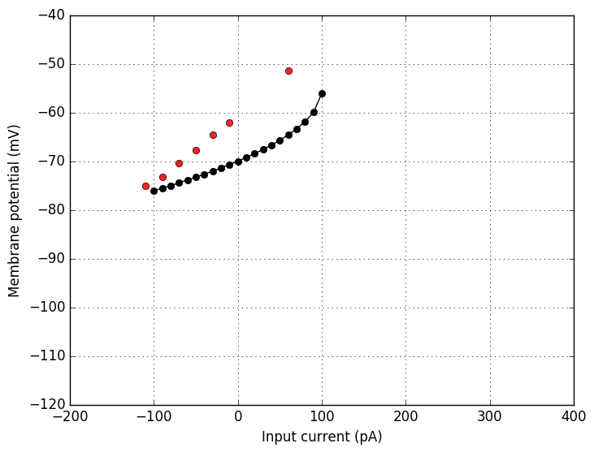</a>
</td>
</tr>
<tr>
<td width="130px">

<b>HH cell model tuned to dataset 480351780</b>

<a href="https://github.com/OpenSourceBrain/AllenInstituteNeuroML/blob/master/CellTypesDatabase/tune/tuned_cells/HH/HH_480351780.cell.nml">Tuned model</a>

</td>
<td>
<a href="../../tune/tuned_cells/summary/HH_480351780_traces.png">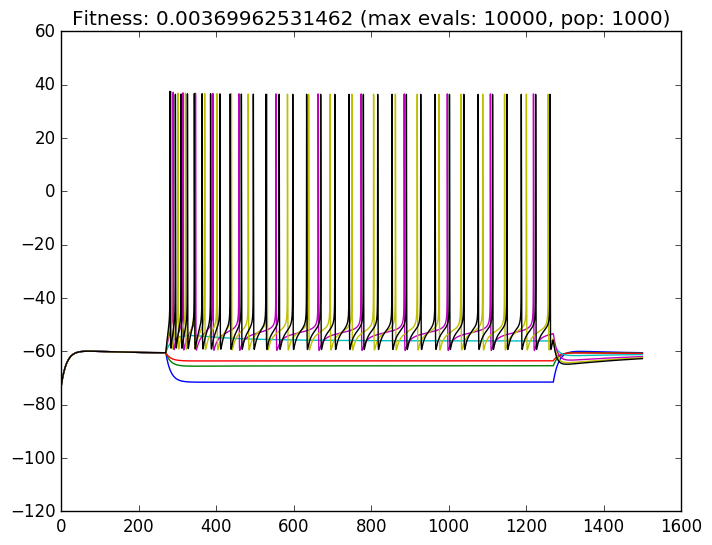</a>
</td>
<td>
<a href="../../tune/tuned_cells/summary/HH_480351780_if.png">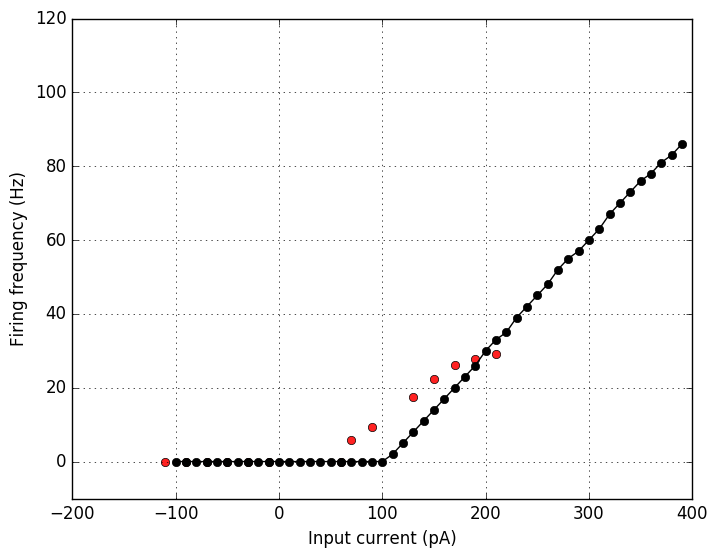</a>
</td>
<td>
<a href="../../tune/tuned_cells/summary/HH_480351780_iv.png">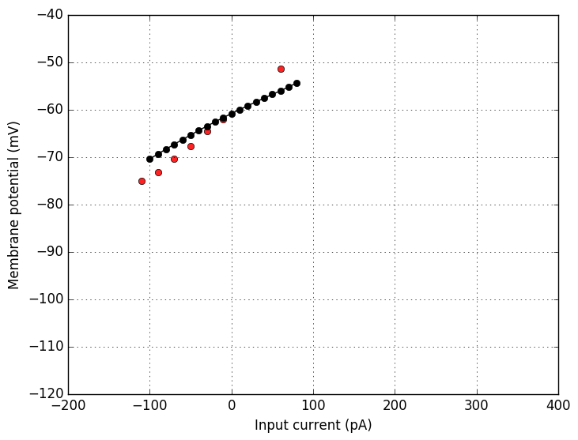</a>
</td>
</tr>
<tr>
<td width="130px">

<b>HH2 cell model tuned to dataset 480351780</b>

<a href="https://github.com/OpenSourceBrain/AllenInstituteNeuroML/blob/master/CellTypesDatabase/tune/tuned_cells/HH2/HH2_480351780.cell.nml">Tuned model</a>

</td>
<td>
<a href="../../tune/tuned_cells/summary/HH2_480351780_traces.png">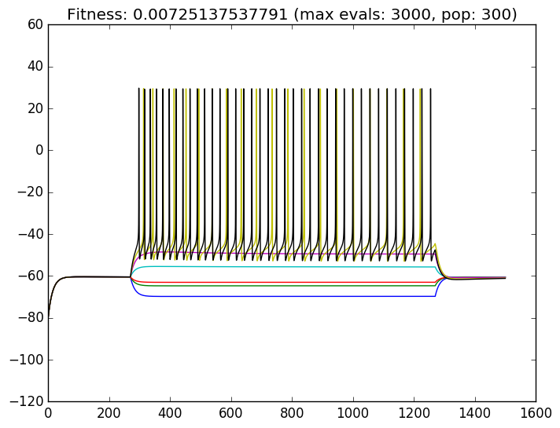</a>
</td>
<td>
<a href="../../tune/tuned_cells/summary/HH2_480351780_if.png">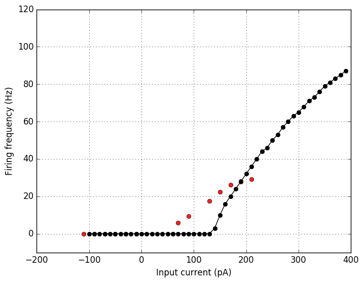</a>
</td>
<td>
<a href="../../tune/tuned_cells/summary/HH2_480351780_iv.png">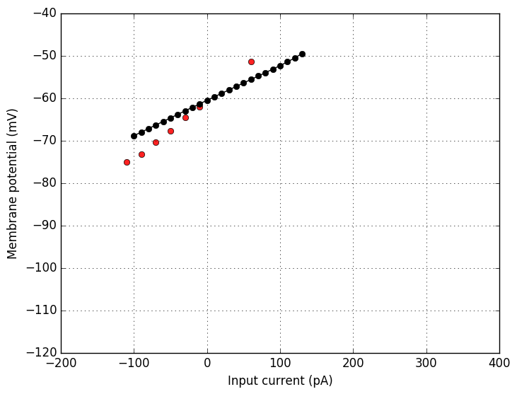</a>
</td>
</tr>
<tr>
<td width="130px">

<b>Allen HH cell model tuned to dataset 480351780</b>

<a href="https://github.com/OpenSourceBrain/AllenInstituteNeuroML/blob/master/CellTypesDatabase/tune/tuned_cells/AllenHH/AllenHH_480351780.cell.nml">Tuned model</a>

</td>
<td>
<a href="../../tune/tuned_cells/summary/AllenHH_480351780_traces.png">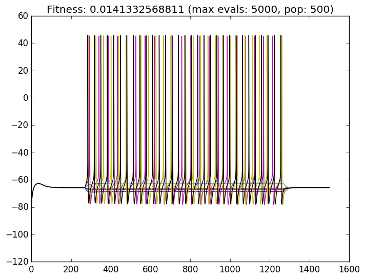</a>
</td>
<td>
<a href="../../tune/tuned_cells/summary/AllenHH_480351780_if.png">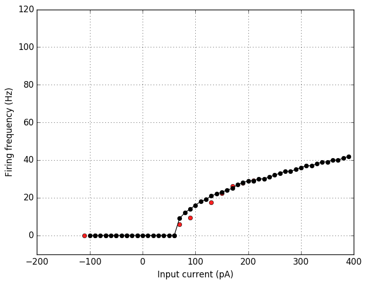</a>
</td>
<td>
<a href="../../tune/tuned_cells/summary/AllenHH_480351780_iv.png">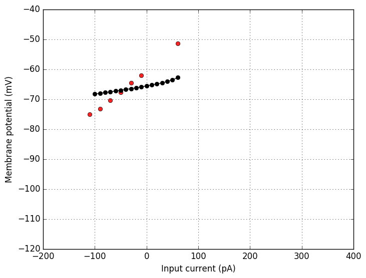</a>
</td>
</tr>
</table>  
 
<table border="1">
<tr>
<td width="130px">

<b>480353286</b>

Primary visual area, layer 5

spiny

Rorb-IRES2-Cre

<a href="http://celltypes.brain-map.org/mouse/experiment/electrophysiology/480353286">Source data</a>

</td>
<td>
<a href="traces_480353286.png">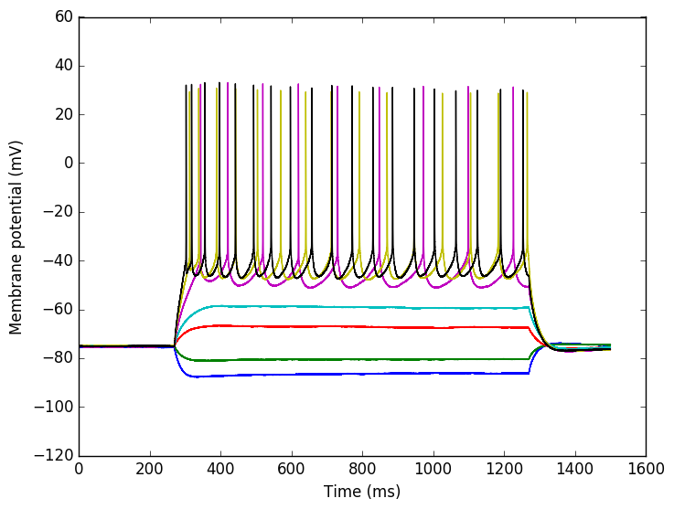</a>
</td>
<td>
<a href="spikes_480353286.png">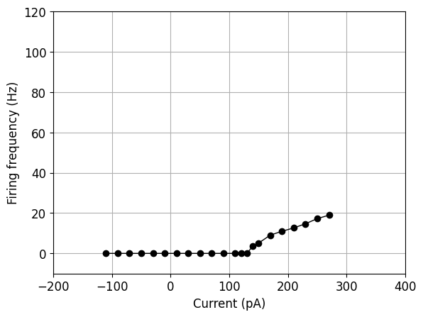</a>
</td>
<td>
<a href="subthreshold_480353286.png">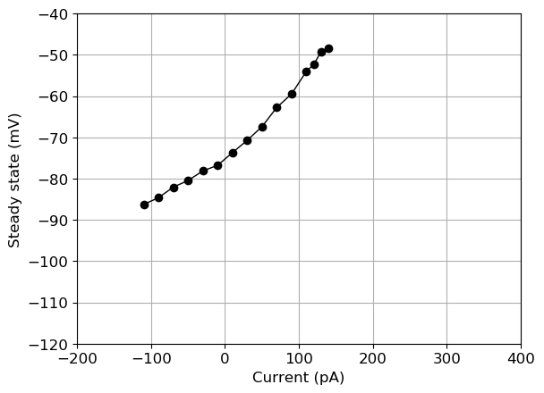</a>
</td>
</tr>
<tr>
<td width="130px">

<b>Izhikevich cell model tuned to dataset 480353286</b>

<a href="https://github.com/OpenSourceBrain/AllenInstituteNeuroML/blob/master/CellTypesDatabase/tune/tuned_cells/Izh/Izh_480353286.cell.nml">Tuned model</a>

</td>
<td>
<a href="../../tune/tuned_cells/summary/Izh_480353286_traces.png">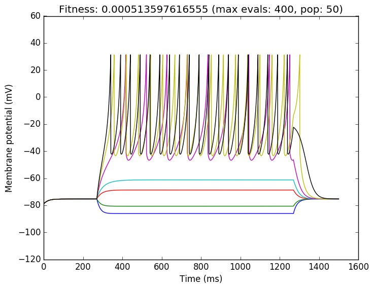</a>
</td>
<td>
<a href="../../tune/tuned_cells/summary/Izh_480353286_if.png">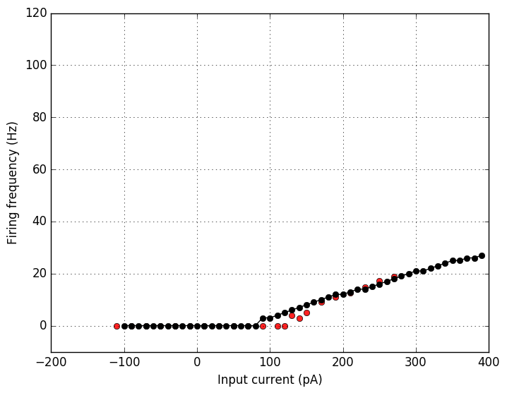</a>
</td>
<td>
<a href="../../tune/tuned_cells/summary/Izh_480353286_iv.png">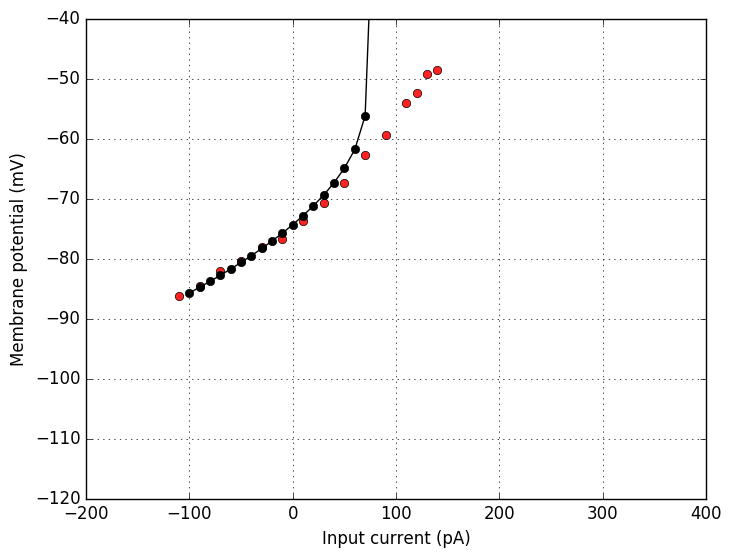</a>
</td>
</tr>
<tr>
<td width="130px">

<b>HH cell model tuned to dataset 480353286</b>

<a href="https://github.com/OpenSourceBrain/AllenInstituteNeuroML/blob/master/CellTypesDatabase/tune/tuned_cells/HH/HH_480353286.cell.nml">Tuned model</a>

</td>
<td>
<a href="../../tune/tuned_cells/summary/HH_480353286_traces.png">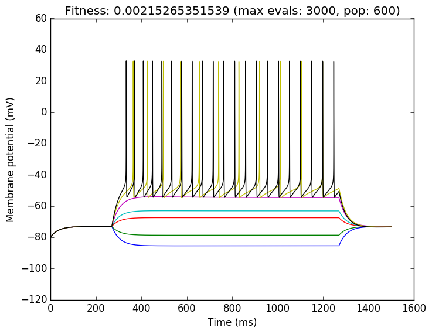</a>
</td>
<td>
<a href="../../tune/tuned_cells/summary/HH_480353286_if.png">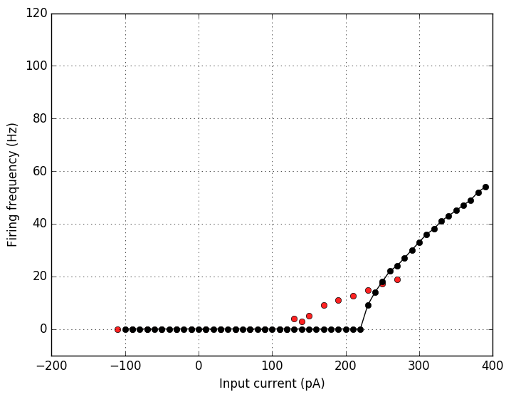</a>
</td>
<td>
<a href="../../tune/tuned_cells/summary/HH_480353286_iv.png">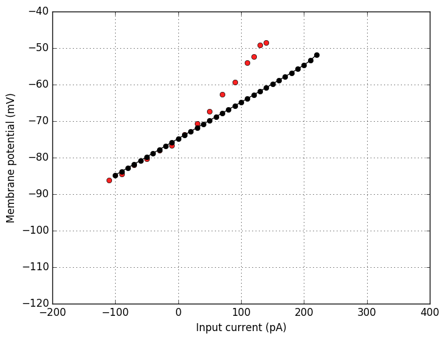</a>
</td>
</tr>
<tr>
<td width="130px">

<b>HH2 cell model tuned to dataset 480353286</b>

<a href="https://github.com/OpenSourceBrain/AllenInstituteNeuroML/blob/master/CellTypesDatabase/tune/tuned_cells/HH2/HH2_480353286.cell.nml">Tuned model</a>

</td>
<td>
<a href="../../tune/tuned_cells/summary/HH2_480353286_traces.png">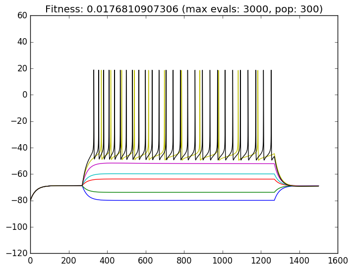</a>
</td>
<td>
<a href="../../tune/tuned_cells/summary/HH2_480353286_if.png">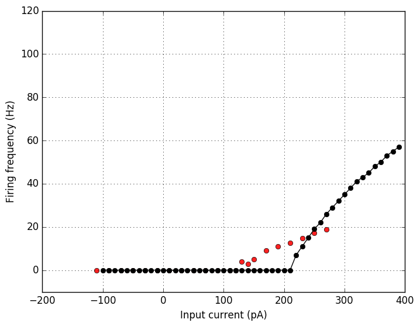</a>
</td>
<td>
<a href="../../tune/tuned_cells/summary/HH2_480353286_iv.png">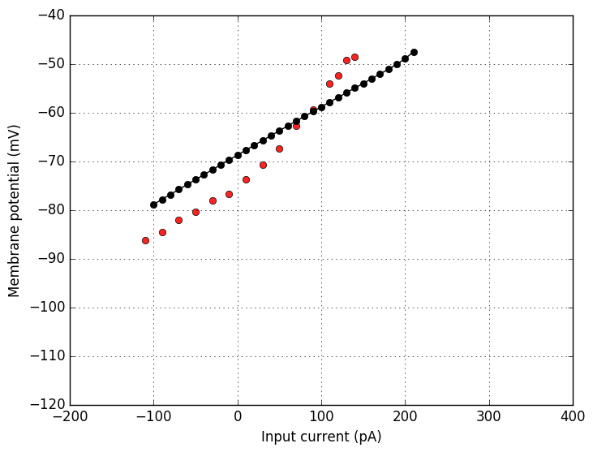</a>
</td>
</tr>
<tr>
<td width="130px">

<b>Allen HH cell model tuned to dataset 480353286</b>

<a href="https://github.com/OpenSourceBrain/AllenInstituteNeuroML/blob/master/CellTypesDatabase/tune/tuned_cells/AllenHH/AllenHH_480353286.cell.nml">Tuned model</a>

</td>
<td>
<a href="../../tune/tuned_cells/summary/AllenHH_480353286_traces.png">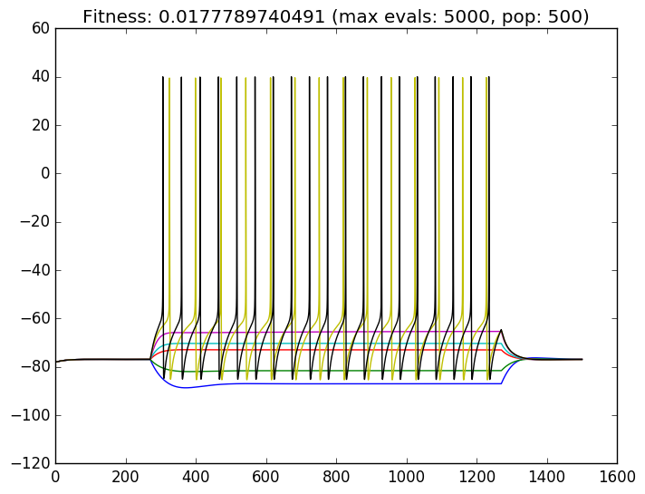</a>
</td>
<td>
<a href="../../tune/tuned_cells/summary/AllenHH_480353286_if.png">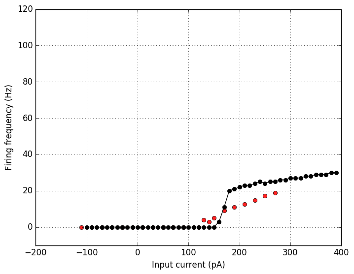</a>
</td>
<td>
<a href="../../tune/tuned_cells/summary/AllenHH_480353286_iv.png">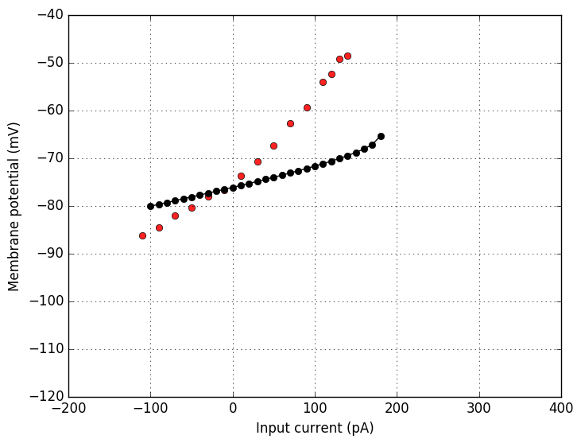</a>
</td>
</tr>
</table>  
 
<table border="1">
<tr>
<td width="130px">

<b>485058595</b>

Primary visual area, layer 4

aspiny

Sst-IRES-Cre

<a href="http://celltypes.brain-map.org/mouse/experiment/electrophysiology/485058595">Source data</a>

</td>
<td>
<a href="traces_485058595.png">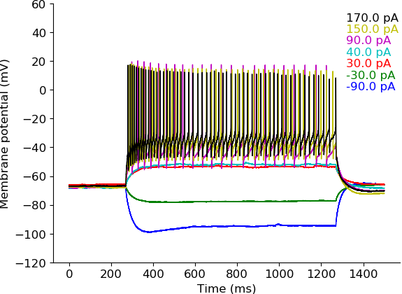</a>
</td>
<td>
<a href="spikes_485058595.png">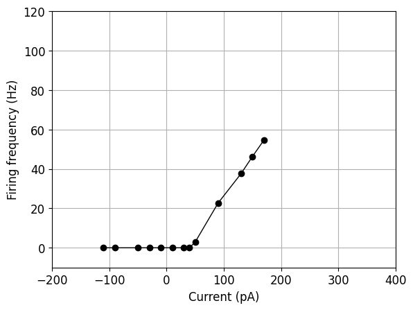</a>
</td>
<td>
<a href="subthreshold_485058595.png">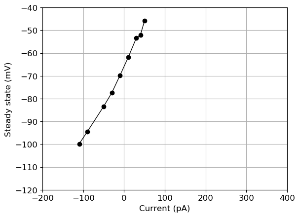</a>
</td>
</tr>
<tr>
<td width="130px">

<b>Izhikevich cell model tuned to dataset 485058595</b>

<a href="https://github.com/OpenSourceBrain/AllenInstituteNeuroML/blob/master/CellTypesDatabase/tune/tuned_cells/Izh/Izh_485058595.cell.nml">Tuned model</a>

</td>
<td>
<a href="../../tune/tuned_cells/summary/Izh_485058595_traces.png">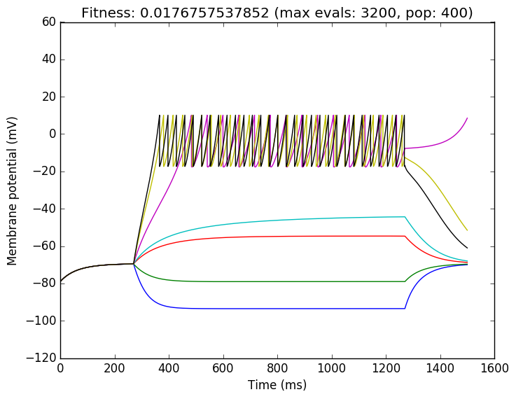</a>
</td>
<td>
<a href="../../tune/tuned_cells/summary/Izh_485058595_if.png">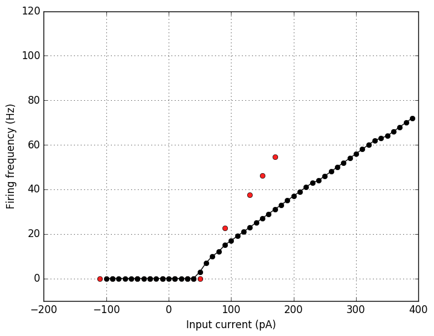</a>
</td>
<td>
<a href="../../tune/tuned_cells/summary/Izh_485058595_iv.png">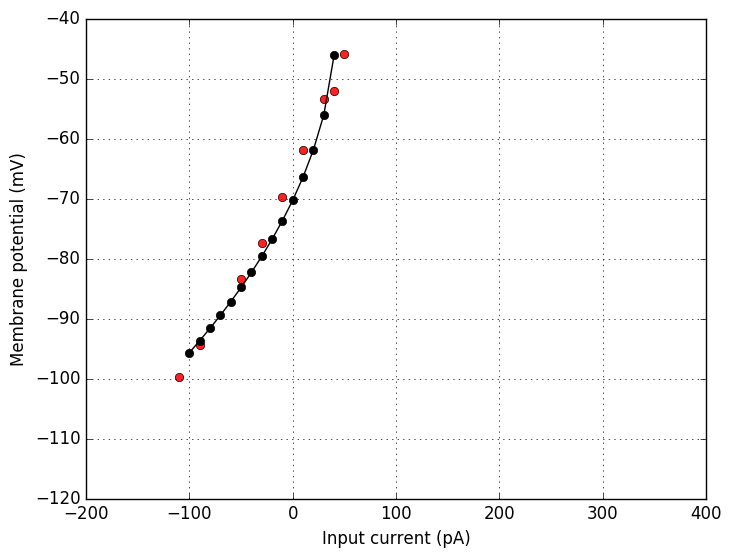</a>
</td>
</tr>
<tr>
<td width="130px">

<b>HH cell model tuned to dataset 485058595</b>

<a href="https://github.com/OpenSourceBrain/AllenInstituteNeuroML/blob/master/CellTypesDatabase/tune/tuned_cells/HH/HH_485058595.cell.nml">Tuned model</a>

</td>
<td>
<a href="../../tune/tuned_cells/summary/HH_485058595_traces.png">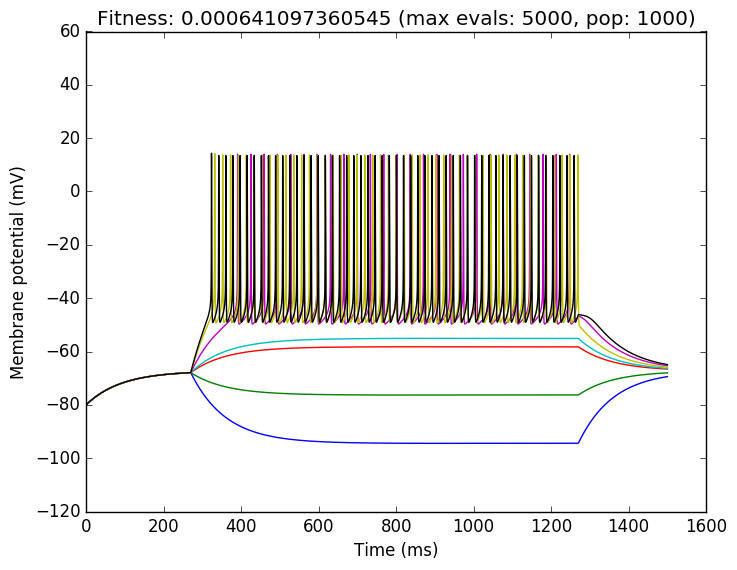</a>
</td>
<td>
<a href="../../tune/tuned_cells/summary/HH_485058595_if.png">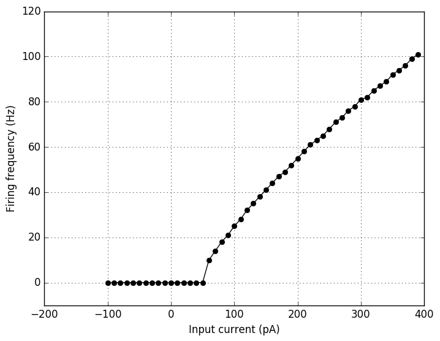</a>
</td>
<td>
<a href="../../tune/tuned_cells/summary/HH_485058595_iv.png">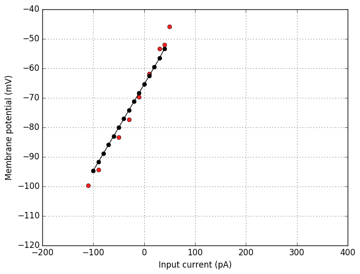</a>
</td>
</tr>
<tr>
<td width="130px">

<b>HH2 cell model tuned to dataset 485058595</b>

<a href="https://github.com/OpenSourceBrain/AllenInstituteNeuroML/blob/master/CellTypesDatabase/tune/tuned_cells/HH2/HH2_485058595.cell.nml">Tuned model</a>

</td>
<td>
<a href="../../tune/tuned_cells/summary/HH2_485058595_traces.png">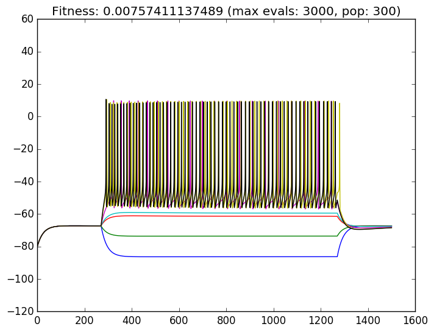</a>
</td>
<td>
<a href="../../tune/tuned_cells/summary/HH2_485058595_if.png">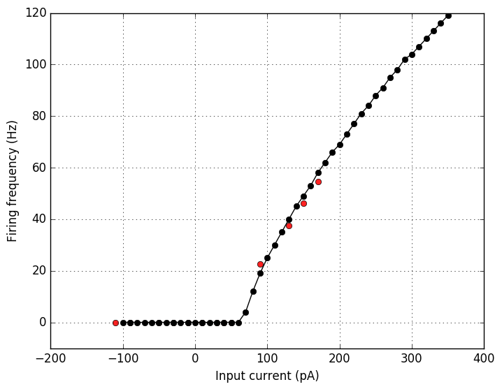</a>
</td>
<td>
<a href="../../tune/tuned_cells/summary/HH2_485058595_iv.png">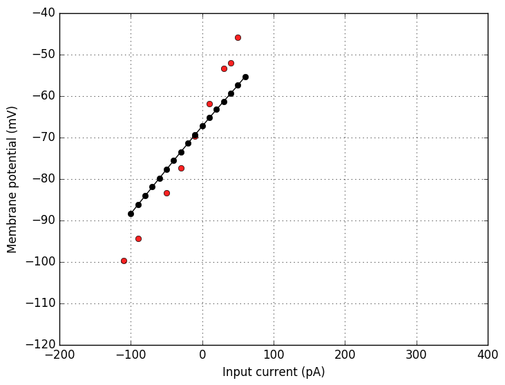</a>
</td>
</tr>
<tr>
<td width="130px">

<b>Allen HH cell model tuned to dataset 485058595</b>

<a href="https://github.com/OpenSourceBrain/AllenInstituteNeuroML/blob/master/CellTypesDatabase/tune/tuned_cells/AllenHH/AllenHH_485058595.cell.nml">Tuned model</a>

</td>
<td>
<a href="../../tune/tuned_cells/summary/AllenHH_485058595_traces.png">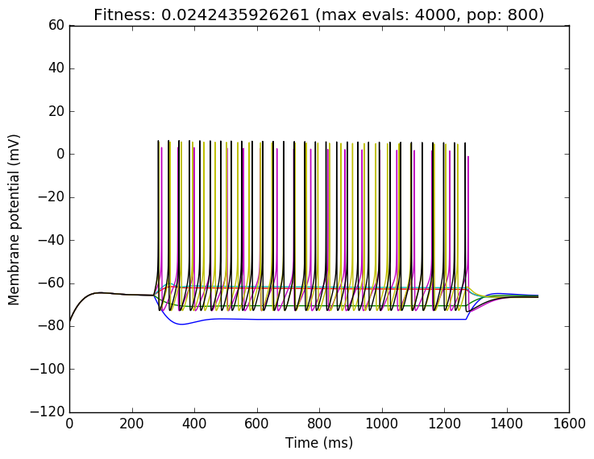</a>
</td>
<td>
<a href="../../tune/tuned_cells/summary/AllenHH_485058595_if.png">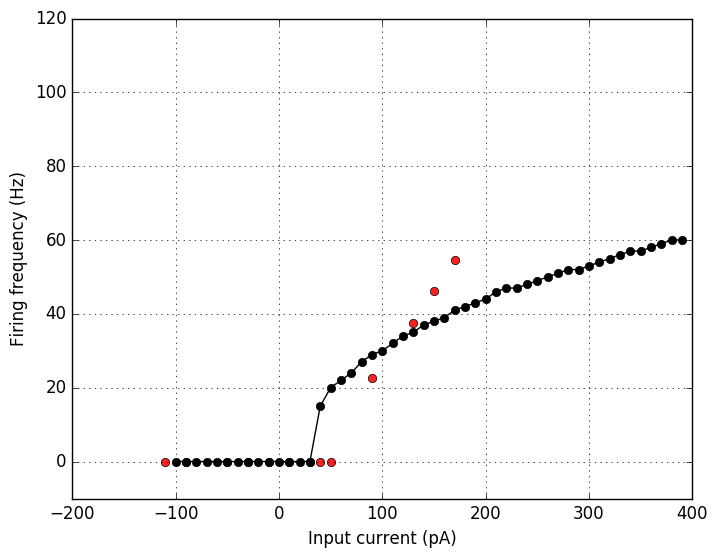</a>
</td>
<td>
<a href="../../tune/tuned_cells/summary/AllenHH_485058595_iv.png">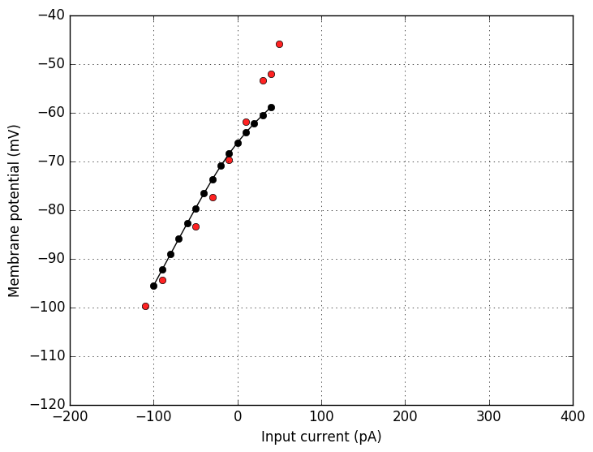</a>
</td>
</tr>
</table>  
 
<table border="1">
<tr>
<td width="130px">

<b>486111903</b>

Primary visual area, layer 5

spiny

Rbp4-Cre_KL100

<a href="http://celltypes.brain-map.org/mouse/experiment/electrophysiology/486111903">Source data</a>

</td>
<td>
<a href="traces_486111903.png">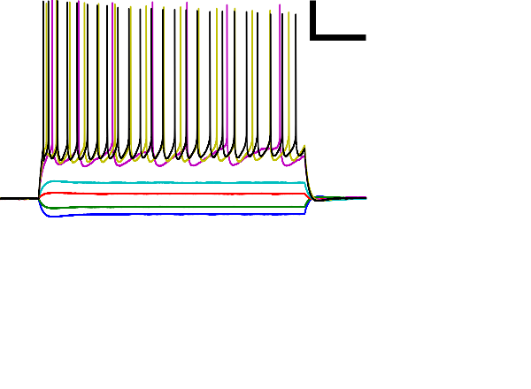</a>
</td>
<td>
<a href="spikes_486111903.png">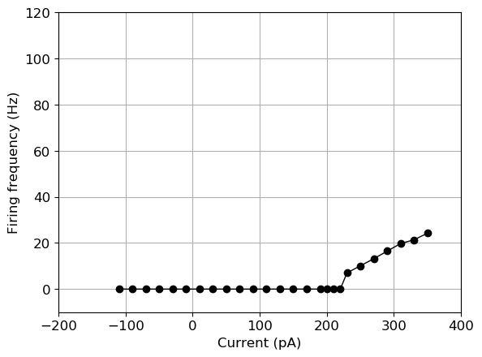</a>
</td>
<td>
<a href="subthreshold_486111903.png">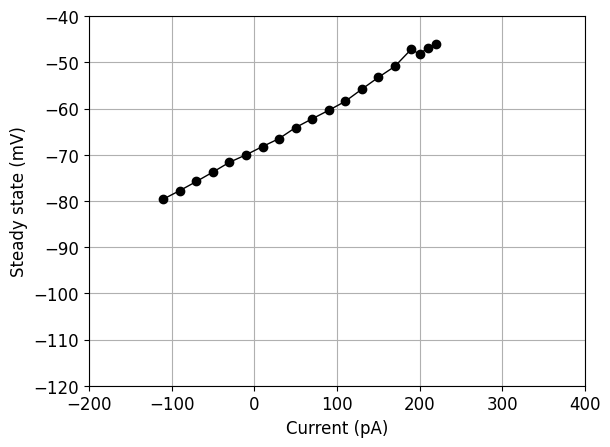</a>
</td>
</tr>
<tr>
<td width="130px">

<b>Izhikevich cell model tuned to dataset 486111903</b>

<a href="https://github.com/OpenSourceBrain/AllenInstituteNeuroML/blob/master/CellTypesDatabase/tune/tuned_cells/Izh/Izh_486111903.cell.nml">Tuned model</a>

</td>
<td>

</td>
<td>
<a href="../../tune/tuned_cells/summary/Izh_486111903_if.png">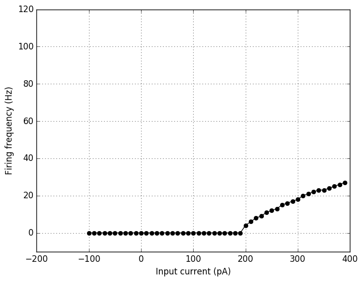</a>
</td>
<td>
<a href="../../tune/tuned_cells/summary/Izh_486111903_iv.png">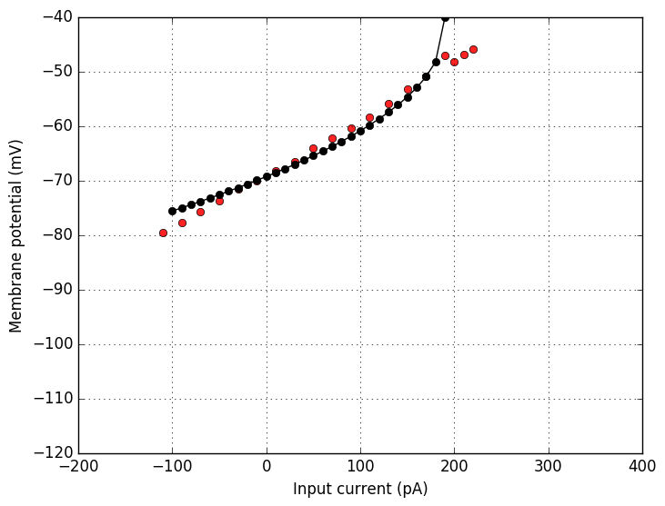</a>
</td>
</tr>
<tr>
<td width="130px">

<b>HH cell model tuned to dataset 486111903</b>

<a href="https://github.com/OpenSourceBrain/AllenInstituteNeuroML/blob/master/CellTypesDatabase/tune/tuned_cells/HH/HH_486111903.cell.nml">Tuned model</a>

</td>
<td>
<a href="../../tune/tuned_cells/summary/HH_486111903_traces.png">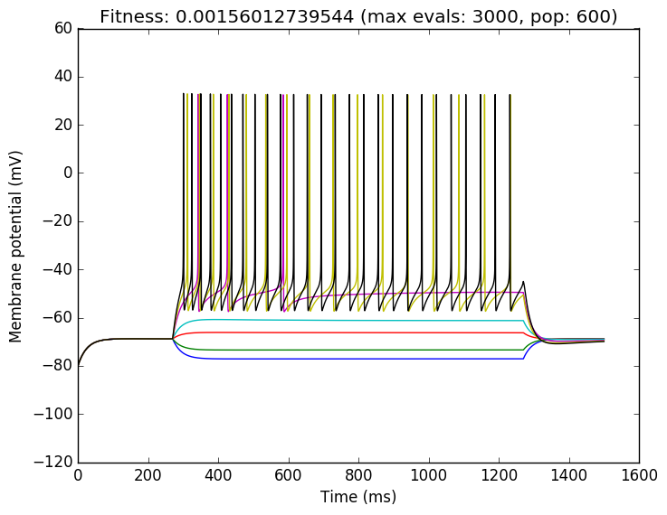</a>
</td>
<td>
<a href="../../tune/tuned_cells/summary/HH_486111903_if.png">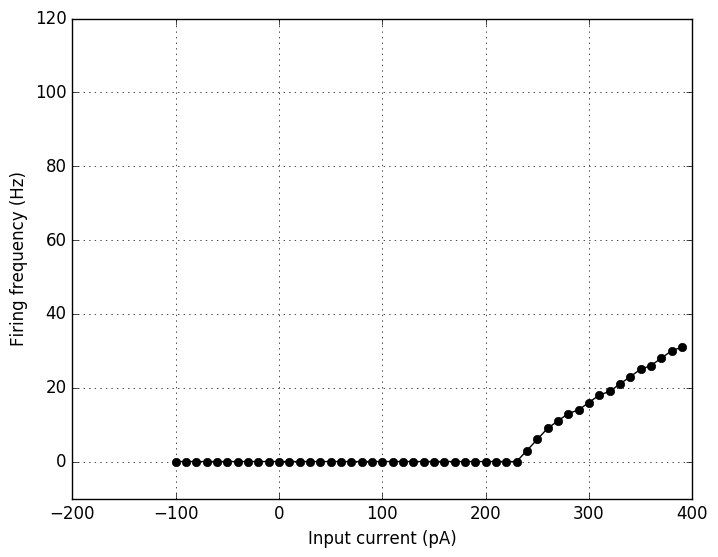</a>
</td>
<td>
<a href="../../tune/tuned_cells/summary/HH_486111903_iv.png">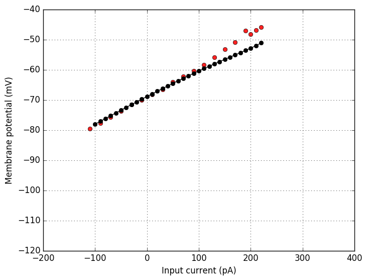</a>
</td>
</tr>
<tr>
<td width="130px">

<b>HH2 cell model tuned to dataset 486111903</b>

<a href="https://github.com/OpenSourceBrain/AllenInstituteNeuroML/blob/master/CellTypesDatabase/tune/tuned_cells/HH2/HH2_486111903.cell.nml">Tuned model</a>

</td>
<td>
<a href="../../tune/tuned_cells/summary/HH2_486111903_traces.png">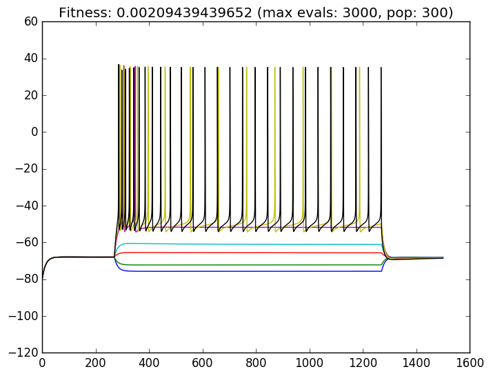</a>
</td>
<td>
<a href="../../tune/tuned_cells/summary/HH2_486111903_if.png">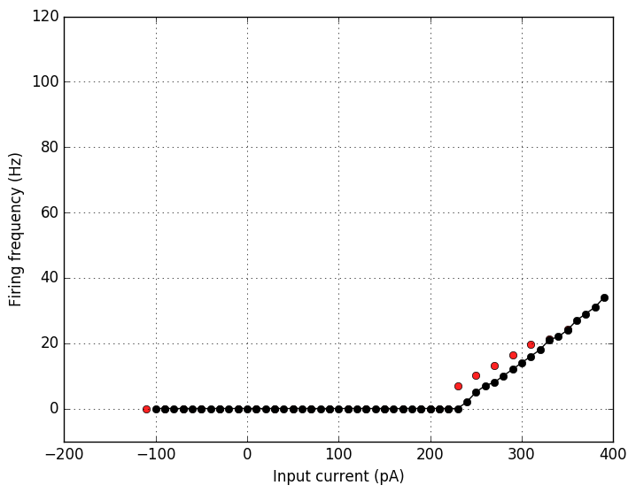</a>
</td>
<td>
<a href="../../tune/tuned_cells/summary/HH2_486111903_iv.png">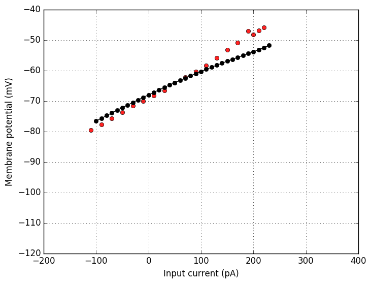</a>
</td>
</tr>
<tr>
<td width="130px">

<b>Allen HH cell model tuned to dataset 486111903</b>

<a href="https://github.com/OpenSourceBrain/AllenInstituteNeuroML/blob/master/CellTypesDatabase/tune/tuned_cells/AllenHH/AllenHH_486111903.cell.nml">Tuned model</a>

</td>
<td>
<a href="../../tune/tuned_cells/summary/AllenHH_486111903_traces.png">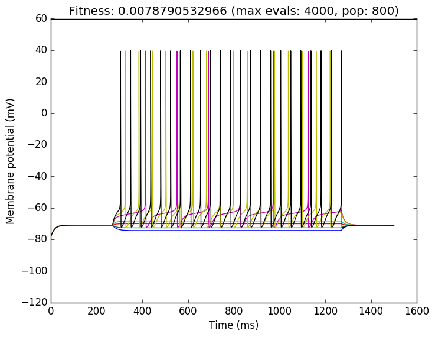</a>
</td>
<td>
<a href="../../tune/tuned_cells/summary/AllenHH_486111903_if.png">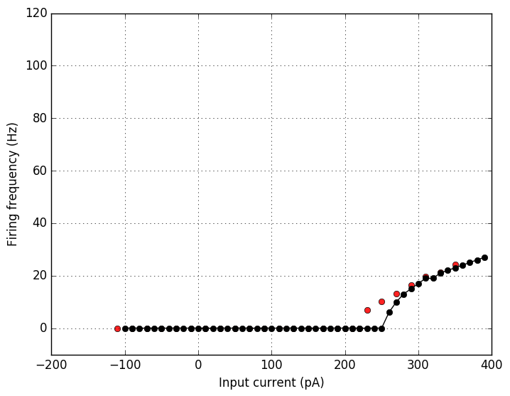</a>
</td>
<td>
<a href="../../tune/tuned_cells/summary/AllenHH_486111903_iv.png">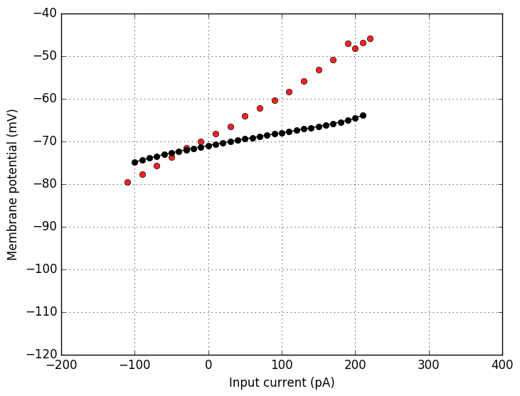</a>
</td>
</tr>
</table>  
 
