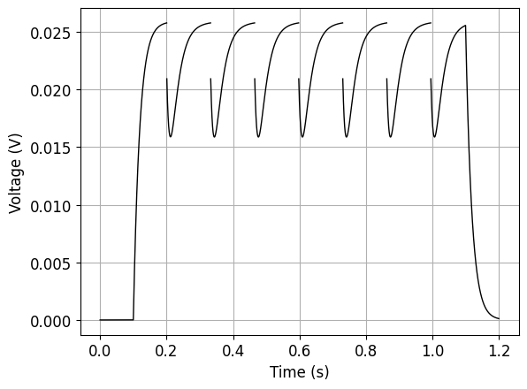
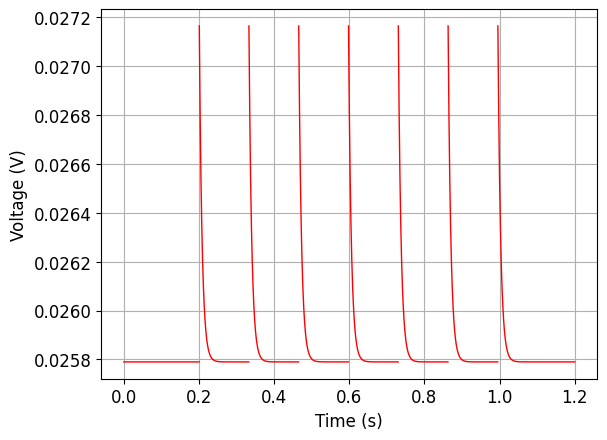
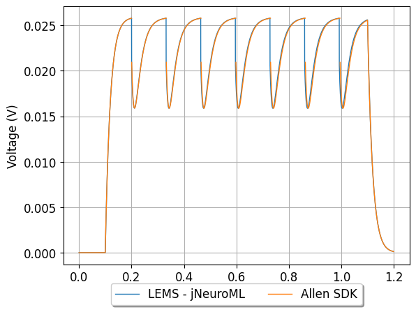
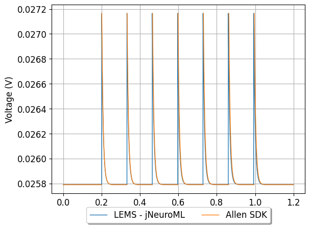

## Model: 486052403

### Original model

4 LIF-R + Afterspike Currents (LIF-R-ASC)_Rbp4-Cre_KL100;Ai14-203498.04.02.01

[Allen Cell Types DB electrophysiology page for specimen](http://celltypes.brain-map.org/mouse/experiment/electrophysiology/485574832)

[Neuron configuration](neuron_config.json); [model metadata](model_metadata.json); [electrophysiology summary](ephys_sweeps.json)

#### Original traces:

**Membrane potential**

Current injection of 230 pA

**Threshold**

### Conversion to NeuroML 2

LEMS version of this model: [GLIF_486052403.xml](GLIF_486052403.xml)

[Definitions of LEMS Component Types](../GLIFs.xml) for GLIFs.

This model can be run locally by installing [jNeuroML](https://github.com/NeuroML/jNeuroML) and running:

    jnml LEMS_Test_486052403.xml

#### Comparison:

**Membrane potential**

Current injection of 230 pA

**Threshold**

