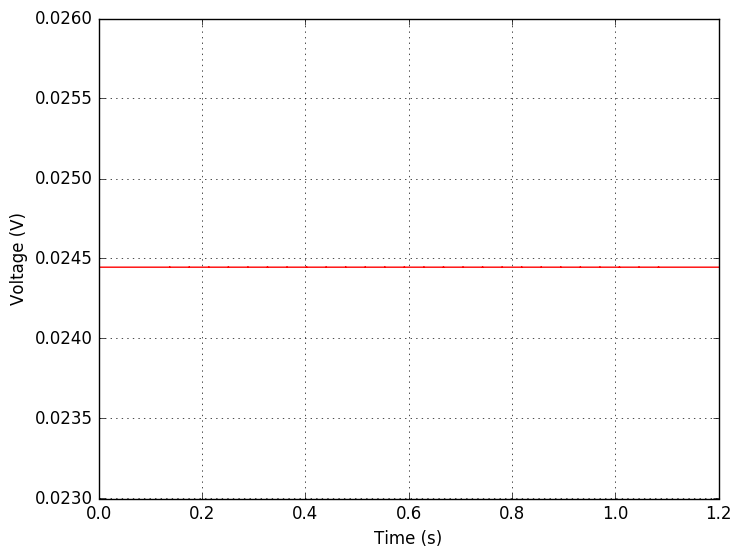
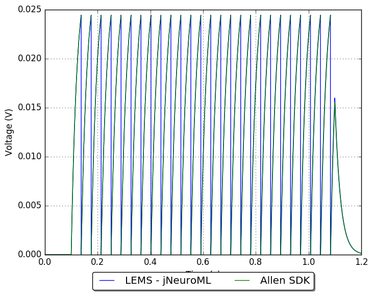
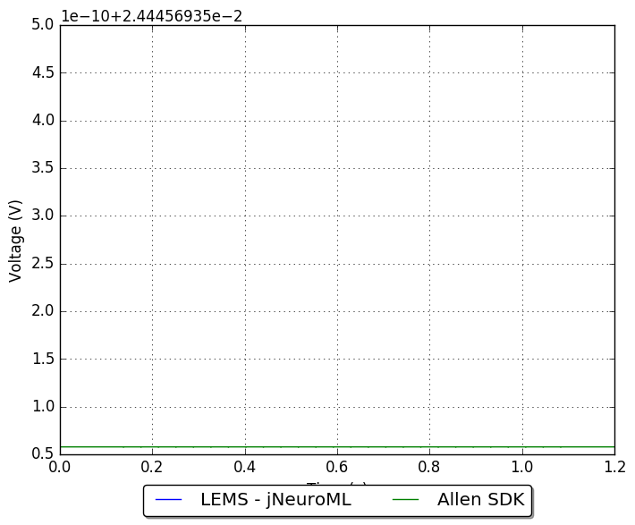

## Model: 486557295

### Original model

1 Leaky Integrate and Fire (LIF)_Cux2-CreERT2;Ai14-205221.05.02.01

[Electrophysiology page for specimin](http://celltypes.brain-map.org/mouse/experiment/electrophysiology/486175203)

[Neuron configuration](neuron_config.json); [model metadata](model_metadata.json); [electrophysiology summary](ephys_sweeps.json)

#### Original traces:

**Membrane potential**

**Threshold**

### Conversion to NeuroML 2

LEMS version of this model: [GLIF_486557295.xml](GLIF_486557295.xml)

[Definitions of LEMS Component Types](../GLIFs.xml) for GLIFs.

This model can be run locally by installing [jNeuroML](https://github.com/NeuroML/jNeuroML) and running:

    jnml LEMS_Test_486557295.xml

#### Comparison:

**Membrane potential**

**Threshold**

