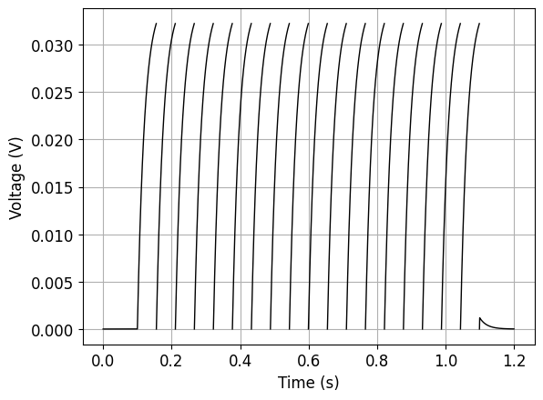
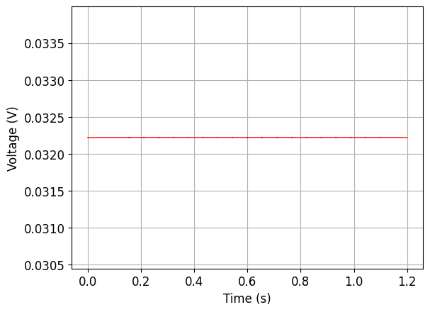
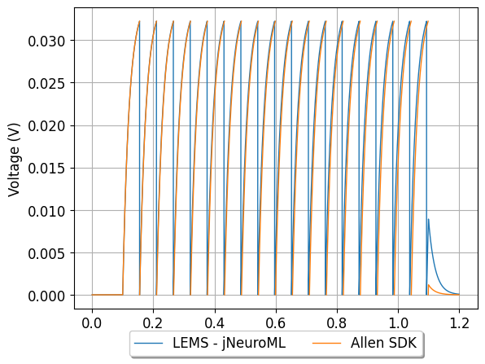
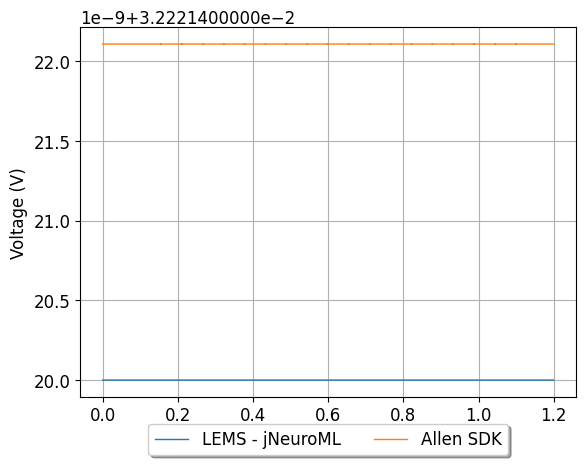

## Model: 566302725

### Original model

1 Leaky Integrate and Fire (LIF)_Scnn1a-Tg3-Cre;Ai14-181566.04.01.01

[Allen Cell Types DB electrophysiology page for specimen](http://celltypes.brain-map.org/mouse/experiment/electrophysiology/470098860)

[Neuron configuration](neuron_config.json); [model metadata](model_metadata.json); [electrophysiology summary](ephys_sweeps.json)

#### Original traces:

**Membrane potential**

Current injection of 170 pA

**Threshold**

### Conversion to NeuroML 2

LEMS version of this model: [GLIF_566302725.xml](GLIF_566302725.xml)

[Definitions of LEMS Component Types](../GLIFs.xml) for GLIFs.

This model can be run locally by installing [jNeuroML](https://github.com/NeuroML/jNeuroML) and running:

    jnml LEMS_Test_566302725.xml

#### Comparison:

**Membrane potential**

Current injection of 170 pA

**Threshold**

