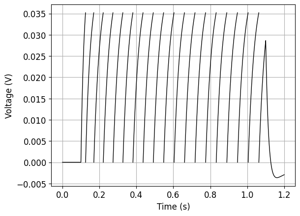
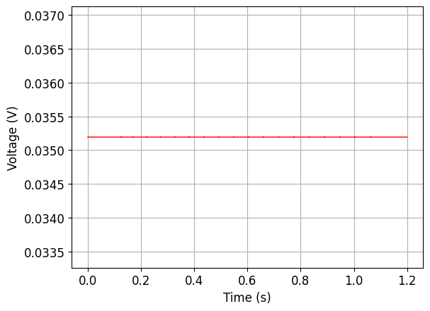
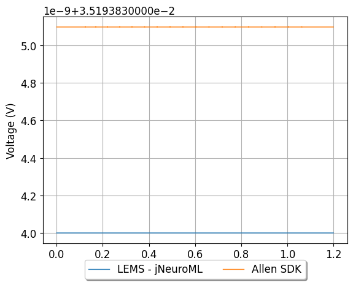

## Model: 566303332

### Original model

3 LIF + Afterspike Currents (LIF-ASC)_Ntsr1-Cre;Ai14-181184.02.02.01

[Allen Cell Types DB electrophysiology page for specimen](http://celltypes.brain-map.org/mouse/experiment/electrophysiology/471819401)

[Neuron configuration](neuron_config.json); [model metadata](model_metadata.json); [electrophysiology summary](ephys_sweeps.json)

#### Original traces:

**Membrane potential**

Current injection of 269 pA

**Threshold**

### Conversion to NeuroML 2

LEMS version of this model: [GLIF_566303332.xml](GLIF_566303332.xml)

[Definitions of LEMS Component Types](../GLIFs.xml) for GLIFs.

This model can be run locally by installing [jNeuroML](https://github.com/NeuroML/jNeuroML) and running:

    jnml LEMS_Test_566303332.xml

#### Comparison:

**Membrane potential**

Current injection of 269 pA

**Threshold**

