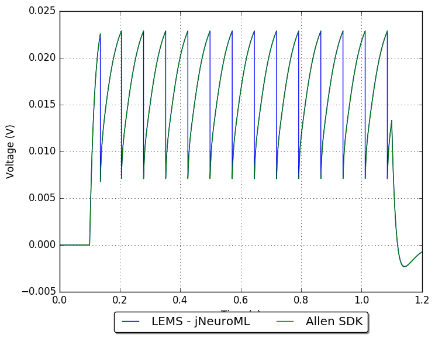
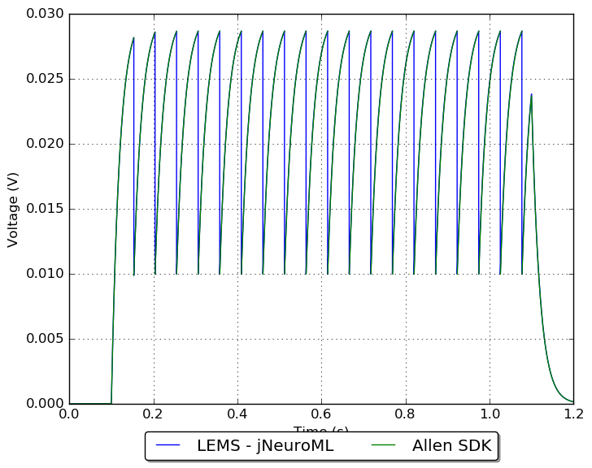
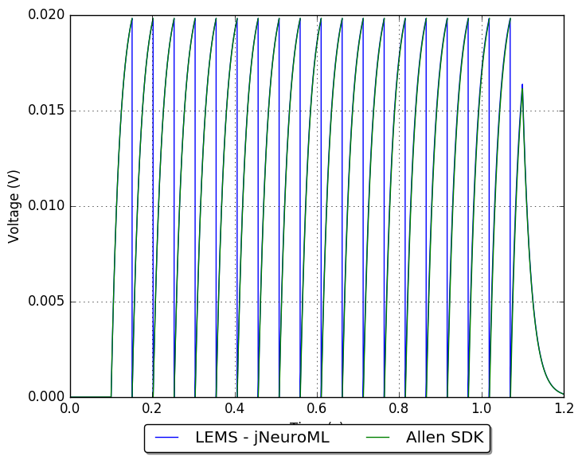
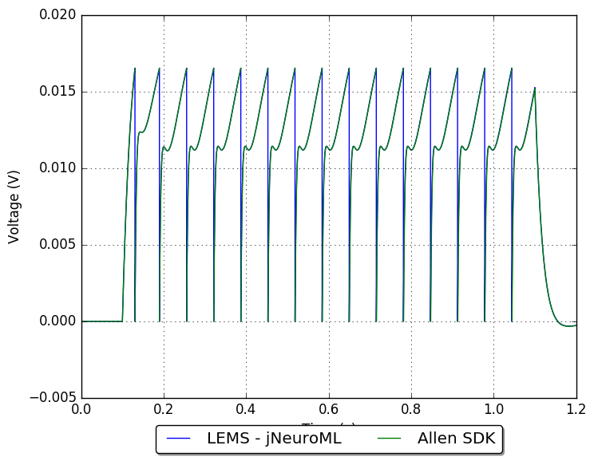
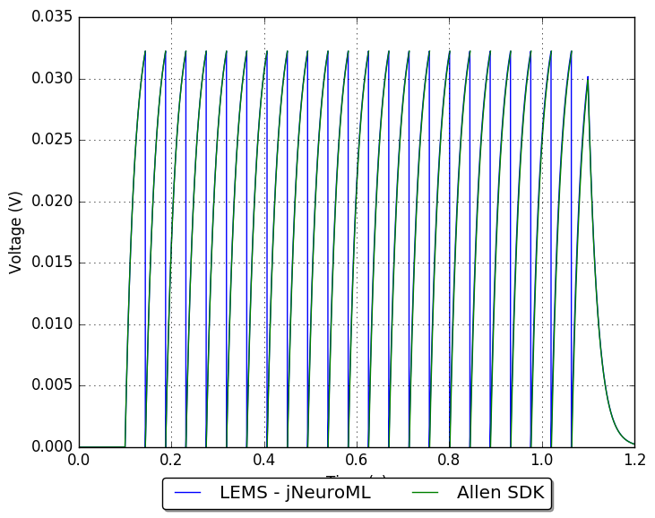

## Conversion of Allen Cell Types Database GLIF models to NeuroML 2/LEMS

**Note: work in progress!**

### Examples:

        
#### Model: 480633674

Model summary: 2 LIF + Reset Rules (LIF-R)_Pvalb-IRES-Cre;Ai14(IVSCC)-169130.06.01.01

[Original electrophysiological data](http://celltypes.brain-map.org/mouse/experiment/electrophysiology/318556138)

[Full details of conversion](480633674/README.md)

            
#### Model: 472455459

Model summary: 5 LIF-R-ASC + Threshold Adaptation (LIF-R-ASC-A)_Scnn1a-Tg3-Cre;Ai14(GSL)-172530.03.01.01

[Original electrophysiological data](http://celltypes.brain-map.org/mouse/experiment/electrophysiology/323834998)

[Full details of conversion](472455459/README.md)

            
#### Model: 472308324

Model summary: 4 LIF-R + Afterspike Currents (LIF-R-ASC)_Rorb-IRES2-Cre-D;Ai14(IVSCC)-172651.05.01.01

[Original electrophysiological data](http://celltypes.brain-map.org/mouse/experiment/electrophysiology/324032509)

[Full details of conversion](472308324/README.md)

            
#### Model: 473875489

Model summary: 2 LIF + Reset Rules (LIF-R)_Sst-IRES-Cre;Ai14(IVSCC)-175894.03.02.01

[Original electrophysiological data](http://celltypes.brain-map.org/mouse/experiment/electrophysiology/328031983)

[Full details of conversion](473875489/README.md)

            
#### Model: 486557295

Model summary: 1 Leaky Integrate and Fire (LIF)_Cux2-CreERT2;Ai14-205221.05.02.01

[Original electrophysiological data](http://celltypes.brain-map.org/mouse/experiment/electrophysiology/486175203)

[Full details of conversion](486557295/README.md)

            
#### Model: 480629471

Model summary: 1 Leaky Integrate and Fire (LIF)_Sst-IRES-Cre;Ai14(IVSCC)-165865.03.01.01

[Original electrophysiological data](http://celltypes.brain-map.org/mouse/experiment/electrophysiology/464198958)

[Full details of conversion](480629471/README.md)

            
#### Model: 480629475

Model summary: 3 LIF + Afterspike Currents (LIF-ASC)_Sst-IRES-Cre;Ai14(IVSCC)-165865.03.01.01

[Original electrophysiological data](http://celltypes.brain-map.org/mouse/experiment/electrophysiology/464198958)

[Full details of conversion](480629475/README.md)

            
#### Model: 472451425

Model summary: 1 Leaky Integrate and Fire (LIF)_Scnn1a-Tg3-Cre;Ai14(IVSCC)-181566.04.01.01

[Original electrophysiological data](http://celltypes.brain-map.org/mouse/experiment/electrophysiology/470098860)

[Full details of conversion](472451425/README.md)

            