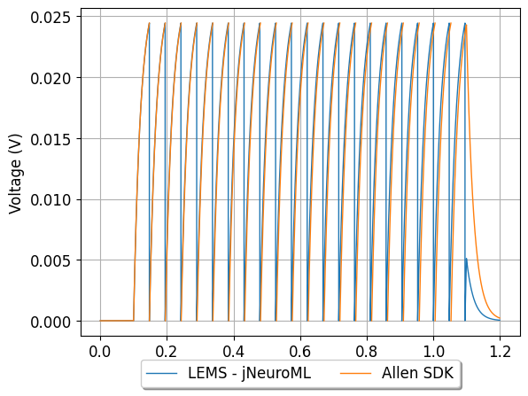
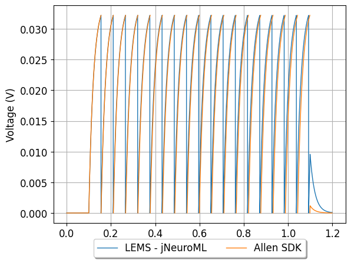

## Conversion of Allen Cell Types Database GLIF models to NeuroML 2

**Note: work in progress!**

### Examples:

    
#### Model: 566282032

Model summary: 2 LIF + Reset Rules (LIF-R)_Pvalb-IRES-Cre;Ai14-169130.06.01.01

[Original electrophysiological data](http://celltypes.brain-map.org/mouse/experiment/electrophysiology/318556138)

[Full details of conversion](566282032/README.md)

        
#### Model: 566283540

Model summary: 5 LIF-R-ASC + Threshold Adaptation (LIF-R-ASC-A)_Scnn1a-Tg3-Cre;Ai14-172530.03.01.01

[Original electrophysiological data](http://celltypes.brain-map.org/mouse/experiment/electrophysiology/323834998)

[Full details of conversion](566283540/README.md)

        
#### Model: 566283879

Model summary: 4 LIF-R + Afterspike Currents (LIF-R-ASC)_Rorb-IRES2-Cre-D;Ai14-172651.05.01.01

[Original electrophysiological data](http://celltypes.brain-map.org/mouse/experiment/electrophysiology/324032509)

[Full details of conversion](566283879/README.md)

        
#### Model: 566288171

Model summary: 2 LIF + Reset Rules (LIF-R)_Sst-IRES-Cre;Ai14-175894.03.02.01

[Original electrophysiological data](http://celltypes.brain-map.org/mouse/experiment/electrophysiology/328031983)

[Full details of conversion](566288171/README.md)

        
#### Model: 486557295

Model summary: 1 Leaky Integrate and Fire (LIF)_Cux2-CreERT2;Ai14-205221.05.02.01

[Original electrophysiological data](http://celltypes.brain-map.org/mouse/experiment/electrophysiology/486175203)

[Full details of conversion](486557295/README.md)

        
#### Model: 566291893

Model summary: 1 Leaky Integrate and Fire (LIF)_Sst-IRES-Cre;Ai14-165865.03.01.01

[Original electrophysiological data](http://celltypes.brain-map.org/mouse/experiment/electrophysiology/464198958)

[Full details of conversion](566291893/README.md)

        
#### Model: 566291897

Model summary: 3 LIF + Afterspike Currents (LIF-ASC)_Sst-IRES-Cre;Ai14-165865.03.01.01

[Original electrophysiological data](http://celltypes.brain-map.org/mouse/experiment/electrophysiology/464198958)

[Full details of conversion](566291897/README.md)

        
#### Model: 566302725

Model summary: 1 Leaky Integrate and Fire (LIF)_Scnn1a-Tg3-Cre;Ai14-181566.04.01.01

[Original electrophysiological data](http://celltypes.brain-map.org/mouse/experiment/electrophysiology/470098860)

[Full details of conversion](566302725/README.md)

        