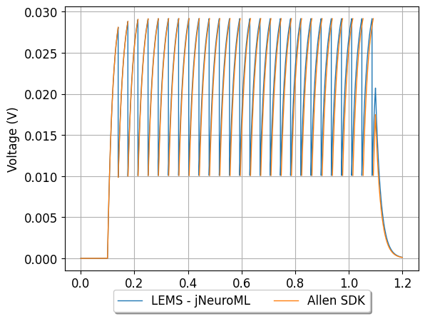
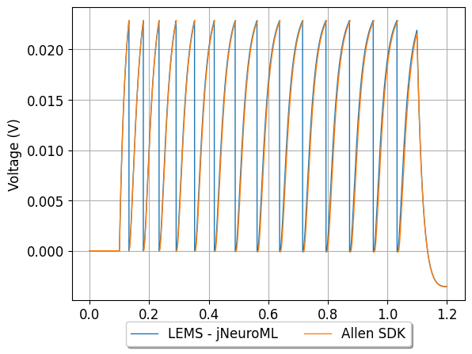
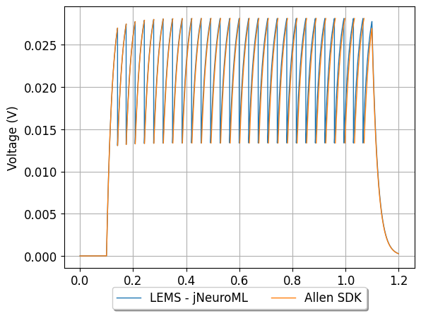
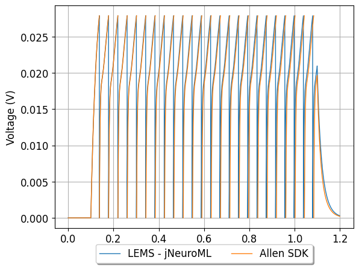
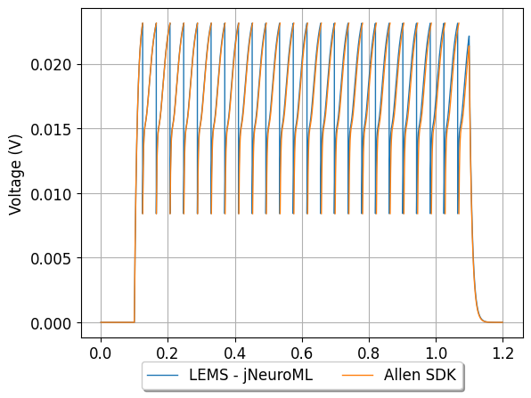

## Conversion of Allen Cell Types Database GLIF models to NeuroML 2

| Model details | Comparison | Injection Current |
| ----- | -------- | --- |
| [566282032](http://celltypes.brain-map.org/mouse/experiment/electrophysiology/318556138)   2 LIF + Reset Rules (LIF-R)_Pvalb-IRES-Cre;Ai14-169130.06.01.01   [Conversion details](566282032/README.md)|  | 129pA |
| [566283540](http://celltypes.brain-map.org/mouse/experiment/electrophysiology/323834998)   5 LIF-R-ASC + Threshold Adaptation (LIF-R-ASC-A)_Scnn1a-Tg3-Cre;Ai14-172530.03.01.01   [Conversion details](566283540/README.md)|  | 129pA |
| [566283879](http://celltypes.brain-map.org/mouse/experiment/electrophysiology/324032509)   4 LIF-R + Afterspike Currents (LIF-R-ASC)_Rorb-IRES2-Cre-D;Ai14-172651.05.01.01   [Conversion details](566283879/README.md)|  | 170pA |
| [566288171](http://celltypes.brain-map.org/mouse/experiment/electrophysiology/328031983)   2 LIF + Reset Rules (LIF-R)_Sst-IRES-Cre;Ai14-175894.03.02.01   [Conversion details](566288171/README.md)|  | 129pA |
| [486557295](http://celltypes.brain-map.org/mouse/experiment/electrophysiology/486175203)   1 Leaky Integrate and Fire (LIF)_Cux2-CreERT2;Ai14-205221.05.02.01   [Conversion details](486557295/README.md)|  | 149pA |
| [566291893](http://celltypes.brain-map.org/mouse/experiment/electrophysiology/464198958)   1 Leaky Integrate and Fire (LIF)_Sst-IRES-Cre;Ai14-165865.03.01.01   [Conversion details](566291893/README.md)|  | 50pA |
| [566291897](http://celltypes.brain-map.org/mouse/experiment/electrophysiology/464198958)   3 LIF + Afterspike Currents (LIF-ASC)_Sst-IRES-Cre;Ai14-165865.03.01.01   [Conversion details](566291897/README.md)|  | 69pA |
| [566302725](http://celltypes.brain-map.org/mouse/experiment/electrophysiology/470098860)   1 Leaky Integrate and Fire (LIF)_Scnn1a-Tg3-Cre;Ai14-181566.04.01.01   [Conversion details](566302725/README.md)|  | 170pA |
| [566320096](http://celltypes.brain-map.org/mouse/experiment/electrophysiology/477127614)   3 LIF + Afterspike Currents (LIF-ASC)_Slc17a6-IRES-Cre;Ai14-190263.04.01.01   [Conversion details](566320096/README.md)|  | 110pA |
| [489931668](http://celltypes.brain-map.org/mouse/experiment/electrophysiology/488501071)   2 LIF + Reset Rules (LIF-R)_Pvalb-IRES-Cre;Ai14-212440.05.02.01   [Conversion details](489931668/README.md)|  | 370pA |
| [486558431](http://celltypes.brain-map.org/mouse/experiment/electrophysiology/486239338)   2 LIF + Reset Rules (LIF-R)_Cux2-CreERT2;Ai14-207760.03.01.01   [Conversion details](486558431/README.md)|  | 190pA |
| [566382734](http://celltypes.brain-map.org/mouse/experiment/electrophysiology/478888083)   2 LIF + Reset Rules (LIF-R)_Scnn1a-Tg2-Cre;Ai14-193643.04.01.01   [Conversion details](566382734/README.md)|  | 129pA |
| [486052403](http://celltypes.brain-map.org/mouse/experiment/electrophysiology/485574832)   4 LIF-R + Afterspike Currents (LIF-R-ASC)_Rbp4-Cre_KL100;Ai14-203498.04.02.01   [Conversion details](486052403/README.md)|  | 230pA |
| [485904755](http://celltypes.brain-map.org/mouse/experiment/electrophysiology/485058595)   3 LIF + Afterspike Currents (LIF-ASC)_Sst-IRES-Cre;Ai14-202726.05.02.01   [Conversion details](485904755/README.md)|  | 90pA |
| [566303332](http://celltypes.brain-map.org/mouse/experiment/electrophysiology/471819401)   3 LIF + Afterspike Currents (LIF-ASC)_Ntsr1-Cre;Ai14-181184.02.02.01   [Conversion details](566303332/README.md)|  | 269pA |
| [566357260](http://celltypes.brain-map.org/mouse/experiment/electrophysiology/478058328)   4 LIF-R + Afterspike Currents (LIF-R-ASC)_Pvalb-IRES-Cre;Ai14-191322.04.02.01   [Conversion details](566357260/README.md)|  | 139pA |
