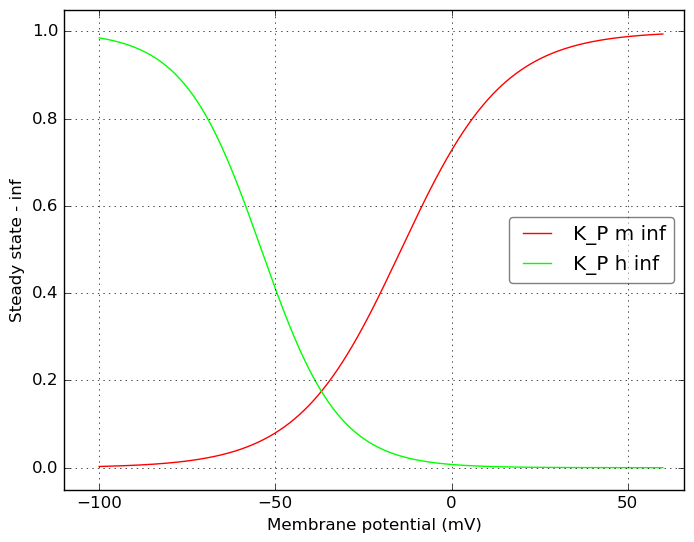
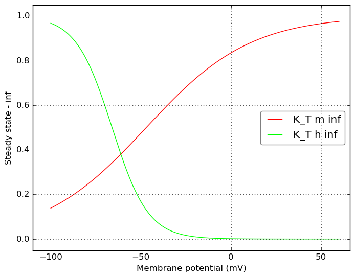
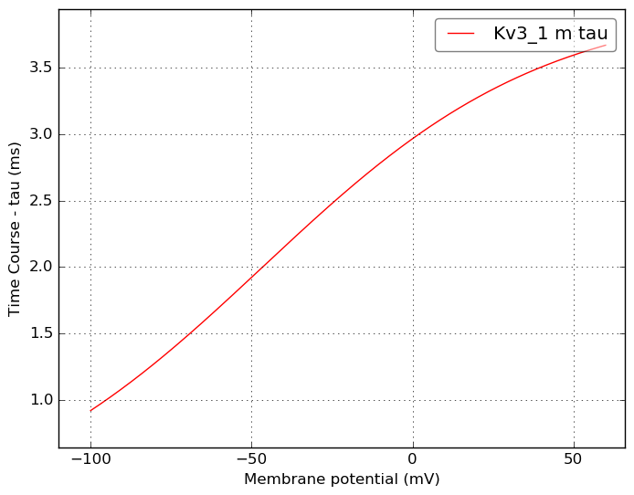

Channel information
===================
    

Channel information at: T = 26.0 degC, E_rev = 0 mV, [Ca2+] = 0.00043 mM

<table>
    <tr>
<td width="120px">
            <b>K_P</b> 
            <a href="../K_P.channel.nml">K_P.channel.nml</a> 
            <b>Ion: k</b> 
            <i>g = gmax * m2 * h </i> 
            Slow inactivating K+ current
Modified slightly for Allen Institute cell models from Hay et al. 2011 version:
 - Added Q10 scaling to rate variables 
 - Equations for tau/inf updated to match mod
            
Comment from original mod file: 
:Comment : The persistent component of the K current
:Reference : :		Voltage-gated K+ channels in layer 5 neocortical pyramidal neurones from young rats:subtypes and gradients,Korngreen and Sakmann, J. Physiology, 2000
:Comment : shifted -10 mv to correct for junction potential
:Comment: corrected rates using q10 = 2.3, target temperature 34, orginal 21
</td>
<td>

</td>
<td>

</td>
</tr>
    <tr>
<td width="120px">
            <b>K_T</b> 
            <a href="../K_T.channel.nml">K_T.channel.nml</a> 
            <b>Ion: k</b> 
            <i>g = gmax * m4 * h </i> 
            Fast inactivating K+ current
Modified slightly for Allen Institute cell models from Hay et al. 2011 version:
 - Added Q10 scaling to rate variables 
 - Equations for tau/inf updated to match mod
            
Comment from original mod file: 
:Comment : The transient component of the K current
:Reference : :		Voltage-gated K+ channels in layer 5 neocortical pyramidal neurones from young rats:subtypes and gradients,Korngreen and Sakmann, J. Physiology, 2000
:Comment : shifted -10 mv to correct for junction potential
:Comment: corrected rates using q10 = 2.3, target temperature 34, orginal 21
</td>
<td>

</td>
<td>

</td>
</tr>
    <tr>
<td width="120px">
            <b>Kv3_1</b> 
            <a href="../Kv3_1.channel.nml">Kv3_1.channel.nml</a> 
            <b>Ion: k</b> 
            <i>g = gmax * m </i> 
            Fast, non inactivating K+ current (Kv3-like)
            
Comment from original mod file: 
:Reference : :		Characterization of a Shaw-related potassium channel family in rat brain, The EMBO Journal, vol.11, no.7,2473-2486 (1992)
</td>
<td>

</td>
<td>

</td>
</tr>
</table>

