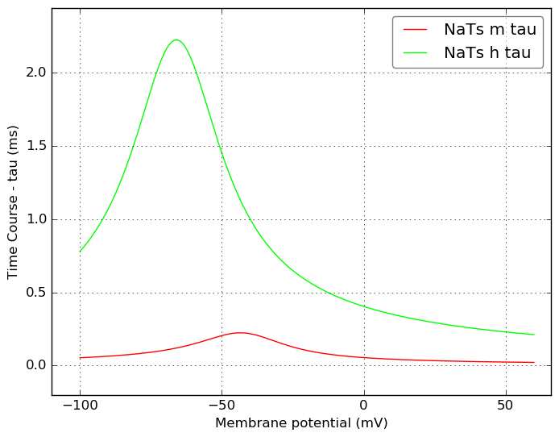
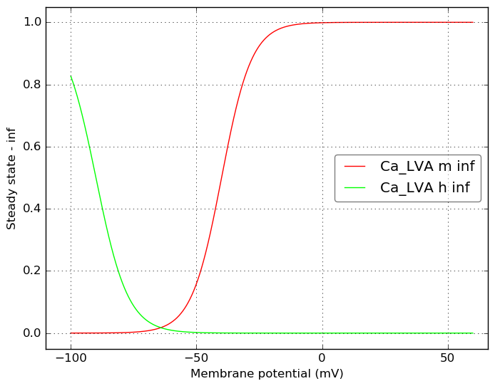
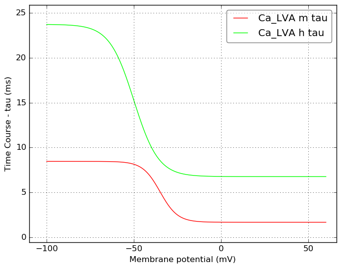

Channel information
===================
    

Channel information at: T = 34.0 degC, E_rev = 0 mV, [Ca2+] = 0.00043 mM

<table>
    <tr>
<td width="120px">
            <b>NaTa</b> 
            <a href="../NaTa.channel.nml">NaTa.channel.nml</a> 
            <b>Ion: na</b> 
            <i>g = gmax * m3 * h </i> 
            Fast inactivating Na+ current
Modified slightly for Allen Institute cell models from Hay et al. 2011 version:
 - Added Q10 scaling to rate variables 
 - Values for midpoint changed to match mod            
            
Comment from original mod file: 
:Reference :Colbert and Pan 2002
</td>
<td>

</td>
<td>

</td>
</tr>
    <tr>
<td width="120px">
            <b>NaTs</b> 
            <a href="../NaTs.channel.nml">NaTs.channel.nml</a> 
            <b>Ion: na</b> 
            <i>g = gmax * m3 * h </i> 
            Fast inactivating Na+ current. 
Modified slightly for Allen Institute cell models from Hay et al. 2011 version:
            
            
Comment from mod file (NaTs2_t.mod): took the NaTa and shifted both activation/inactivation by 6 mv
</td>
<td>

</td>
<td>

</td>
</tr>
    <tr>
<td width="120px">
            <b>Ca_LVA</b> 
            <a href="../Ca_LVA.channel.nml">Ca_LVA.channel.nml</a> 
            <b>Ion: ca</b> 
            <i>g = gmax * m2 * h </i> 
            Low voltage activated Ca2+ current
Modified slightly for Allen Institute cell models from Hay et al. 2011 version:
 - Added Q10 scaling to rate variables 
            
Comment from original mod file: 
Note: mtau is an approximation from the plots
:Reference : :		Avery and Johnston 1996, tau from Randall 1997
:Comment: shifted by -10 mv to correct for junction potential
:Comment: corrected rates using q10 = 2.3, target temperature 34, orginal 21
</td>
<td>

</td>
<td>

</td>
</tr>
    <tr>
<td width="120px">
            <b>Ca_HVA</b> 
            <a href="../Ca_HVA.channel.nml">Ca_HVA.channel.nml</a> 
            <b>Ion: ca</b> 
            <i>g = gmax * m2 * h </i> 
            High voltage activated Ca2+ current. 
NOTE: Most Allen Institute channel models from Hay et al. 2011 use Q10 scaling. This one doesn't...
See https://github.com/OpenSourceBrain/AllenInstituteNeuroML/issues/2
            
Comment from original mod file: 
Reuveni, Friedman, Amitai, and Gutnick, J.Neurosci. 1993
</td>
<td>

</td>
<td>

</td>
</tr>
</table>

