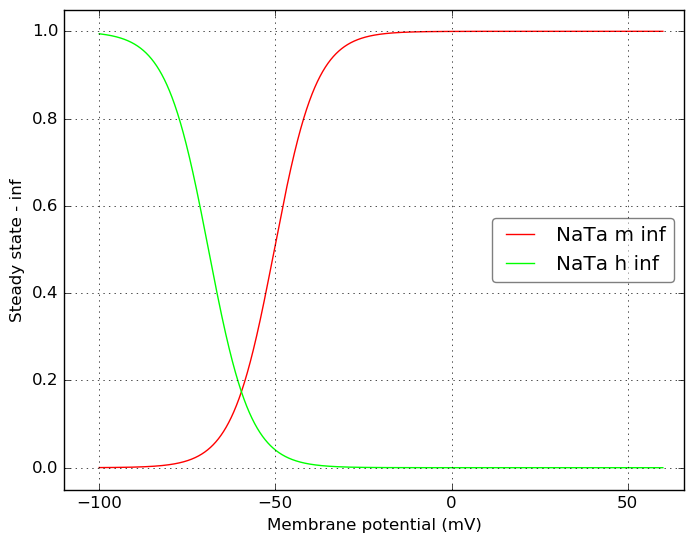

Channel information
===================
    

Channel information at: T = 26.0 degC, E_rev = 0 mV, [Ca2+] = 0.00043 mM

<table>
    <tr>
<td width="120px">
            <b>NaTa</b> 
            <a href="../NaTa.channel.nml">NaTa.channel.nml</a> 
            <b>Ion: na</b> 
            <i>g = gmax * m3 * h </i> 
            Fast inactivating Na+ current
            
Comment from original mod file: 
:Reference :Colbert and Pan 2002
</td>
<td>

</td>
<td>

</td>
</tr>
</table>

