Channel information
===================
    

Channel information at: T = 34.0 degC, E_rev = 0 mV, [Ca2+] = 0.00043 mM

<table>
    <tr>
<td width="120px">
            <b>NaTa</b> 
            <a href="../NaTa.channel.nml">NaTa.channel.nml</a> 
            <b>Ion: na</b> 
            <i>g = gmax * m3 * h </i> 
            Fast inactivating Na+ current
Modified slightly for Allen Institute cell models from Hay et al. 2011 version:
 - Added Q10 scaling to rate variables 
 - Values for midpoint changed to match mod            
            
Comment from original mod file: 
:Reference :Colbert and Pan 2002
</td>
<td>

</td>
<td>
<a href="NaTa.tau.png">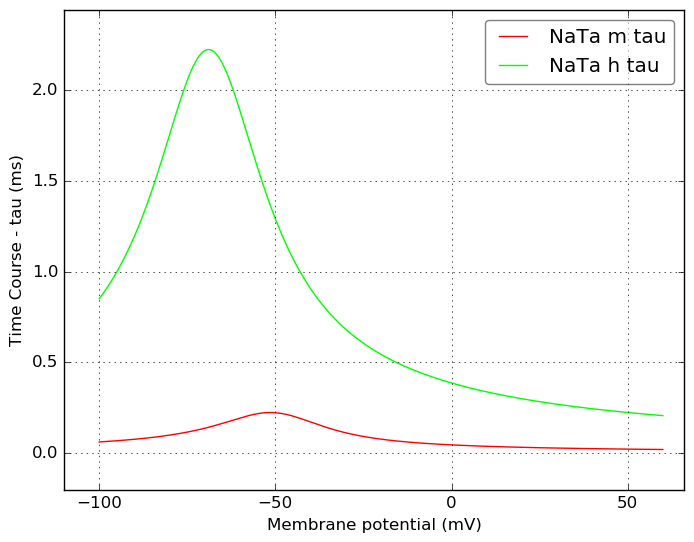</a>
</td>
</tr>
    <tr>
<td width="120px">
            <b>NaTs</b> 
            <a href="../NaTs.channel.nml">NaTs.channel.nml</a> 
            <b>Ion: na</b> 
            <i>g = gmax * m3 * h </i> 
            Fast inactivating Na+ current. 
Modified slightly for Allen Institute cell models from Hay et al. 2011 version:
 - Added Q10 scaling to rate variables 
 - Values for midpoint changed to match mod 
            
Comment from mod file (NaTs2_t.mod): took the NaTa and shifted both activation/inactivation by 6 mv
</td>
<td>
<a href="NaTs.inf.png">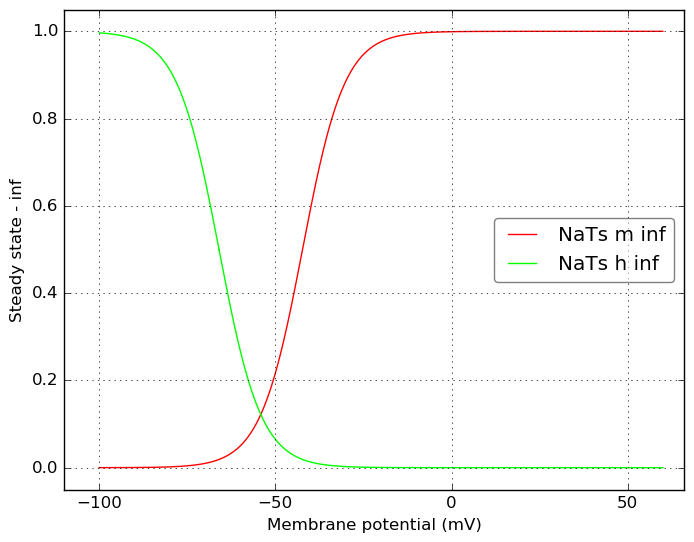</a>
</td>
<td>

</td>
</tr>
    <tr>
<td width="120px">
            <b>Nap</b> 
            <a href="../Nap.channel.nml">Nap.channel.nml</a> 
            <b>Ion: na</b> 
            <i>g = gmax * m * h </i> 
            Persistent Na+ current
Modified for Allen Institute cell models from Hay et al. 2011 version:
- Form of conductance expression changed from: g = gbar * m^3 * h to: g = gbar * minf * h (comment in mod: assuming instantaneous activation as modeled by Magistretti and Alonso)
- Added Q10 scaling to rate variables            

Comment from original mod file: 
:Comment : mtau deduced from text (said to be 6 times faster than for NaTa)
:Comment : so I used the equations from NaT and multiplied by 6
:Reference : Modeled according to kinetics derived from Magistretti and Alonso 1999
:Comment: corrected rates using q10 = 2.3, target temperature 34, orginal 21
</td>
<td>
<a href="Nap.inf.png">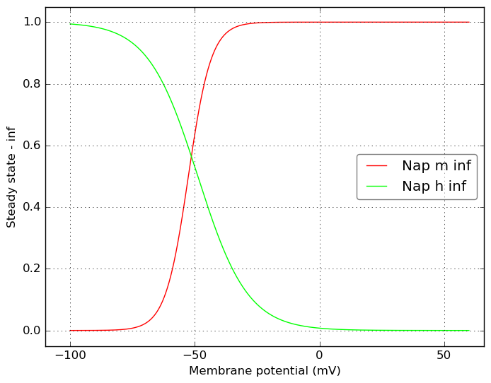</a>
</td>
<td>
<a href="Nap.tau.png">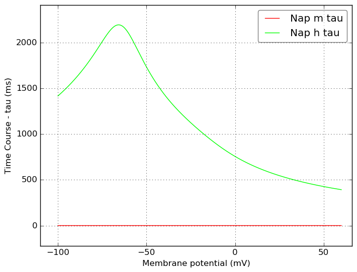</a>
</td>
</tr>
    <tr>
<td width="120px">
            <b>Kd</b> 
            <a href="../Kd.channel.nml">Kd.channel.nml</a> 
            <b>Ion: k</b> 
            <i>g = gmax * m * h </i> 
            Kd current
            
Comment from original mod file: 
Based on Kd model of Foust et al. (2011)
</td>
<td>

</td>
<td>

</td>
</tr>
    <tr>
<td width="120px">
            <b>K_P</b> 
            <a href="../K_P.channel.nml">K_P.channel.nml</a> 
            <b>Ion: k</b> 
            <i>g = gmax * m2 * h </i> 
            Slow inactivating K+ current
Modified slightly for Allen Institute cell models from Hay et al. 2011 version:
 - Added Q10 scaling to rate variables 
 - Equations for tau/inf updated to match mod
            
Comment from original mod file: 
:Comment : The persistent component of the K current
:Reference : :		Voltage-gated K+ channels in layer 5 neocortical pyramidal neurones from young rats:subtypes and gradients,Korngreen and Sakmann, J. Physiology, 2000
:Comment : shifted -10 mv to correct for junction potential
:Comment: corrected rates using q10 = 2.3, target temperature 34, orginal 21
</td>
<td>

</td>
<td>
<a href="K_P.tau.png">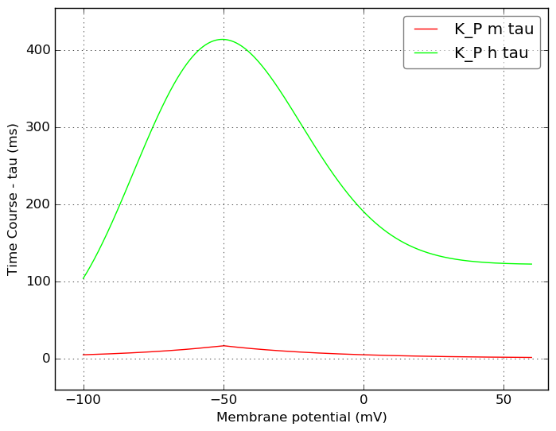</a>
</td>
</tr>
    <tr>
<td width="120px">
            <b>K_T</b> 
            <a href="../K_T.channel.nml">K_T.channel.nml</a> 
            <b>Ion: k</b> 
            <i>g = gmax * m4 * h </i> 
            Fast inactivating K+ current
Modified slightly for Allen Institute cell models from Hay et al. 2011 version:
 - Added Q10 scaling to rate variables 
 - Equations for tau/inf updated to match mod
            
Comment from original mod file: 
:Comment : The transient component of the K current
:Reference : :		Voltage-gated K+ channels in layer 5 neocortical pyramidal neurones from young rats:subtypes and gradients,Korngreen and Sakmann, J. Physiology, 2000
:Comment : shifted -10 mv to correct for junction potential
:Comment: corrected rates using q10 = 2.3, target temperature 34, orginal 21
</td>
<td>

</td>
<td>
<a href="K_T.tau.png">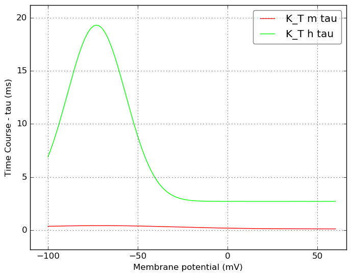</a>
</td>
</tr>
    <tr>
<td width="120px">
            <b>Kv3_1</b> 
            <a href="../Kv3_1.channel.nml">Kv3_1.channel.nml</a> 
            <b>Ion: k</b> 
            <i>g = gmax * m </i> 
            Fast, non inactivating K+ current (Kv3-like)
            
Comment from original mod file: 
:Reference : :		Characterization of a Shaw-related potassium channel family in rat brain, The EMBO Journal, vol.11, no.7,2473-2486 (1992)
</td>
<td>

</td>
<td>

</td>
</tr>
    <tr>
<td width="120px">
            <b>Kv2like</b> 
            <a href="../Kv2like.channel.nml">Kv2like.channel.nml</a> 
            <b>Ion: k</b> 
            <i>g = gmax * m2 </i> 
            Kv2-like channel
            
Comment from original mod file: 
: Kv2-like channel
: Adapted from model implemented in Keren et al. 2005
: Adjusted parameters to be similar to guangxitoxin-sensitive current in mouse CA1 pyramids from Liu and Bean 2014
</td>
<td>

</td>
<td>

</td>
</tr>
    <tr>
<td width="120px">
            <b>Im</b> 
            <a href="../Im.channel.nml">Im.channel.nml</a> 
            <b>Ion: k</b> 
            <i>g = gmax * m </i> 
            Muscarinic K+ current
Modified slightly for Allen Institute cell models from Hay et al. 2011 version:
 - Added Q10 scaling to rate variables 
            
Comment from original mod file: 
:Reference : :		Adams et al. 1982 - M-currents and other potassium currents in bullfrog sympathetic neurones
:Comment: corrected rates using q10 = 2.3, target temperature 34, orginal 21
</td>
<td>

</td>
<td>
<a href="Im.tau.png">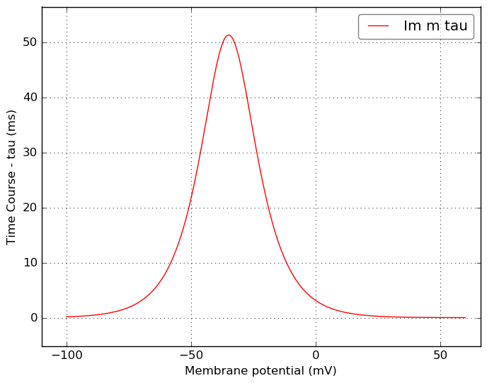</a>
</td>
</tr>
    <tr>
<td width="120px">
            <b>Im_v2</b> 
            <a href="../Im_v2.channel.nml">Im_v2.channel.nml</a> 
            <b>Ion: k</b> 
            <i>g = gmax * m </i> 
            Im current
            
Comment from original mod file: 
Based on Im model of Vervaeke et al. (2006)
</td>
<td>

</td>
<td>

</td>
</tr>
    <tr>
<td width="120px">
            <b>SK</b> 
            <a href="../SK.channel.nml">SK.channel.nml</a> 
            <b>Ion: k</b> 
            <i>g = gmax * z </i> 
            Small-conductance, Ca2+ activated K+ current
            
Comment from original mod file: 
: SK-type calcium-activated potassium current
: Reference : Kohler et al. 1996
</td>
<td>
<a href="SK.inf.png">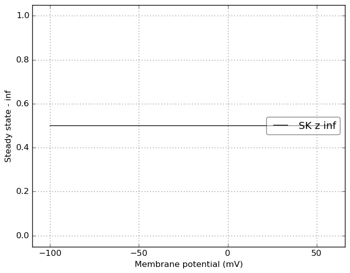</a>
</td>
<td>
<a href="SK.tau.png">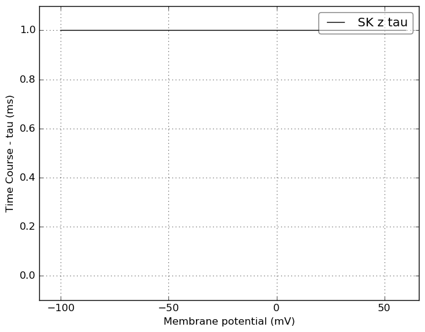</a>
</td>
</tr>
    <tr>
<td width="120px">
            <b>Ca_LVA</b> 
            <a href="../Ca_LVA.channel.nml">Ca_LVA.channel.nml</a> 
            <b>Ion: ca</b> 
            <i>g = gmax * m2 * h </i> 
            Low voltage activated Ca2+ current
Modified slightly for Allen Institute cell models from Hay et al. 2011 version:
 - Added Q10 scaling to rate variables 
            
Comment from original mod file: 
Note: mtau is an approximation from the plots
:Reference : :		Avery and Johnston 1996, tau from Randall 1997
:Comment: shifted by -10 mv to correct for junction potential
:Comment: corrected rates using q10 = 2.3, target temperature 34, orginal 21
</td>
<td>

</td>
<td>

</td>
</tr>
    <tr>
<td width="120px">
            <b>Ca_HVA</b> 
            <a href="../Ca_HVA.channel.nml">Ca_HVA.channel.nml</a> 
            <b>Ion: ca</b> 
            <i>g = gmax * m2 * h </i> 
            High voltage activated Ca2+ current. 
NOTE: Most Allen Institute channel models from Hay et al. 2011 use Q10 scaling. This one doesn't...
See https://github.com/OpenSourceBrain/AllenInstituteNeuroML/issues/2
            
Comment from original mod file: 
Reuveni, Friedman, Amitai, and Gutnick, J.Neurosci. 1993
</td>
<td>

</td>
<td>
<a href="Ca_HVA.tau.png">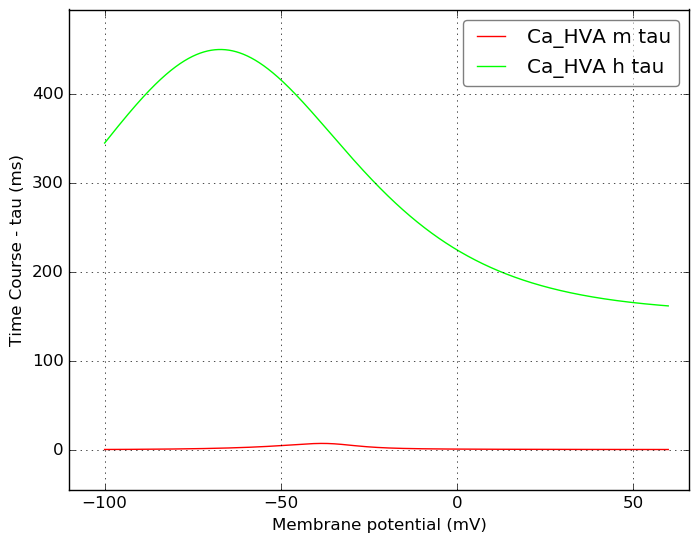</a>
</td>
</tr>
    <tr>
<td width="120px">
            <b>Ih</b> 
            <a href="../Ih.channel.nml">Ih.channel.nml</a> 
            <b>Ion: hcn</b> 
            <i>g = gmax * m </i> 
            Non-specific cation current
            
Comment from original mod file: 
Reference : :		Kole,Hallermann,and Stuart, J. Neurosci. 2006
</td>
<td>
<a href="Ih.inf.png">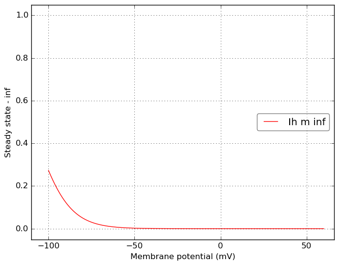</a>
</td>
<td>
<a href="Ih.tau.png">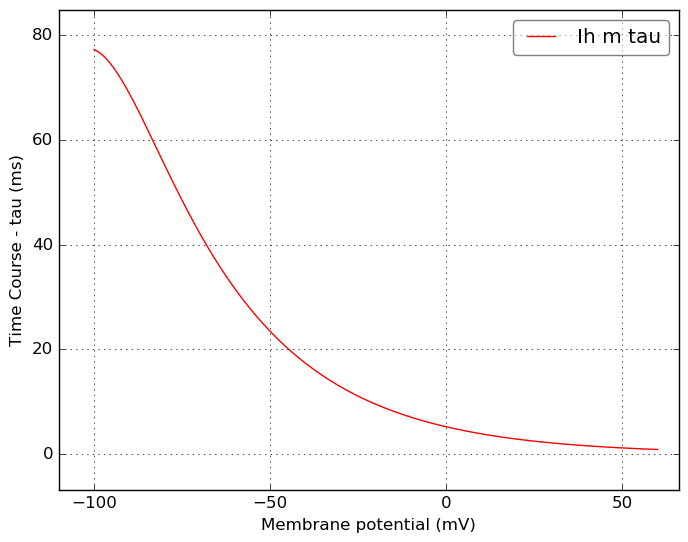</a>
</td>
</tr>
</table>

