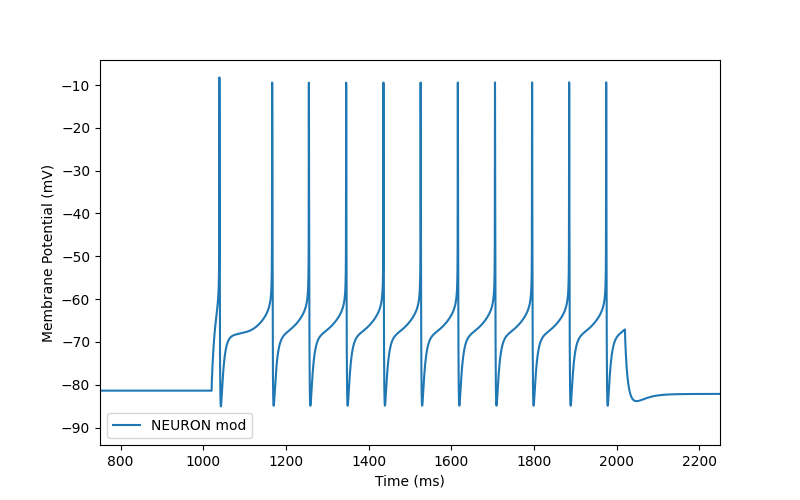
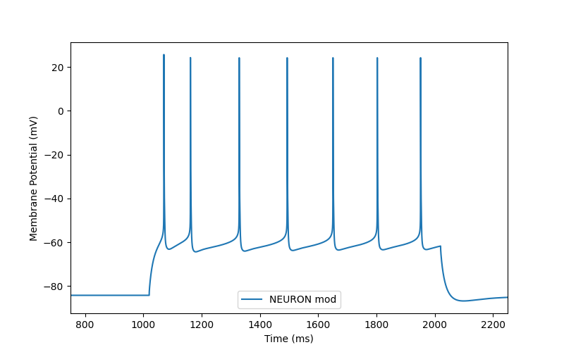
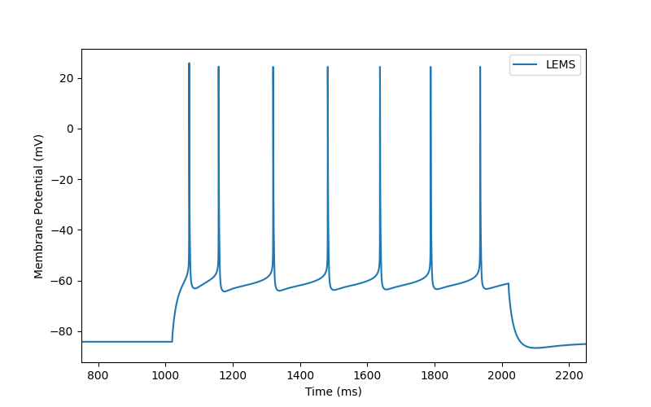
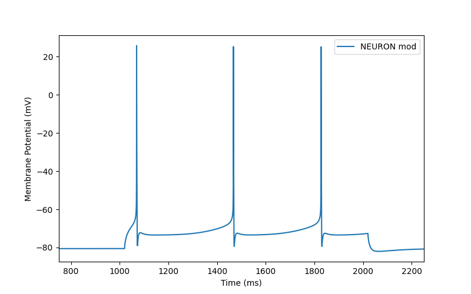
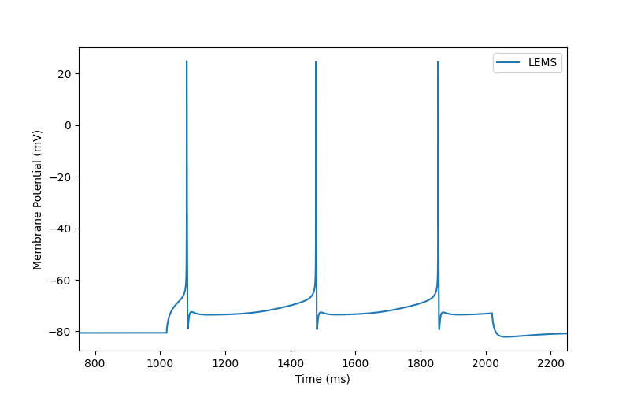

<h1>Models based on Allen Cell Types Database data</h1>

<h2>NEURON models</h2>

A number of NEURON models which have been generated by the Allen Institute from their data can be found in [483108201/](483108201/) and [486556811/](486556811/).

Helper & common files, e.g. NMODL channel descriptions are in [NEURON/](NEURON/).

To download the original data using the Allen SDK try:

    python download.py

<h2>NeuroML 2 models of biophysically detailed cells</h2>

NeuroML2 versions of the cell models which are constrained by the data 
collected in the Cell Types Database can be found [here](NeuroML2).

To extract these from the original NEURON files try:

    nrnivmodl  NEURON    # Compile the Neuron mod files in the NEURON folder
    python ParseAll.py

<h2>GLIF models</h2>

Conversion of Allen Cell Types Database GLIF models to NeuroML 2/LEMS can be found [here](GLIF/).

<h2>Model Summary</h2>
    

Simulated neurons using the NEURON mods and the generated LEMS file:

<table class="tg">
<tbody>
    <tr>
        <th class="tg-yw4l">Cell Type</td>
        <th class="tg-yw4l">3D structure of the NeuroML model</td>
        <th class="tg-yw4l">Neuron mods</td>
        <th class="tg-yw4l">LEMS model</td>
    </tr>
        <tr>
        <td class="tg-0pky"><a href=http://celltypes.brain-map.org/mouse/experiment/electrophysiology/485574832><b>497232312</b></a> Primary visual area, layer 5 spiny Rbp4-Cre_KL100</td>
        <td class="tg-0pky"></img></td>
        <td class="tg-0pky"></img></td>
        <td class="tg-0pky"></img></td>
    </tr>
    <tr>
        <td class="tg-0pky"><a href=http://celltypes.brain-map.org/mouse/experiment/electrophysiology/486111903><b>486556811</b></a> Primary visual area, layer 5 spiny Rbp4-Cre_KL100</td>
        <td class="tg-0pky"></img></td>
        <td class="tg-0pky"></img></td>
        <td class="tg-0pky"></img></td>
    </tr>
    <tr>
        <td class="tg-0pky"><a href=http://celltypes.brain-map.org/mouse/experiment/electrophysiology/464198958><b>472450023</b></a> Primary visual area, layer 5 aspiny Sst-IRES-Cre</td>
        <td class="tg-0pky"></img></td>
        <td class="tg-0pky"></img></td>
        <td class="tg-0pky"></img></td>
    </tr>
    <tr>
        <td class="tg-0pky"><a href=http://celltypes.brain-map.org/mouse/experiment/electrophysiology/479704527><b>483108201</b></a> Primary visual area, layer 4 spiny Rbp4-Cre_KL100</td>
        <td class="tg-0pky"></img></td>
        <td class="tg-0pky"></img></td>
        <td class="tg-0pky"></img></td>
    </tr>
</tbody>
</table>