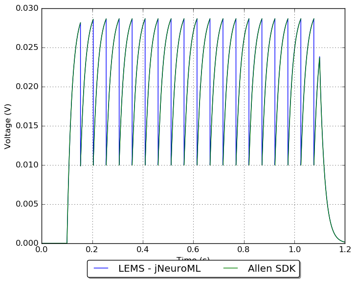

## Model: 123

## Original model

[Neuron config](neuron_config.json); [metadata](model_metadata.json); [electrophysiology](ephys_sweeps.json)

Original traces:

## Conversion to NeuroML 2

LEMS version: [GLIF_473875489.xml](GLIF_473875489.xml)

Comparison:

