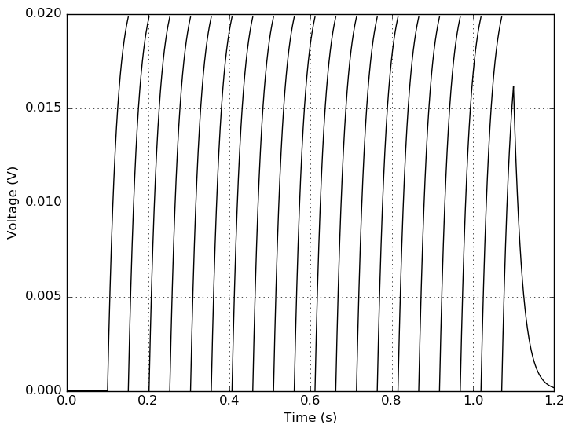
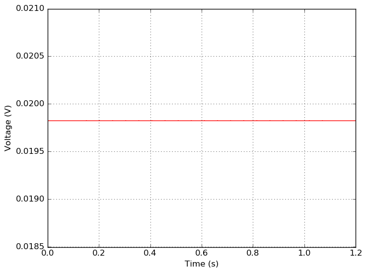
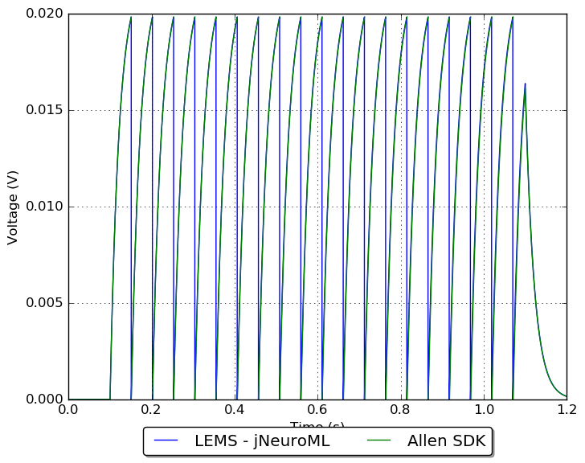

## Model: 480629471

## Original model

[Neuron config](neuron_config.json); [metadata](model_metadata.json); [electrophysiology](ephys_sweeps.json)

Original traces:

## Conversion to NeuroML 2

LEMS version: [GLIF_480629471.xml](GLIF_480629471.xml)

Comparison:

