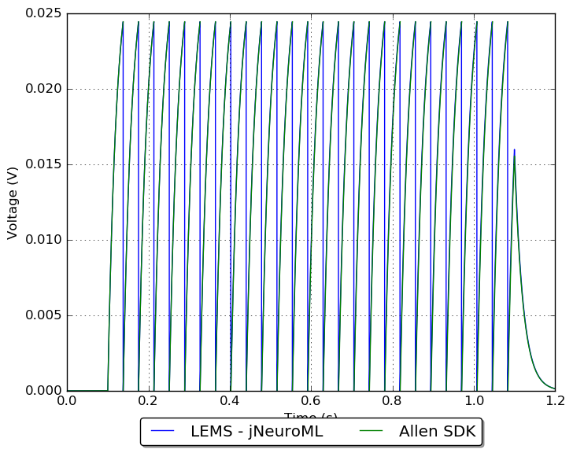
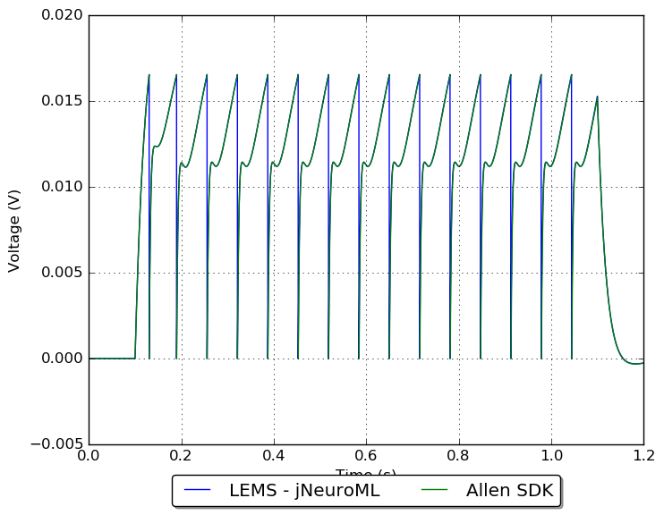
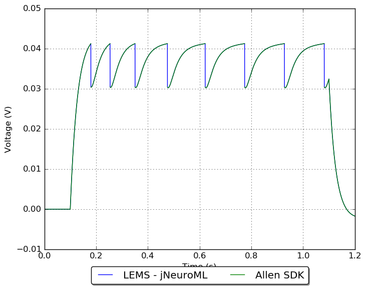
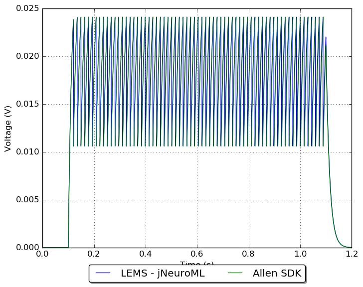

## Conversion of Allen Cell Types Database GLIF models to NeuroML 2

**Work in progress!**

Not yet stable!!

### Examples:

        
#### Model: 480629471

1 Leaky Integrate and Fire (LIF)_Sst-IRES-Cre;Ai14(IVSCC)-165865.03.01.01

[More details](480629471/README.md)
            
#### Model: 486557295

1 Leaky Integrate and Fire (LIF)_Cux2-CreERT2;Ai14-205221.05.02.01

[More details](486557295/README.md)
            
#### Model: 480629475

3 LIF + Afterspike Currents (LIF-ASC)_Sst-IRES-Cre;Ai14(IVSCC)-165865.03.01.01

[More details](480629475/README.md)
            
#### Model: 472451425

1 Leaky Integrate and Fire (LIF)_Scnn1a-Tg3-Cre;Ai14(IVSCC)-181566.04.01.01

[More details](472451425/README.md)
            
#### Model: 473875489

2 LIF + Reset Rules (LIF-R)_Sst-IRES-Cre;Ai14(IVSCC)-175894.03.02.01

[More details](473875489/README.md)
            
#### Model: 472308324

4 LIF-R + Afterspike Currents (LIF-R-ASC)_Rorb-IRES2-Cre-D;Ai14(IVSCC)-172651.05.01.01

[More details](472308324/README.md)
            
#### Model: 480633674

2 LIF + Reset Rules (LIF-R)_Pvalb-IRES-Cre;Ai14(IVSCC)-169130.06.01.01

[More details](480633674/README.md)
            